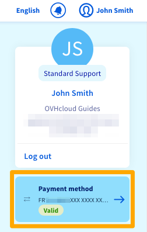

**Letzte Aktualisierung am 07.05.2020**

## Ziel

Ihr OVHcloud Kunden-Account ermöglicht Ihnen, verschiedene Zahlungsarten zu hinterlegen und zu verwalten.

**In dieser Anleitung erfahren Sie, wie Sie Ihre Zahlungsmittel hinzufügen, entfernen und für automatischen Einzug festlegen können.**

## Voraussetzungen

- Sie sind in Ihrem [OVHcloud Kundencenter](https://www.ovh.com/auth/?action=gotomanager) eingeloggt.
- Sie verfügen über eine gültige Zahlungsart.

## In der praktischen Anwendung

Klicken Sie auf Ihren Namen oben rechts im [OVHcloud Kundencenter](https://www.ovh.com/auth/?action=gotomanager) und wählen Sie dann im Menü `Zahlungsmittel`{.action}.

{.thumbnail}

Die nun angezeigte Seite enthält eine Tabelle mit den in Ihrem Kunden-Account gespeicherten Zahlungsarten. Sie können dort:

- eine Zahlungsart hinzufügen
- Ihre Standardzahlungsart ändern
- eine Zahlungsart löschen

### Eine Zahlungsart hinzufügen

Während Ihrer ersten Bestellung eines OVHcloud Service werden Sie gebeten, eine Zahlungsart einzutragen um die Verlängerung Ihrer Dienstleistung mit Einzugsermächtigungen sicherzustellen.

Diese Zahlungsart wird standardmäßig für alle automatischen Verlängerungen verwendet und für neue Bestellungen vorgeschlagen.

Sie können natürlich weitere Zahlungsarten angeben, damit sie für neue Bestellungen vorgeschlagen werden oder für Ihre künftigen Zahlungen genutzt werden können.

Es werden folgende Zahlungsmittel akzeptiert:

- Kreditkarte
- Bankkonto
- PayPal Konto 

Klicken Sie hierfür auf den Button `Zahlungsart hinzufügen`{.action}.

{.thumbnail}

Folgen Sie den nachfolgenden Schritten zur Hinterlegung einer Zahlungsart. Im ersten Schritt schlägt man Ihnen vor, diese neue Zahlungsart als „Standardzahlungsart“ zu definieren, damit sie für künftige Bestellungen oder automatische Zahlungen verwendet werden kann.

#### Ein Bankkonto hinzufügen

Im Fall der Hinterlegung eines neuen Bankkontos wird eine E-Mail von unserem Partner Yousign versendet, mit der Sie die Einzugsermächtigung dann digital signieren können.

{.thumbnail}

> [!primary]
>
Solange diese Authorisierung nicht erfolgt ist, wird der Status „Validierung wird durchgeführt“ neben Ihrem Bankkonto angezeigt. Es kann in diesem Status für Zahlungen per Einzug noch nicht berücksichtigt werden.
>

### Ihre Standardzahlungsart ändern

Die Rechnungen für die Verlängerung Ihrer Dienstleistungen werden automatisch mit Ihrer Standardzahlungsart beglichen. Wenn Sie diese ändern möchten, müssen Sie zuerst in Ihrem OVHcloud Kundencenter eine neue Zahlungsart hinzufügen.

Klicken Sie dafür auf die Schaltfläche `...`{.action} rechts neben der Zahlungsart und dann auf  `dieses Zahlungsmittel als Standardzahlungsmittel festlegen`{.action}.

{.thumbnail}

### Eine Zahlungsart löschen

Wenn Sie eine Ihrer Zahlungsarten nicht mehr verwenden möchten, dann können Sie sie löschen, indem Sie auf die Schaltfläche `...`{.action} rechts neben der Zahlungsart klicken und dann auf `Dieses Zahlungsmittel löschen`{.action}.

{.thumbnail}

> [!warning]
>
Die Standardzahlungsart kann nicht gelöscht werden. Wenn Sie sie entfernen möchten, müssen Sie zuerst eine andere Standardzahlungsart definieren.
>

### Löschung einer Zahlungsart über die OVHcloud API

Die Löschung einer Zahlungsart kann über die API erfolgen; verbinden Sie sich hierzu mit  [https://eu.api.ovh.com/](https://eu.api.ovh.com/).

Beginnen Sie, indem Sie die ID der Zahlungsart anfordern: 

> [!api]
>
> @api {GET} /me/payment/method 
>

Löschen Sie dann die Zahlungsart, indem Sie die zuvor erhaltene ID verwenden: 

> [!api]
>
> @api {DELETE} /me/payment/method/{paymentMethodId}
>

## Weiterführende Informationen

[Verlängerung meiner Dienste verwalten](https://docs.ovh.com/de/billing/anleitung_zur_nutzung_der_automatischen_verlangerung_bei_ovh/)

[OVHcloud Rechnungen verwalten](https://docs.ovh.com/de/billing/ovh-rechnungen-verwalten/)

[OVHcloud Bestellungen verwalten](https://docs.ovh.com/de/billing/bestellungen-verwalten-ovh/)

Für den Austausch mit unserer User Community gehen Sie auf <https://community.ovh.com/en/>.
