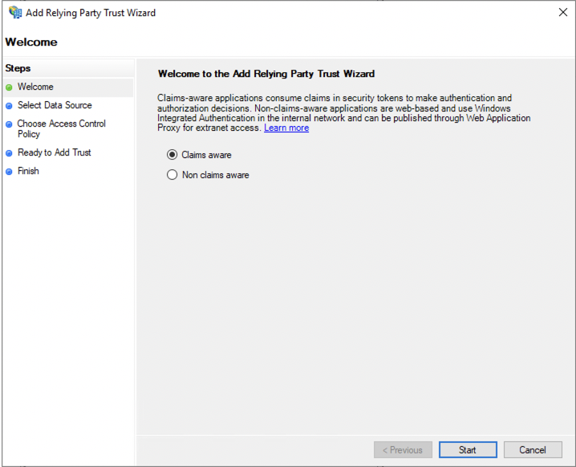
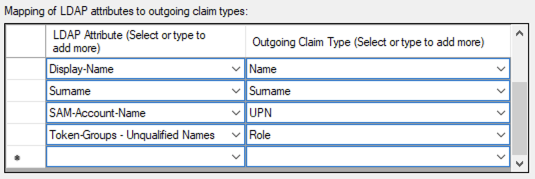
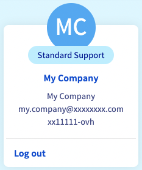

## Objectif

Vous pouvez utiliser l'authentification **SSO** (*Single Sign-On*) pour vous connecter à votre compte OVHcloud. Pour activer ces connexions, votre compte et vos services AD FS (*Active Directory Federation Services*) doivent être configurés à l'aide des authentifications SAML (*Security Assertion Markup Language*).

**Ce guide vous explique comment associer votre compte OVHcloud à un Active Directory externe.**

## Prérequis

- Les services AD FS (Active Directory Federation Services) doivent s'exécuter sur votre serveur
- Disposer d'un [compte OVHcloud](/pages/account_and_service_management/account_information/ovhcloud-account-creation)
- Être connecté à votre [espace client OVHcloud](https://www.ovh.com/auth/?action=gotomanager&from=https://www.ovh.com/fr/&ovhSubsidiary=fr)

## En pratique

> [!primary]
>
> Afin qu’un prestataire de services (c'est à dire votre compte OVHcloud) puisse établir une connexion SSO avec un fournisseur d’identité (c'est à dire votre service AD FS), l’essentiel est d’établir une relation de confiance mutuelle.
>

### Établir la confiance AD FS

Votre AD FS agit en tant que fournisseur d'identité. Les demandes d'authentification de votre compte OVHcloud ne seront acceptées que si vous l'avez d'abord déclaré comme organisme tiers de confiance.

Dans le contexte Active Directory, cela signifie qu'il doit être ajouté en tant que `Relying Party Trust`.

Dans le Gestionnaire de Serveurs, ouvrez le menu `Tools`{.action} et sélectionnez `AD FS Management`{.action}.

{.thumbnail}

Cliquez sur `Relying Party Trusts`{.action}.

{.thumbnail}

Cliquez ensuite sur `Add Relying Party Trust...`{.action}.

{.thumbnail}

Sélectionnez `Claims aware`{.action} et validez avec le bouton `Start`{.action}.

{.thumbnail}

Vous pouvez y entrer manuellement les informations sur l'organisme tiers de confiance ou les importer à partir d'un fichier de métadonnées.

#### Importer les métadonnées OVHcloud SP

Vous pouvez obtenir le fichier de métadonnées approprié via les liens suivants :

- [Métadonnées de la région UE](https://www.ovh.com/auth/sso/saml/sp/metadata.xml)
- [Métadonnées de la région CA](https://ca.ovh.com/auth/sso/saml/sp/metadata.xml)

Sélectionnez `Import data about the relying party from a file`{.action} et sélectionnez votre fichier de métadonnées.

Cliquez ensuite sur le bouton `Next`{.action} .

{.thumbnail}

Entrez un nom d'affichage pour l'organisme tiers de confiance et cliquez sur le bouton `Next`{.action}.

{.thumbnail}

Cliquez sur `Next`{.action} dans la fenêtre du contrôle d'accès.

{.thumbnail}

Cliquez de nouveau sur `Next`{.action} pour continuer.

{.thumbnail}

Cliquez sur le bouton `Close`{.action} dans la dernière fenêtre. L'approbation de OVHcloud en tant qu'organisme tiers de confiance est maintenant ajoutée à votre AD FS.

{.thumbnail}

> [!primary]
>
> Avec OVHcloud ajouté en tant qu'organisme tiers de confiance, vous devriez déjà pouvoir vous connecter via une connexion SSO. Cependant, toutes les informations relatives à l'identité de l'utilisateur (en termes d' « assertion » SAML) resteront indisponibles jusqu'à ce que vous configuriez une stratégie pour faire correspondre les champs LDAP Active Directory aux attributs de l'assertion SAML.
>

#### Correspondance des attributs LDAP aux attributs SAML

Cliquez sur l'entrée OVHcloud dans la partie « Relying Party Trusts ».

{.thumbnail}

Cliquez ensuite sur `Edit Claim Issuance Policy...`{.action}.

{.thumbnail}

Cliquez sur le bouton `Add Rule...`{.action}.

{.thumbnail}

Cliquez sur `Next`{.action}.

Renseignez un nom de règle puis définissez votre tableau de correspondances.

Sélectionnez `Active Directory` comme `Attribute store`.

> [!primary]
>
> Les paramètres suivants peuvent être configurés librement afin que le fournisseur de services puisse lire correctement les données LDAP Active Directory. Vous pouvez vous référer à l'image ci-dessous comme exemple.

Lorsque vous avez terminé, cliquez sur le bouton `Finish`{.action}.

{.thumbnail}

{.thumbnail}

Cliquez sur le bouton `Apply`{.action} et validez avec `OK`{.action}.

{.thumbnail}

Une fois le tableau de correspondances terminé, votre service AD FS fait désormais confiance à OVHcloud en tant que fournisseur de services. L'étape suivante consiste à vous assurer que le compte OVHcloud fait confiance à votre AD FS en tant que fournisseur d'identité.

### Établir la confiance du compte OVHcloud et configurer la connexion

L'ajout de votre AD FS en tant que fournisseur d'identité de confiance s'effectue dans [l'espace client OVHcloud](https://www.ovh.com/auth/?action=gotomanager&from=https://www.ovh.com/fr/&ovhSubsidiary=fr) où vous pouvez fournir les métadonnées du fournisseur d'identité.

[Connectez-vous](https://www.ovh.com/auth/?action=gotomanager&from=https://www.ovh.com/fr/&ovhSubsidiary=fr) et cliquez sur votre profil en haut à droite.

{.thumbnail}

Cliquez sur votre nom pour accéder à la page de gestion de votre profil.

{.thumbnail}

Ouvrez l'onglet `Gestion des utilisateurs`{.action}.

{.thumbnail}

Cliquez sur le bouton `Connexion SSO`{.action}.

{.thumbnail}

Renseignez les métadonnées XML de votre service AD FS. Le champ `Nom d'attribut de groupe` est facultatif dans ce cas. Cliquez sur `Confirmer`{.action}.

{.thumbnail}

Vous devez maintenant retrouver votre AD FS en tant que fournisseur d'identité, ainsi que les groupes par défaut.

{.thumbnail}

Pour plus d'informations, cliquez sur le lien situé sous l'`URL du service SSO`.

{.thumbnail}

{.thumbnail}

Le bouton `...`{.action} permet de mettre à jour ou de supprimer le SSO, et d’en consulter les détails.

{.thumbnail}

Votre AD FS est maintenant considéré comme fournisseur d'identité de confiance. Cependant, vous devez tout de même ajouter des groupes à votre compte OVHcloud.

> [!warning]
> Si vous essayez à ce stade de vous connecter via SSO, un message d'erreur `Not in valid groups` s'affichera probablement.
>
> En effet, votre compte OVHcloud vérifie si l'utilisateur s'authentifiant appartient à un groupe existant sur le compte.
>

Pour résoudre cela, vérifiez les informations correspondant à l'attribut « Group » retourné par votre service AD FS.

Prenez pour exemple celui d'un utilisateur « John Doe » de votre Active Directory, comme indiqué dans l'image ci-dessous.

{.thumbnail}

Vérifiez le tableau de correspondances dans AD FS :

{.thumbnail}

Dans cet exemple, l'attribut « Group » renvoyé par l'Active Directory pour l'utilisateur « John Doe » est « title » Cela correspond au « job title » qui est `manager@<my-domain>.com`.

Vous pouvez également le vérifier dans l'assertion SAML :

```xml
<AttributeStatement>
    <Attribute Name="http://schemas.xmlsoap.org/claims/Group">
        <AttributeValue>manager@<my-domain>.com</AttributeValue>
    </Attribute>
    ...
</AttributeStatement>
```

Cela signifie que vous devez ajouter le groupe `manager@<my-domain>.com` à votre compte OVHcloud en y attachant un rôle. Dans le cas contraire, votre compte OVHcloud ne sait pas ce que l'utilisateur est autorisé à faire.

Ajoutez-le en cliquant sur le bouton `Déclarer un groupe`{.action} et en remplissant les champs :

{.thumbnail}

{.thumbnail}

Vous pourrez ensuite vérifier que le groupe est ajouté à votre compte OVHcloud dans la section `Groupes` :

{.thumbnail}

Lorsque vous vous connecterez par la suite avec l'utilisateur Active Directory « John Doe », votre compte OVHcloud reconnaîtra que l'utilisateur a le rôle « REGULAR », spécifié par son groupe.

Vous pourrez ensuite vous déconnecter de votre compte et vous reconnecter avec votre AD FS en tant que fournisseur d'identité.

### Connexion via SSO

Sur [la page d'identification OVHcloud](https://www.ovh.com/auth/?action=gotomanager&from=https://www.ovh.com/fr/&ovhSubsidiary=fr), renseignez votre [identifiant](/pages/account_and_service_management/account_information/ovhcloud-account-creation#quel-est-mon-identifiant-client) suivi de **/idp** sans mot de passe et cliquez sur le bouton `Login`{.action} .

{.thumbnail}

Vous êtes ensuite redirigé vers votre page de connexion AD FS. Entrez un login/password d'un utilisateur de votre Active Directory LDAP, puis cliquez sur le bouton `Sign in`{.action} .

{.thumbnail}

Vous êtes maintenant connecté avec le même identifiant client, mais via votre utilisateur Active Directory et avec votre SSO AD FS.

{.thumbnail}

## Aller plus loin

[Créer un compte OVHcloud](/pages/account_and_service_management/account_information/ovhcloud-account-creation)

[Sécuriser mon compte OVHcloud et gérer mes informations personnelles](/pages/account_and_service_management/account_information/all_about_username)

[Définition et gestion du mot de passe de votre compte](/pages/account_and_service_management/account_information/manage-ovh-password)

[Sécuriser son compte OVHcloud avec la double authentification](/pages/account_and_service_management/account_information/secure-ovhcloud-account-with-2fa)

Échangez avec notre communauté d'utilisateurs sur <https://community.ovh.com/>.
