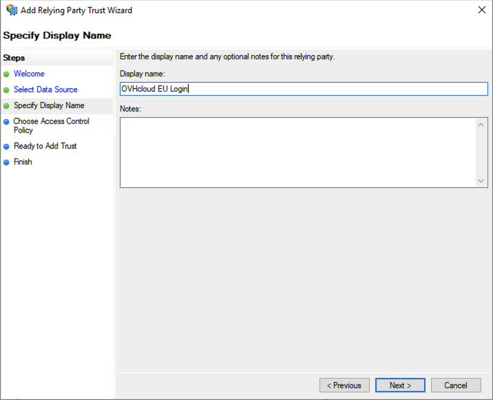
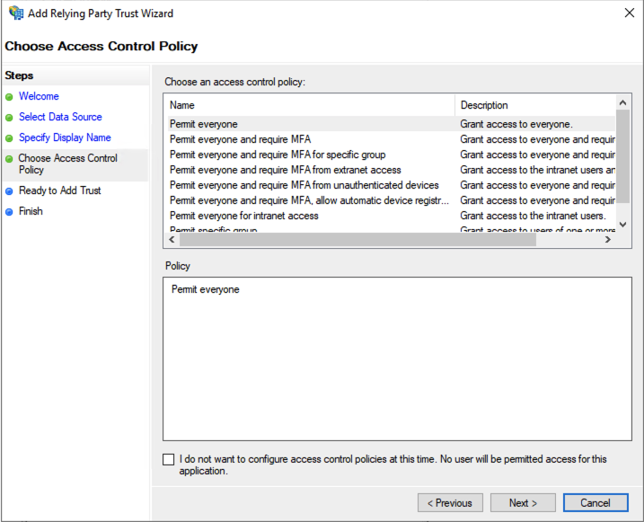

> [!primary]
> Tłumaczenie zostało wygenerowane automatycznie przez system naszego partnera SYSTRAN. W niektórych przypadkach mogą wystąpić nieprecyzyjne sformułowania, na przykład w tłumaczeniu nazw przycisków lub szczegółów technicznych. W przypadku jakichkolwiek wątpliwości zalecamy zapoznanie się z angielską/francuską wersją przewodnika. Jeśli chcesz przyczynić się do ulepszenia tłumaczenia, kliknij przycisk "Zgłóś propozycję modyfikacji" na tej stronie.
>

## Wprowadzenie

Do zalogowania się do konta OVHcloud możesz użyć **unikalnego** uwierzytelnienia SSO (*Single Sign-On*). Aby włączyć te połączenia, Twoje konto oraz usługi AD FS (*Active Directory Federation Services*) muszą być skonfigurowane za pomocą uwierzytelniania SAML (*Security Assertion Markup Language*).

**Niniejszy przewodnik wyjaśnia, jak powiązać Twoje konto OVHcloud z zewnętrzną Active Directory.**

## Wymagania początkowe

- Usługi AD FS (Active Directory Federation Services) muszą być wykonywane na serwerze
- Posiadanie [konta OVHcloud](/pages/account_and_service_management/account_information/ovhcloud-account-creation)
- Zalogowanie do [Panelu klienta OVHcloud](https://www.ovh.com/auth/?action=gotomanager&from=https://www.ovh.pl/&ovhSubsidiary=pl)

## W praktyce

> [!primary]
>
> Aby usługodawca (tzn. Twoje konto OVHcloud) mógł nawiązać połączenie SSO z dostawcą tożsamości (tzn. usługą AD FS), należy przede wszystkim nawiązać relację zaufania.
>

### Budowa zaufania AD FS

Twój AD FS działa jako dostawca tożsamości. Zlecenia uwierzytelnienia Twojego konta OVHcloud zostaną przyjęte tylko wtedy, gdy zostanie ono uznane za zaufaną organizację trzecią.

W kontekście Active Directory oznacza to, że należy go dodać jako `Relying Party Trust`.

W menedżerze serwerów otwórz menu `Tools`{.action} i wybierz `AD FS Management`{.action}.

{.thumbnail}

Kliknij `Relying Party Trusts`{.action}.

{.thumbnail}

Następnie kliknij `Add Relying Party Trust...`{.action}.

{.thumbnail}

Wybierz `Claims aware`{.action} i zatwierdź przyciskiem `Start`{.action}.

{.thumbnail}

Możesz wprowadzić ręcznie informacje dotyczące zaufanego podmiotu trzeciego lub zaimportować je z pliku metadanych.

#### Importuj metadane OVHcloud SP

Możesz uzyskać odpowiedni plik metadanych za pomocą następujących linków:

- [Metadane regionu UE](https://www.ovh.com/auth/sso/saml/sp/metadata.xml)
- [Metadane regionu CA](https://ca.ovh.com/auth/sso/saml/sp/metadata.xml)

Wybierz `Import data about the relying party from a file`{.action} i wybierz Twój plik metadanych.

Następnie kliknij przycisk `Next`{.action}.

{.thumbnail}

Wprowadź nazwę wyświetlacza dla zaufanej strony trzeciej i kliknij przycisk `Next`{.action}.

{.thumbnail}

Kliknij `Next`{.action} w oknie kontroli dostępu.

{.thumbnail}

Kliknij `Next`{.action}, aby kontynuować.

{.thumbnail}

Kliknij przycisk `Close`{.action} w ostatnim oknie. Zatwierdzenie przez OVHcloud jako zaufaną organizację trzecią zostało dodane do Twojego AD FS.

{.thumbnail}

> [!primary]
>
> Z OVHcloud dodanym jako zaufany podmiot zewnętrzny, powinieneś już mieć możliwość logowania się przez SSO. Jednak wszystkie informacje dotyczące tożsamości użytkownika (w zakresie "twierdzenia" SAML) pozostaną niedostępne do czasu skonfigurowania strategii dopasowania pól LDAP Active Directory do atrybutów SAML.
>

#### Korespondencja atrybutów LDAP z atrybutami SAML

Kliknij pozycję OVHcloud w części "Relying Party Trusts".

{.thumbnail}

Następnie kliknij `Edit Claim Issuance Policy...`{.action}.

{.thumbnail}

Kliknij przycisk `Add Rule...`{.action}.

{.thumbnail}

Kliknij `Next`{.action}.

Wpisz nazwę reguły i zdefiniuj tabelę korelacji.

Wybierz `Active Directory` jako `Attribute store`.

> [!primary]
>
> Poniższe parametry mogą być dowolnie skonfigurowane tak, aby dostawca usług mógł poprawnie odczytać dane LDAP Active Directory. Jako przykład możesz wykorzystać poniższy obraz.

Po zakończeniu kliknij przycisk `Finish`{.action}.

{.thumbnail}

{.thumbnail}

Kliknij przycisk `Apply`{.action} i zatwierdź `OK`{.action}.

{.thumbnail}

Po utworzeniu tabeli korelacji Twoja usługa AD FS stała się zaufana OVHcloud jako dostawca usług. Kolejnym krokiem jest sprawdzenie, czy konto OVHcloud zaufa użytkownikowi AD FS.

### Budowa zaufania do konta OVHcloud i konfiguracja połączenia

Opcja dodawania AD FS jako zaufanego dostawcy danych jest dostępna w [panelu klienta OVHcloud](https://www.ovh.com/auth/?action=gotomanager&from=https://www.ovh.pl/&ovhSubsidiary=pl), w którym możesz dostarczyć metadane dostawcy tożsamości.

[Zaloguj się](https://www.ovh.com/auth/?action=gotomanager&from=https://www.ovh.pl/&ovhSubsidiary=pl) i kliknij swój profil w prawym górnym rogu.

{.thumbnail}

Kliknij Twoją nazwę, aby przejść do strony zarządzania profilem.

{.thumbnail}

Otwórz zakładkę `Zarządzanie użytkownikami`{.action}.

{.thumbnail}

Kliknij przycisk `SSO connection`{.action} .

{.thumbnail}

Wpisz metadane XML Twojej usługi AD FS. W tym przypadku pole `Nazwa atrybutu grupy` jest opcjonalne. Kliknij na `Zatwierdź`{.action}.

{.thumbnail}

Odszukaj AD FS jako dostawcę danych, a także grupy domyślne.

{.thumbnail}

Aby uzyskać więcej informacji, kliknij link pod `URL usługi SSO`.

{.thumbnail}

{.thumbnail}

Przycisk `...`{.action} pozwala na aktualizację lub usunięcie certyfikatu SSO i na zapoznanie się z jego szczegółami.

{.thumbnail}

Usługa AD FS jest obecnie uważana za zaufanego dostawcę tożsamości. Jednocześnie należy dodać grupy do konta OVHcloud.

> [!warning]
> Jeśli spróbujesz zalogować się przez SSO, prawdopodobnie wyświetli się komunikat błędu `Not in valid groups`.
>
> Twoje konto OVHcloud sprawdza, czy użytkownik loguje się do grupy istniejącej na koncie.
>

Aby to zrobić, sprawdź informacje zebrane w atrybucie "Group" zwróconym przez usługę AD FS.

Weźmy na przykład użytkownika "John Doe" z Active Directory, jak pokazano na poniższym obrazku.

{.thumbnail}

Sprawdź tabelę korelacji w AD FS:

{.thumbnail}

W tym przykładzie atrybut "Group" zwrócony przez Active Directory dla użytkownika "John Doe" jest "title". Odpowiada to "job title", który jest `manager@<my-domain>.com`.

Możesz również sprawdzić w twierdzeniu SAML:

```xml
<AttributeStatement>
    <Attribute Name="http://schemas.xmlsoap.org/claims/Group">
        <AttributeValue>manager@<my-domain>.com</AttributeValue>
    </Attribute>
    ...
</AttributeStatement>
```

Oznacza to, że należy dodać grupę `manager@<my-domain>.com` do Twojego konta OVHcloud i przypisać do niego określoną rolę. W przeciwnym razie Twoje konto OVHcloud nie wie, co może robić użytkownik.

Dodaj konto klikając przycisk `Zgłoś grupę`{.action} i wypełniając pola:

{.thumbnail}

{.thumbnail}

Następnie możesz sprawdzić, czy grupa została dodana do Twojego konta OVHcloud w sekcji `Grupy`:

{.thumbnail}

Po zalogowaniu się z użytkownikiem Active Directory "John Doe" Twoje konto OVHcloud potwierdzi rolę "REGULAR" określoną przez jego grupę.

Następnie będziesz mógł wylogować się ze swojego konta i ponownie zalogować się z AD FS jako dostawcą danych.

### Logowanie przez SSO

Na [stronie logowania OVHcloud](https://www.ovh.com/auth/?action=gotomanager&from=https://www.ovh.pl/&ovhSubsidiary=pl) wpisz [identyfikator](/pages/account_and_service_management/account_information/ovhcloud-account-creation#jaki-jest-moj-identyfikator-klienta), po którym następuje **/idp** bez hasła i kliknij przycisk `Login`{.action}.

{.thumbnail}

Zostaniesz przekierowany na stronę logowania AD FS. Wprowadź login/hasło użytkownika Active Directory LDAP, następnie kliknij przycisk `Sign in`{.action}.

{.thumbnail}

Teraz jesteś zalogowany tym samym identyfikatorem klienta, ale za pomocą użytkownika Active Directory oraz SSO AD FS.

{.thumbnail}

## Sprawdź również

[Załóż konto OVHcloud](/pages/account_and_service_management/account_information/ovhcloud-account-creation)

[Zabezpieczenie konta OVHcloud i zarządzanie danymi osobowymi](/pages/account_and_service_management/account_information/all_about_username)

[Definicja i zarządzanie hasłem do konta](/pages/account_and_service_management/account_information/manage-ovh-password)

[Zabezpieczenie konta OVHcloud za pomocą weryfikacji dwuetapowej](/pages/account_and_service_management/account_information/secure-ovhcloud-account-with-2fa)

Przyłącz się do społeczności naszych użytkowników na stronie <https://community.ovh.com/en/>.
