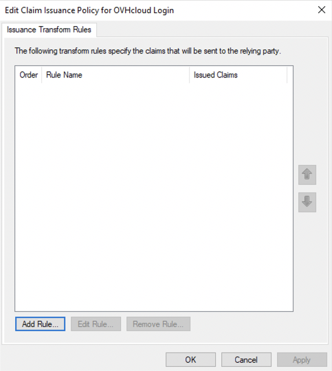
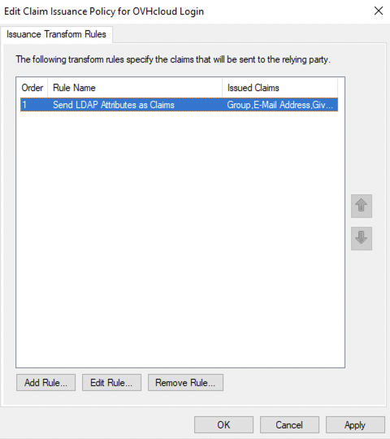
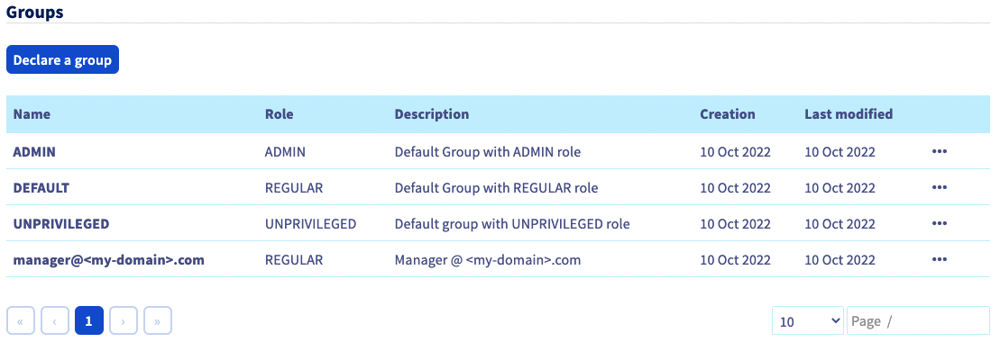

> [!primary]
> Esta tradução foi automaticamente gerada pelo nosso parceiro SYSTRAN. Em certos casos, poderão ocorrer formulações imprecisas, como por exemplo nomes de botões ou detalhes técnicos. Recomendamos que consulte a versão inglesa ou francesa do manual, caso tenha alguma dúvida. Se nos quiser ajudar a melhorar esta tradução, clique em "Contribuir" nesta página.
>

## Objetivo

Pode utilizar a autenticação SSO (*Single Sign-On*) **única** para se ligar à sua conta OVHcloud. Para ativar estas ligações, a sua conta e os seus serviços AD FS (*Active Directory Federation Services*) devem ser configurados com a ajuda das autenticações SAML (*Security Assertion Markup Language*).

**Este manual explica-lhe como associar a sua conta OVHcloud a um Active Directory externo.**

## Requisitos

- Os serviços AD FS (Active Directory Federation Services) devem ser executados no seu servidor
- Ter uma [conta OVHcloud](/pages/account_and_service_management/account_information/ovhcloud-account-creation)
- Estar ligado à [Área de Cliente OVHcloud](https://www.ovh.com/auth/?action=gotomanager&from=https://www.ovh.pt/&ovhSubsidiary=pt).

## Instruções

> [!primary]
>
> Para que um prestador de serviços (ou seja, a sua conta OVHcloud) possa estabelecer uma ligação SSO com um fornecedor de identidade (ou seja, o seu serviço AD FS), o essencial é estabelecer uma relação de confiança mútua.
>

### Estabelecer a confiança AD FS

O seu AD FS atua como fornecedor de identidade. Os pedidos de autenticação da sua conta OVHcloud só serão aceites se o tiver declarado previamente como organismo terceiro de confiança.

No contexto Active Directory, isto significa que deve ser adicionado como `Relying Party Trust`.

No gestor dos Servidores, abra o menu `Tools`{.action} e selecione `AD FS Management`{.action}.

{.thumbnail}

Clique em `Relying Party Trusts`{.action}.

{.thumbnail}

A seguir, clique em `Add Relying Party Trust...`{.action}.

{.thumbnail}

Selecione `Claims aware`{.action} e valide com o botão `Start`{.action}.

{.thumbnail}

Pode introduzir manualmente as informações sobre o organismo terceiro de confiança ou importá-las a partir de um ficheiro de metadados.

#### Importar os metadados OVHcloud SP

Pode obter o ficheiro de metadados adequado através das seguintes ligações:

- [Metadados da região da UE](https://www.ovh.com/auth/sso/saml/sp/metadata.xml)
- [Metadados da região CA](https://ca.ovh.com/auth/sso/saml/sp/metadata.xml)

Selecione o `Import data about the relying party from a file`{.action} e selecione o seu ficheiro de metadados.

A seguir, clique no botão `Next`{.action}.

{.thumbnail}

Introduza um nome de apresentação para o organismo terceiro de confiança e clique no botão `Next`{.action}.

{.thumbnail}

Clique em `Next`{.action} na janela do controlo de acesso.

{.thumbnail}

Clique novamente em `Next`{.action} para continuar.

{.thumbnail}

Clique no botão `Close`{.action} na última janela. A aprovação da OVHcloud como organismo terceiro de confiança foi adicionada ao seu AD FS.

{.thumbnail}

> [!primary]
>
> Com a OVHcloud adicionada como organismo terceiro de confiança, já deveria poder ligar-se através de uma ligação SSO. No entanto, todas as informações relativas à identidade do utilizador (em termos de "asserção" SAML) permanecerão indisponíveis até que configure uma estratégia para fazer corresponder os campos LDAP Active Directory aos atributos da asserção SAML.
>

#### Correspondência dos atributos LDAP aos atributos SAML

Clique na entrada da OVHcloud na secção "Relying Party Trusts".

{.thumbnail}

A seguir, clique em `Edit Claim Issuance Policy...`{.action}.

{.thumbnail}

Clique no botão `Add Rule...`{.action}.

{.thumbnail}

Clique em `Next`{.action}.

Introduza um nome de regra e defina a sua tabela de correspondência.

Selecione `Active Directory` como `Attribute store`.

> [!primary]
>
> Os parâmetros seguintes podem ser configurados livremente de modo a que o prestador de serviços possa ler corretamente os dados LDAP Active Directory. Pode consultar a imagem abaixo como exemplo.

Quando terminar, clique no botão `Finish`{.action}.

{.thumbnail}

{.thumbnail}

Clique no botão `Apply`{.action} e valide com `OK`{.action}.

{.thumbnail}

Uma vez terminada a tabela de correspondências, o seu serviço AD FS confia agora na OVHcloud enquanto fornecedor de serviços. O passo seguinte consiste em assegurar-se de que a conta OVHcloud confia no seu AD FS enquanto fornecedor de identidade.

### Determinar a confiança da conta OVHcloud e configurar a ligação

A adição do AD FS como fornecedor de identidade de confiança pode ser efetuada na [Área de Cliente OVHcloud](https://www.ovh.com/auth/?action=gotomanager&from=https://www.ovh.pt/&ovhSubsidiary=pt), onde poderá fornecer os metadados do fornecedor de identidade.

[Ligue-se](https://www.ovh.com/auth/?action=gotomanager&from=https://www.ovh.pt/&ovhSubsidiary=pt) e clique no seu perfil no canto superior direito.

{.thumbnail}

Clique no seu nome para aceder à página de gestão do seu perfil.

{.thumbnail}

Abra o separador `Gestão dos utilizadores`{.action}.

{.thumbnail}

Clique no botão `SSO connection`{.action}.

{.thumbnail}

Insira os metadados XML do seu serviço AD FS. O campo `Nome do atributo do grupo` é facultativo neste caso. Clique em `Confirmar`{.action}.

{.thumbnail}

Agora deve encontrar o AD FS como fornecedor de identidade, assim como os grupos predefinidos.

{.thumbnail}

Para mais informações, clique no link situado abaixo do `URL do serviço SSO`.

{.thumbnail}

{.thumbnail}

O botão `...`{.action} permite atualizar ou eliminar o SO, e consultar os respetivos detalhes.

{.thumbnail}

O seu AD FS é agora considerado fornecedor de identidade de confiança. No entanto, deve mesmo assim adicionar grupos à sua conta OVHcloud.

> [!warning]
> Se, nesta fase, estiver a tentar conectar-se através de SSO, é provável que apareça uma mensagem de erro `Not in valid groups`.
>
> A sua conta OVHcloud verifica se o utilizador que se autentica pertence a um grupo existente na conta.
>

Para resolver este problema, verifique as informações associadas ao atributo "Group" devolvidas pelo serviço AD FS.

Tome como exemplo o de um utilizador "John Doe" do seu Active Directory, como indicado na imagem abaixo.

{.thumbnail}

Verifique a tabela de correspondências em AD FS:

{.thumbnail}

Neste exemplo, o atributo "Group" reenviado pelo Active Directory para o utilizador "John Doe" é "title". Corresponde ao "job title" que é o `manager@<my-domain>.com`.

Também pode verificar isto na secção SAML:

```xml
<AttributeStatement>
    <Attribute Name="http://schemas.xmlsoap.org/claims/Group">
        <AttributeValue>manager@<my-domain>.com</AttributeValue>
    </Attribute>
    ...
</AttributeStatement>
```

Isto significa que deve adicionar o grupo `manager@<my-domain>.com` à sua conta OVHcloud ligando-lhe um papel. Caso contrário, a sua conta OVHcloud não sabe o que o utilizador pode fazer.

Adicione-o ao clicar no botão `Declarar um grupo`{.action} e preencher os campos:

{.thumbnail}

{.thumbnail}

De seguida, poderá verificar que o grupo é adicionado à sua conta OVHcloud na secção `Grupos`:

{.thumbnail}

Quando se ligar ao utilizador Active Directory "John Doe", a sua conta OVHcloud reconhecerá que o utilizador tem o papel "REGULAR", especificado pelo seu grupo.

De seguida, poderá desligar a sua conta e voltar a ligar-se ao seu AD FS enquanto fornecedor de identidade.

### Ligação via SSO

Na [página de identificação da OVHcloud](https://www.ovh.com/auth/?action=gotomanager&from=https://www.ovh.pt/&ovhSubsidiary=pt), introduza o seu [identificador de cliente](/pages/account_and_service_management/account_information/ovhcloud-account-creation#qual-e-o-meu-identificador-de-cliente) seguido de **/idp** sem password e clique no botão `Login`{.action}.

{.thumbnail}

De seguida, será redirecionado para a página de ligação AD FS. Introduza um login/password de um utilizador do seu Active Directory LDAP e clique no botão `Sign in`{.action}.

{.thumbnail}

Já está conectado com o mesmo identificador de cliente, mas através do utilizador Active Directory e do SSO AD FS.

{.thumbnail}

## Quer saber mais?

[Criar uma conta OVHcloud](/pages/account_and_service_management/account_information/ovhcloud-account-creation)

[Proteger a minha conta OVHcloud e gerir as minhas informações pessoais](/pages/account_and_service_management/account_information/all_about_username)

[Definição e gestão da palavra-passe da sua conta](/pages/account_and_service_management/account_information/manage-ovh-password)

[Proteger a sua conta OVHcloud com a dupla autenticação](/pages/account_and_service_management/account_information/secure-ovhcloud-account-with-2fa)

Junte-se à nossa comunidade de utilizadores em <https://community.ovh.com/en/>.
