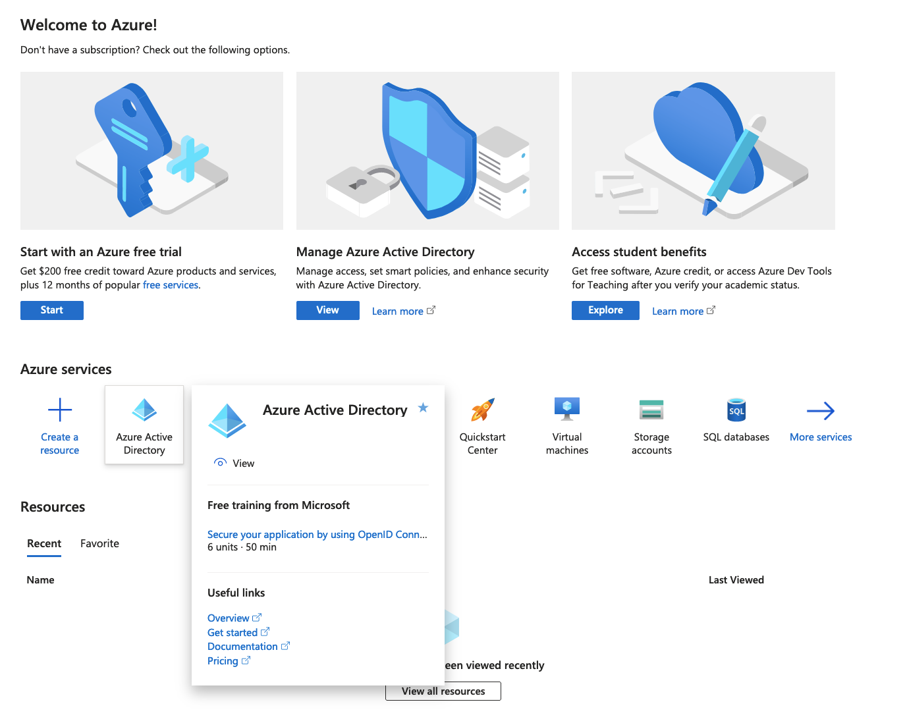
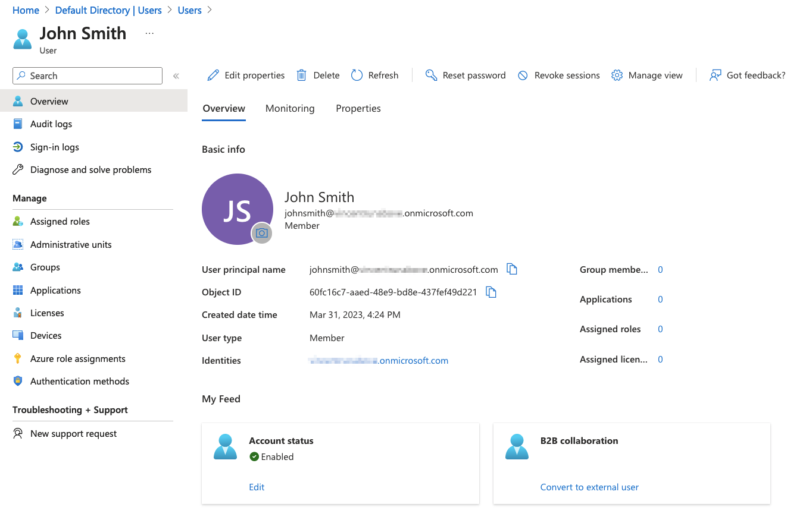
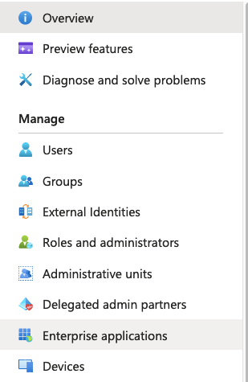
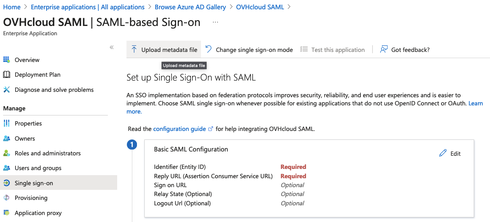
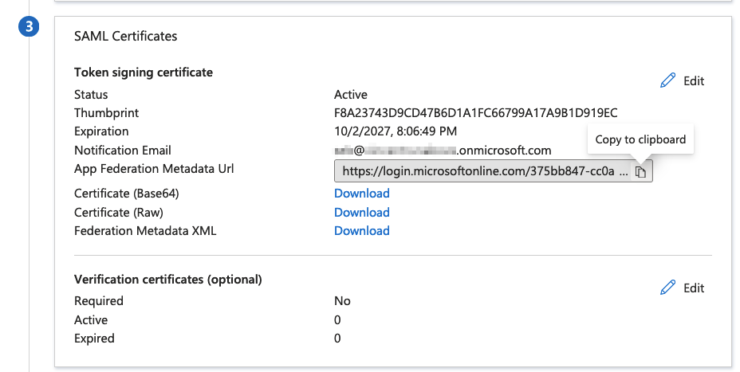
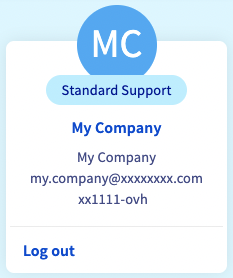
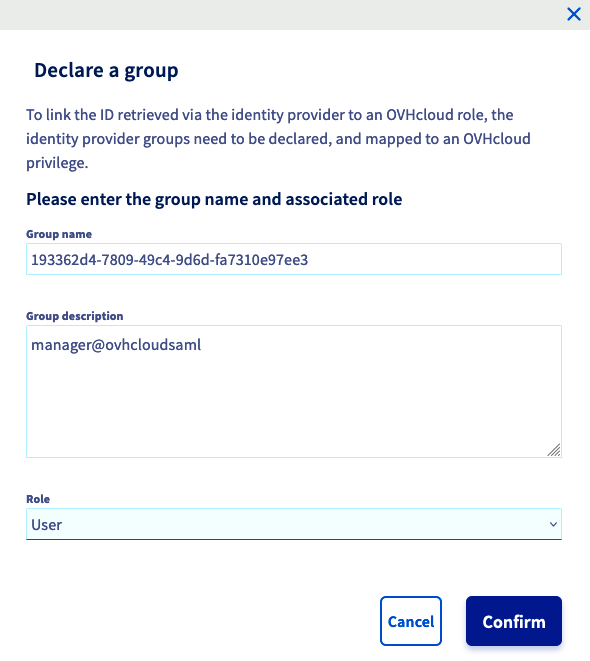
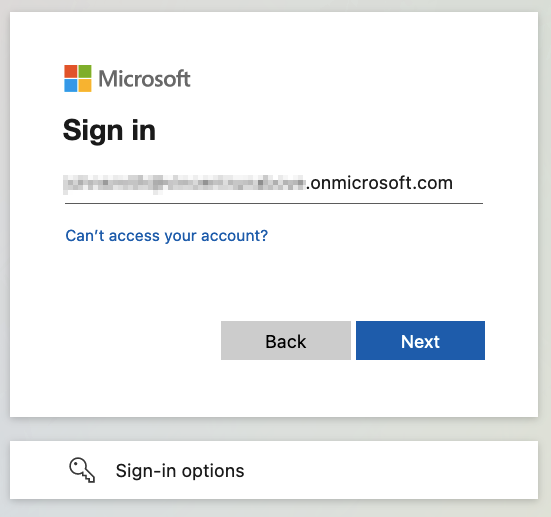
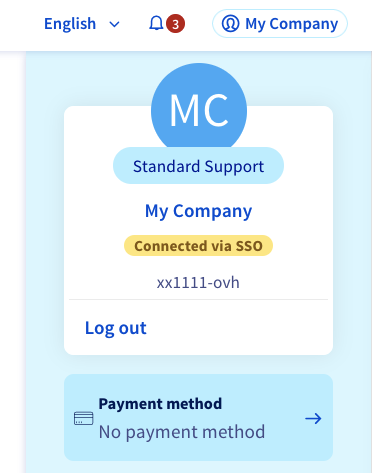

> [!primary]
> Esta traducción ha sido generada de forma automática por nuestro partner SYSTRAN. En algunos casos puede contener términos imprecisos, como en las etiquetas de los botones o los detalles técnicos. En caso de duda, le recomendamos que consulte la versión inglesa o francesa de la guía. Si quiere ayudarnos a mejorar esta traducción, por favor, utilice el botón «Contribuir» de esta página.
> 

**Última actualización: 05/04/2023**

## Objetivo

Puede utilizar la autenticación **SSO** (*Single Sign-On*) para conectarse a su cuenta OVHcloud. Para activar estas conexiones, su cuenta y su Azure AD (Active Directory) deben configurarse utilizando SAML (*Security Assertion Markup Language*).

**Esta guía explica cómo asociar una cuenta de OVHcloud a un Azure AD externo.**

## Requisitos

- Tener acceso a las funciones de **administrador de aplicaciones** y **administrador de usuarios** de un servicio Azure AD
- Disponer de una [cuenta de OVHcloud](/pages/account_and_service_management/account_information/ovhcloud-account-creation)
- Tienes acceso a tu [Panel de configuración de OVHcloud](https://ca.ovh.com/auth/?action=gotomanager&from=https://www.ovh.com/world/&ovhSubsidiary=ws)

## Procedimiento

> [!primary]
>
> Para que un proveedor de servicios (por ejemplo, su cuenta de OVHcloud) establezca una conexión SSO con un proveedor de identidad (por ejemplo, su Azure AD), debe establecer una relación de confianza mutua registrando la conexión SSO en ambos servicios.
>

### Usuarios y grupos Azure AD

Su Azure AD actúa como proveedor de identidad. Las solicitudes de autenticación de su cuenta de OVHcloud solo se aceptarán si primero la ha declarado como un tercero de confianza.

Concentrémonos un momento en las identidades del proveedor de identidad.

#### Usuarios Azure AD

En primer lugar, acceda al panel de control Azure AD.

{.thumbnail}

En el menú de la izquierda, haga clic en `Users`{.action}.

{.thumbnail}

Cree tantos usuarios como desee y/o verifique a sus usuarios haciendo clic en él.

Para este ejemplo, se usará el usuario **John Smith**.

{.thumbnail}

Cuando se realiza la autenticación SSO, la identidad de **John Smith** la proporciona Azure AD a la cuenta de OVHcloud. Sin embargo, esta identidad debe contener al menos un grupo. Si no existe ningún grupo, a continuación se muestra cómo crear uno para agregar a **John Smith**.

#### Grupos Azure AD

En el menú de la izquierda, haga clic en `Groups`{.action}.

{.thumbnail}

En el menú superior, haga clic en `New group`{.action} e introduzca toda la información necesaria.

Para este ejemplo, se utilizará el grupo **manager@ovhcloudsaml**.

{.thumbnail}

Haga clic en el botón `Create`{.action} para ver toda la información sobre este grupo.

{.thumbnail}

Ahora, los usuarios que se utilizarán para la autenticación SSO deben añadirse a un grupo.

En este ejemplo, asociemos al usuario **John Smith** con el grupo **manager@ovhcloudsaml**.

En la interfaz del grupo seleccionado, haga clic en `Members`{.action} en el menú de la izquierda y seleccione `Add members`{.action} en el menú superior.

{.thumbnail}

Seleccione el usuario que desea añadir a este grupo y haga clic en el botón `Select`{.action}.

{.thumbnail}

Ahora el usuario está asignado al grupo.

Para realizar autenticaciones SSO, debe crear una aplicación Azure AD.

La autenticación única debe configurarse en esta aplicación.

### Aplicaciones Azure AD

En primer lugar, cree una aplicación si todavía no existe.

#### Crear una aplicación Azure AD

En el menú de la izquierda, haga clic en `Enterprise applications`{.action}.

{.thumbnail}

Haga clic en `New application`{.action} en el menú superior.

{.thumbnail}

Haga clic en `Create your own application`{.action} en el menú superior.

{.thumbnail}

Seleccione `Non-gallery`{.action} en el menú de la izquierda y haga clic en el botón `Create`{.action}.

{.thumbnail}

Se mostrarán los detalles de la aplicación.

{.thumbnail}

Se ha creado la aplicación Azure AD. Los usuarios que deseen realizar autenticaciones SSO a través de esta aplicación deben añadirse.

#### Application Azure AD - Uso de usuarios

> [!primary]
>
> Para que un usuario realice la autenticación SSO a partir de una aplicación Azure AD, debe añadirse a esta aplicación. Cómo añadir un usuario a una aplicación Azure AD
>
> Sin embargo, si dispone de **Azure AD Premium**, es mejor añadir un grupo de usuarios que usuarios.
>

En el menú de la izquierda, haga clic en `Users and groups`{.action} y seleccione `Add user/group`{.action}.

A continuación, haga clic en la sección `Usuarios`{.action}, seleccione el usuario que desea añadir a la aplicación y haga clic en el botón `Select`{.action}.

{.thumbnail}

{.thumbnail}

La aplicación está creada, el usuario está asignado, solo tiene que implementar el SSO a través de SAML.

#### Azure AD application SSO

Vuelva a la vista de conjunto utilizando el botón `Overview`{.action} en el menú de la izquierda y haga clic en la sección `Set up single sign on`{.action}.

{.thumbnail}

Haga clic en la sección `SAML`{.action} .

{.thumbnail}

Haga clic en `Upload metadata file`{.action} en el menú superior.

{.thumbnail}

Haga clic en el icono del botón `Select a file`{.action}, seleccione el archivo de metadatos OVHcloud Service Provider y haga clic en el botón `Add`{.action}.

Puede obtener el archivo de metadatos adecuado a través de los siguientes enlaces:

- [Metadatos de la región de la UE](https://www.ovh.com/auth/sso/saml/sp/metadata.xml)
- [Metadatos de la región CA](https://ca.ovh.com/auth/sso/saml/sp/metadata.xml)

Descargue el archivo de metadatos, que más tarde necesitará.

{.thumbnail}

Se mostrará la configuración SAML.

{.thumbnail}

En la sección `Attributes & Claims`{.action}, haga clic en el botón `Edit`{.action}.

{.thumbnail}

Haga clic en `Add a group claim`{.action} en el menú superior.

{.thumbnail}

Seleccione `Security groups`{.action} y **Group ID** en `Source attribute`{.action} y haga clic en el botón `Save`{.action}.

{.thumbnail}

La reivindicación de **groups** debe aparecer ahora en la lista.

Copie y guarde el valor del **Claim name** en algún lugar (por ejemplo, un bloc de notas), pero más adelante lo necesitará.

{.thumbnail}

En la sección `SAML certificates`{.action}, copie el valor del campo `App Federation Metadata Url`{.action}.

Utilice este enlace para descargar el archivo de metadatos de la aplicación Azure AD para utilizarlo posteriormente en la cuenta de OVHcloud.

{.thumbnail}

### Crear la confianza de una cuenta de OVHcloud y configurar la conexión

La adición de su aplicación Azure AD como proveedor de identidad aprobado se realiza en [el área de cliente de OVHcloud](https://ca.ovh.com/auth/?action=gotomanager&from=https://www.ovh.com/world/&ovhSubsidiary=ws), donde puede proporcionar los metadatos del proveedor de identidad.

#### Creación de confianza en OVHcloud

[Conéctese al área de cliente](https://ca.ovh.com/auth/?action=gotomanager&from=https://www.ovh.com/world/&ovhSubsidiary=ws) y haga clic en su perfil en la parte superior derecha.

{.thumbnail}

Haga clic en su nombre para acceder a la página de gestión de su perfil.

{.thumbnail}

Abra la pestaña `Gestión de usuarios`{.action}.

{.thumbnail}

Haga clic en el botón `Conexión SSO`{.action}.

{.thumbnail}

Complete el campo **Group Attribute Name** con el valor de **Claim name** de los grupos de aplicaciones Azure AD guardado anteriormente.

Rellene los metadatos XML de su aplicación Azure AD desde el archivo guardado anteriormente.

Haga clic en `Aceptar`{.action}.

{.thumbnail}

La adición de su aplicación Azure AD como proveedor de identidad ya está establecida, pero debe añadir grupos a su cuenta de OVHcloud.

> [!warning]
> Si intenta conectarse por SSO, es probable que aparezca un mensaje de error `Not in valid groups`.
>
> Su cuenta de OVHcloud verifica si el usuario autentificado pertenece a un grupo existente en la cuenta.
>

Para solucionar el problema, compruebe el atributo "Group" devuelto por la aplicación Azure AD: el campo **Object Id**.

#### Declaración de los grupos OVHcloud

{.thumbnail}

Para añadirlo, haga clic en el botón `Declarar un grupo`{.action}.

{.thumbnail}

Complete los campos y haga clic en el botón `Aceptar`{.action}.

{.thumbnail}

El grupo creado debe aparecer en la lista.

{.thumbnail}

### Conexión mediante SSO

En [la página de identificación de OVHcloud](https://ca.ovh.com/auth/?action=gotomanager&from=https://www.ovh.com/world/&ovhSubsidiary=ws), introduzca su [ID de cliente](/pages/account_and_service_management/account_information/ovhcloud-account-creation#cual-es-mi-id-de-cliente) seguido de **/idp** sin contraseña y haga clic en el botón `Login`{.action} .

{.thumbnail}

A continuación, será redirigido a la página de conexión a su aplicación Azure AD. Seleccione `Use another account`{.action}.

{.thumbnail}

Introduzca el mensaje de correo electrónico del usuario de la aplicación Azure AD y haga clic en el botón `Next`{.action}.

{.thumbnail}

Introduzca la contraseña del usuario de la aplicación Azure AD y haga clic en el botón `Sign In`{.action}.

{.thumbnail}

Ahora está conectado con el mismo ID de cliente, pero a través de su usuario de Azure AD.

{.thumbnail}

## Más información

[Crear una cuenta de OVHcloud](/pages/account_and_service_management/account_information/ovhcloud-account-creation)

[Proteger mi cuenta de OVHcloud y gestionar mis datos personales](/pages/account_and_service_management/account_information/all_about_username)

[Definición y gestión de la contraseña de su cuenta](/pages/account_and_service_management/account_information/manage-ovh-password)

[Proteger su cuenta de OVHcloud con la doble autenticación](/pages/account_and_service_management/account_information/secure-ovhcloud-account-with-2fa)

Interactúe con nuestra comunidad de usuarios en <https://community.ovh.com/en/>.