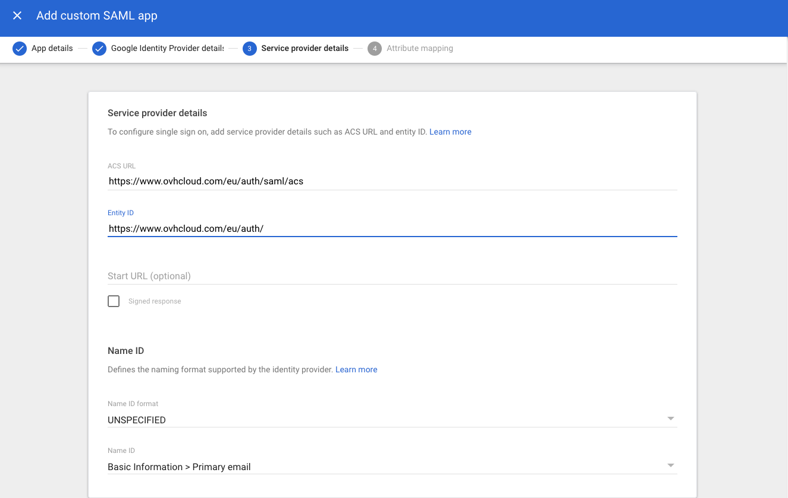
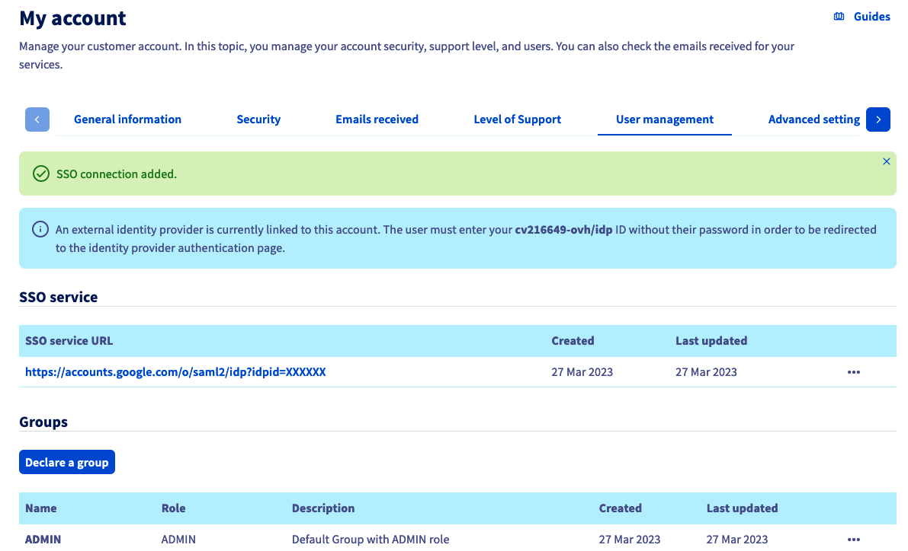

> [!primary]
> Esta tradução foi automaticamente gerada pelo nosso parceiro SYSTRAN. Em certos casos, poderão ocorrer formulações imprecisas, como por exemplo nomes de botões ou detalhes técnicos. Recomendamos que consulte a versão inglesa ou francesa do manual, caso tenha alguma dúvida. Se nos quiser ajudar a melhorar esta tradução, clique em "Contribuir" nesta página.
>

## Objetivo

Pode utilizar a autenticação **SSO** (*Single Sign-On*) para se ligar à sua conta OVHcloud. Para ativar estas ligações, a sua conta OVHcloud e as suas contas Google Workspace devem ser configuradas com a ajuda das autenticações SAML (*Security Assertion Markup Language*).

**Este guia explica como associar a sua conta OVHcloud a um serviço Google Workspace externo.**

## Requisitos

- Ser administrador de um serviço Google Workspace
- Ter uma [conta OVHcloud](/pages/account_and_service_management/account_information/ovhcloud-account-creation)
- Ter acesso à [Área de Cliente OVHcloud](https://www.ovh.com/auth/?action=gotomanager&from=https://www.ovh.pt/&ovhSubsidiary=pt)

## Instruções

> [!primary]
>
> Para que um prestador de serviços (ou seja, a sua conta OVHcloud) possa estabelecer uma ligação SSO com um fornecedor de identidade (ou seja, o seu serviço Google Workspace), o essencial é estabelecer uma relação de confiança mútua ao registar a ligação SSO em ambos os serviços.
>

### Registar a OVHcloud no Google Workspace

O seu Google Workspace atua como fornecedor de identidade. Os pedidos de autenticação da sua conta OVHcloud só serão aceites se o tiver declarado previamente como organismo terceiro de confiança.

Isto significa que tem de ser adicionado como `Web and mobile apps`.

Ligue-se à interface de administração do [Google Workspace](https://admin.google.com) com a sua conta de administrador.

Aceda à `Apps`{.action} e depois à `Web and mobile apps`{.action}.

{.thumbnail}

Clique em `Add app`{.action} e depois em `Add custom SAML app`{.action}.

Na etapa "App Details", adicione um nome para esta interligação. Se não tem inspiração, a **OVHcloud** é um nome adequado. Clique em `Continue`{.action}.

{.thumbnail}

Na etapa "Google Identity Provider details", descarregue o ficheiro de metadados clicando em `Download metadata`{.action} e clique em `Continue`{.action}.

{.thumbnail}

Na etapa "Service provider details", complete os campos `ACS URL` e `Entity ID` com os valores da sua região: 

 - Região EU: **ACS URL**: `https://www.ovhcloud.com/eu/auth/saml/acs` e **Entity ID**: `https://www.ovhcloud.com/eu/auth/`
 - Região CA: **ACS URL**: `https://www.ovhcloud.com/ca/auth/saml/acs` e **Entity ID**: `https://www.ovhcloud.com/ca/auth/`

Clique em `Continue`{.action}.

{.thumbnail}

Na etapa "Atributo mapping", adicione o seguinte mapping:

- **First Name**: Name
- **Last Name**: Surname
- **Primary email**: E-mail Address

Clique em `Finish`{.action}.

{.thumbnail}

Ative o acesso a esta aplicação clicando em `OFF for everyone`{.action} na rubrica "User Access". Clique em `ON for everyone`{.action} e, a seguir, no botão `SAVE`{.action}

{.thumbnail}

{.thumbnail}

> [!primary]
>
> A adição de uma aplicação a utilizadores pode demorar várias horas até ficar efetiva.
>

O seu serviço Google Workspace já confia na OVHcloud enquanto fornecedor de serviços. O passo seguinte é assegurar-se de que a conta OVHcloud confia no seu Google Workspace enquanto fornecedor de identidade.

### Determinar a confiança da conta OVHcloud e configurar a ligação

A adição do seu Google workspace como fornecedor de identidade é efetuada na [Área de Cliente OVHcloud](https://www.ovh.com/auth/?action=gotomanager&from=https://www.ovh.pt/&ovhSubsidiary=pt), onde pode fornecer os metadados ]do fornecedor de identidade.

[Ligue-se e clique](https://www.ovh.com/auth/?action=gotomanager&from=https://www.ovh.pt/&ovhSubsidiary=pt) no seu perfil no canto superior direito.

{.thumbnail}

Clique no seu nome para aceder à página de gestão do seu perfil.

{.thumbnail}

Abra o separador `Gestão dos utilizadores`{.action}.

{.thumbnail}

Clique no botão `Ligação SSO`{.action}.

{.thumbnail}

Insira os metadados XML do seu serviço Google Workspace. Preencha o campo "Apelido de grupo" com o valor `Group`. Clique em `Confirmar`{.action}.

{.thumbnail}

Agora tem de encontrar o seu Google Workspace como fornecedor de identidade, assim como os grupos predefinidos.

{.thumbnail}

Para mais informações, clique no link situado em "URL do serviço SSO".

{.thumbnail}

O botão `...`{.action} permite atualizar ou eliminar o SO, e consultar os respetivos detalhes.

{.thumbnail}

O seu Google Workspace é agora considerado um fornecedor de confiança. No entanto, deve mesmo assim adicionar grupos à sua conta OVHcloud.

> [!warning]
> Se, nesta fase, estiver a tentar conectar-se através de SSO, é provável que apareça uma mensagem de erro `Not in valid groups`.
>
> A sua conta OVHcloud verifica se o utilizador que se autentica pertence a um grupo existente na conta.
>

Para isso, deve autorizar os grupos que serão transmitidos do Google Workspace para a OVHcloud. Estes grupos são os mesmos que os utilizados para categorizar os seus utilizadores.

Para isso, aceda à interface de administração do [Google Workspace](https://admin.google.com) com a sua conta de administrador.

Aceda à `Apps`{.action} e depois à `Web and mobile apps`{.action}.

{.thumbnail}

Clique na linha da aplicação que adicionou anteriormente.

{.thumbnail}

Clique em `SAML attribute mapping`{.action} para editar o mapping das informações partilhadas entre o Google Workspace e a OVHcloud.

{.thumbnail}

Na categoria "Group membership (optional)", adicione todos os grupos que deseja autorizar para se ligar à OVHcloud. No campo "App attribute", indique o `Group`.

De seguida, deverá atribuir **funções** a estes grupos de utilizadores na OVHcloud. Caso contrário, a sua conta OVHcloud não sabe o que o utilizador está autorizado a fazer e, de forma padrão, não é atribuído nenhum direito.

{.thumbnail}

Na Área de Cliente OVHcloud, adicione um grupo ao clicar no botão `Declarar um grupo`{.action} e preencher os campos:

 - **Nome do grupo**: nome do grupo no Google Workspace
 - **Privilégio**: nível do direito concedido a este grupo

{.thumbnail}

{.thumbnail}

De seguida, poderá verificar que o grupo é adicionado à sua conta OVHcloud na secção "Grupos":

{.thumbnail}

Quando se ligar a um utilizador do grupo **Intern**, a sua conta OVHcloud reconhecerá que o utilizador tem o papel "UNPRIVILEGED" especificado pelo seu grupo.

De seguida, poderá desligar a sua conta e voltar a ligar-se ao seu Google Workspace enquanto fornecedor de identidade.

### Ligação via SSO

Na [página de identificação da OVHcloud](https://www.ovh.com/auth/?action=gotomanager&from=https://www.ovh.pt/&ovhSubsidiary=pt), introduza o seu [identificador de cliente](/pages/account_and_service_management/account_information/ovhcloud-account-creation#qual-e-o-meu-identificador-de-cliente) seguido de **/idp** sem password e clique no botão `Login`{.action}.

{.thumbnail}

De seguida, será redirecionado para a página de ligação Google Workspace. Introduza um login/password de um utilizador do seu Google Workspace e clique no botão `Sign in`{.action} .

{.thumbnail}

Já está conectado com o mesmo identificador de cliente, mas através do seu utilizador Google Workspace.

{.thumbnail}

## Quer saber mais?

[Criar uma conta OVHcloud](/pages/account_and_service_management/account_information/ovhcloud-account-creation)

[Proteger a minha conta OVHcloud e gerir as minhas informações pessoais](/pages/account_and_service_management/account_information/all_about_username)

[Definição e gestão da palavra-passe da sua conta](/pages/account_and_service_management/account_information/manage-ovh-password)

[Proteger a sua conta OVHcloud com a dupla autenticação](/pages/account_and_service_management/account_information/secure-ovhcloud-account-with-2fa)

Junte-se à nossa comunidade de utilizadores em <https://community.ovh.com/en/>.
