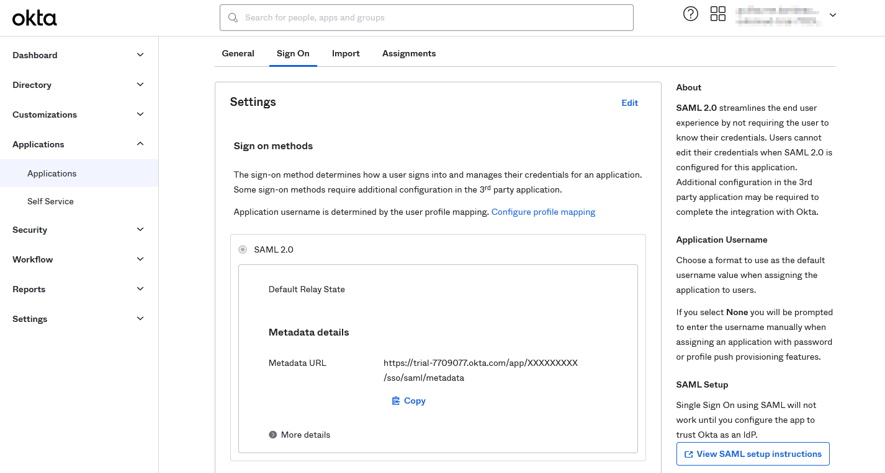
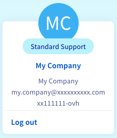
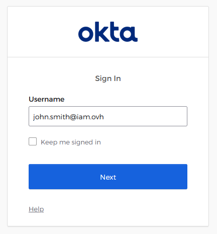

## Obiettivo

L'autenticazione SSO (*Single Sign-On*) è disponibile per accedere al tuo account OVHcloud. Per attivare queste connessioni, il tuo account e i tuoi account Okta devono essere configurati con l'aiuto di SAML (*Security Assertion Markup Language*).

**Questa guida ti mostra come associare il tuo account OVHcloud a un servizio Okta esterno.**

## Prerequisiti

- Essere amministratore di un servizio Okta
- Disporre di un [account OVHcloud attivo](/pages/account_and_service_management/account_information/ovhcloud-account-creation)
- Avere accesso allo [Spazio Cliente OVHcloud](https://www.ovh.com/auth/?action=gotomanager&from=https://www.ovh.it/&ovhSubsidiary=it)

## Procedura

> [!primary]
>
> Affinché un provider di servizi (ad esempio, l'account OVHcloud) stabilisca una connessione SSO con un provider di identità (ad esempio, il tuo servizio Okta), l'essenziale è stabilire un rapporto di fiducia reciproca memorizzando la connessione SSO nei due servizi.
>

### Registrare OVHcloud a Okta

Il tuo servizio Okta agisce come provider di identità. Le richieste di autenticazione del tuo account OVHcloud saranno accettate solo se l'hai precedentemente dichiarato come organismo terzo di fiducia.

Ciò significa che deve essere aggiunto come `Applications`.

Accedi all'interfaccia di amministrazione di Okta con il tuo account amministratore.

Accedi alle `Applications`{.action} e torna alle `Applications`{.action}.

{.thumbnail}

Clicca su `Create App Integration`{.action} e seleziona `SAML 2.0`{.action}.

{.thumbnail}

Allo step "General Settings" aggiungi un nome per questa applicazione, come **OVHcloud**, e un logo se vuoi. Clicca su `Next`{.action}.

{.thumbnail}

Allo step "Configure SAML", completa i campi `Single sign-on URL` e `Audience URI` con i valori della tua regione: 

- Regione UE: **Single sign-on URL**: `https://www.ovhcloud.com/eu/auth/saml/acs` e **Audience URI**: `https://www.ovhcloud.com/eu/auth/`
- Regione CA: **Single sign-on URL**: `https://www.ovhcloud.com/ca/auth/saml/acs` e **Audience URI**: `https://www.ovhcloud.com/ca/auth/`

{.thumbnail}

Definisci gli `Attribute Statements`:

- **Name**: `http://schemas.xmlsoap.org/ws/2005/05/identity/claims/upn` e **Value**: `user.login`
- **Name**: `http://schemas.xmlsoap.org/ws/2005/05/identity/claims/emailaddress` e **Value**: `user.email`
- **Name**: `http://schemas.xmlsoap.org/ws/2005/05/identity/claims/name` e **Value**: `user.displayName`

Definisci i `Group Attribute Statements`:

- **Name**: `groups` e **Filter**: `Matches regex:.*` (Adatta il filtro se vuoi essere più preciso)

Clicca su `Next`{.action}.

{.thumbnail}

Allo step "Feedback", seleziona l'opzione in funzione e clicca su `Finish`{.action}.

Apri l'applicazione, accedi alla scheda `Assignments`{.action} e assegna agli utenti o ai gruppi l'accesso.

{.thumbnail}

Prima di passare alla sezione successiva, clicca sulla scheda `Sign On`{.action}, accedi a **Metadata URL** e salva il file XML fornito.

{.thumbnail}

Il tuo servizio Okta si fida di OVHcloud come provider di servizi. Lo step successivo consiste nell'assicurarsi che l'account OVHcloud si fidi dell'Okta come provider.

### Salva Okta sull'account OVHcloud e configura la connessione

Per aggiungere Okta come affidabilità provider, è necessario fornire i metadati del provider nel tuo [Spazio Cliente OVHcloud](https://www.ovh.com/auth/?action=gotomanager&from=https://www.ovh.it/&ovhSubsidiary=it).

Una volta connesso, clicca sul tuo profilo in alto a destra.

{.thumbnail}

Clicca sul tuo nome per accedere alla pagina di gestione del tuo profilo.

{.thumbnail}

Apri la scheda `Gestione utenti`{.action}.

{.thumbnail}

Clicca sul pulsante `Connessione SSO`{.action}.

{.thumbnail}

Inserisci i metadati XML del tuo servizio Okta. Completa il campo "Nome attributo di gruppo" con il valore `groups`. Clicca su `Conferma`{.action}.

{.thumbnail}

A questo punto è necessario trovare Okta come provider di identità e i gruppi predefiniti.

{.thumbnail}

Per maggiori informazioni, clicca sul link sotto "URL del servizio SSO".

{.thumbnail}

Il pulsante `...`{.action} permette di aggiornare o rimuovere l'SO e consulta i dettagli.

{.thumbnail}

Il tuo servizio Okta è considerato un provider di identità affidabile. È comunque necessario aggiungere gruppi al tuo account OVHcloud.

> [!warning]
> Se stai cercando di accedere via SSO, probabilmente comparirà un messaggio di errore `Not in valid groups`.
>
> Infatti, il tuo account OVHcloud verifica se l'utente che si autentica appartiene a un gruppo esistente sull'account.
>

A questo punto è necessario attribuire i **roles** ai gruppi di utenti Okta in OVHcloud. In caso contrario, il tuo account OVHcloud non sa cosa è autorizzato a fare l'utente e, di default, non viene assegnato alcun diritto.

Dallo Spazio Cliente è possibile aggiungere un gruppo cliccando sul pulsante `Dichiarare un gruppo`{.action} e riempendo i campi:

- **Group name**: Nome del gruppo in Okta
- **Role**: Livello dei diritti concessi a questo gruppo

{.thumbnail}

{.thumbnail}

Verifica che il gruppo sia aggiunto al tuo account OVHcloud nella sezione "Gruppi":

{.thumbnail}

Quando ti connetti successivamente con un utente del gruppo **Intern**, il tuo account OVHcloud riconoscerà che l'utente ha il ruolo "UNPRIVILEGED" specificato dal suo gruppo.

In seguito, potrai disconnetterti dal tuo account e collegarti nuovamente al tuo Okta come provider.

### Connexion via SSO

Nella [pagina di identificazione OVHcloud](https://www.ovh.com/auth/?action=gotomanager&from=https://www.ovh.it/&ovhSubsidiary=it), inserisci il tuo [identificativo](/pages/account_and_service_management/account_information/ovhcloud-account-creation#qual-e-il-mio-identificativo-cliente) seguito da **/idp** senza password e clicca sul pulsante `Connessione`{.action}.

{.thumbnail}

Verrai reindirizzato alla tua pagina di connessione a Okta. Inserisci l'identificativo e la password di un utente dell'Okta e clicca sul pulsante `Sign in`{.action}.

{.thumbnail}

Adesso sei connesso con lo stesso identificativo cliente, ma tramite l'utente Okta.

{.thumbnail}

## Per saperne di più

[Crea un account OVHcloud](/pages/account_and_service_management/account_information/ovhcloud-account-creation)

[Rendere sicuro il tuo account OVHcloud e gestire le tue informazioni personali](/pages/account_and_service_management/account_information/all_about_username)

[Configurazione e gestione della password del tuo account](/pages/account_and_service_management/account_information/manage-ovh-password)

[Rendere sicuro il tuo account OVHcloud con la doppia autenticazione](/pages/account_and_service_management/account_information/secure-ovhcloud-account-with-2fa)

Contatta la nostra Community di utenti all’indirizzo <https://community.ovh.com/en/>.