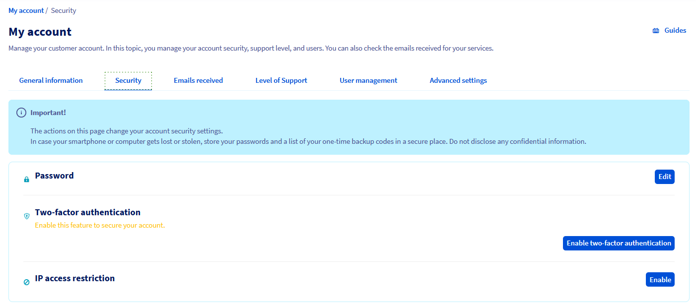
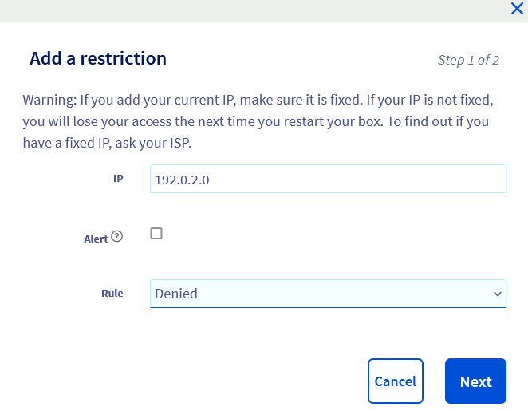
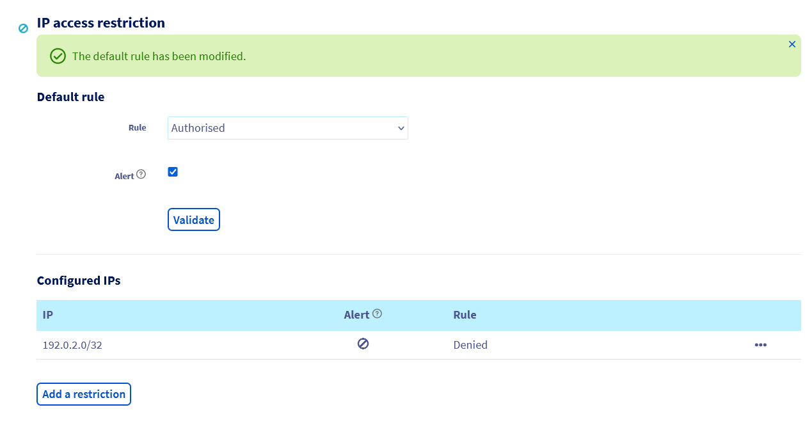

> [!primary]
> Diese Übersetzung wurde durch unseren Partner SYSTRAN automatisch erstellt. In manchen Fällen können ungenaue Formulierungen verwendet worden sein, z.B. bei der Beschriftung von Schaltflächen oder technischen Details. Bitte ziehen Sie im Zweifelsfall die englische oder französische Fassung der Anleitung zu Rate. Möchten Sie mithelfen, diese Übersetzung zu verbessern? Dann nutzen Sie dazu bitte den Button "Beitragen" auf dieser Seite.
>

  
## Ziel

OVHcloud stellt Ihnen Optionen zur Verfügung, um die Sicherheit Ihres OVHcloud Kundencenters und Ihrer Dienste zu erhöhen.

Sie können den Zugang zu Ihrem [OVHcloud Kundencenter](https://www.ovh.com/auth/?action=gotomanager&from=https://www.ovh.de/&ovhSubsidiary=de) auf bestimmte IP-Adressen beschränken.
Die Einrichtung dieser Option, kombiniert mit der [Zwei-Faktor-Authentifizierung](/pages/account_and_service_management/account_information/secure-ovhcloud-account-with-2fa), ermöglicht die optimale Absicherung Ihres OVHcloud Kundencenters gegen unbefugte Zugriffe.

**Diese Anleitung erklärt, wie Sie Ihren OVHcloud Kunden-Account absichern, indem Sie den Zugang über IP-Adressen einschränken.**

> [!warning]
>
> Zugriffsbeschränkungen nach IP und die Zwei-Faktor-Authentifizierung sichern nur den Zugang zum OVHcloud Kundencenter, über das Sie Ihre OVHcloud Dienste bestellen, verwalten, verlängern oder löschen können. Diese Optionen haben keinen direkten Einfluss auf den Zugang zu Ihren Diensten selbst. Dazu müssen individuelle Sicherheitsmaßnahmen konfiguriert werden.
>

## Voraussetzungen

- Sie haben Zugriff auf Ihr [OVHcloud Kundencenter](https://www.ovh.com/auth/?action=gotomanager&from=https://www.ovh.de/&ovhSubsidiary=de).
- Sie haben die [Empfehlungen zur Verwaltung des Account-Passworts](/pages/account_and_service_management/account_information/manage-ovh-password) zur Kenntnis genommen.

## In der praktischen Anwendung

## Schritt 1: Bestimmung der öffentlichen IP-Adressen, die zum Zugriff auf Ihr OVHcloud Kundencenter berechtigt sind

Es gibt grundsätzlich zwei Arten IP-Adressen:

- **Öffentliche IP-Adressen**: Sie sind im Internet sichtbar und werden z.B. von Ihrem Internet-Zugangspunkt bzw. Ihrer Internet-Box verwendet, um den Zugang zu öffentlichen Netzwerken (Internet) zu ermöglichen.
- **Private IP-Adressen**: Sie sind im Internet nicht sichtbar und können nur in lokalen Netzwerk verwendet werden. Beispielsweise wird jedem der in Ihrem privaten Netzwerk mit Ihrer Internet-Box verbundenen Geräte (Computer, Smartphones, Tablets, etc.) eine private IP-Adresse zugewiesen. Ihr Internet-Zugangspunkt ermöglicht es dann diesen Geräten, die öffentliche IP-Adresse für den Internetzugang zu verwenden. Private IP-Adressen lassen sich leicht erkennen, da sie in der Regel mit 10.X.X.X, 172.16.X.X oder 192.168.X.X beginnen (wobei X für Werte zwischen 0 und 255 steht).

Um die IP-basierte Zugriffsbeschränkung im OVHcloud Kundencenter zu verwenden, geben Sie **ausschließlich** öffentliche IP-Adressen ein.

Um die öffentliche IP-Adresse eines Geräts abzurufen, dem der Zugriff auf Ihr OVHcloud Kundencenter gestattet wird, gehen Sie auf die Seite [whatismyip.com](https://www.whatismyip.com/){.external} (nicht von OVHcloud verwaltet).

Notieren Sie die angezeigte IP-Adresse und wiederholen Sie dies für jedes Gerät, das Zugriff auf Ihr OVHcloud Kundencenter erhalten soll.

Wenn Sie zusätzlich ein 4G/5G-Netzwerk verwenden, vergessen Sie nicht, auch die IP-Adresse(n) dieses Netzwerks(s) abzurufen.

> [!warning]
>
> Die meisten Internet Access Provider (ISPs) weisen Ihrem Internetzugang eine **dynamische** IP-Adresse zu. Diese dynamischen IP-Adressen ändern sich beim Neustart Ihres Routers oder alle 24/48 Stunden. Einige Internetprovider können Ihnen jedoch auf Anfrage **statische** IP-Adressen zuweisen.
>
> Für eine 3G/4G/5G Verbindung sind IP-Adressen systematisch **dynamisch**.
>
> **Bevor** Sie in Ihrem OVHcloud Kundencenter eine IP-Einschränkung einrichten, überprüfen Sie bei Ihrem ISP, dass es sich bei den zuvor abgerufenen IP-Adressen um  **statische** IP-Adressen handelt. Andernfalls könnten Sie den Zugang zu Ihrem OVHcloud Kundencenter verlieren, indem Sie eine dynamische IP angeben.
>

### Schritt 2: Einschränkung des Zugangs nach IP einrichten

Loggen Sie sich in Ihr [OVHcloud Kundencenter](https://www.ovh.com/auth/?action=gotomanager&from=https://www.ovh.de/&ovhSubsidiary=de) ein und. Klicken Sie auf Ihren `Namen und Vornamen` oben rechts **und dann** auf Ihre `Initialen` in der blauen Spalte.

{.thumbnail}

Klicken Sie anschließend auf den Tab `Sicherheit`{.action}, um auf folgende Seite zu gelangen:

{.thumbnail}

Klicken Sie auf `Aktivieren`{.action} rechts neben `Einschränkung des Zugangs nach IP`{.action}.

#### Interface - Übersicht

{.thumbnail}

Es gibt zwei Abschnitte zur Umsetzung der IP-Beschränkungen:

- **Standardregel**. Dieses Feld hat zwei Funktionen:
    - Den Zugriff für alle IP-Adressen verweigern, ausgenommen die im zweiten Abschnitt `Konfigurierte IP` als **Berechtigt** eingetragenen.
    - Den Zugriff für alle IP-Adressen erlauben, ausgenommen die im zweiten Abschnitt `Konfigurierte IP` als **Abgelehnt** eingetragenen.
    > Setzen Sie einen Haken bei `Alarm`{.action}, um über Ihre Kontakt-E-Mail-Adresse benachrichtigt zu werden, wenn eine unbefugter Login-Versuch in Ihr Kundencenter erfolgt.

- **Konfigurierte IP**. In diesem Feld können IP-Adressen eingetragen werden, für die eine Zugriffsbeschränkung oder Zugriffsberechtigung gilt. Es zeigt auch alle bereits eingerichteten Regeln an.

> [!alert]
>
> Warnung, bevor Sie fortfahren.
>
> `Bestätigen`{.action} Sie **niemals** die `Standardregel`{.action} im Status: `Abgelehnt`{.action} ***ohne vorherige Autorisierung** einer Ihrer öffentlichen IP-Adressen in `Konfigurierte IP`. 
>
> Andernfalls blockieren Sie **alle öffentlichen IPs (einschließlich Ihrer eigenen)** ohne Ausnahmeregelung. Der Zugriff auf Ihr [OVHcloud Kundencenter](https://www.ovh.com/auth/?action=gotomanager&from=https://www.ovh.de/&ovhSubsidiary=de) wird dadurch gesperrt und Sie müssen einen Verwaltungsvorgang durchführen, um den Zugang wieder zu entsperren.
>
> Widmen Sie daher diesem Punkt besondere Aufmerksamkeit.
>

#### Alle IP-Adressen mit Ausnahme berechtigter Adressen ablehnen

Um den Zugriff auf das OVHcloud Kundencenter nur für eine oder mehrere autorisierte IP-Adressen zu erlauben, klicken Sie auf den Button `Eine Einschränkung hinzufügen`{.action}.

> Ersetzen Sie die in den folgenden Screenshots angezeigte IP-Adresse **192.0.2.0** mit Ihrer tatsächlich verwendeten Adresse.
> 

{.thumbnail}

Geben Sie im neuen Fenster in `IP`{.action} die öffentliche IP-Adresse ein, die Sie autorisieren möchten. Setzen Sie einen Haken im Feld `Alarm`{.action}, wenn Sie per E-Mail über Verbindungsversuche über diese IP-Adresse informiert werden möchten, und setzen Sie dann die `Regel`{.action} auf den Status `Berechtigt`{.action}.

Klicken Sie auf `Weiter`{.action} und überprüfen Sie Ihre IP-Adresse sowie die Regel, bevor Sie auf `Bestätigen`{.action} klicken.

{.thumbnail}

Die Regel sollte dann im Bereich `Konfigurierte IP`{.action} angezeigt werden.

{.thumbnail}

> [!primary]
>
> **Bevor** Sie mit den in diesem Schritt beschriebenen Aktionen fortfahren, wiederholen Sie den Vorgang für alle anderen IP-Adressen, denen Sie den Zugriff auf Ihr OVHcloud Kundencenter erlauben möchten.
>

Nachdem Sie **alle** Ihre öffentlichen IP-Adressen in der Rubrik `Konfigurierte IP`{.action} angegeben haben, klicken Sie im Bereich `Standardregel`{.action} auf `Abgelehnt`{.action}. Haken Sie `Alarm`{.action} an, wenn Sie per E-Mail über die Login-Versuche informiert werden möchten, und klicken Sie dann auf `Bestätigen`{.action}.

{.thumbnail}

> Ab sofort haben **ausschließlich** die im Bereich `Konfigurierte IP`{.action} autorisierten öffentlichen IP-Adressen Zugriff auf Ihr OVHcloud Kundencenter.

#### Alle IP-Adressen mit Ausnahme bestimmter Adressen erlauben

Mit der Kundencenter-Zugriffsbeschränkung nach IP können bestimmte IP-Adressen blockiert werden, während alle anderen öffentlichen Adressen generell für den Zugang erlaubt bleiben.

Um den Zugang zu Ihrem OVHcloud Kundencenter für eine oder mehrere IP-Adressen zu sperren, klicken Sie im Bereich `Konfigurierte IP` auf den Button `Eine Einschränkung hinzufügen`{.action}.

{.thumbnail}

Geben Sie im neuen Fenster in `IP`{.action} die öffentliche IP-Adresse ein, die Sie blockieren möchten. Setzen Sie einen Haken im Feld `Alarm`{.action}, wenn Sie per E-Mail über Verbindungsversuche über diese IP-Adresse informiert werden möchten, und setzen Sie dann die `Regel`{.action} auf den Status `Abgelehnt`{.action}.

Klicken Sie auf `Weiter`{.action}, überprüfen Sie die IP-Adresse und die Regel, bevor Sie auf `Bestätigen`{.action} klicken.

{.thumbnail}

Die Regel sollte dann im Bereich `Konfigurierte IP`{.action} angezeigt werden.

{.thumbnail}

> [!primary]
>
> **Bevor** Sie mit den in diesem Schritt beschriebenen Aktionen fortfahren, wiederholen Sie den Vorgang für alle anderen IP-Adressen, deren Zugriff auf Ihr OVHcloud Kundencenter Sie blockieren möchten.
>

Nachdem Sie **alle** abzulehnenden IP-Adressen in der Rubrik `Konfigurierte IP`{.action} angegeben haben, klicken Sie im Bereich `Standardregel`{.action} auf `Autorisiert`{.action}. Haken Sie `Alarm`{.action} an, wenn Sie per E-Mail über die Login-Versuche informiert werden möchten, und klicken Sie dann auf `Bestätigen`{.action}.

{.thumbnail}

> Ab sofort können alle öffentlichen IP-Adressen **außer** die im Bereich `Konfigurierte IP`{.action} abgelehnten öffentlichen IP-Adressen auf Ihr OVHcloud Kundencenter zugreifen.

## Weiterführende Informationen

[Zwei-Faktor-Authentifizierung in Ihrem OVHcloud Kundencenter einrichten](/pages/account_and_service_management/account_information/secure-ovhcloud-account-with-2fa)
 
Kontaktieren Sie für spezialisierte Dienstleistungen (SEO, Web-Entwicklung etc.) die [OVHcloud Partner](https://partner.ovhcloud.com/de/directory/).

Wenn Sie Hilfe bei der Nutzung und Konfiguration Ihrer OVHcloud Lösungen benötigen, beachten Sie unsere [Support-Angebote](https://www.ovhcloud.com/de/support-levels/).

Für den Austausch mit unserer User Community gehen Sie auf <https://community.ovh.com/en/>.