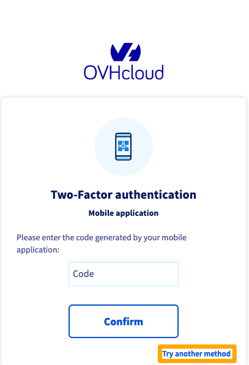
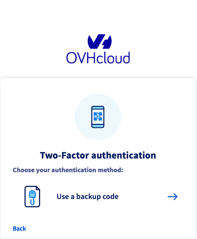
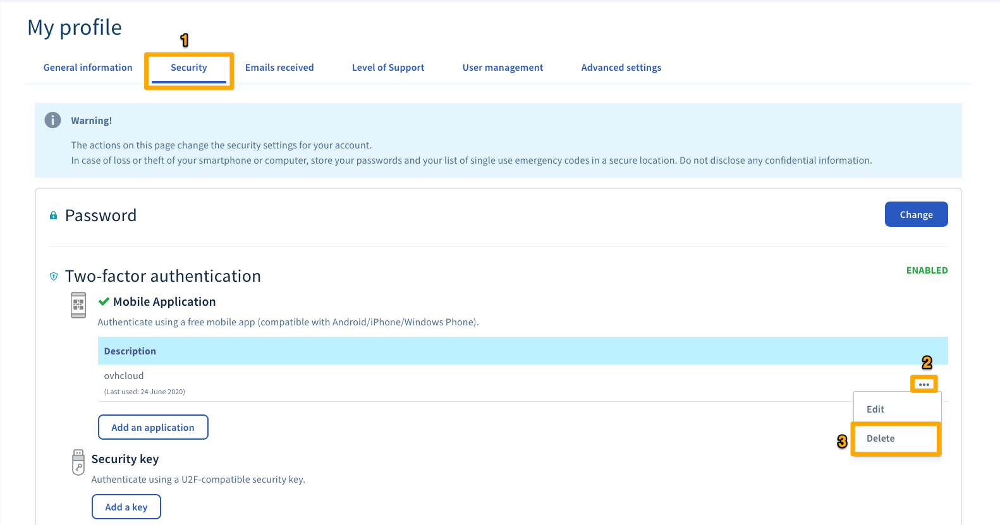

**Dernière mise à jour le 09/02/2023**

## Objectif

OVHcloud met à votre disposition des outils pour renforcer la sécurité de votre compte et de vos services. 
Vous pouvez activer une authentification à deux facteurs (2FA). Celle-ci vient s'ajouter à votre couple identifiant-mot de passe et est gérée depuis un appareil que vous possédez : un téléphone, une tablette ou une clé de sécurité. 

**Découvrez les différentes méthodes proposées et comment les activer.**

<iframe width="560" height="315" src="https://www.youtube-nocookie.com/embed/odO58c4gJfc" frameborder="0" allow="accelerometer; autoplay; clipboard-write; encrypted-media; gyroscope; picture-in-picture" allowfullscreen></iframe>

## Prérequis

- Être connecté à l'[espace client OVHcloud](https://ca.ovh.com/auth/?action=gotomanager&from=https://www.ovh.com/ca/fr/&ovhSubsidiary=qc).
- Posséder un smartphone ou une tablette (pour la méthode via application mobile) ou une clé de sécurité Universal Second Factor (U2F).
- Avoir pris connaissance des [recommandations sur la gestion du mot de passe d'accès à votre compte](/pages/account_and_service_management/account_information/manage-ovh-password).

## En pratique

Vous pouvez activer une ou plusieurs méthodes de double authentification afin de sécuriser et de contrôler l'accès à votre espace client. 
Nous vous proposons deux méthodes différentes :

- **via une application mobile OTP**. Installez une application mobile OTP sur votre smartphone ou tablette Android ou iOS. Associez ensuite l'application à votre compte OVHcloud. À chaque tentative de connexion, l'application générera un code à usage unique valable pendant un court laps de temps.
Une fois la première association de l'application à votre compte effectuée, il n'est plus nécessaire d'être connecté à Internet sur votre périphérique pour que les codes soient générés ;

- **via une clé de sécurité U2F**. Cette méthode nécessite de brancher une clé USB de sécurité U2F sur votre ordinateur à chaque connexion à votre compte OVHcloud. L'authentification s'effectue alors automatiquement. Cette méthode offre un niveau de sécurité plus élevé, car elle repose sur un équipement de sécurité indépendant, totalement séparé de votre ordinateur, smartphone ou tablette, et qui est moins exposé aux risques de piratage.

### Étape 1 : activer votre première méthode de double authentification

- [Activer la méthode de double authentification par application mobile](/pages/account_and_service_management/account_information/enable-2fa-with-mobile-app).
- [Activer la méthode de double authentification par clé de sécurité](/pages/account_and_service_management/account_information/enable-2fa-with-security-key).

Une fois la première méthode ajoutée, vous pouvez également en ajouter une ou deux autres afin de disposer de multiples moyens de vous connecter à votre compte.

### Étape 2 : sauvegarder les codes de sécurité

Lorsque vous ajoutez une double authentification pour la première fois, des codes de secours vous seront communiqués. Conservez-les précieusement. Nous vous conseillons de les sauvegarder dans un gestionnaire de mots de passe.

{.thumbnail}

Vous pourrez les supprimer ou les regénérer depuis votre espace client :

{.thumbnail}

> [!warning]
>
> Nous vous rappelons qu’il est indispensable de sauvegarder ces codes de secours et de vous assurer qu’ils sont valides. En cas d’indisponibilité de votre ou vos méthodes de sécurité sélectionnées (vol ou perte de votre téléphone ou de votre clé de sécurité), l’accès à votre espace client pourrait être bloqué.
>

### Étape 3 : se connecter à l'espace client avec la double authentification

Une fois la double authentification activée, l'écran d'identification affiche la méthode de sécurité sélectionnée. Si vous souhaitez en utiliser une autre, cliquez sur `Essayer une autre méthode`{.action}.

{.thumbnail}

Toutes les méthodes que vous avez activées apparaîtront alors :

{.thumbnail}

### Que faire si l'un de mes périphériques est perdu ou cesse de fonctionner ?

Si votre périphérique (téléphone mobile/smartphone/clé de sécurité) est perdu ou ne fonctionne plus, nous vous conseillons d'utiliser les autres méthodes de double authentification actives sur votre compte.

Vous pouvez également utiliser l'un des codes de sécurité mis à votre disposition. 

### Supprimer un périphérique lié à la double authentification 

> [!warning]
>
> La suppression d'un périphérique ne désactive pas la double authentification. 
> 
> Avant de supprimer un périphérique et afin de ne pas bloquer l'accès à votre compte, vérifiez donc que vous disposez au choix :
> 
> - d'un périphérique fonctionnel ;
> - d'une autre méthode de double authentification fonctionnelle ; 
> - de codes de sécurité valides.
> 

Pour supprimer un périphérique, connectez-vous à votre [espace client OVHcloud](https://ca.ovh.com/auth/?action=gotomanager&from=https://www.ovh.com/ca/fr/&ovhSubsidiary=qc){.external}. Cliquez sur votre nom en haut à droite (première étape sur l'image ci-dessous), puis sur vos initiales (seconde étape). 

{.thumbnail}

Cliquez ensuite sur `Sécurité`{.action} (première étape sur l'image ci-dessous), puis sur les `...`{.action} (deuxième étape) à droite de votre périphérique à supprimer et enfin sur `Supprimer`{.action} (troisième étape).

{.thumbnail}

Un dernier code de validation vous est alors envoyé sur le périphérique que vous souhaitez supprimer. Renseignez ce code dans la fenêtre qui s'ouvre puis cliquez sur `Valider`{.action} pour terminer la suppression.

> [!warning]
>
> Si vous n'avez plus accès au périphérique que vous souhaitez supprimer, vous ne pourrez pas le supprimer vous-même de l'espace client OVHcloud.
>
> Dans ce cas, **contactez directement** nos équipes support en suivant le processus décrit [ici](#2FA-deletion).
>

### Désactiver complètement la double authentification 

#### Si vous avez accès à votre espace client OVHcloud

Pour désactiver complètement la double authentification sur votre compte OVHcloud, il vous faut supprimer **tous** les périphériques renseignés **et aussi désactiver les codes de secours**.

Pour supprimer chaque périphérique, consultez la [partie dédiée de ce guide](#supprimer-peripherique).

Une fois tous vos périphériques supprimés, désactivez les codes de secours en cliquant sur le bouton `Désactiver les codes 2FA`{.action}.

{.thumbnail}

#### Si vous n'avez plus accès à votre espace client OVHcloud 

Si vous ne disposez plus de périphériques valides et si vous ne disposez plus de codes de secours valides, vous pouvez demander la désactivation de la double authentification en contactant nos équipes support.

Avant de nous contacter, vous devez réunir les éléments justificatifs suivants :

|Type de compte OVHcloud|Justificatifs à fournir|
|---|---|
|Particulier|- Justificatif d’identité (carte d’identité, permis de conduire, passeport) mentionnant le nom complet, la date de naissance et la date d’expiration, au nom du titulaire du compte OVHcloud.  - Justificatif de domicile correspondant à celui enregistré sur le compte OVHcloud, datant de moins de deux mois. **Si, suite à un déménagement, vous n'avez pas mis à jour votre adresse dans votre espace client OVHcloud, vous devrez fournir :** - Un justificatif de domicile à l'ancienne adresse - Un justificatif de domicile à la nouvelle adresse, datant de moins de 3 mois Si vous vivez à présent chez un tiers, vous devrez fournir : - Un justificatif de domicile au nom de la personne vous hébergeant, datant de moins de 3 mois - Une attestation d'hébergement sur l'honneur|
|Société|- Justificatif d’identité (carte d’identité, permis de conduire, passeport) mentionnant le nom complet, la date de naissance et la date d’expiration, au nom du titulaire du compte OVHcloud, ou au nom d'une personne autorisée à représenter l'entreprise.  - Justificatif de domicile de l'entreprise datant de moins de deux mois, correspondant à l'adresse enregistrée sur le compte OVHcloud.|

Une fois vos justificatifs réunis, contactez le support OVHcloud par téléphone au 1-855-684-5463.

> [!warning]
>
> Vos documents doivent nous être envoyés depuis une adresse e-mail **enregistrée sur votre compte OVHcloud**.

Après vérification de vos documents, un conseiller pourra désactiver manuellement la double authentification sur votre compte OVHcloud et reviendra vers vous une fois cette action effectuée.

A des fins de sécurité, une fois l'accès à votre compte rétabli, nous vous recommandons de réactiver la double authentification dès que possible.

## Aller plus loin

Pour des prestations spécialisées (référencement, développement, etc), contactez les [partenaires OVHcloud](https://partner.ovhcloud.com/fr-ca/directory/).

Si vous souhaitez bénéficier d'une assistance à l'usage et à la configuration de vos solutions OVHcloud, nous vous proposons de consulter nos différentes [offres de support](https://www.ovhcloud.com/fr-ca/support-levels/).

Échangez avec notre communauté d'utilisateurs sur <https://community.ovh.com>.