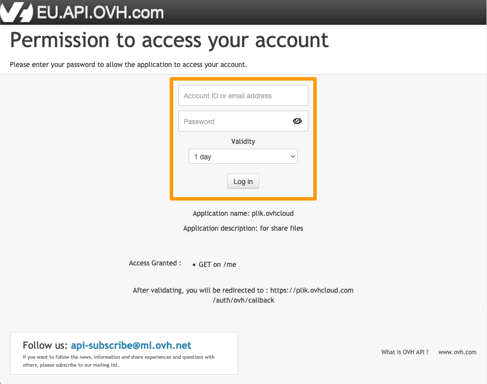
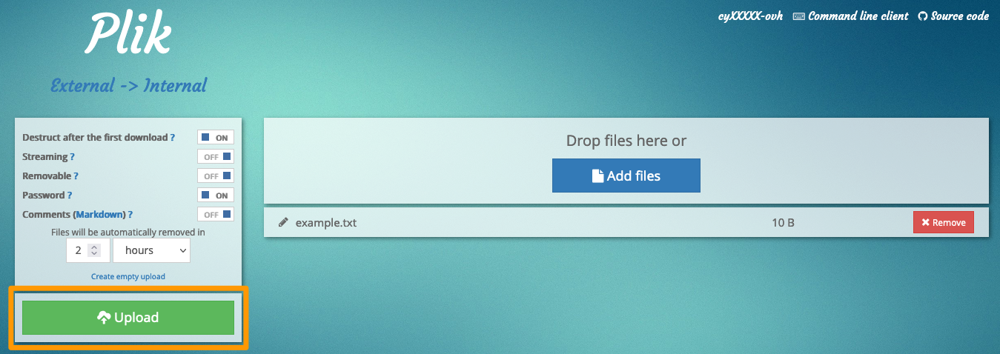

**Dernière mise à jour le 14/02/2022**

## Objectif

L'outil en ligne [Plik](https://plik.ovhcloud.com) permet de partager des fichiers entre différentes personnes, en offrant des options de sécurisation d'accès à ces fichiers.

**Découvrez comment utiliser l'outil en ligne Plik pour partager des fichiers.**

## Prérequis

- Disposer d'un [compte OVHcloud](/pages/account_and_service_management/account_information/ovhcloud-account-creation)

## En pratique

### Connexion API

Accédez tout d'abord à la page <https://plik.ovhcloud.com>.

Pour téléverser des fichiers, vous devez être authentifié. Cliquez sur `Login with OVH`{.action}.

Connectez-vous à votre compte OVHcloud, ce qui donnera à l'API OVHcloud l'accès à l'outil Plik. 
Entrez vos informations d'identification et cliquez sur le bouton `Log in`{.action} pour continuer.

> [!primary]
>
> Si vous avez activé la [double authentification](/pages/account_and_service_management/account_information/secure-ovhcloud-account-with-2fa) sur votre compte, vous devrez alors saisir le code fourni par la méthode d'authentification que vous avez définie sur votre compte. 

### Téléverser des fichiers

Une fois connecté, cliquez sur le mot `Plik`{.action} en haut à gauche pour accéder au menu d'ajout de fichiers.

Cliquez sur `Add files`{.action} et sélectionnez le fichier à ajouter ou effectuez un « glisser-déposer » de vos fichiers.

> [!primary]
>
> La taille des fichiers est limitée à 10 Go.
>

Plusieurs options sont disponibles pour configurer vos téléversements :

- `Destruct after the first download` - Cette option supprimera votre fichier téléversé après le premier téléchargement.
- `Streaming` - Le fichier ne sera pas stocké sur le serveur. Au lieu de cela, le téléversement de fichier commence lorsque l'utilisateur distant commence le téléchargement.
- `Removable` - Permet aux utilisateurs finaux de supprimer le fichier téléversé.
- `Password` - Protégez votre téléversement en imposant un identifiant et un mot de passe que l'utilisateur distant devra renseigner.
- `Comments` - Ajoutez des commentaires à votre téléchargement. Le langage *markdown* est pris en charge.
- `Files will be automatically removed in` - Choisissez le nombre de jours (30 maximum), d'heures ou de minutes au bout desquels vous souhaitez que vos fichiers téléversés soient automatiquement supprimés.

> [!primary]
>
> Lorsque vous protégez votre téléversement avec un mot de passe, le nom d'utilisateur par défaut est « plik ».
>

Après avoir ajouté vos fichiers et sélectionné les options souhaitées, cliquez sur le bouton `Upload`{.action} vert sur le côté gauche. Cela ouvrira une nouvelle page avec vos fichiers joints.

Les options de téléchargement sont alors disponibles.

### Télécharger des fichiers

Sur la page de téléchargement, de nouvelles options sont disponibles :

- `Zip archive` - Place tous les fichiers que vous avez téléversés dans un dossier compressé.
- `Add files` - Vous permet d'ajouter d'autres fichiers.
- `Delete` - Supprime tous les fichiers préalablement téléversés.

Vous pouvez également supprimer des fichiers un par un en cliquant sur le bouton `X`{.action} à droite de chaque fichier.

Pour permettre à d'autres personnes de télécharger vos fichiers, donnez-leur le lien vers le fichier individuel situé sous le nom du fichier. 
Vous pouvez également leur donner le lien vers tous les fichiers de la session en leur partageant l'URL située dans la barre d'adresses de votre navigateur. 
Vous pouvez aussi partager le QR code situé à gauche. Si vous avez téléversé plusieurs fichiers, le QR code permettra de télécharger chacun des fichiers.

### Options du compte

Cliquez sur votre identifiant en haut à droite pour accéder aux options du compte.

Via ce menu, vous pouvez vous déconnecter, générer des tokens pour utiliser l'outil Plik en ligne de commande, supprimer chaque téléversement (via le bouton `Remove`{.action} situé à droite de chaque téléversement) ou les supprimer tous (via le bouton `DELETE UPLOADS`{.action}).

## Aller plus loin

Échangez avec notre communauté d'utilisateurs sur <https://community.ovh.com/>.
