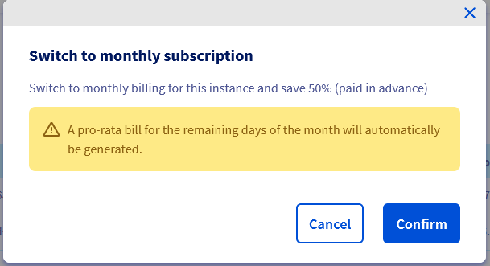

## Ziel

Wenn Sie eine Public Cloud Instanz erstellen, können Sie wählen, ob die Abrechnung stündlich oder monatlich erfolgen soll. Instanzen mit Stundensatz werden nach dem Verfahren *Pay as you go* abgerechnet, d.h. am Monatsende werden den Nutzern die spezifischen Ressourcen in Rechnung gestellt, die sie verwendet haben.

Instanzen mit monatlicher Fälligkeit können im Voraus bezahlt werden und werden zu einem niedrigeren Preis berechnet (bis zu 50% weniger als bei der verbrauchsspezifischen Abrechnung). Wenn Sie ursprünglich die stündliche Abrechnung ausgewählt haben, können Sie jederzeit zur monatlichen Abrechnung wechseln.

**In dieser Anleitung wird erläutert, wie Sie von der stündlichen zur monatlichen Abrechnung wechseln.**

> [!warning]
>
> Sie können nicht von der monatlichen zur stündlichen Abrechnung wechseln. Um Ihre Instanz im Stundensatz abrechnen zu lassen, müssen Sie die monatlich abgerechnete Instanz löschen, eine neue erstellen und die stündliche Abrechnung auswählen. In diesem Fall empfehlen wir Ihnen das folgende Verfahren:
>
>- Erstellen Sie einen Snapshot Ihrer aktuellen Instanz.
>
>- Erstellen Sie eine neue Instanz basierend auf diesem Snapshot.
>
>- Löschen Sie die alte Instanz.
>

## Voraussetzungen

- Sie verfügen über eine [Public Cloud Instanz](https://www.ovhcloud.com/de/public-cloud).
- Sie haben Zugriff auf Ihr [OVHcloud Kundencenter](https://www.ovh.com/auth/?action=gotomanager&from=https://www.ovh.de/&ovhSubsidiary=de).

## In der praktischen Anwendung

### Über das OVHcloud Kundencenter

Wählen Sie im [OVHcloud Kundencenter](https://www.ovh.com/auth/?action=gotomanager&from=https://www.ovh.de/&ovhSubsidiary=de) unter `Instances`{.action} die Instanz für welche Sie das Abrechnungsintervall ändern möchten. Öffnen Sie das Kontextmenü indem Sie auf `...`{.action} rechts neben der Instanz klicken. Sie sehen dann die Option `Auf monatliche Abrechnung umstellen`{.action}:

{.thumbnail}

Sie müssen dann bestätigen, dass Sie die Abrechnungsart ändern möchten:

{.thumbnail}

Sobald Sie Ihre Wahl bestätigt haben, erhalten Sie eine anteilige Monatsrechnung. Die nächste Rechnung enthält den Stundensatzanteil des Monats (1. des Monats bis zur Änderung) und die neue monatliche Gebühr.

### Über die OpenStack API

Bei der Erstellung einer Instanz mithilfe der OpenStack API wird die Instanz automatisch mit Stundensatz erstellt, wenn nicht anders im Erstellungsskript angegeben. Um auf die monatliche Abrechnung umzustellen, führen Sie folgenden Befehl aus:

```bash
openstack server set --property ovh-monthly-instance=1 "InstanceID"
```

Ersetzen Sie "InstanceID" mit der ID der entsprechenden Instanz. Diese Kennung kann über das Kundencenter oder die OVHcloud API abgerufen werden.

### Über die OVHcloud API

Loggen Sie sich gemäß der [entsprechenden Anleitung](/pages/manage_and_operate/api/first-steps) in das [OVHcloud API Interface](https://eu.api.ovh.com/) ein und folgen Sie den nachstehenden Schritten.

Verwenden Sie folgenden Aufruf:

> [!api]
>
> @api {v1} /cloud POST /cloud/project/{serviceName}/instance/{instanceId}/activeMonthlyBilling
>

### Mit einem Terraform-Skript

Dies ist möglich dank des `metadata` [Attributs](https://registry.terraform.io/providers/terraform-provider-openstack/openstack/latest/docs/resources/compute_instance_v2#metadata){.external} aus der Ressource [*openstack_compute_instance_v2*](https://registry.terraform.io/providers/terraform-provider-openstack/openstack/latest/docs/resources/compute_instance_v2){.external}:

```terraform
metadata = {
    "ovh-monthly-instance" = 1
}
```

## Weiterführende Informationen

Für den Austausch mit unserer User Community gehen Sie auf <https://community.ovh.com/en/>.
