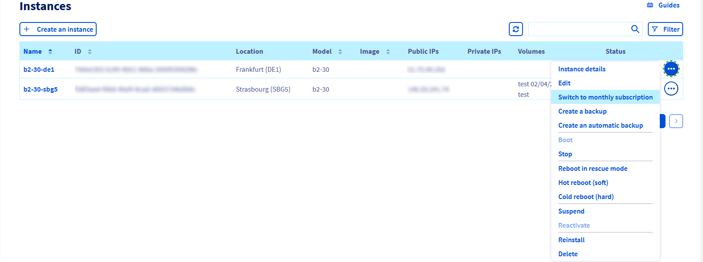

> [!primary]
> Tłumaczenie zostało wygenerowane automatycznie przez system naszego partnera SYSTRAN. W niektórych przypadkach mogą wystąpić nieprecyzyjne sformułowania, na przykład w tłumaczeniu nazw przycisków lub szczegółów technicznych. W przypadku jakichkolwiek wątpliwości zalecamy zapoznanie się z angielską/francuską wersją przewodnika. Jeśli chcesz przyczynić się do ulepszenia tłumaczenia, kliknij przycisk "Zgłóś propozycję modyfikacji" na tej stronie.
>


## Wprowadzenie

Podczas tworzenia instancji Public Cloud można wybrać typ rozliczenia za godzinę lub miesięcznie. Instancje w typu godzinowym są płatne według faktycznego zużycia, czyli na koniec miesiąca użytkownicy są rozliczani za konkretne zasoby, z których korzystali. Instancje w subskrypcji miesięcznej są płatne z góry, ale rozliczane według niższej ceny (do 50% taniej niż w przypadku rozliczeń godzinowych). Jeśli początkowo zostało wybrane rozliczenie godzinowe, w dowolnym momencie można je zmienić na miesięczne.

**Dowiedz się, jak zmienić typ rozliczenia godzinowego na miesięczne.**

> [!warning]
>
> Nie można zmienić rozliczenia miesięcznego na godzinowe. Aby rozliczać się godzinowo, należy usunąć instancję rozliczaną miesięcznie, utworzyć nową instancję i wybrać dla niej typ rozliczenia godzinowego. W takiej sytuacji wykonaj następujące działania:
>
>- Utwórz migawkę bieżącej instancji.
>
>- Utwórz nową instancję na podstawie migawki.
>
>- Usuń instancję rozliczaną miesięcznie.
>

## Wymagania początkowe

- utworzona [instancja Public Cloud](https://www.ovhcloud.com/pl/public-cloud/){.external}
- zalogowanie do [Panelu klienta OVHcloud](https://www.ovh.com/auth/?action=gotomanager&from=https://www.ovh.pl/&ovhSubsidiary=pl){.external}

## W praktyce

### W panelu klienta OVHcloud

W [Panelu klienta OVHcloud](https://www.ovh.com/auth/?action=gotomanager&from=https://www.ovh.pl/&ovhSubsidiary=pl){.external} wybierz instancję, dla której chcesz zmienić typ rozliczenia, i otwórz menu opcji, klikając ikonę z trzema kropkami (po prawej stronie instancji). Zobaczysz przycisk `Zmień na subskrypcję miesięczną`{.action}:

{.thumbnail}

Następnie potwierdź zmianę typu rozliczenia:

{.thumbnail}

Po potwierdzeniu wyboru, natychmiast otrzymają Państwo miesięczny rachunek proporcjonalny. Następny rachunek będzie zawierał część stawki godzinowej z danego miesiąca (od 1. dnia miesiąca do zmiany) oraz nową opłatę miesięczną.

### Z poziomu API Openstack

Podczas tworzenia instancji za pomocą API Openstack, o ile nie zostało to określone w skrypcie tworzenia, instancja jest automatycznie tworzona z abonamentem godzinowym. Aby przejść na abonament miesięczny, wprowadź następującą komendę:

```bash
openstack server set --property ovh-monthly-instance=1 "InstanceID"
```

Zastąp "InstanceID" identyfikatorem odpowiedniej instancji. Identyfikator może zostać pobrany z Panelu klienta lub API OVHcloud.

### Z poziomu API OVHcloud

Zaloguj się do [interfejsu API OVHcloud](https://eu.api.ovh.com/) zgodnie z [odpowiednim przewodnikiem](/pages/manage_and_operate/api/first-steps) i postępuj zgodnie z poniższymi krokami.

Skorzystaj z następującego połączenia:

> [!api]
>
> @api {POST} /cloud/project/{serviceName}/instance/{instanceId}/activeMonthlyBilling
>

### Ze skryptu Terraform

Jest to możliwe dzięki `metadata` [attribute](https://registry.terraform.io/providers/terraform-provider-openstack/openstack/latest/docs/resources/compute_instance_v2#metadata){.external} z zasobu [openstack_compute_instance_v2](https://registry.terraform.io/providers/terraform-provider-openstack/openstack/latest/docs/resources/compute_instance_v2){.external}:

```terraform
metadata = {
"ovh-monthly-instance" = 1
}
```

## Sprawdź również

Przyłącz się do społeczności naszych użytkowników na stronie <https://community.ovh.com/en/>.
