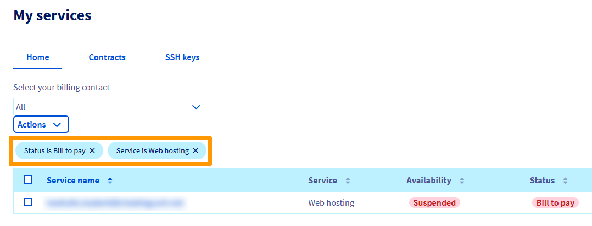
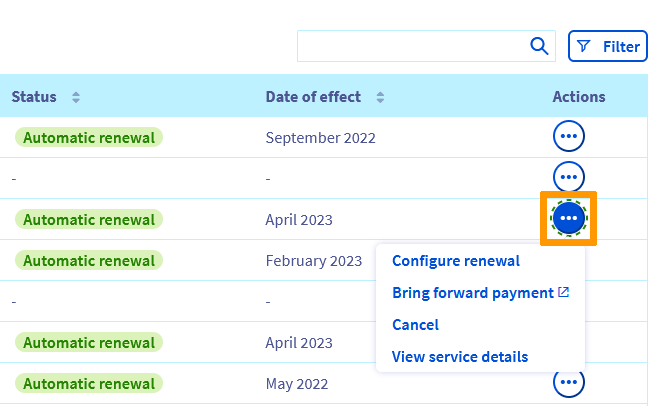

## Objective

You can manage renewals and cancellations for your services via the OVHcloud Control Panel.

**Find out how to manage automatic renewal for your services via the OVHcloud Control Panel.**

> [!primary]
>
> Depending on your place of residence, local legislation, and the solutions concerned, the details in this guide may vary or not apply to your situation. For further information, please refer to your OVHcloud contracts via the [OVHcloud Control Panel](https://ca.ovh.com/auth/?action=gotomanager&from=https://www.ovh.com/asia/&ovhSubsidiary=asia): click on your name in the top right-hand corner of your screen, then `Service Management`{.action}, then the `Contracts`{.action} tab.
>

<iframe width="560" height="315" src="https://www.youtube-nocookie.com/embed/dfpPCa0mUyo" frameborder="0" allow="accelerometer; autoplay; encrypted-media; gyroscope; picture-in-picture" allowfullscreen></iframe>

## Requirements

- Access to the [OVHcloud Control Panel](https://ca.ovh.com/auth/?action=gotomanager&from=https://www.ovh.com/asia/&ovhSubsidiary=asia)
- Active OVHcloud services
- Access as a [billing contact](/pages/account/customer/managing_contacts#definition) to your OVHcloud services

## Instructions

When you place orders, your services are set to be automatically renewed on their expiry date. Payments are taken via the default payment method saved in the [OVHcloud Control Panel](https://ca.ovh.com/auth/?action=gotomanager&from=https://www.ovh.com/asia/&ovhSubsidiary=asia). You can cancel these services at any time via the OVHcloud Control Panel. They will not be renewed once their validity period has ended.

You can also set certain products (domain names, Web Hosting plans, VPS, dedicated servers) to *manual* renewal, if you do not wish to renew and pay them automatically.

We recommend reading the following guides and focusing on the operations you wish to carry out:

- [Display the renewal statuses for your services](/pages/account/billing/how_to_use_automatic_renewal#display-the-renewal-statuses-for-your-services): This guide will help you check if your services are renewed automatically. You can also retrieve their renewal or expiry dates.

- [Manage renewal for your services](/pages/account/billing/how_to_use_automatic_renewal#renewal-at-ovhcloud): This guide will help you enable or disable automatic renewal, change a service’s payment frequency and pay for renewals before their expiry date.

- [Manage your payment methods](/pages/account_and_service_management/managing_billing_payments_and_services/manage-payment-methods): Using this guide, you can check that you have a saved payment method for future renewals. You can also add and delete payment methods, if required.

### Access your service’s settings

Log in to the [OVHcloud Control Panel](https://ca.ovh.com/auth/?action=gotomanager&from=https://www.ovh.com/asia/&ovhSubsidiary=asia). Click on the name associated with your NIC handle (Customer ID) in the menu bar at the top right-hand corner then choose `Products and services`{.action}.

{.thumbnail}

### Display the renewal statuses for your services

The `My services` page contains a table for managing your OVHcloud services. You can find their name, type, availability (if it is suspended, for example), status (renewal type, action to be performed, etc.) and the date by which the action to be performed will be effective.

{.thumbnail}

You can sort the columns by ascending or descending order, use the search field or apply a filter to display only some of your services based on your chosen criteria.

{.thumbnail}

Your filter criteria will then be displayed above the table. Below is an example of a filter that can be used to display web hosting plans that have bills pending payment.

{.thumbnail}

### Automatic renewal

When you subscribe to a service, it is set to **automatic renewal** by default. This setting means you can ensure your services are systematically renewed on their expiry date. Also, if you have registered a payment method in the [OVHcloud Control Panel](https://ca.ovh.com/auth/?action=gotomanager&from=https://www.ovh.com/asia/&ovhSubsidiary=asia), it will be used to pay for your bills automatically.

If you have not registered a [payment method](/pages/account_and_service_management/managing_billing_payments_and_services/manage-payment-methods), an invoice will be sent to you by email. You can then pay it online.

For services with an automatic renewal frequency higher than 1 month (3 months, 6 months, 12 months), you will also be sent an email reminder the month before, listing the services that will need to be renewed soon.

If you do not wish to renew one of these services, simply [cancel it via the OVHcloud Control Panel](/pages/account_and_service_management/managing_billing_payments_and_services/how_to_cancel_services).

### Manual renewal

For some OVHcloud products (domains, hosting plans, VPS, dedicated servers), you can also switch to manual **renewal**. This renewal method is useful if you are not sure whether you want to keep the service on its expiry date, or if you do not want your bills to be deducted automatically from your payment method. 

If you select this mode, you will receive several reminder emails before the expiry date, each containing a link for renewing your services online before the expiry date. You can also pay via the [OVHcloud Control Panel](https://ca.ovh.com/auth/?action=gotomanager&from=https://www.ovh.com/asia/&ovhSubsidiary=asia).

> [!warning]
>
> If you do not pay for a service in manual renewal, it is suspended on its expiry date, then deleted after a few days.
>
> It is therefore not necessary to request the cancellation if you do not want to keep this service.
>

### Manage renewal for your services 

To the right of each service, click on the `...`{.action} button in the `Actions` column to set renewal for your services.

{.thumbnail}

> [!primary]
>
> Depending on whether the chosen service is eligible for manual renewal, some actions may not be available.
>

#### Configure the renewal

{.thumbnail}

Depending on the service you have chosen, you can set it to manual renewal or choose an automatic renewal frequency. If your service is eligible, you can choose the renewal type and frequency.

{.thumbnail}

Depending on your choice, you will be given information on future payment dates, the payment method that will be used, and the service’s expiry date.

#### Renew the service

This action is only applicable to services set to manual renewal and it will redirect you to an online payment interface. You can renew these services at any time before their expiry and choose their renewal duration. 

#### Anticipate payment

This action is applicable to services set to automatic renewal, and it will redirect you to an online payment interface. You can renew these services at any time before their expiry, and choose their renewal duration. In this case, the duration of validity you subscribe to will be added to the current validity duration. You will not lose any remaining validity time.

#### Cancel on expiry

This action is available for services set to automatic renewal. By choosing this action, automatic payments and renewals are disabled for the service you have selected. 

> [!warning]
>
> For more information on cancelling OVHcloud services, follow the instructions in this [guide](/pages/account_and_service_management/managing_billing_payments_and_services/how_to_cancel_services).
>

#### Pay your bill

If you have services set to automatic renewal, but have not registered a payment method to pay for your bills, you will see an **Invoice to pay** comment when an invoice is awaiting payment. Then click on `Pay balance immediately`{.action}. It will redirect you to an online payment interface.

#### Group actions

You can perform group actions by selecting multiple services in the table. Then click on the `Actions`{.action} menu.

{.thumbnail}

The table below details the group actions you can perform.

|Possible actions|Description|
|---|---|
|Renew|Renew several services at once. You will be redirected to a page where you can choose the renewal duration you want, and pay online.|
|Disable automatic payment|Disable automatic payment for several services at once. If one or more of your services cannot be set to automatic renewal, this will be flagged when you confirm.|
|Enable automatic payment|Enable automatic payment for several services at once. Only eligible services will be updated.|
|Export as CSV|Export all of your services and their expiry dates into a csv-formatted file.|
|Align renewal dates|Aligns the expiry dates for your services on a single calendar day. Only eligible services can be updated.|

## Go further

[Information regarding Public Cloud billing options](/pages/public_cloud/compute/analyze_billing)

Join our community of users on <https://community.ovh.com/en/>.