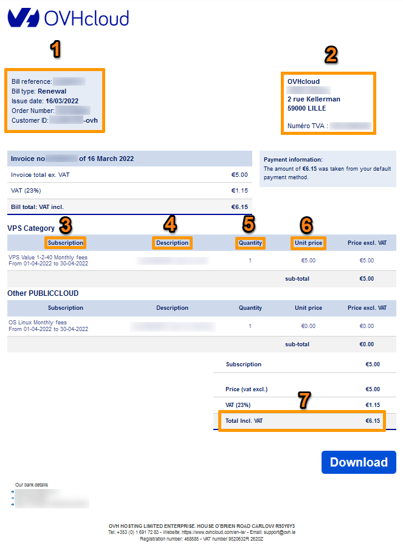
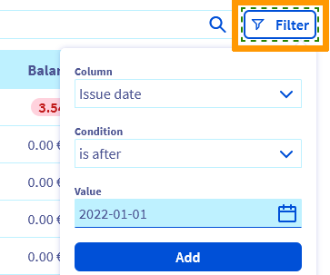

## Objective

OVHcloud provides a space for you to view, manage and pay your various bills.

**Find out how to manage bills in the OVHcloud Control Panel.**

> [!primary]
>
> Depending on your place of residence and its local legislation, as well as the products concerned, some parts of this guide may vary from the information provided in the guide, and some may not apply to your situation. If you have any doubts, please refer to your OVHcloud contracts, which you can access from the [OVHcloud Control Panel](https://www.ovh.com/auth/?action=gotomanager&from=https://www.ovh.ie/&ovhSubsidiary=ie). (Click on your name in the top right-hand corner of the screen, then in the context menu, click on `Service management`{.action}, then on the `Contracts`{.action} tab.)
>

<iframe width="560" height="315" src="https://www.youtube-nocookie.com/embed/iiQmopMhzik" frameborder="0" allow="accelerometer; autoplay; encrypted-media; gyroscope; picture-in-picture" allowfullscreen></iframe>

## Requirements

- Access to the [OVHcloud Control Panel](https://www.ovh.com/auth/?action=gotomanager&from=https://www.ovh.ie/&ovhSubsidiary=ie) as the [Billing contact](/pages/account_and_service_management/account_information/managing_contacts) of your service

## Instructions

> [!primary]
>
> Each invoice is sent to you by email and accessible via a clickable link. You can then access it by logging in to your [OVHcloud Control Panel](https://www.ovh.com/auth/?action=gotomanager&from=https://www.ovh.ie/&ovhSubsidiary=ie). All invoices are also available via the `Dashboard`{.action} tab in the OVHcloud Control Panel.
>

### Understanding your bill

Your OVHcloud service bill is sent to you following the payment of an order or a renewal. It summarises the amounts corresponding to the purchase or renewal of your products, as well as their periods of validity.

{.thumbnail}

|Number|Description|
|---|---|
|1|Invoice information: Reference, issue date, purchase order to which it refers, payment type and NIC handle concerned|
|2|Billing contact information|
|3|Subscription: A description of the service and the period billed|
|4|Description: The billed service reference|
|5|Quantity: The number of units of the service billed for|
|6|Unit price (ex. VAT) of a product|
|7|Total amount (incl. taxes) of the invoice|

### The billing section in your Control Panel

#### View and manage bills

To view your invoices, go to your [OVHcloud Control Panel](https://www.ovh.com/auth/?action=gotomanager&from=https://www.ovh.ie/&ovhSubsidiary=ie). Click on your name in the top right-hand corner of your screen, then in the new menu that appears, click on `Invoices`{.action}.

{.thumbnail}

You will then land on a page summarising your bills:

{.thumbnail}

> [!primary]
>
> If an invoice is pending payment (`Unpaid` status), the amount due will be shown in red in the `Balance` column.
>

On each row of the table, you will see the following information:

- The invoice `Reference`{.action}
- The `Order Number`{.action}
- The `Issue Date`{.action}
- Its `Amount ex. VAT`{.action}
- Its `Amount incl. VAT`{.action}
- The `Balance`{.action} to be settled
- The invoice `Status`{.action} (`Unpaid` or `Paid`)

By clicking on one of the `...`{.action} buttons to the right of the table, you can also access these functions:

- `See HTML version`{.action}: The bill opens in a new tab in your browser.
- `See PDF version`{.action}: A downloadable PDF version of your invoice will be generated automatically.

{.thumbnail}

> [!primary]
>
> If one of your bills is awaiting payment, a `Pay balance immediately`{.action} button will also appear by clicking on `...`{.action}.
>

##### **Filters**

Several filters are available:

{.thumbnail}

To find a specific invoice, you can enter its reference, the associated order number or its issue date.

##### **Batch actions**

Using the `Batch actions`{.action} menu, you can export your invoice summary in *.csv* or *.pdf* format. The files created will show their amount, reference and issue date.

If you want to export all of your invoices, use the `Export all as CSV`{.action} or `Export all as PDF`{.action} button.

{.thumbnail}

If you want to export only selected invoices, use the corresponding check boxes in the first column of the table to select the invoices you want to export. Two new actions, `Export selection in CSV format`{.action} and `Export selection in PDF format`{.action}, will then be available in the `Batch actions`{.action}.

{.thumbnail}

#### Pay your bills 

To pay bills that are awaiting payment, simply click on the `Batch actions`{.action} menu, then select `Pay balance immediately`{.action}.

{.thumbnail}

A [settlement purchase order](/pages/account/billing/managing_ovh_orders#purchase-order) will then be created. Once the payment has been made, your account will be balanced again.

#### Request invoice cancellation

> [!primary]
>
> To request that your service be cancelled on the expiry date, follow the instructions in [this guide](/pages/account_and_service_management/managing_billing_payments_and_services/how_to_cancel_services).
>

If you have received an invoice that you do not consider to be legitimate and you wish to request a refund, or submit your claim click on your name in the top right-hand corner of your screen, then on `Create a ticket`{.action}.

### Track your payments

You can find the payment history in `My bills`{.action} if you click on the `Payment tracking`{.action} tab. You can then link each invoice to the associated payment.

{.thumbnail}

In this section, you can also export your payment receipts in *.csv* format, by clicking on `Export in CSV format`{.action} (1). You can also use several filters via the `Filter`{.action} button (2).

> [!primary]
>
> If you notice a discrepancy between a payment and the total amount listed on a bill, it means that an account balance automatically reduced the amount debited.
>

## Go further

[Managing renewal for your services](/pages/account_and_service_management/managing_billing_payments_and_services/how_to_use_automatic_renewal)

[Managing payment methods](/pages/account_and_service_management/managing_billing_payments_and_services/manage-payment-methods)

Join our community of users on <https://community.ovh.com/en/>.
