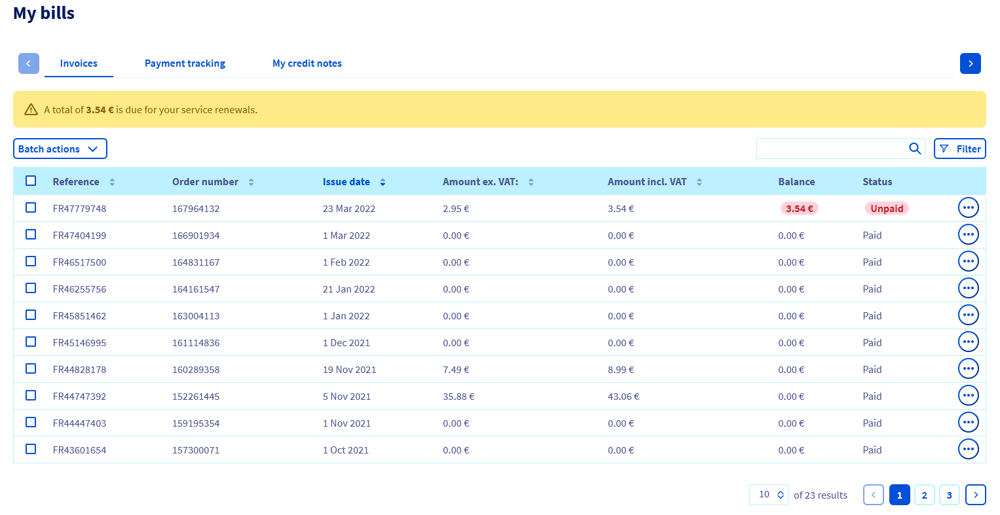
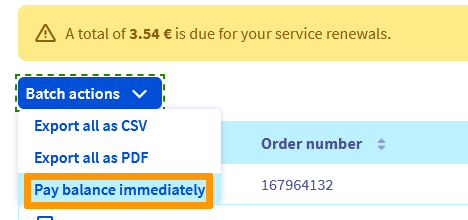

> [!primary]
> Esta traducción ha sido generada de forma automática por nuestro partner SYSTRAN. En algunos casos puede contener términos imprecisos, como en las etiquetas de los botones o los detalles técnicos. En caso de duda, le recomendamos que consulte la versión inglesa o francesa de la guía. Si quiere ayudarnos a mejorar esta traducción, por favor, utilice el botón "Contribuir" de esta página.
>

## Objetivo

OVHcloud pone a su disposición un espacio que le permitirá consultar, administrar y abonar sus facturas.

**Cómo gestionar sus facturas desde el área de cliente de OVHcloud**

> [!primary]
>
> En función de su lugar de residencia y de la legislación vigente, así como del producto o productos en cuestión, es posible que algunas partes de esta guía varíen o no se apliquen en función de su caso particular. En caso de duda, consulte los contratos de OVHcloud disponibles en el [área de cliente de OVHcloud](https://www.ovh.com/auth/?action=gotomanager&from=https://www.ovh.es/&ovhSubsidiary=es) (haga clic en su nombre en la esquina superior derecha de la pantalla y seleccione `Gestión de servicios`{.action} en el menú contextual y abra la pestaña `Contratos`{.action}).
>

<iframe width="560" height="315" src="https://www.youtube-nocookie.com/embed/iiQmopMhzik" frameborder="0" allow="accelerometer; autoplay; encrypted-media; gyroscope; picture-in-picture" allowfullscreen></iframe>

## Requisitos

- Estar conectado al [área de cliente de OVHcloud](https://www.ovh.com/auth/?action=gotomanager&from=https://www.ovh.es/&ovhSubsidiary=es) como [contacto de facturación](/pages/account_and_service_management/account_information/managing_contacts) del servicio.

## Procedimiento

> [!primary]
>
> Cada factura se enviará por correo electrónico y podrá acceder a ella a través de un enlace accesible. Podrá acceder autenticándose en el [área de cliente de OVHcloud](https://www.ovh.com/auth/?action=gotomanager&from=https://www.ovh.es/&ovhSubsidiary=es). Todas las facturas están también disponibles en la pestaña `Panel de control`{.action} del área de cliente.
>

### Partes de una factura de OVH

La factura del servicio de OVHcloud se enviará una vez realizado el pago de un pedido o una renovación. En ella se resumen los importes correspondientes a la compra o renovación de sus productos, así como sus períodos de validez.

{.thumbnail}

|Número|Descripción|
|---|---|
|1|Información sobre la factura: referencia, fecha de emisión, orden de pedido correspondiente, tipo de pago e identificador de cliente de que se trate.|
|2|Información del contacto de facturación.|
|3|Suscripción: una descripción del servicio y período facturado|
|4|Referencia: la referencia del servicio facturado|
|5|Cantidad: el número de unidades del servicio facturado|
|6|Precio unitario (sin IVA) de un producto|
|7|Importe total (IVA incluido) de la factura|

### Descubrir el área de Facturación

#### Consultar y administrar las facturas de OVH

Para consultar sus facturas, acceda al [área de cliente de OVHcloud](https://www.ovh.com/auth/?action=gotomanager&from=https://www.ovh.es/&ovhSubsidiary=es). Haga clic en su nombre en la esquina superior derecha de su pantalla y, en el nuevo menú que aparecerá, haga clic en `Facturas`{.action}.

{.thumbnail}

Será redirigido a una página en la que podrá consultar todas sus facturas.

{.thumbnail}

> [!primary]
>
> Si una factura está pendiente de pago (estado de `No pagada`), el importe adeudado se indica en rojo en la columna `Saldo`.
>

En cada línea de la tabla encontrará la siguiente información:

- `Referencia`{.action} de la factura;
- `Número del pedido`{.action} correspondiente;
- `Fecha de emisión`{.action} de la factura;
- `Importe sin IVA`{.action};
- `Importe IVA incl`{.action}.
- `Saldo`{.action} a pagar;
- `Estado`{.action} de la factura (`No pagada` o `Pago`).

Al hacer clic en uno de los botones `...`{.action} a la derecha de la tabla, también podrá:

- `Ver la versión HTML`{.action}: la factura se mostrará en su navegador en una nueva pestaña.
- `Ver la versión PDF`{.action}: una versión en PDF descargable de su factura se generará automáticamente.

{.thumbnail}

> [!primary]
>
> Si una de sus facturas está pendiente de pago, aparecerá un botón `Abonar el importe pendiente ahora`{.action} haciendo clic en `...`{.action}.
>

##### **Filtros**

Hay varios filtros a su disposición:

{.thumbnail}

Para obtener una factura exacta, podrá indicar su referencia, el número del pedido correspondiente o la fecha de emisión.

##### **Acciones masivas**

En el menú `Acciones masivas`{.action} podrá exportar sus facturas en formato *.CSV* o *.pdf*. Los archivos creados mostrarán su importe, referencia y fecha de emisión.

Si desea exportar todas sus facturas, utilice los botones `Exportar todo en CSV`{.action} o `Exportar todo en PDF`{.action}.

{.thumbnail}

Si quiere exportar sólo una parte, marque las casillas correspondientes en la primera columna de la tabla para seleccionar las facturas que le interesen. En el menú `Acciones masivas`{.action} podrá elegir dos nuevas acciones: `Exportar la selección en formato CSV`{.action} o `Exportar la selección en formato PDF`{.action}.

{.thumbnail}

#### Pagar sus facturas 

Para abonar las facturas pendientes de pago, haga clic en el menú `Acciones massivas`{.action} y, seguidamente, en el botón `Abonar el importe pendiente ahora`{.action}.

{.thumbnail}

Se generará una [orden de pedido de regularización](/pages/account_and_service_management/managing_billing_payments_and_services/managing_ovh_orders#la-orden-de-pedido). Una vez abonado el importe pendiente, se regularizará su situación.

#### Solicitar la cancelación de una factura

> [!primary]
>
> Para solicitar la baja al vencimiento del servicio, siga las indicaciones de esta [guía](/pages/account_and_service_management/managing_billing_payments_and_services/how_to_cancel_services).
>

Si ha recibido una factura que no considera legítima y desea solicitar el reembolso o hacer valer su [derecho de desistimiento](/pages/account_and_service_management/managing_billing_payments_and_services/managing_ovh_orders#ejercer-el-derecho-de-desistimiento), puede realizar una reclamación a través de su [área de cliente OVHcloud](https://www.ovh.com/auth/?action=gotomanager&from=https://www.ovh.es/&ovhSubsidiary=es), sujeto a la aplicación de nuestras [Condiciones Generales de Servicio](https://www.ovh.es/soporte/documentos_legales/CondicionesGeneralesServicio.pdf).
  Haga clic en su nombre en la esquina superior derecha de la pantalla y seleccione `Crear un tíquet`{.action}.

### Seguimiento de los pagos

Consulte el historial de pagos efectuados en `Mis facturas`{.action} y, seguidamente, `Seguimiento de los pagos`{.action}. De este modo, podrá asociar cada factura al pago asociado.

{.thumbnail}

También puede exportar sus justificantes de pago en formato *.CSV* utilizando el botón `Exportar en CSV`{.action}(1). También puede utilizar el botón `Filtrar`{.action}(2) para filtrar los datos.

> [!primary]
>
> Si detecta alguna diferencia entre un pago y el importe de una factura, significa que el saldo previo en su cuenta ha hecho que se reduzca el importe final.
>

## Más información

[Gestionar la renovación de los servicios](/pages/account_and_service_management/managing_billing_payments_and_services/how_to_use_automatic_renewal)

[Gestionar las formas de pago](/pages/account_and_service_management/managing_billing_payments_and_services/manage-payment-methods)

Interactúe con nuestra comunidad de usuarios en <https://community.ovh.com/en/>.

