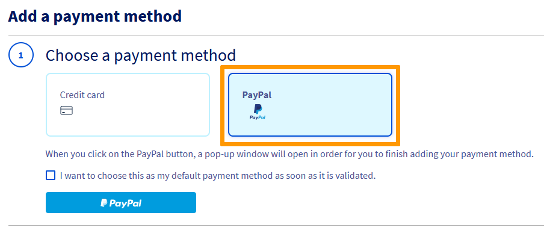
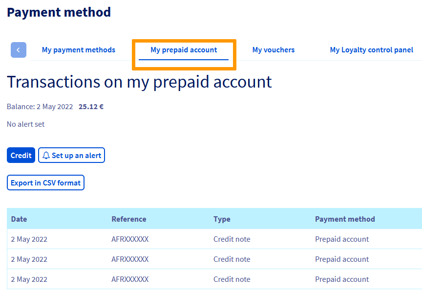

> [!primary]
> Esta tradução foi automaticamente gerada pelo nosso parceiro SYSTRAN. Em certos casos, poderão ocorrer formulações imprecisas, como por exemplo nomes de botões ou detalhes técnicos. Recomendamos que consulte a versão inglesa ou francesa do manual, caso tenha alguma dúvida. Se nos quiser ajudar a melhorar esta tradução, clique em "Contribuir" nesta página.
>

## Objetivo

A Área de Cliente OVHcloud permite-lhe guardar e gerir vários métodos de pagamento.

## Requisitos

- Ter acesso à [Área de Cliente OVHcloud](https://www.ovh.com/auth/?action=gotomanager&from=https://www.ovh.pt/&ovhSubsidiary=pt).
- Dispor de um método de pagamento válido.

## Instruções 

Na [Área de Cliente OVHcloud](https://www.ovh.com/auth/?action=gotomanager&from=https://www.ovh.pt/&ovhSubsidiary=pt), clique no seu nome (canto superior direito) e selecione `Método de pagamento`{.action}.

{.thumbnail}

Aparecerá uma página com um quadro que indica os métodos de pagamento registados na sua conta de cliente. Nela pode:

- Adicionar um método de pagamento
- Alterar o seu método de pagamento padrão
- Modificar a descrição do seu método de pagamento
- Eliminar um método de pagamento

### Adicionar um método de pagamento

Aquando da sua primeira encomenda, é-lhe pedido que registe um método de pagamento para assegurar a renovação do seu serviço por débito automático.

Este método de pagamento é então utilizado por defeito para todas as suas renovações e é-lhe proposto para pagar novas encomendas.

Tem a possibilidade de registar outros métodos de pagamento, para que eles lhe sejam propostos durante as suas novas encomendas ou utilizados por defeito para os seus futuros débitos.

É possível registar 2 tipos de métodos de pagamento:

- Cartão bancário
- Conta PayPal

Para isso, basta clicar no botão `Adicionar um método de pagamento`{.action}.

{.thumbnail}

Escolha o método de pagamento que deseja utilizar: 

{.thumbnail}

Siga as etapas sucessivas de registo do método de pagamento. Na primeira etapa, é-lhe proposto que selecione a opção `Pretendo selecionar este método de pagamento predefinido após a sua validação.`{.action}, de forma a que ele seja utilizado para as suas futuras compras ou débitos automáticos.

#### Cartão bancário

{.thumbnail}

Para registar um novo cartão de crédito, será redirecionado para a interface segura do nosso prestador de pagamentos. É efetuada uma tentativa de débito junto do seu organismo bancário para validar o número e a validade do seu cartão. 
Nenhum montante será debitado e o seu cartão de crédito será ativado ao fim de alguns minutos.

#### Conta paga

{.thumbnail}

Clique no botão `Paypal`{.action}. Será então aberta uma janela de contexto para se ligar à sua conta Paypal® e registar esta como método de pagamento autorizado junto da OVHcloud.

A sua conta Paypal® será ativada dentro de alguns minutos.

### Alterar o seu método de pagamento padrão

As faturas de renovação dos seus serviços são sempre debitadas no seu método de pagamento padrão. Se pretender alterar este método, terá primeiro de adicionar um novo método de pagamento na sua Área de Cliente.

Clique, então, no botão `...`{.action} à direita do novo método de pagamento, e em `Definir este método de pagamento por predefiniçao`{.action}.

{.thumbnail}

> **Pretendo substituir o meu método de pagamento predefinido por outro, como fazer?**
>
> - Etapa 1: adicione o novo método de pagamento
> - Etapa 2: defina o novo método de pagamento como método de pagamento padrão
> - Etapa 3: elimine o método de pagamento antigo
>

### Eliminar um método de pagamento

Se já não quiser usar um dos métodos de pagamento, poderá eliminá-lo clicando no botão `...`{.action} à direita do método de pagamento. Clique, então, em `Eliminar este método de pagamento`{.action}.

{.thumbnail}

Se deseja eliminar a integralidade dos seus métodos de pagamento, o conjunto dos seus serviços deve ser [renovado manualmente](/pages/account_and_service_management/managing_billing_payments_and_services/how_to_use_automatic_renewal#a-renovacao-manual).

#### Eliminar um método de pagamento através das API OVHcloud

A eliminação de um método de pagamento pode ser realizada através das API, ligando-se a [https://eu.api.ovh.com/](https://eu.api.ovh.com/).

Comece por obter a ID do método de pagamento:

> [!api]
>
> @api {GET} /me/payment/method
>

De seguida, elimine o método de pagamento utilizando o ID que obteve na etapa anterior:

> [!api]
>
> @api {DELETE} /me/payment/method/{paymentMethodId}
>

> [!primary]
>
> Para mais informações, consulte o guia [Primeiros passos com as API OVHcloud](/pages/manage_and_operate/api/first-steps).
>
> Em caso de dificuldades para identificar os seus métodos de pagamento através das API OVHcloud, utilize a função `Alterar a descrição`{.action} (botão `...`{.action} à direita do ecrã) na parte relativa aos [Métodos de pagamento](#payment_methods) da sua [Área de Cliente OVHcloud](https://www.ovh.com/auth/?action=gotomanager&from=https://www.ovh.pt/&ovhSubsidiary=pt).
>

### Conta pré-paga

#### O que é a conta pré-paga?

A *conta pré-paga* está presente na sua [Área de Cliente OVHcloud](https://www.ovh.com/auth/?action=gotomanager&from=https://www.ovh.pt/&ovhSubsidiary=pt) assim que for criada. Permite-lhe creditar antecipadamente a sua conta de cliente e utilizar estes fundos para o pagamento das suas encomendas e das suas faturas de renovação.

Ao creditar regularmente a sua conta, certificar-se-á de que a [renovação automática](/pages/account_and_service_management/managing_billing_payments_and_services/how_to_use_automatic_renewal#a-renovacao-automatica) dos seus serviços nunca será interrompida por falta de pagamento.

Para isso, aceda à secção `Métodos de pagamento` na Área de Cliente:

- clique no canto superior direito e, em seguida, em `Métodos de pagamento`{.action}, no menu da direita;
- selecione o separador `Conta pré-paga`{.action}.

{.thumbnail}

#### Como funciona?

A cada prazo, quando possui serviços parametrizados para a *renovação automática*, o montante da sua fatura é debitado prioritariamente na sua conta pré-paga.

Na ausência de fundos suficientes, o saldo da sua conta passará em negativo e ficará a aguardar pagamento.

Se dispõe de um método de pagamento válido registado na sua conta de cliente, este montante será automaticamente debitado nas 24 horas e o seu saldo reposto a zero. Isto sem qualquer impacto no estado dos seus serviços.

No entanto, se não registou nenhum método de pagamento, deverá pagar este saldo a partir da Área de Cliente dentro de 7 dias, para evitar qualquer interrupção do serviço.

Se não possui nenhum método de pagamento registado, recomendamos que parametrize um **limite de alerta** para garantir que dispõe dos fundos suficientes para as suas próximas faturas:

{.thumbnail}

Se o crédito disponível na sua conta pré-paga desce abaixo do limite definido, ser-lhe-á imediatamente enviado um e-mail de notificação.

#### Como creditar a sua conta pré-paga?

No separador `A minha conta pré-paga`{.action}, clique no botão `Creditar`{.action}.

{.thumbnail}

Na nova janela, indique o montante a creditar, clique em `Seguinte`{.action} e depois em `Encomendar`{.action}.

{.thumbnail}

Na nota de encomenda que aparece, selecione o método de pagamento à sua escolha e efetue o pagamento da sua encomenda.

## Quer saber mais?

Fale com a nossa comunidade de utilizadores: <https://community.ovh.com/en/>
