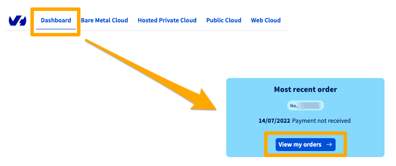

> [!primary]
> Diese Übersetzung wurde durch unseren Partner SYSTRAN automatisch erstellt. In manchen Fällen können ungenaue Formulierungen verwendet worden sein, z.B. bei der Beschriftung von Schaltflächen oder technischen Details. Bitte ziehen Sie im Zweifelsfall die englische oder französische Fassung der Anleitung zu Rate. Möchten Sie mithelfen, diese Übersetzung zu verbessern? Dann nutzen Sie dazu bitte den Button "Beitragen" auf dieser Seite.
>

## Ziel

In dieser Anleitung erfahren Sie, wie Sie die Bestellnummer bzw. Purchase Order Nummer für die OVHCloud Abrechnung verwenden.

## In der praktischen Anwendung

### Purchase Order (PO) Nummer

Bei Käufen von Waren oder Dienstleistungen müssen Unternehmen Bestellscheine validieren. Diese Validierung erfolgt in den meisten Fällen durch Erhalt eines Dokuments (Papier- oder Digitalformat) mit Briefkopf, das die erworbenen Waren oder Dienstleistungen enthält und dabei eine Bestellnummer angibt.
International wird dieses Dokument als **Purchase Order** bezeichnet und mit **PO** abgekürzt.

Für das Unternehmen, das die PO ausstellt, soll mit diesem Dokument der Einkauf von Waren und Dienstleistungen bei den Lieferanten kontrolliert werden, insbesondere indem vorgeschrieben wird, dass alle ausgestellten Rechnungen eine PO Nummer angeben müssen.

Es gibt im Wesentlichen zwei Arten von Bestellungen, die nachstehend beschrieben werden.

#### Purchase Order (PO)

Es handelt sich um ein Dokument, das die Bestellung von Waren oder Dienstleistungen für eine bestimmte Menge und für eine bestimmte Dauer bestätigt.

Für OVHcloud muss das Dokument daher mindestens folgende Angaben enthalten:

- Firmenname des Auftragnehmers
- Bestellnummer 
- Art(en) der bestellten Dienste
- Mengen
- Stückpreise
- Beginn der Gültigkeit
- Ablaufdatum

#### Blanket Purchase Order (BPO)

Hierbei handelt es sich um ein Dokument, in dem die Bestellung von Waren oder Dienstleistungen für eine variable Menge mit einem Höchstbetrag und für eine feste Laufzeit bestätigt wird.

Für OVHcloud muss das Dokument daher mindestens folgende Angaben enthalten:

- Firmenname des Auftragnehmers
- Bestellnummer 
- Art(en) der bestellten Dienste
- Stückpreise
- Gesamtbetrag der Bestellung
- Beginn der Gültigkeit
- Ablaufdatum

### Wie Sie eine Purchase Order Nummer (PO) in Ihrem OVHcloud Kundencenter eingeben

Loggen Sie sich in Ihr [OVHcloud Kundencenter](https://www.ovh.com/auth/?action=gotomanager&from=https://www.ovh.de/&ovhSubsidiary=de) ein und klicken Sie dann im Tab `Dashboard`{.action} auf `Meine Bestellungen anzeigen`{.action}.

{.thumbnail}

Klicken Sie auf den Tab `Meine internen Referenzen`{.action} und anschließend auf den Button `+ Interne Referenz hinzufügen`{.action}.

{.thumbnail}

Sie können auf Ihren Rechnungen den Eintrag `Interne Referenz` **oder*** den Eintrag `Purchase Order` anzeigen lassen. 
Wählen Sie entweder `Ihre Interne Referenz erstellen`{.action} oder `Ihre Purchase Order erstellen`{.action}.

Geben Sie im dafür vorgesehenen Feld einen Namen für Ihre interne Referenz / Purchase Order ein, geben Sie ein **Startdatum** und ein **Enddatum** ein (Enddatum ist ausgeschlossen) und klicken Sie anschließend auf `Bestätigen`{.action}.

> [!primary]
> Sie können nicht 2 interne Referenzen / Purchase Orders für denselben Zeitraum erstellen.

{.thumbnail}

Diese Referenz erscheint dann auf Ihren nächsten Rechnungen, die dem von Ihnen definierten Zeitintervall entsprechen.

{.thumbnail}

Im Tab `Meine internen Referenzen`{.action} können Sie eine Referenz ändern oder deaktivieren, die bereits erstellt wurde, indem Sie rechts neben der betreffenden Referenz auf den Button `...`{.action} klicken.

{.thumbnail}

> [!primary]
> Wenn Sie eine Referenz **innerhalb des gleichen Zeitintervalls** deaktivieren/ändern möchten, verwenden Sie die Option `Bearbeiten`{.action}, um die Zeitspanne der ersten Referenz zu ändern.

## Weiterführende Informationen

Für den Austausch mit unserer User Community gehen Sie auf <https://community.ovh.com/en/>.
