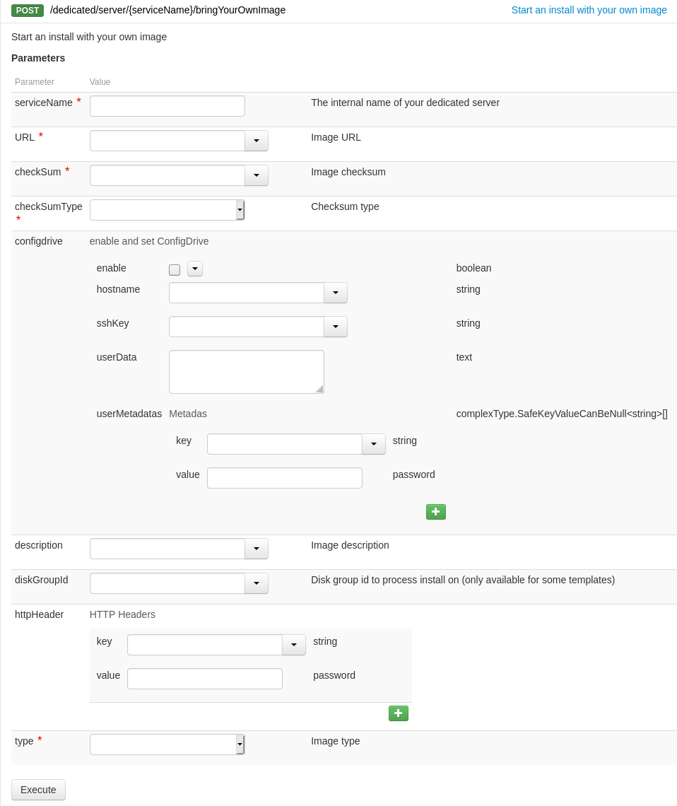

## Wprowadzenie

Dzięki technologii Bring Your Own Image możesz teraz wdrażać obrazy cloudready* * bezpośrednio na serwerach dedykowanych. Możesz zatem użyć produktu bare metal jako zasobu do wdrożenia.

**Co oznacza *cloudready*?**
 W jednym zdaniu być agnostykiem infrastruktury, na której zaczyna się obraz.
Oprócz wymagań i ograniczeń wymienionych poniżej, należy upewnić się, że obraz (odzyskiwany, generowany) spełnia wymagania techniczne dotyczące obrazu cloudready. Obraz musi być w stanie poprawnie uruchamiać dowolną typologię serwera, na której się uruchamia, musi również zainstalować usługę Cloud Init w przypadku korzystania z Config Drive. Wreszcie, konfiguracje systemowe muszą umożliwiać pełne uruchomienie systemu operacyjnego, zwłaszcza w przypadku konfiguracji dotyczących sieci.

**Dowiedz się, jak skonfigurować BringYourOwnImage z poziomu APIv6 OVHcloud**

## Wymagania początkowe

- Posiadanie [serwera dedykowanego OVHcloud](https://www.ovhcloud.com/pl/bare-metal/).
- Dostęp do [Panelu klienta OVHcloud](https://www.ovh.com/auth/?action=gotomanager&from=https://www.ovh.pl/&ovhSubsidiary=pl) w części ["Wdrażanie w Panelu klienta"](#viacontrolpanel) niniejszego przewodnika.
- Dostęp do [API OVHcloud](https://api.ovh.com/){.external} w części ["Wdrażanie przez API"](#viaapi) niniejszego przewodnika.
- Wygenerowanie [credentials do korzystania z APIv6](/pages/manage_and_operate/api/first-steps) w części ["Wdrażanie przez API"](#viaapi) tego przewodnika.
- Rozmiar obrazu musi być mniejszy niż ilość pamięci RAM serwera minus 3GiB.

> [!warning]
>
> Nowa instalacja przez BringYourOwnImage usunie wszystkie dane przechowywane na serwerze.
>

## W praktyce

**Ograniczenia techniczne**

Obecnie istnieje kilka ograniczeń technicznych związanych z korzystaniem z produktów fizycznych, takich jak serwery dedykowane.
Przygotowując wdrożenie, należy wziąć pod uwagę wymagania wymienione poniżej. Lista ta nie jest wyczerpująca.

- Typ boot: **uefi** lub **legacy**
- Typ partycji: **MBR** lub **GPT**
- Format obrazu: **qcow** lub **raw**

Jeśli Twój serwer ma boot **uefi**, należy koniecznie przewidzieć na zdjęciu partycję **EFI**, jeśli chcesz, aby Twój serwer mógł się zwiększyć.

**Metody wdrażania**

- [Wdrażanie w Panelu klienta](#viacontrolpanel): pozwala szybko i łatwo wdrażać obraz w Panelu klienta OVHcloud.
- [Wdrażanie przez API](#viaapi): Możesz korzystać z API OVHcloud i zintegrować je ze swoimi skryptami, aby zautomatyzować wdrażanie.

### Uruchom Twój obraz w Panelu klienta OVHcloud 

W [Panelu klienta OVHcloud](https://www.ovh.com/auth/?action=gotomanager&from=https://www.ovh.pl/&ovhSubsidiary=pl), w sekcji `Bare Metal Cloud`{.action}, następnie w sekcji `Serwery Dedykowane`{.action} wybierz Twój serwer.

W ramce `Informacje ogólne` kliknij przycisk `...`{.action} przed `Informacje ogólne`. Następnie kliknij `Zainstaluj`{.action}.

{.thumbnail}

W oknie, które się wyświetla wybierz `Zainstaluj ze spersonalizowanego`{.action} obrazu, a następnie kliknij `Zainstaluj`{.action}.

{.thumbnail}

Zostaniesz przekierowany na stronę konfiguracji. Upewnij się, że adres URL obrazu jest w odpowiednim formacie. Uzupełnij pozostałe wymagane pola na tej stronie. Po potwierdzeniu, że informacje są poprawne, kliknij przycisk `Zainstaluj system`{.action}.

Szczegółowe informacje na temat opcji znajdują się w części ["Tabele opcji"](#options) niniejszego przewodnika. 

Dokumentacja dotycząca aktywacji usługi `ConfigDrive` znajduje się na [tej stronie](https://cloudinit.readthedocs.io/en/22.1_a/topics/datasources/configdrive.html).

{.thumbnail}

### Uruchom obraz z poziomu API 

Zaloguj się na stronie [https://api.ovh.com/](https://api.ovh.com/){.external} i przejdź do sekcji `/dedicated/server`{.action}. Pole `Filter` pozwoli Ci wyszukać "BringYourOwnImage".

Dysponujesz trzema połączeniami API związanymi z funkcją BringYourOwnImage.

{.thumbnail}

Aby utworzyć i wdrożyć obraz, zadzwoń i uzupełnij wymagane pola:

> [!api]
>
> @api {v1} /dedicated/server POST /dedicated/server/{serviceName}/bringYourOwnImage
>

#### Tabele opcji 

| Pole | Opis |
|-|-|
| serviceName | Nazwa serwera. |
| URL | Adres URL, gdzie można pobrać obraz. |
| checkSum | Checksum na zdjęciu. |
| checkSumType | Checksum obrazu do wdrożenia (md5, sha1, sha256, sha512). |
| enable (ConfigDrive)\* | Włącz tworzenie partycji ConfigDrive (cloud-init). |
| hostname (ConfigDrive)\* | Hostname serwera. |
| sshKey (ConfigDrive)\* | Twój publiczny klucz SSH. |
| userData (ConfigDrive)\* | Skrypt poinstalacyjny. |
| userMetadatas (ConfigDrive)\* | Meta datas używany przez CloudInit w momencie uruchamiania bootu. |
| | Nazwa obrazu. |
| diskGroupId | ID dysku, który ma być używany. |
| httpHeader | Tylko w razie potrzeby do pobrania obrazu. |
| type | Typ/format obrazu (qcow2, raw, ova). |

\* ConfigDrive to partycja używana przez cloud-init przy pierwszym uruchamianiu serwera, w celu ustalenia pożądanej konfiguracji. Możesz włączyć lub nie tę opcję.

{.thumbnail}

Po uzupełnieniu pól uruchom wdrożenie, klikając `Execute`{.action}.

### Sprawdź wdrażanie

Możesz śledzić wdrażanie obrazu za pomocą następującego wywołania API lub za pomocą KVM / [IPMI](/pages/bare_metal_cloud/dedicated_servers/using_ipmi_on_dedicated_servers).

> [!api]
>
> @api {v1} /dedicated/server GET /dedicated/server/{serviceName}/bringYourOwnImage
>

W tym przykładzie wdrażanie jest w trakcie uruchamiania.

{.thumbnail}

Wdrożenie może trwać kilkadziesiąt minut. Po zakończeniu operacji status wdrożenia zmieni się na "done", a serwer zostanie zrestartowany na dysk.

#### Przykłady powrotu

Oto kilka przykładów:

| Wiadomość | Znaczenie |
|-|-|
| Can't write qcow2 on disk. | Nie można zapisać obrazu qcow2 na dysku. |
| Could not download, qcow2 image is too big to download in memory. | Nie ma wystarczająco dużo miejsca w pamięci RAM, aby pobrać obraz. |
| Could not download image located: `http://path/of/your/image` | Nie można pobrać obrazu znajdującego się na stronie: `http://ścieżka/Twój/obraz` |
| Format obrazu, expected: qcow2, raw. | Format obrazu jest nieprawidłowy. |
| Bad checkSumType, expected: sha1, sha256, md5. | Typ checksum jest nieprawidłowy. |
| Bad $checkSumType for downloaded file, got: 1234 while expecting 5678\. | Checksum jest nieprawidłowy. |
| Can not move backup GPT data structures to the end of disk. | Format dysku jest nieprawidłowy. |
| Could not create configdrive on disk. | Nie można utworzyć partycji skonfigurowanej na dysku. |

### Usuń wdrażanie

Możesz usunąć wdrożenie, wykonując następujące połączenie:

> [!api]
>
> @api {v1} /dedicated/server DELETE /dedicated/server/{serviceName}/bringYourOwnImage
>

Dzięki temu będziesz mógł usunąć stan wdrożenia i umieścić serwer w trybie rescue.

## Sprawdź również

Dołącz do społeczności naszych użytkowników na stronie<https://community.ovh.com/en/>.
