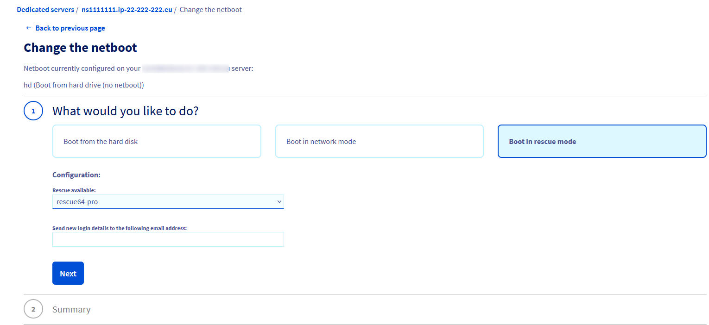
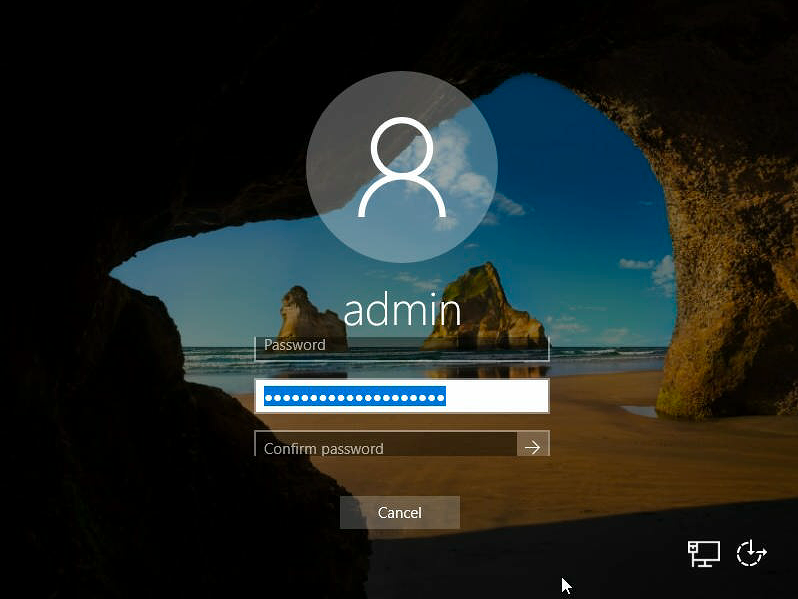
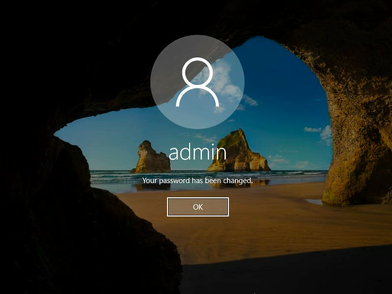
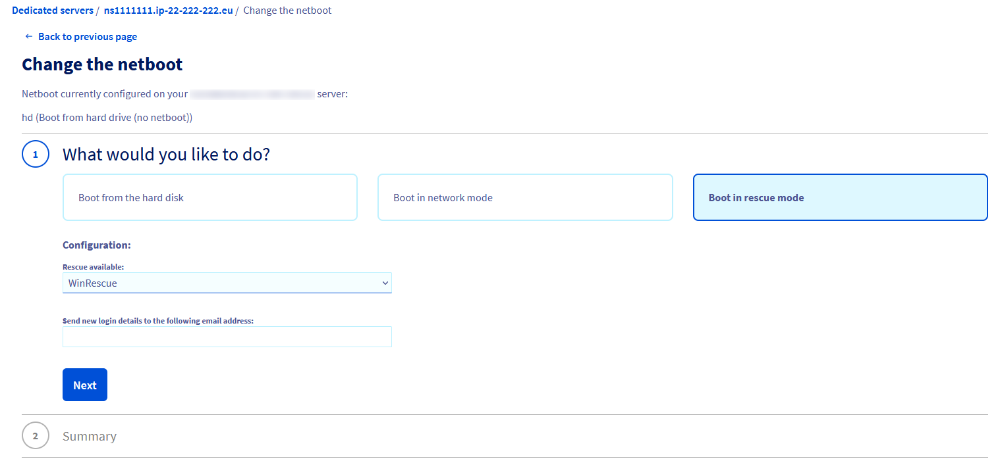

## Objectif

Lors de l’installation ou de la réinstallation d’un système d’exploitation Windows, un mot de passe pour l’accès administrateur vous est fourni. Nous vous conseillons vivement de le modifier, comme expliqué dans notre guide intitulé « [Sécuriser un serveur dédié](/pages/bare_metal_cloud/dedicated_servers/securing-a-dedicated-server){.external} ». Si vous avez perdu votre mot de passe admin, vous devrez le réinitialiser en mode rescue.

**Ce guide vous accompagnera tout au long du processus de modification du mot de passe admin de votre serveur, via les configurations de mode rescue disponibles pour un système d'exploitation Windows.**

## Prérequis

* Posséder un [serveur dédié](https://www.ovhcloud.com/fr-ca/bare-metal/){.external} avec Windows installé.
* Être connecté à l'[espace client OVHcloud](https://ca.ovh.com/auth/?action=gotomanager&from=https://www.ovh.com/ca/fr/&ovhSubsidiary=qc){.external}.


## En pratique

Les étapes suivantes décrivent le processus de modification du mot de passe admin local via le mode rescue OVHcloud (basé sur Linux) qui est disponible à tout moment. Si vous préférez utiliser Windows PE (WinRescue), consultez la méthode dédiée [à la fin de ce guide](./#reinitialisation-du-mot-de-passe-admin-a-laide-de-winrescue). 

### Étape 1 : redémarrer le serveur en mode rescue

Le système doit être démarré en mode rescue avant de pouvoir modifier le mot de passe admin. Connectez-vous à l'[espace client OVHcloud](https://ca.ovh.com/auth/?action=gotomanager&from=https://www.ovh.com/ca/fr/&ovhSubsidiary=qc), accédez à la section `Bare Metal Cloud`{.action} et sélectionnez votre serveur dans la liste de navigation de gauche sous `Serveurs dédiés`{.action}.

Le netboot doit être basculé vers « rescue64-pro (Customer rescue system (Linux) ». Recherchez « Boot » dans la zone **Informations générales** et cliquez sur `...`{.action}, puis sur `Modifier`{.action}. 
<br>Dans la page suivante, sélectionnez **Booter en mode rescue** et choisissez « rescue64-pro » dans le menu. Spécifiez une adresse e-mail dans le dernier champ si les identifiants de connexion doivent être envoyés à une adresse différente de l'adresse principale de votre compte OVHcloud. 

Cliquez sur `Suivant`{.action} puis sur `Valider`{.action}.

{.thumbnail}

Une fois la modification terminée, cliquez sur `...`{.action} à droite de « Status » dans la zone intitulée **Etat des services**. 
<br>Cliquez sur `Redémarrer`{.action} et le serveur redémarrera en mode rescue. Cette opération peut prendre quelques minutes. 
<br>Vous pouvez vérifier l'avancement sous l'onglet `Tâches`{.action}. Un e-mail vous sera envoyé, contenant les identidiants (dont le mot de passe de connexion)  de l'utilisateur « root » du mode rescue.

{.thumbnail}

Pour plus d'informations sur le mode rescue, consultez [ce guide](/pages/bare_metal_cloud/dedicated_servers/rescue_mode).

### Étape 2 : monter la partition système

Connectez-vous à votre serveur via SSH. Si nécessaire, consultez le guide d'[introduction au SSH](/pages/bare_metal_cloud/dedicated_servers/ssh_introduction).
<br>Étant donné qu'il s'agit d'un serveur Windows, les partitions seront intitulées « Microsoft LDM data ».

```
# fdisk -l
Disk /dev/sda: 1.8 TiB, 2000398934016 bytes, 3907029168 sectors
Units: sectors of 1 * 512 = 512 bytes
Sector size (logical/physical): 512 bytes / 512 bytes
I/O size (minimum/optimal): 512 bytes / 512 bytes
Disklabel type: gpt
Disk identifier: 54A5B25A-75B9-4355-9185-8CD958DCF32A
 
Device          Start        End    Sectors  Size Type
/dev/sda1        2048     718847     716800  350M EFI System
/dev/sda2      718848     720895       2048    1M Microsoft LDM metadata
/dev/sda3      720896     980991     260096  127M Microsoft reserved
/dev/sda4      980992 3907028991 3906048000  1.8T Microsoft LDM data
/dev/sda5  3907028992 3907029134        143 71.5K Microsoft LDM data
```

Dans cet exemple, « sda4 » est la partition système, déterminée par sa taille. Généralement, il existe aussi une seconde partition miroir qui, dans ce cas, est intitulée « /dev/sdb**X** ». En effet, dans la plupart des cas, le serveur aura plusieurs disques avec des schémas de partition identiques. Pour le processus de réinitialisation du mot de passe, seul le premier est important. 

À présent, montez cette partition :

```
# mount /dev/sda4 /mnt
```

Vérifiez le point de montage :

```
# lsblk
NAME   MAJ:MIN RM  SIZE RO TYPE MOUNTPOINT
sdb      8:16   0  1.8T  0 disk
├─sdb4   8:20   0  1.8T  0 part
├─sdb2   8:18   0    1M  0 part
├─sdb5   8:21   0 71.5K  0 part
├─sdb3   8:19   0  127M  0 part
└─sdb1   8:17   0  350M  0 part
sda      8:0    0  1.8T  0 disk
├─sda4   8:4    0  1.8T  0 part /mnt
├─sda2   8:2    0    1M  0 part
├─sda5   8:5    0 71.5K  0 part
├─sda3   8:3    0  127M  0 part
└─sda1   8:1    0  350M  0 part
```

Dans l'exemple ci-dessus, l'opération a réussi. Si le montage a échoué, vous recevrez probablement un message d'erreur semblable à celui-ci : 

```
The disk contains an unclean file system (0, 0).
Metadata kept in Windows cache, refused to mount.
Failed to mount '/dev/sda4': Operation not permitted
The NTFS partition is in an unsafe state. Please resume and shutdown
Windows fully (no hibernation or fast restarting), or mount the volume
read-only with the 'ro' mount option.
```

Dans ce cas, utilisez la commande suivante, puis réessayez de monter la partition.

```
# ntfsfix /dev/sda4
# mount /dev/sda4 /mnt
```

### Étape 3 : supprimer le mot de passe actuel

Cette étape consiste à manipuler le fichier *SAM* à l'aide d'un outil permettant d'effacer le mot de passe de l'utilisateur admin. Accédez au bon dossier et répertoriez les utilisateurs Windows :

```
# cd /mnt/Windows/System32/config
/mnt/Windows/System32/config# chntpw -l SAM

chntpw version 1.00 140201, (c) Petter N Hagen
Hive <SAM> name (from header): <\SystemRoot\System32\Config\SAM>
ROOT KEY at offset: 0x001020 * Subkey indexing type is: 686c <lh>
File size 65536 [10000] bytes, containing 8 pages (+ 1 headerpage)
Used for data: 359/39024 blocks/bytes, unused: 33/18064 blocks/bytes.

| RID -|---------- Username ------------| Admin? |- Lock? --|
| 03e8 | admin                          | ADMIN  | dis/lock |
| 01f4 | Administrator                  | ADMIN  | dis/lock |
| 01f7 | DefaultAccount                 |        | dis/lock |
| 01f5 | Guest                          |        | dis/lock |
| 01f8 | WDAGUtilityAccount             |        | dis/lock |
```

Si la commande ne fonctionne pas, installez d'abord l'outil : `apt get install chntpw`.

Effacez le mot de passe de l'utilisateur admin à l'aide de la commande suivante. (Choisissez « Administrator » si « admin » n'existe pas.)

```
# chntpw -u admin SAM
chntpw version 1.00 140201, (c) Petter N Hagen
Hive <SAM> name (from header): <\SystemRoot\System32\Config\SAM>
ROOT KEY at offset: 0x001020 * Subkey indexing type is: 686c <lh>
File size 65536 [10000] bytes, containing 8 pages (+ 1 headerpage)
Used for data: 361/39344 blocks/bytes, unused: 35/13648 blocks/bytes.
 
================= USER EDIT ====================
 
RID     : 1000 [03e8]a
Username: admin
fullname:
comment :
homedir :
 
00000221 = Users (which has 3 members)
00000220 = Administrators (which has 2 members)
 
Account bits: 0x0010 =
[ ] Disabled        | [ ] Homedir req.    | [ ] Passwd not req. |
[ ] Temp. duplicate | [X] Normal account  | [ ] NMS account     |
[ ] Domain trust ac | [ ] Wks trust act.  | [ ] Srv trust act   |
[ ] Pwd don't expir | [ ] Auto lockout    | [ ] (unknown 0x08)  |
[ ] (unknown 0x10)  | [ ] (unknown 0x20)  | [ ] (unknown 0x40)  |
 
Failed login count: 0, while max tries is: 0
Total  login count: 5
 
- - - - User Edit Menu:
 1 - Clear (blank) user password
(2 - Unlock and enable user account) [seems unlocked already]
 3 - Promote user (make user an administrator)
 4 - Add user to a group
 5 - Remove user from a group
 q - Quit editing user, back to user select
Select: [q] >
```

Tapez « 1 » et appuyez sur Entrée ( ↩). (Utilisez d'abord l'option 2 si un « X » apparaît en face de « Disabled ».)

```
Select: [q] > 1
Password cleared!
================= USER EDIT ====================
 
RID     : 1000 [03e8]
Username: admin
fullname:
comment :
homedir :
 
00000221 = Users (which has 3 members)
00000220 = Administrators (which has 2 members)
 
Account bits: 0x0010 =
[ ] Disabled        | [ ] Homedir req.    | [ ] Passwd not req. |
[ ] Temp. duplicate | [X] Normal account  | [ ] NMS account     |
[ ] Domain trust ac | [ ] Wks trust act.  | [ ] Srv trust act   |
[ ] Pwd don't expir | [ ] Auto lockout    | [ ] (unknown 0x08)  |
[ ] (unknown 0x10)  | [ ] (unknown 0x20)  | [ ] (unknown 0x40)  |
 
Failed login count: 0, while max tries is: 0
Total  login count: 5
** No NT MD4 hash found. This user probably has a BLANK password!
** No LANMAN hash found either. Try login with no password!
 
- - - - User Edit Menu:
 1 - Clear (blank) user password
(2 - Unlock and enable user account) [seems unlocked already]
 3 - Promote user (make user an administrator)
 4 - Add user to a group
 5 - Remove user from a group
 q - Quit editing user, back to user select
Select: [q] >
```

Tapez « q » et appuyez sur Entrée pour quitter l'outil. Tapez « y » lorsque vous y êtes invité et appuyez sur Entrée.

```
Select: [q] > q
 
Hives that have changed:
 #  Name
 0  <SAM>
Write hive files? (y/n) [n] : y
 0  <SAM> - OK
```

### Étape 4 : redémarrer le serveur 

Commencez par remplacer le netboot par **Booter sur le disque dur** dans l'[espace client OVHcloud](https://ca.ovh.com/auth/?action=gotomanager&from=https://www.ovh.com/ca/fr/&ovhSubsidiary=qc) (voir [Etape 1](./#etape-1-redemarrer-le-serveur-en-mode-rescue)). 

De retour en ligne de commande, démontez la partition et redémarrez le serveur avec les commandes suivantes :

```
# cd
# umount /mnt
# reboot

Broadcast message from root@rescue.ovh.net on pts/0 (Wed 2020-05-27 11:28:53 CEST):

The system is going down for reboot NOW!
```

### Étape 5 : définir un nouveau mot de passe (IPMI)

Dans l'[espace client OVHcloud](https://ca.ovh.com/auth/?action=gotomanager&from=https://www.ovh.com/ca/fr/&ovhSubsidiary=qc), accédez à l'onglet `IPMI`{.action} pour ouvrir une session KVM.

{.thumbnail}

#### Étape 5.1 : pour une version récente de Windows

L'interface de connexion devrait afficher un message indiquant l'expiration du mot de passe.

{.thumbnail}

Le nouveau mot de passe de l'utilisateur admin doit maintenant être entré deux fois. Toutefois, le champ de confirmation n'est pas encore visible, ce qui signifie que vous devez laisser le premier champ vide, entrer votre nouveau mot de passe dans le deuxième champ, puis utiliser la touche de tabulation (« ↹ ») du clavier (virtuel) pour passer au troisième champ (« Confirmer le mot de passe »). 
<br>Tapez de nouveau le mot de passe et cliquez sur la flèche pour l'enregistrer.

{.thumbnail}

Cliquez sur `OK`{.action} et vous serez connecté.

{.thumbnail}

#### Étape 5.2 : pour une version antérieure de Windows

Une fenêtre de ligne de commande (cmd) doit s'ouvrir lorsque la session KVM est établie.

Définissez le mot de passe de l'utilisateur actuel (« Administrator »):

```
net user Administrator *
```


{.thumbnail}

> [!primary]
>
Il est recommandé d'utiliser le clavier virtuel lors de la saisie de mots de passe dans cette interface.
>


### Réinitialisation du mot de passe admin à l'aide de WinRescue

#### Étape 1 : redémarrer le serveur en mode rescue

Le système doit être démarré en mode rescue avant de pouvoir modifier le mot de passe admin. Connectez-vous à l'[espace client OVHcloud](https://ca.ovh.com/auth/?action=gotomanager&from=https://www.ovh.com/ca/fr/&ovhSubsidiary=qc), accédez à la section `Bare Metal Cloud`{.action} et sélectionnez votre serveur sous `Serveurs dédiés`{.action}.

Le netboot doit être basculé vers « WinRescue (Rescue System for Windows) ». Recherchez « Boot » dans la zone **Informations générales** et cliquez sur `...`{.action}, puis sur `Modifier`{.action}. 
<br>Dans la page suivante, sélectionnez **Booter en mode rescue** et choisissez « WinRescue » dans le menu. Spécifiez une adresse e-mail dans le dernier champ si les identifiants de connexion doivent être envoyés à une adresse différente de l'adresse principale de votre compte OVHcloud. 

Cliquez sur `Suivant`{.action} puis sur `Valider`{.action}.

{.thumbnail}

Une fois la modification terminée, cliquez sur `...`{.action} à droite de « Status » dans la zone intitulée **Etat des services**. 
<br>Cliquez sur `Redémarrer`{.action} et le serveur redémarrera en mode rescue. Cette opération peut prendre quelques minutes. 
<br>Vous pouvez vérifier l'avancement sous l'onglet `Tâches`{.action}. 
<br>Un e-mail vous sera envoyé, contenant les identifiants (dont le mot de passe de connexion)  de l'utilisateur « root » du mode rescue.

{.thumbnail}

Pour plus d'informations sur le mode rescue, consultez [ce guide](/pages/bare_metal_cloud/dedicated_servers/rescue_mode).

#### Étape 2 : supprimer le mot de passe actuel

Dans l'[espace client OVHcloud](https://ca.ovh.com/auth/?action=gotomanager&from=https://www.ovh.com/ca/fr/&ovhSubsidiary=qc), accédez à l'onglet `IPMI`{.action} pour ouvrir une session KVM.

{.thumbnail}

Pour réinitialiser les mots de passe, l'outil NTPWEdit est nécessaire. Une fois connecté via le KVM, ouvrez le navigateur et téléchargez-le à partir du [site Web officiel](http://www.cdslow.org.ru/en/ntpwedit/). 

Naviguez jusqu'au dossier où se trouve le fichier ZIP téléchargé et extrayez le contenu. Ouvrez ensuite l'exécutable *ntpwedit64* pour démarrer l'application.

{.thumbnail}

Dans cette interface, vous pouvez manipuler le fichier *SAM* afin d'effacer le mot de passe de l'utilisateur admin. Le chemin d'accès par défaut du répertoire *WINDOWS* est prérempli. Ouvrez le fichier pour afficher la liste des utilisateurs en cliquant sur `Ouvrir`{.action}.

L'utilisateur concerné sera soit « admin », soit « Administrator », selon la version de Windows. Si les deux sont présents, choisissez « admin ». Cliquez ensuite sur `Modifier le mot de passe`{.action}.

{.thumbnail}

Dans la fenêtre qui apparaît, laissez les champs vides et cliquez sur `OK`{.action}. Terminez en cliquant sur `Enregistrer les modifications`{.action} puis sur `Quitter`{.action}.

Le serveur doit alors être redémarré.

#### Étape 3 : redémarrer le serveur 

Commencez par remplacer le netboot par **Booter sur le disque dur** dans l'[espace client OVHcloud](https://ca.ovh.com/auth/?action=gotomanager&from=https://www.ovh.com/ca/fr/&ovhSubsidiary=qc) (voir [Etape 1](./#etape-1-redemarrer-le-serveur-en-mode-rescue)).

De retour dans la fenêtre KVM, sélectionnez l'option d'arrêt `Redémarrer`{.action} via le bouton Windows « Démarrer » en bas à gauche.

Poursuivez la lecture de ce guide à l'[etape 5: définir un nouveau mot de passe (IPMI)](./#etape-5-definir-un-nouveau-mot-de-passe-ipmi).


## Aller plus loin

[Activer et utiliser le mode rescue](/pages/bare_metal_cloud/dedicated_servers/rescue_mode)

[Utilisation de l'IPMI pour les serveurs dédiés](/pages/bare_metal_cloud/dedicated_servers/using_ipmi_on_dedicated_servers)

Rejoignez notre communauté d'utilisateurs sur <https://community.ovh.com/>.