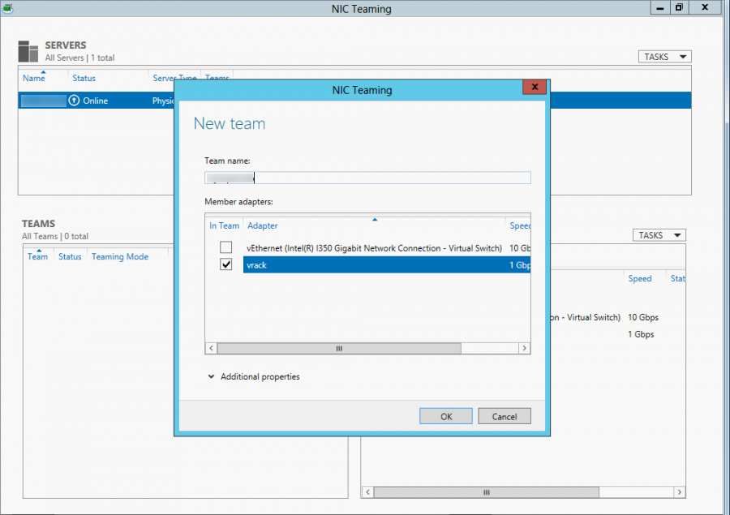

> [!primary]
> Esta tradução foi automaticamente gerada pelo nosso parceiro SYSTRAN. Em certos casos, poderão ocorrer formulações imprecisas, como por exemplo nomes de botões ou detalhes técnicos. Recomendamos que consulte a versão inglesa ou francesa do manual, caso tenha alguma dúvida. Se nos quiser ajudar a melhorar esta tradução, clique em "Contribuir" nesta página.
>

## Sumário

A [configuração standard do vRack](/pages/bare_metal_cloud/dedicated_servers/vrack_configuring_on_dedicated_server){.external} permite-lhe criar uma única VLAN. Isto significa que só pode utilizar um endereço de IP de cada vez. No entanto, com a versão 2.0 da configuração do vRack, pode criar até 4000 redes locais virtuais num único vRack. Assim, só pode utilizar cada endereço de IP até 4000 vezes.

**Este manual explica-lhe como criar várias VLAN no vRack.**

## Requisitos

- Ter um ou vários [servidores dedicados](https://www.ovh.pt/servidores_dedicados/){.external} compatíveis com o vRack.
- Ter ativado um serviço [vRack](https://www.ovh.pt/solucoes/vrack/){.external}.
- Ter acesso ao intervalo de endereços de IP privados escolhidos.
- Ter acesso root ao servidor via SSH (Linux).
- Estar ligado com uma conta de administrador (Windows).
- Ter finalizado a [configuração do vRack](/pages/bare_metal_cloud/dedicated_servers/vrack_configuring_on_dedicated_server){.external}.

> [!warning]
> Esta funcionalidade pode estar indisponível ou limitada nos [servidores dedicados **Eco**](https://eco.ovhcloud.com/pt/about/).
>
> Para mais informações, consulte o nosso [comparativo](https://eco.ovhcloud.com/pt/compare/).

## Instruções

### Linux

> [!primary]
>
> Como exemplo, utilizaremos **eno2** para Ubuntu e **eth1** para Debian como interface de rede, **10** como etiqueta VLAN e **192.168.0.0/16** como intervalo de endereços de IP. 
>
> Todas as encomendas devem ser adaptadas em função da distribuição utilizada. Não hesite em consultar a documentação oficial da sua distribuição em caso de dúvidas.
>

#### Ubuntu 20 & 21

Este exemplo é baseado em Ubuntu 21.10 (Impish Indri).

Primeiro, deve estabelecer uma ligação SSH ao seu servidor e executar os seguintes comandos a partir da linha de comandos. Será instalado o pacote vLAN no seu servidor:

```sh
sudo apt-get install vlan
```

Carregue o módulo kernel 8021q:

```sh
sudo su -c 'echo "8021q" >> /etc/modules'
```

Crie ou edite este ficheiro de configuração para evitar que as alterações na configuração de rede sejam efetuadas automaticamente:

```sh
sudo nano /etc/cloud/cloud.cfg.d/99-disable-network-config.cfg
```

E adicione esta linha:

```sh
network: {config: disabled}
```

Obter o nome da interface de rede e o seu endereço MAC:

```sh
ip a
```

Aqui a interface que queremos configurar é `eno2` com um endereço MAC: `d0:50:99:d6:6b:14`.


Adicione a configuração de rede para esta interface de rede e a declaração de VLAN no seguinte ficheiro:

```sh
sudo nano /etc/netplan/50-cloud-init.yaml
```

```yaml
network:
    version: 2
    ethernets:
        eno2:
            match:
                macaddress: d0:50:99:d6:6b:14
        eno1:
            ...
            ...
    vlans:
        vlan10:
            id: 10                      # VLAN ID    
            link: eno2                  # Interface name
            addresses:
            - 192.168.0.14/16
```

Guarde e feche o ficheiro e, em seguida, execute os seguintes comandos:

```sh
sudo netplan try
sudo netplan apply
```

Utilize o seguinte comando para confirmar a configuração:

```sh
ip a
``` 


#### Debian

Primeiro, é necessário instalar o pacote “VLAN” no seu servidor. Para o fazer, utilize o seguinte comando:

```sh
sudo apt-get install vlan
```

Recomendamos que crie uma etiqueta VLAN para poder diferenciar as diferentes VLAN.

```sh
vconfig add eth1 10

Added vlan with VID == 10 to IF -:eth1:-
```

A seguir, é necessário declarar o intervalo de endereços de IP no vRack e identificá-lo com a respetiva etiqueta. Para isso, use o comando:

```sh
ip addr add 192.168.0.0/16 dev eth1.10
```

Finalmente, precisa de alterar a configuração da interface de rede para que tenha em conta a etiqueta da VLAN. Para este passo, abra o ficheiro de configuração da interface de rede para o editar e alterar, tal como indicado a seguir:

```sh
sudo /etc/network/interfaces

auto eth1.10
iface eth1.10 inet static
address 192.168.0.50
netmask 255.255.0.0
broadcast 192.168.255.255
```

### Windows

Ligue-se ao seu servidor através do ambiente de trabalho remoto e abra a aplicação “Server Manager”. De seguida, selecione a opção `Local Server`{.action} e clique em `Disabled`{.action} junto de **NIC Teaming**:

{.thumbnail}

Para criar uma nova equipa, selecione uma interface de rede e insira o nome de equipa no campo **Team name**. Clique em `OK`{.action} para terminar:

{.thumbnail}

Em seguida, deve indicar a etiqueta da VLAN. No painel “**Adapters and Interfaces**” do ecrã “**NIC Teaming**”, clique com o botão direito do rato na interface que acabou de adicionar à nova equipa e clique em `Properties`{.action}. Depois, clique em `Specific VLAN`{.action} e indique a etiqueta:

{.thumbnail}

Agora, é necessário configurar o endereço de IP da VLAN. Clique no botão `Start`{.action} do menu inicial e, em seguida, em `Control Panel`{.action}:

{.thumbnail}

Clique em `Network and Internet`{.action}:

{.thumbnail}

Clique em `Network and Sharing Center`{.action}:

{.thumbnail}

Clique em `Change adapter settings`{.action}:

{.thumbnail}

Depois, clique com o botão direito do rato na interface VLAN e, em seguida, em `Properties`{.action}:

{.thumbnail}

Clique duas vezes em `Internet Protocol Version 4 (TCP/IP/IPv4)`{.action}:

{.thumbnail}

No passo seguinte, clique em `Use the following IP address`{.action}. Em “**IP address**”: introduza um endereço de IP do seu intervalo interno. Em “**Subnet mask**”: introduza “255.255.0.0”.

{.thumbnail}

Finalmente, clique no botão `OK`{.action} para guardar as alterações e reinicie o servidor.

## Quer saber mais?

[Configurar vários servidores dedicados no vRack](/pages/bare_metal_cloud/dedicated_servers/vrack_configuring_on_dedicated_server){.external}

Fale com a nossa comunidade de utilizadores em <https://community.ovh.com/en/>.