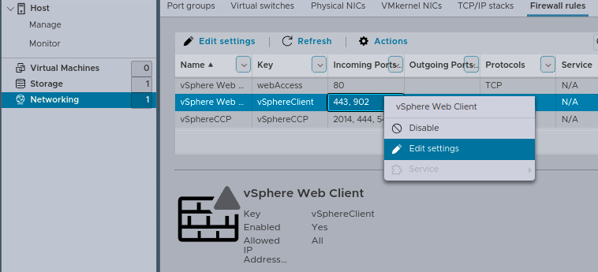
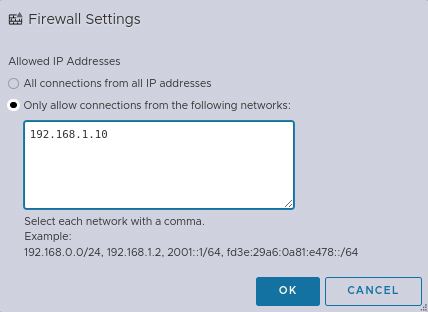

## Objectif

Cette documentation a pour objectif de vous accompagner pour élaborer au mieux la sécurisation de votre système ESXi.

En particulier, ce guide présente comment :

- limiter l'accès à votre ESXi à une adresse IP ou une plage réseau spécifique ;
- désactiver des services augmentant la surface d'attaque de votre serveur.

Nous nous appuierons pour cela sur les fonctions embarquées que propose VMware, mais aussi celles offertes par OVHcloud.

> [!warning]
> 
> Récemment, les systèmes ESXi ont été victimes d'une faille que des groupes malveillants ont exploitée très rapidement à travers les réseaux publics.
>
> Vous trouverez plus d'informations sur cette attaque dans [une FAQ complémentaire](/pages/bare_metal_cloud/dedicated_servers/faq-esxi).
>

### Rappel des bonnes pratiques de sécurité :

- Mettez à jour régulièrement vos systèmes ESXi.
- Restreignez l’accès aux seules adresses IP de confiance.
- Désactivez les ports ainsi que les services inutilisés.
- Assurez-vous que les accès à vos serveurs ou vos équipements réseaux sont limités, contrôlés et protégés avec des mots de passe robustes.
- Sauvegardez vos données critiques dans des disques externes et des serveurs de backup protégés et isolés d’Internet.

**Optionnel** :

- Mettez en place des solutions de journalisation nécessaires pour contrôler les évènements survenus sur vos serveurs critiques et vos équipements réseaux.
- Mettez en place des packs de sécurité pour la détection des actions malveillantes, des intrusions (IPS / NIDS) et pour le contrôle de la bande passante de trafic réseau.

## Prérequis

- Être connecté à l'[espace client OVHcloud](https://ca.ovh.com/auth/?action=gotomanager&from=https://www.ovh.com/ca/fr/&ovhSubsidiary=qc){.external}.
- Posséder un serveur dédié avec la solution ESXi déployée.
- Avoir souscrit à une offre compatible avec notre fonctionnalité [Network Firewall](/pages/bare_metal_cloud/dedicated_servers/firewall_network) si vous souhaitez l'utiliser pour effectuer le filtrage.

## En pratique

### La protection anti-intrusion native

Rappel de sa définition et son principe de fonctionnement :

> [!primary]
> 
> Le système ESXi embarque un mécanisme de sécurité lié au compte administrateur.
> En effet, en cas de plusieurs tentatives d'accès érronées, le compte administrateur est temporairement vérrouillé.
> Ce mécanisme permet de protéger votre système et ainsi d'éviter les tentatives de connexions malveillantes.

> [!warning]
> 
> Si ce système se déclenche et que vous souhaitez vous connecter à votre ESXi immédiatement, il vous faudra déverrouiller manuellement le compte administrateur.
>
> Pour cela, il vous sera nécessaire de [redémarrer](/pages/bare_metal_cloud/dedicated_servers/getting-started-with-dedicated-server#redemarrage-de-votre-serveur-dedie) votre serveur ESXi à travers l'espace client OVHcloud.
> 

Vous pouvez consulter l'historique des logs d'accès dans les fichiers suivants à partir d'un shell SSH :

- `/var/run/log/vobd.log` contient les logs qui peuvent être utilisés pour la supervision et la résolution de problèmes :

```
2023-02-13T16:22:22.897Z: [UserLevelCorrelator] 410535559us: [vob.user.account.locked] Remote access for ESXi local user account 'root' has been locked for 900 seconds after 6 failed login attempts.
2023-02-13T16:22:22.897Z: [GenericCorrelator] 410535559us: [vob.user.account.locked] Remote access for ESXi local user account 'root' has been locked for 900 seconds after 6 failed login attempts.
2023-02-13T16:22:22.897Z: [UserLevelCorrelator] 410535867us: [esx.audit.account.locked] Remote access for ESXi local user account 'root' has been locked for 900 seconds after 6 failed login attempts.
```

- `/var/run/log/hostd.log` contient les logs de l'hôte ESXi (tâches, accès à l'interface WEB, etc.) :

```
2023-02-21T08:44:19.711Z error hostd[2101004] [Originator@6876 sub=Default opID=esxui-d48c-26a4] [module:pam_lsass]pam_do_authenticate: error [login:root][error code:2]
2023-02-21T08:44:19.711Z error hostd[2101004] [Originator@6876 sub=Default opID=esxui-d48c-26a4] [module:pam_lsass]pam_sm_authenticate: failed [error code:2]
2023-02-21T08:44:19.712Z warning hostd[2101004] [Originator@6876 sub=Default opID=esxui-d48c-26a4] Rejected password for user root from xxx.xxx.xxx.xxx
2023-02-21T08:44:19.712Z info hostd[2101004] [Originator@6876 sub=Vimsvc.ha-eventmgr opID=esxui-d48c-26a4] Event 175 : Cannot login root@xxx.xxx.xxx.xxx
```

Toutes ces informations sont également disponibles à travers l'interface d'administration web. Cliquez sur le menu `Host`{.action} et accédez à la section `Monitor`{.action}, puis cliquez sur `Logs`{.action}.

{.thumbnail}

### La solution Network Firewall

> [!primary]
>
> Pour rappel, le Network Firewall n’est pas pris en compte au sein du réseau OVHcloud. Par conséquent, les règles configurées n’affectent pas les connexions provenant de ce réseau interne.
>

Nous vous proposons d'activer et d'utiliser notre solution de filtrage [Network Firewall](/pages/bare_metal_cloud/dedicated_servers/firewall_network).
Cette solution vous permettra de gérer facilement les accès légitimes, en complément de ceux que vous aurez mis en place à travers votre système ESXi.

Elle vous évitera aussi de verrouiller inopinément votre compte administrateur en cas d'attaque.

Il est donc recommandé de filtrer les accès légitimes de cette manière :

- La règle 1 (Priority 0) autorise des réseaux externes de confiance à accèder à votre système ESXi.
- La règle 2 (Priority 1) bloque tout le reste.

{.thumbnail}

### Le filtrage sous ESXi

> [!primary]
>
> Vous avez également la possibilité de filtrer les accès à votre système ESXi grâce au pare-feu intégré.
> Vous pourrez aussi désactiver les services inutiles, en fonction de votre usage.
>

> [!warning]
> 
> La désactivation des services **SSH** et **SLP** est fortement conseillée.
> Si malgré tout, vous continuez à utiliser le service SSH, restreignez au maximum son uilisation et ses accès.
> Ceci est valable également pour les accès au **shell**.
> Ne prévilégiez que le strict nécessaire pour chacun de vos besoins.

#### Manipulation via l'interface graphique

**Services**

Cliquez sur le menu `Host`{.action} et accédez à la section `Manage`{.action} puis cliquez sur `Services`{.action}.

Trouvez dans la liste le service `TSM-SSH` et faites un clic droit sur la ligne associée.

Arrêtez le service en cliquant sur `Stop`{.action} :

{.thumbnail}

Selectionnez la `Policy` puis modifiez-la comme sur l'exemple présenté.

Choisissez l'option `Start anc stop manually`{.action} afin d'éviter que le service ne soit actif au démarrage du serveur.

{.thumbnail} 

Appliquez les mêmes paramètres pour le service `slpd` :

{.thumbnail}

**Règles de pare-feu**

Cliquez sur le menu `Networking`{.action} puis sur `Firewall rules`{.action} et choisissez `Edit settings`{.action} pour chacun des services à protéger :

{.thumbnail}

Éditez la règle pour n'ajouter que les adresses IP ou les réseaux qui doivent avoir accès à votre système ESXi.

Exemple autorisant uniquement les connexions depuis l'IP 192.168.1.10 :

{.thumbnail}

#### Manipulation via le shell

**Services**

Désactivez les services inutiles :

- Service SLP

```bash
/etc/init.d/slpd stop
esxcli network firewall ruleset set -r CIMSLP -e 0
chkconfig slpd off
```

- Service SSH

```bash
/etc/init.d/SSH stop
esxcli network firewall ruleset set -r sshServer -e 0
chkconfig SSH off
```

Vérifiez l'ensemble des services actifs au démarrage :

```bash
chkconfig --list | grep on
```
<br/>
<br/>

**Règles de pare-feu**

Affichez les règles de pare-feu existantes :

```bash
esxcli network firewall ruleset list
esxcli system account list
```

> Explications sur les modification/ajustement de règle d'accès : 
> 
> - Le service `vSphereClient` : ce service correspond à l'interface WEB d'administration sur le port 443 (HTTPS).
> - Le service `sshServer` : ce service correspond aux accès en SSH sur le port 22.

Exemple avec le service vSphereClient :

```bash
esxcli network firewall ruleset list --ruleset-id vSphereClient
```

Assurez-vous que la règle de pare-feu soit active :

```bash
esxcli network firewall ruleset set --ruleset-id vSphereClient --enabled true
```

Affichez la liste des IP autorisées pour cette règle :

```bash
esxcli network firewall ruleset allowedip list --ruleset-id vSphereClient
```

Résultat :

```
Ruleset        Allowed IP Addresses
-------------  --------------------
vSphereClient  All
```

Changez le statut du tag en le désactivant :

```bash
esxcli network firewall ruleset set --ruleset-id vSphereClient --allowed-all false
```

Autorisez exclusivement l'adresse IP légitime 192.168.1.10 :

```bash
esxcli network firewall ruleset allowedip add --ruleset-id vSphereClient --ip-address 192.168.1.10
```

Vérifiez la présence de l'adresse dans la liste d'accès :

```bash
esxcli network firewall ruleset allowedip list --ruleset-id vSphereClient
```

Résultat :

```
Ruleset        Allowed IP Addresses
-------------  --------------------
vSphereClient  192.168.1.10
```
<br/>
<br/>

Si vous souhaitez malgré tout utiliser le service SSH, nous vous expliquons ici comment mettre en place un accès par clé SSH.

Générez les clés sur la machine devant se connecter au serveur ESXi, l'algorithme **ECDSA** sur 521 bits est à privilégier pour une sécurité maximale :  

> [!warning]
> L'authentification fonctionne avec une paire de clés : une publique et une autre privée.
> Ne partagez en aucun cas votre clé **privée**, celle-ci doit rester sur la machine où elle a été générée.

Exécutez la commande suivante :

```bash
ssh-keygen -t ecdsa -b 521 -C "key-ecdsa-esxi-host" -f /path-to-my-key/key-ecdsa
```

```
Generating public/private ecdsa key pair.
Enter file in which to save the key (/path-to-my-key/key-ecdsa_rsa):
```

Renseignez un mot de passe robuste :

```
Enter passphrase (empty for no passphrase):
Enter same passphrase again:
```

Seule la clé publique (key-ecdsa.pub) devra être communiquée ou déposée sur les machines auxquelles vous souhaitez vous connecter.

```
Your identification has been saved in /path-to-my-key/key-ecdsa.
Your public key has been saved in /path-to-my-key/key-ecdsa.pub.
The key fingerprint is:
SHA256:******************************************* key-ecdsa-esxi-host
```

Transférez la clé publique vers votre hôte ESXi pour qu'elle puisse être déclarée comme étant de confiance :

```bash
cat /path-to-my-key/key-ecdsa.pub | ssh root@esxi-host-ip 'cat >> /etc/ssh/keys-root/authorized_keys'
```

## Aller plus loin

Vous pourrez trouver encore plus de détails sur les bonnes pratiques de sécurité dans [ce guide](https://core.vmware.com/security-configuration-guide) proposé par VMware.

Échangez avec notre communauté d'utilisateurs sur <https://community.ovh.com/>.
