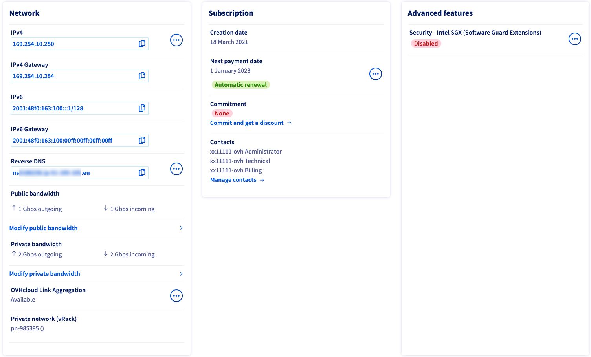
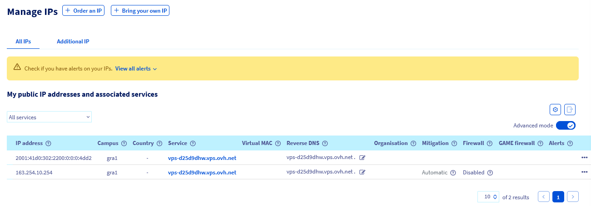

## Objective

OVHcloud annonce le regroupement de l’ensemble des serveurs dédiés Kimsufi, So you Start et Rise dans une ligne de produits appelée Eco, afin de vous offrir une meilleure vue d’ensemble de nos configurations. En raison de ces changements, vous pourrez désormais gérer tous vos services, quelle que soit leur gamme, depuis l'espace client OVHcloud. Pour vous accompagner dans ce changement si vous avez opté pour un serveur de la ligne de produits Eco, nous avons créé ce guide afin de vous présenter l’espace client OVHcloud et ses options.

**Ce guide est destiné à vous aider à vous familiariser avec l'espace client OVHcloud.**

> [!warning]
> Veuillez noter que malgré le changement d'interface client, certaines options peuvent ne pas être disponibles pour des serveurs Kimsufi et So you Start.
>

## En pratique

### Tableau de bord

{.thumbnail}

Si vous avez acquis un serveur de la ligne de produit Eco, votre tableau de bord sera désormais celui de l’espace client OVHcloud. Ce tableau de bord OVHcloud présente un récapitulatif de tous vos services. Cette interface présente plusieurs sections qui vous permettent d'accéder instantanément à un service. 
La colonne de droite vous donne accès à vos informations personnelles, votre identifiant client et votre niveau de support (le cas échéant). 
Elle propose également un ensemble de raccourcis et de liens utiles.

### Accéder au serveur

{.thumbnail}

Dans les interfaces Kimsufi et So you Start, le tableau de bord vous permet de voir votre serveur/liste de serveurs. 
Depuis l'espace client OVHcloud, cliquez d’abord sur le menu `Bare Metal Cloud`{.action} et ensuite sur `Serveurs dédiés`{.action} pour afficher vos serveurs. 
Si vous possédez plusieurs serveurs, le bouton `Tous mes serveurs`{.action} vous permet de les lister pour un accès facile.

### Interface Serveur

Une fois dans le menu `Serveurs Dédiés`{.action}, cliquez sur le serveur de votre choix pour accéder à son interface.

{.thumbnail}

{.thumbnail}

**Informations générales** : dans cette section, retrouvez toutes les informations concernant votre serveur.

- Nom : cliquez sur les `...`{.action} à côté de cette option pour modifier le nom de votre serveur.
- Boot : cliquez sur les `...`{.action} à côté de cette option pour changer le netboot de votre serveur en *mode rescue*, *mode normal* (sur le disque dur) ou *mode network*.
- Dernier système d'exploitation (OS) installé par OVHcloud : cliquez sur les `...`{.action} à côté de cette option pour installer/réinstaller votre serveur.

**Etat des services**

- Statut : cliquez sur les `...`{.action} à côté de cette option pour redémarrer ou supprimer votre serveur.
- Monitoring : cliquez sur `Configurer`{.action} pour modifier les [paramètres de monitoring de votre serveur](/pages/bare_metal_cloud/dedicated_servers/getting-started-with-dedicated-server#monitoring-server).

**Réseau**

- IPV4 : cliquez sur les `...`{.action} à côté de cette option pour gérer votre IP.
- Reverse : cliquez sur les `...`{.action} à côté de cette section pour entrer/modifier votre reverse DNS.

**DNS secondaire** : configurez votre DNS secondaire ici. Pour plus d'informations, consultez [ce guide](/pages/bare_metal_cloud/dedicated_servers/adding-secondary-dns-on-dedicated-server).

**Backup Storage** (disponible uniquement sur les serveurs OVHcloud et les serveurs So you Start, y compris ceux de la ligne Eco) : commandez et configurez votre backup storage ici. Pour plus d'informations, consultez [ce guide](/pages/bare_metal_cloud/dedicated_servers/services_backup_storage).

**Interventions** : retrouvez ici les interventions en cours et passées sur votre serveur.

**IPMI** (disponible uniquement sur les serveurs OVHcloud et certains serveurs So you Start, y compris ceux de la ligne Eco) : accédez ici à l'outil IPMI ou le KVM IP de votre serveur. Pour plus d'informations sur l'utilisation de cet outil, consultez [ce guide](/pages/bare_metal_cloud/dedicated_servers/using_ipmi_on_dedicated_servers).

**Tâches** : visualisez ici les tâches récentes effectuées sur votre serveur.

Pour plus d'informations sur la gestion de votre serveur dédié via l'espace client OVHcloud, veuillez consulter [ce guide](/pages/bare_metal_cloud/dedicated_servers/getting-started-with-dedicated-server).

### Section IP

Pour accéder à la section « IP » de votre espace client OVHcloud, cliquez sur le menu `Bare Metal Cloud`{.action} et ensuite sur `IP`{.action} :

{.thumbnail}

### Onglet Licences (non disponible sur Kimsufi)

Pour accéder à l'onglet « Licences » dans l'espace client OVHcloud, cliquez sur le menu `Bare Metal Cloud`{.action} et ensuite sur `Licences`{.action} :

{.thumbnail}

### Support, facturation et gestion de compte

Dans l’espace client Kimsufi ou So you Start, ces options sont disponibles en haut à droite sous des onglets individuels. 
Dans l’espace client OVHcloud, ces options sont regroupées dans un espace commun. Cliquez sur votre nom en haut à droite et cliquez sur vos initiales pour accéder à la rubrique `Gérer mon compte`.

{.thumbnail}

- **Informations générales** : dans cette rubrique, vous pouvez visualiser les informations de votre compte, votre dernière facture et accéder à différents raccourcis.
- **Sécurité** : cette rubrique vous permet de gérer les paramètres de sécurité de votre compte. Pour plus d’informations, nous vous invitons à consulter [ce guide](/pages/account_and_service_management/account_information/all_about_username).
- **Emails reçus** : dans cette rubrique, vous trouverez l'ensemble des e-mails qu'OVHcloud vous a envoyé, en dehors des demandes d'assistance.
- **Mon niveau de support** (uniquement disponible pour les services OVHcloud) : vous trouverez plus d’informations sur le niveau de support proposé par OVHcloud dans cette rubrique.
- **Gestion des utilisateurs** : cette rubrique vous permet de gérer vos utilisateurs. Pour plus d'informations, consultez [ce guide](/pages/account_and_service_management/account_information/ovhcloud-users-management).
- **Mes factures** : depuis cette rubrique, vous pouvez consulter vos factures, suivre les paiements effectués avec votre moyen de paiement par défaut et consulter vos avoirs. Plus d'informations sur [ce guide](/pages/account_and_service_management/managing_billing_payments_and_services/invoice_management).
- **Mes services** : cette rubrique vous permet de visualiser l'ensemble de vos services, vos contrats et vos clés SSH.
- **Moyens de paiement** : dans cette rubrique, vous avez accès à votre moyen de paiement actuel, votre compte prépayé ainsi que vos vouchers OVHcloud. Vous y trouverez également l'option d'ajouter/supprimer une méthode de paiement. Pour plus d’informations sur la gestion de vos moyens de paiement, nous vous invitons à consulter [ce guide](/pages/account_and_service_management/managing_billing_payments_and_services/manage-payment-methods).
- **Mes commandes** : consultez vos commandes depuis cette page. Plus d'informations sur [ce guide](/pages/account_and_service_management/managing_billing_payments_and_services/managing_ovh_orders).
- **Mes contacts** : dans cette rubrique, vous pouvez visualiser et gérer les contacts associés à vos services. Dans l'onglet **Mes demandes**, vous trouverez les demandes de modification de coordonnées envoyées depuis votre compte client ainsi que les demandes de gestion de services reçues. Pour plus d’informations sur la gestion de vos contacts de services, nous vous invitons à consulter [ce guide](/pages/account_and_service_management/account_information/managing_contacts).
- **Mes demandes d'assistance** : cette rubrique vous permet d’ouvrir/visualiser l’ensemble de vos demandes d’assistance.

## Aller plus loin

Voici quelques guides supplémentaires qui vous aideront dans vos premiers pas :

[Se connecter à l’espace client OVHcloud](/pages/account_and_service_management/account_information/ovhcloud-account-login). 
[Modifier le mot de passe de votre compte](/pages/account_and_service_management/account_information/manage-ovh-password). 
[Sécuriser mon compte OVHcloud et gérer mes informations personnelles](/pages/account_and_service_management/account_information/all_about_username). 
[Gérer les contacts de ses services](/pages/account_and_service_management/account_information/managing_contacts). 
[Créer une clé SSH](/pages/bare_metal_cloud/dedicated_servers/creating-ssh-keys-dedicated). 
[Quelles sont les adresses IP du monitoring OVHcloud ?](/pages/bare_metal_cloud/dedicated_servers/network_ip_monitoring).

Si vous avez besoin d'une formation ou d'une assistance technique pour la mise en oeuvre de nos solutions, contactez votre commercial ou cliquez sur [ce lien](https://www.ovhcloud.com/fr/professional-services/) pour obtenir un devis et demander une analyse personnalisée de votre projet à nos experts de l’équipe Professional Services.

Échangez avec notre communauté d’utilisateurs sur <https://community.ovh.com/>.
