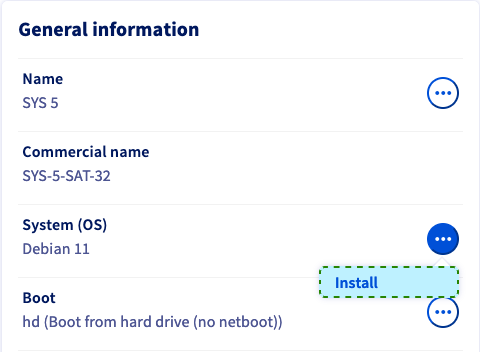
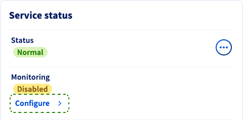

## Objectif

Un serveur dédié est un serveur physique situé dans l'un de nos datacenters. Contrairement aux solutions d'hébergement web (décrites comme « mutualisées »), qui sont techniquement gérées par OVHcloud, vous êtes entièrement responsable de l'administration sur votre serveur dédié.

**Ce guide vous accompagne lors des premières étapes de la gestion de votre serveur dédié Kimsufi, So You Start ou Rise.**

## Prérequis

- Un [serveur dédié](https://www.ovhcloud.com/fr-ca/bare-metal/) des gammes Kimsufi, So You Start ou Rise dans votre compte OVHcloud.
- Être connecté à votre serveur en SSH (accès root) sous Linux ou via un bureau distant sous Windows.
- Être connecté à votre [espace client OVHcloud](https://ca.ovh.com/auth/?action=gotomanager&from=https://www.ovh.com/ca/fr/&ovhSubsidiary=qc).

## En pratique

Lorsque votre serveur dédié est configuré pour la première fois au cours du processus de commande, vous pouvez sélectionner le système d'exploitation à installer.

### Installation ou réinstallation de votre serveur dédié

Vous pouvez facilement réinstaller votre serveur et choisir une autre image d'OS dans votre [espace client OVHcloud](https://ca.ovh.com/auth/?action=gotomanager&from=https://www.ovh.com/ca/fr/&ovhSubsidiary=qc). Sous l'onglet `Informations générales`{.action}, cliquez sur `...`{.action} en face du système d'exploitation, puis cliquez sur `Installer`{.action}.

{.thumbnail}

Dans la fenêtre qui apparaît, sélectionnez l'une des options d'installation :

- `Installer à partir d'un template OVHcloud`{.action} : vous pouvez sélectionner le système d’exploitation et personnaliser la configuration de votre serveur.
- `Installer un de vos gabarits`{.action} : pour pouvoir appliquer un gabarit personnalisé, vous devez avoir enregistré au préalable au moins une configuration de serveur. Pour cela, il est nécessaire de cocher l'option « Enregistrer cette installation » à l'étape 4 du processus d'installation.
- `Installer à partir d'une image personnalisée`{.action} : cette option vous permet d'installer une image externe sur le serveur. Consultez le [guide sur la fonctionnalité Bring Your Own Image](/pages/bare_metal_cloud/dedicated_servers/bring-your-own-image) pour plus de détails sur cette option.

> [!primary]
>
> Certains systèmes d'exploitation ou plates-formes propriétaires tels que Plesk ou Windows nécessitent des licences qui génèrent des frais supplémentaires. Vous pouvez acheter des licences [auprès de OVHcloud](https://www.ovhcloud.com/fr-ca/bare-metal/os/) ou auprès d'un revendeur externe. Vous devrez ensuite appliquer votre licence, dans le système d'exploitation lui-même ou à l'aide de votre [espace client OVHcloud](https://ca.ovh.com/auth/?action=gotomanager&from=https://www.ovh.com/ca/fr/&ovhSubsidiary=qc).
>
> Vous pouvez gérer toutes vos licences dans la section `Bare Metal Cloud`{.action} sous `Licences`{.action}. Dans cette section, vous pouvez également commander des licences ou ajouter des licences existantes via le bouton `Actions`{.action}.
>

Cliquez sur `Suivant`{.action} pour continuer.

{.thumbnail}

Après avoir choisi `Installer à partir d'un template OVH`{.action}, vous pouvez sélectionner le système d'exploitation dans les menus déroulants.

{.thumbnail}

Si vous devez modifier le schéma de partitionnement de votre système d'exploitation, cochez la case « Personnaliser la configuration des partitions » avant de cliquer sur `Suivant`{.action}.

{.thumbnail}

Une fois les ajustements terminés, cliquez sur `Suivant`{.action} pour accéder à la page de résumé.

#### Ajout d'une clé SSH (facultatif)

Si vous installez un système d'exploitation GNU/Linux, vous pouvez ajouter votre clé SSH à la dernière étape du processus d'installation.

{.thumbnail}

Si une clé SSH est déjà enregistrée, elle apparaît dans le menu déroulant sous « Clés SSH » en bas. Sinon, vous devrez d'abord en ajouter une dans la section « Mes services ».

Pour ce faire, ouvrez la barre latérale en cliquant sur votre nom dans le coin supérieur droit et utilisez le raccourci `Produits et services`{.action}.

{.thumbnail}

Dans « Mes services », basculez vers l'onglet `Clés SSH`{.action} et cliquez sur `Ajouter une clé SSH`{.action}.

{.thumbnail}

Comme il s'agit de l'installation d'un serveur dédié, veillez à sélectionner « Dédié » dans le menu déroulant (également compatible avec un VPS).

Dans la nouvelle fenêtre, entrez un ID (nom de votre choix) et la clé elle-même (de type RSA, ECDSA ou Ed25519) dans les champs correspondants.

{.thumbnail}

Pour obtenir une explication détaillée sur la génération de clés SSH, reportez-vous à notre [guide](/pages/bare_metal_cloud/dedicated_servers/creating-ssh-keys-dedicated).

> [!warning]
> OVHcloud vous fournit des services dont vous êtes responsable en ce qui concerne leur configuration et leur gestion. Vous êtes donc responsable de leur bon fonctionnement.
>
>Ce guide est conçu pour vous aider le plus possible dans les tâches courantes. Néanmoins, nous vous recommandons de contacter un prestataire de services spécialisé si vous rencontrez des difficultés ou des doutes concernant l'administration, l'utilisation ou la mise en oeuvre des services sur un serveur.
>

### Connexion à votre serveur

#### Linux

Une fois l'installation terminée, vous recevrez un e-mail contenant les instructions d'accès administratif. Vous pouvez vous connecter à votre serveur via un terminal de commande ou avec un client tiers en utilisant SSH, qui est un protocole de communication sécurisé.

Utilisez les exemples suivants pour vous connecter à votre serveur et remplacez les informations d'identification par vos propres identifiants (l'adresse IP et le nom de référence du serveur sont interchangeables).

**Exemple avec root :**

```bash
ssh root@IPv4_de_votre_serveur
```

**Exemple avec un utilisateur préconfiguré :**

```bash
ssh ubuntu@nom_de_reference_de_votre_serveur
```

Pour en savoir plus sur SSH, consultez notre guide « [Introduction au SSH](/pages/bare_metal_cloud/dedicated_servers/ssh_introduction) ».

#### Windows

Une fois l'installation terminée, vous recevrez un e-mail contenant votre mot de passe pour l'accès administrateur (root). Vous devez utiliser ces informations d'identification pour vous connecter au serveur via RDP (**R**emote **D**esktop **P**rotocol). Une fois connecté, Windows vous guidera tout au long de l'installation initiale.

Consultez également notre guide « [Configurer une nouvelle installation de Windows Server](/pages/bare_metal_cloud/dedicated_servers/windows_first_config) ».

### Redémarrage de votre serveur dédié <a name="reboot"></a>

Un redémarrage peut être nécessaire pour appliquer des configurations mises à jour ou pour résoudre un problème. Dans la mesure du possible, effectuez un « soft reboot » du serveur via la ligne de commande suivante :

```bash
reboot
```

Vous pouvez cependant effectuer un « hard reboot » à tout moment dans votre [espace client OVHcloud](https://ca.ovh.com/auth/?action=gotomanager&from=https://www.ovh.com/ca/fr/&ovhSubsidiary=qc). Sous l'onglet `Informations générales`{.action}, cliquez sur `...`{.action} en face de « Statut » dans la zone **Etat des services**, puis cliquez sur `Redémarrer`{.action} et `Valider`{.action} dans la fenêtre contextuelle.

{.thumbnail}

### Sécurisation de votre serveur dédié

Comme expliqué dans la section « Objectif » de ce guide, vous êtes l'administrateur de votre serveur dédié. En tant que tel, vous êtes responsable de vos données et de leur sécurité. Pour en savoir plus sur la sécurisation de votre serveur, consultez notre guide « [Sécuriser un serveur dédié](/pages/bare_metal_cloud/dedicated_servers/securing-a-dedicated-server) ».

Si vous utilisez un serveur Windows, rendez-vous sur [ce guide](/pages/bare_metal_cloud/dedicated_servers/activate-port-firewall-soft-win).

### Monitoring OVHcloud

Vous pouvez activer ou désactiver le monitoring d'un serveur dédié à partir de l'onglet `Informations générales`{.action} de votre [espace client OVHcloud](https://ca.ovh.com/auth/?action=gotomanager&from=https://www.ovh.com/ca/fr/&ovhSubsidiary=qc). L'option se situe dans la section `État des services`.

{.thumbnail}

Cliquez sur le bouton `Configurer`{.action}. Dans la fenêtre qui apparaît, vous avez trois options pour le comportement du monitoring :

- **Désactivé** : cette option interrompt les messages d'alerte et les interventions d'OVHcloud. Choisissez cette option si vous exécutez des actions d'administration spécifiques sur le serveur et qui empêchent une réponse ICMP.
- **Activé avec intervention proactive** : si le serveur ne répond plus, un e-mail d'alerte vous est envoyé et le serveur est vérifié par un technicien.
- **Activé sans intervention proactive** : vous recevrez un message d'alerte par e-mail au cas où le serveur ne répondrait plus. Pour lancer une intervention, il est nécessaire de créer une demande d'assistance.

{.thumbnail}

Cliquez sur `Confirmer`{.action} pour mettre à jour votre configuration du monitoring.

Vous trouverez plus d'informations sur le monitoring OVHcloud dans [ce guide](/pages/bare_metal_cloud/dedicated_servers/network_ip_monitoring).

### Configuration réseau

> [!primary]
>
> Veuillez noter que les adresses IP [supplémentaires](https://www.ovhcloud.com/fr-ca/bare-metal/ip/) ne sont pas compatibles avec la gamme **Kimsufi**.
>

#### Mode bridge IP

Le mode bridge est l'action entreprise par l'équipement réseau pour créer un réseau agrégé à partir de plusieurs réseaux de communication ou de plusieurs segments réseau. Le mode bridge est distinct du routage, qui permet aux réseaux de communiquer indépendamment tout en restant séparés.

Il s'agit d'une configuration qui est le plus souvent utilisée dans le cadre de la virtualisation pour permettre à chaque machine virtuelle d’avoir sa propre adresse IP publique.

Pour plus d'informations sur le mode bridge, reportez-vous à notre guide « [Mode bridge IP](/pages/bare_metal_cloud/dedicated_servers/network_bridging) ».

#### Alias IP

Le mode alias IP associe deux adresses IP ou plus à une interface réseau. Cela permet à votre serveur d’établir plusieurs connexions à un réseau, chacune servant un objectif différent.

Pour obtenir des instructions détaillées sur la configuration de l'alias IP, reportez-vous au guide « [Configurer son adresse IP en alias](/pages/bare_metal_cloud/dedicated_servers/network_ipaliasing) ».

#### Configuration IPv6

> [!primary]
>
> Les serveurs de la gamme **Kimsufi** ne disposent que d'une adresse IPv4 et d'une adresse IPv6. Les adresses seront configurées automatiquement à l’installation du système d’exploitation.
>

Tous les serveurs dédiés OVHcloud sont livrés avec un bloc /64 IPv6. Pour utiliser les adresses de ce bloc, vous devez apporter des modifications à la configuration du réseau. Consultez notre guide « [Configuration IPv6](/pages/bare_metal_cloud/dedicated_servers/network_ipv6) ».

### Mode rescue

Pour tout type de problème, la première étape de dépannage consiste à redémarrer votre serveur en mode rescue depuis votre [espace client OVHcloud](https://ca.ovh.com/auth/?action=gotomanager&from=https://www.ovh.com/ca/fr/&ovhSubsidiary=qc). Il est important d'identifier les problèmes de serveur dans ce mode, afin d'exclure les problèmes liés aux logiciels avant de contacter nos équipes de support.

Reportez-vous au guide « [Activer et utiliser le mode rescue](/pages/bare_metal_cloud/dedicated_servers/rescue_mode) ».

### Accès à l'aide de l'IPMI

> [!primary]
>
> Attention, cette option n’est pas disponible pour la gamme **Kimsufi**.
>

OVHcloud déploie tous les serveurs dédiés avec une console IPMI (Intelligent Platform Management Interface) qui s'exécute dans votre navigateur ou à partir d'une applet Java, et vous permet de vous connecter directement à votre serveur même s'il n'a pas de connexion réseau. Cela en fait un outil utile pour résoudre les problèmes qui ont pu mettre votre serveur hors ligne.

Pour plus d'informations, reportez-vous à notre guide « [Utilisation de l'IPMI avec des serveurs dédiés](/pages/bare_metal_cloud/dedicated_servers/using_ipmi_on_dedicated_servers) ».

### Backup storage

> [!primary]
>
> Attention, cette option n’est pas disponible pour la gamme **Kimsufi**.
>

Les serveurs dédiés OVHcloud comprennent un espace de stockage disposant d'un contrôle d'accès et fourni en tant qu'option gratuite. Il est préférable de l'utiliser comme option de sauvegarde complémentaire si jamais le serveur lui-même venait à subir une perte de données.

Pour activer et utiliser l'option Backup Storage, consultez [ce guide](/pages/bare_metal_cloud/dedicated_servers/services_backup_storage).

## Allez plus loin

Si vous avez besoin d'une formation ou d'une assistance technique pour la mise en oeuvre de nos solutions, contactez votre commercial ou cliquez sur [ce lien](https://www.ovhcloud.com/fr-ca/professional-services/) pour obtenir un devis et demander une analyse personnalisée de votre projet à nos experts de l’équipe Professional Services.

Échangez avec notre communauté d'utilisateurs sur <https://community.ovh.com>.
