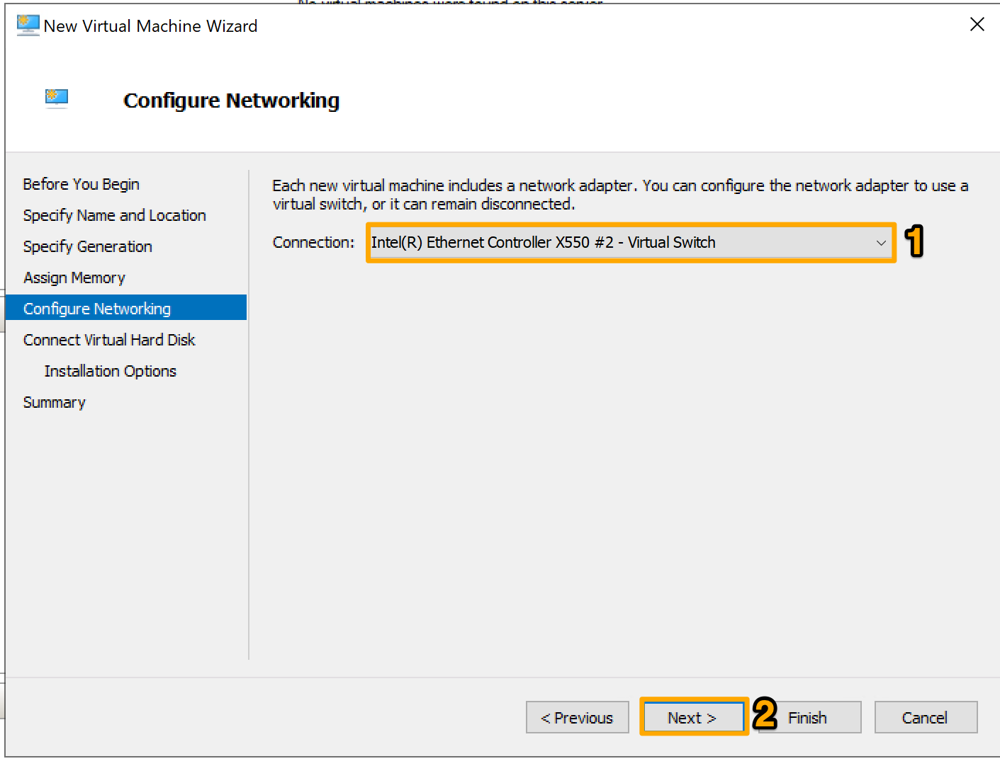

> [!primary]
> Esta traducción ha sido generada de forma automática por nuestro partner SYSTRAN. En algunos casos puede contener términos imprecisos, como en las etiquetas de los botones o los detalles técnicos. En caso de duda, le recomendamos que consulte la versión inglesa o francesa de la guía. Si quiere ayudarnos a mejorar esta traducción, por favor, utilice el botón «Contribuir» de esta página.
> 

**Última actualización: 26/04/2021**

## Objetivo

Siga el proceso de instalación de Hyper-V, asocie un switch virtual y configure una máquina virtual para funcionar con las Additional IP en un vRack.

**Esta guía explica cómo configurar una máquina virtual con Additional IP e Hyper-V en un vRack.**

## Requisitos

- Un servidor dedicado (compatible con el [vRack](https://www.ovh.es/soluciones/vrack/)) en el que está instalado Windows Server
- Una imagen ISO para el sistema operativo que se instalará en su máquina virtual (CentOS 7 se utilizará como ejemplo en esta guía)
- Un vRack incluido en su cuenta de OVHcloud
- Un bloque IP de 4 o más direcciones IP
- Estar conectado al [área de cliente de OVHcloud](https://www.ovh.com/auth/?action=gotomanager&from=https://www.ovh.es/&ovhSubsidiary=es).

> [!warning]
> Esta funcionalidad puede no estar disponible o estar limitada en los [servidores dedicados **Eco**](https://eco.ovhcloud.com/es-es/about/).
>
> Para más información, consulte nuestra [comparativa](https://eco.ovhcloud.com/es-es/compare/).

## Procedimiento

Esta guía asume que ya tiene Windows Server, que está conectado a través del escritorio remoto y que ya ha asignado su servidor dedicado y su bloque IP a un vRack. Para más información sobre estos pasos, consulte los pasos 1 a 4 de nuestra guía: [Configurar varios servidores dedicados en el vRack](/pages/bare_metal_cloud/dedicated_servers/vrack_configuring_on_dedicated_server).

### Instalación de Hyper-V

El primer paso es instalar Hyper-V.

En el gestor de servidores, haga clic en `Add roles and feature`{.action}

{.thumbnail}

En el Asistente, haga clic en `Next`{.action} para ir a la página siguiente.

{.thumbnail}

Compruebe que la opción "Role-Based or feature-based instalation" está seleccionada y haga clic en `Next`{.action}.

{.thumbnail}

Compruebe que la opción "Select a server from the server pool" esté seleccionada, así como el servidor en el que esté trabajando en la lista inferior. Haga clic en `Next`{.action}.

{.thumbnail}

En la lista de roles, marque "Hyper-V" y haga clic en `Next`{.action}.

{.thumbnail}

En la página siguiente ("Funcionalidades"), haga clic en `Next`{.action}.

{.thumbnail}

Identifique la conexión de red del servidor que quiera utilizar para el switch virtual.

Para identificarlo, abra un Command Prompt o PowerShell y ejecute el comando `ipconfig /all`.

En nuestro ejemplo, `Ethernet 2` es la interfaz utilizada para el vRack. Sin embargo, es posible que la tarjeta de red vRack utilice una interfaz diferente. Utilice una interfaz que no posea la dirección IP principal del servidor o que utilice una dirección IP autoasignada (169.254.x.x).

{.thumbnail}

Una vez que disponga de esta información, acceda a la ventana `Add Roles and Feature Wizard`{.action} y haga clic en `Next`{.action}.

{.thumbnail}

Seleccione el adaptador del vRack que haya indicado en el command Prompt o PowerShell y haga clic en `Next`{.action}.

{.thumbnail}

Las siguientes dos páginas le permiten elegir las opciones de migración y almacenamiento. Puede configurarlos como desee.

Una vez que haya llegado a la página de confirmación, marque la casilla "Restart the destination server automatically if required", haga clic en `Yes`{.action} y seleccione `Install`{.action}.

{.thumbnail}

Hyper-V se instalará y el servidor se reiniciará.

### Crear y configurar una máquina virtual

Una vez reiniciado el servidor, conéctese y abra el Hyper-V Manager.

Seleccione el servidor a la izquierda, haga clic en `Nueva`{.action} y seleccione "Virtual Machine".

{.thumbnail}

En "New Virtual Machine Wizard", configure la máquina virtual como desee. Para acceder al paso Configure Networking, seleccione el switch virtual. A continuación, haga clic en `Next`{.action} para continuar.

{.thumbnail}

Una vez que haya accedido al apartado "Instalación Opciones", añada la imagen ISO para el sistema operativo que vaya a instalar. Haga clic en `Next`{.action} para continuar.

{.thumbnail}

Acceda a la página "Summary", compruebe que los parámetros del switch virtual y del sistema operativo son correctos y haga clic en `Finish`{.action}.

{.thumbnail}

### Instalar el SO y configurar la IP

Inicie la máquina virtual. La instalación del sistema operativo debe iniciarse automáticamente. En caso contrario, se mostrará el siguiente mensaje de error:

> "The unsigned image's hash is not allowed (DB)"

En ese caso, debe desactivar el "Secure Boot".

Apaga la máquina virtual y haga clic en `Settings`{.action}.

{.thumbnail}

Haga clic en `Security`{.action}, desmarque "Enable Secure Boot" y, seguidamente, en `Apply`{.action}.

{.thumbnail}

Una vez finalizado, reinicie la máquina virtual.

Configure el sistema operativo como desee.

Para los parámetros de red, será necesario establecer una dirección IP estática.

En nuestro ejemplo, el bloque IP asociado al vRack es 192.xxx.xxx.80/29. Aquí está la distribución del bloque:

 
192.xxx.xxx.80 - Dirección de red (reservado - No utilizable) 
192.xxx.xxx.81 - Primera dirección IP utilizable 
192.xxx.xxx.82 
192.xxx.xxx.83 
192.xxx.xxx.84 
192.xxx.xxx.85 - Última dirección IP utilizable 
192.xxx.xxx.86 - Puerta de enlace por defecto (reservada - no utilizable) 
192.xxx.xxx.87 - Dirección de broadcast (Reservado - No utilizable) 
 

Utilizaremos 192.xxx.xxx.81 en nuestro ejemplo. La configuración debe tener el siguiente formato:

 
Address: 192.168.xxx.81 
Subnet Mask: 255.255.255.248 
Gateway: 192.xxx.xxx.86 
DNS: 213.186.33.99 (Puede poner otro DNS si lo desea) 
 

Una vez instalado el sistema operativo, Ya debería estar conectado.

En el ejemplo que se muestra a continuación se muestra cómo debe aparecer el archivo `ifcfg-eth0`.

{.thumbnail}

## Más información

Interactúe con nuestra comunidad de usuarios en <https://community.ovh.com/en/>.
