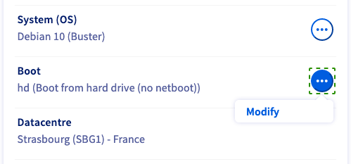

> [!primary]
> Esta traducción ha sido generada de forma automática por nuestro partner SYSTRAN. En algunos casos puede contener términos imprecisos, como en las etiquetas de los botones o los detalles técnicos. En caso de duda, le recomendamos que consulte la versión inglesa o francesa de la guía. Si quiere ayudarnos a mejorar esta traducción, por favor, utilice el botón «Contribuir» de esta página.
> 

## Objetivo

El RAID (Redundant Array of Independent Disks) es un conjunto de técnicas que mitigan la pérdida de datos en un servidor, replicando la información en varios discos.

El nivel de RAID por defecto de los servidores de OVHcloud es el RAID 1. duplica el volumen de los datos, reduciendo así el espacio disponible.

**Esta guía explica cómo configurar los discos del servidor en RAID 0 para aprovechar al máximo el espacio útil.**

> [!warning]
> 
> Tenga en cuenta: RAID 0 no proporciona **tolerancia a fallos** ni **redundancia de datos**, lo que hace muy probable la pérdida de datos en caso de fallo del disco.
>

## Requisitos

- Tener un [servidor dedicado](https://www.ovhcloud.com/es/bare-metal/) con RAID por hardware.
- Tener acceso al servidor por SSH como administrador (root).

## Procedimiento

### Utilizar el área de cliente de OVHcloud

En el [Panel de configuración de OVHcloud](https://ca.ovh.com/auth/?action=gotomanager&from=https://www.ovh.com/world/&ovhSubsidiary=ws), seleccione el servidor en la sección `Barra Metal Cloud`{.action} y seleccione `servidores dedicados`{.action}. 

Busque "Último sistema operativo (SO) instalado por OVHcloud" en la zona `Información general`{.action} y haga clic en `...`{.action} y, seguidamente, en `Instalar`{.action} para instalar un nuevo sistema operativo con su configuración RAID 0 personalizada.

Seleccione **Instalar desde una plantilla de OVHcloud** y haga clic en `Siguiente`{.action}.

{.thumbnail}

Seleccione el sistema operativo que quiera instalar y haga clic en `Siguiente`{.action}.

Marque las casillas **Personalizar la configuración del RAID** de hardware y **Personalizar la configuración de las particiones**. Haga clic en `Siguiente`{.action}.

{.thumbnail}

Seleccione "RAID0" en la lista desplegable y haga clic en `Siguiente`{.action}.

{.thumbnail}

Configure las particiones según sus necesidades y haga clic en `Siguiente`{.action}.

{.thumbnail}

Por último, haga clic en `Confirmar`{.action}.

{.thumbnail}

Una vez que haya configurado el servidor, compruebe el tamaño de las particiones conectándose a él por SSH y ejecutando el siguiente comando:

```sh
df -h
```

### Utilizar el modo de rescate

En el [Panel de configuración de OVHcloud](https://ca.ovh.com/auth/?action=gotomanager&from=https://www.ovh.com/world/&ovhSubsidiary=ws), seleccione el servidor en la sección `Barra Metal Cloud`{.action} y seleccione `servidores dedicados`{.action}.

Busque "Boot" en la zona **Información general** y haga clic en `...`{.action} y luego en `Editar`{.action} para cambiar el sistema de arranque.

{.thumbnail}

A continuación, seleccione `Arrancar en modo rescue`{.action} y elija `rescue-customer`{.action} en la lista desplegable.

En el campo "Recibir las claves del modo en la dirección de correo electrónico:", introduzca otra dirección de correo electrónico si no desea que se envíen las claves de acceso a la dirección principal de su cuenta de OVHcloud.

{.thumbnail}

Haga clic en `Siguiente`{.action} y, seguidamente, en `Confirmar`{.action}.

{.thumbnail}

Una vez que haya realizado los cambios, haga clic en `...`{.action} a la derecha de "Estado" en el cuadro titulado **Estado de los servicios.** 

Haga clic en el botón `Reiniciar`{.action} y el servidor se reiniciará en modo de rescate. Esta operación puede tardar unos minutos. 

{.thumbnail}

Cuando reinicie el servidor, conéctese a este último por SSH utilizando las claves del modo de rescate. Estos se le han enviado a la dirección de correo electrónico principal de la cuenta o, en su caso, a la dirección de correo electrónico que se le ha proporcionado anteriormente.

En la línea de comandos, escriba los siguientes comandos para eliminar los parámetros RAID existentes. Todos los datos del RAID se eliminarán:

```sh
MegaCli -CfgLdDel -L0 -a0
MegaCli -CfgLdDel -Lall -aAll
```

Introduzca el siguiente comando para obtener las claves de ubicación de los discos:

```sh
MegaCli -PdList -ALL | egrep "Slot|Device ID"
```

Introduzca los siguientes comandos para configurar el RAID 0:

```sh
MegaCli -CfgLDAdd -R0[252:0,252:1] -a0
```

En este ejemplo, 252 es el identificador del adaptador del disco.

Una vez que haya establecido el nuevo nivel de RAID, puede comprobar los parámetros utilizando el siguiente comando:

```sh
MegaCli -LDInfo -Lall -a0 | grep -i size
```

## Más información

[Sustituir en caliente un disco en un servidor con RAID por hardware](/pages/bare_metal_cloud/dedicated_servers/hotswap_raid_hard)

[Sustituir en caliente un disco en un servidor con RAID por software](/pages/bare_metal_cloud/dedicated_servers/hotswap_raid_soft)

[Gestión del RAID por hardware](/pages/bare_metal_cloud/dedicated_servers/raid_hard)

Interactúe con nuestra comunidad de usuarios en <https://community.ovh.com/en/>.