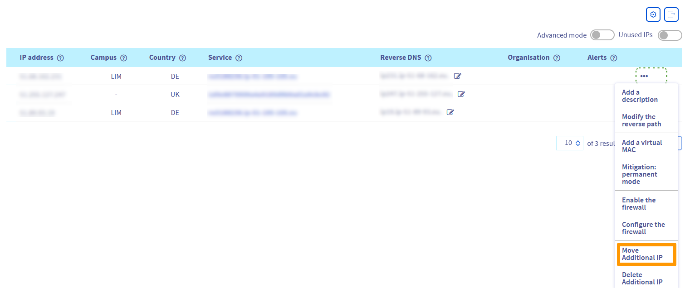
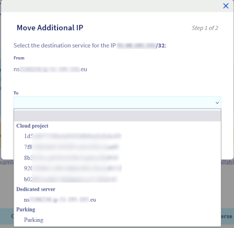

> [!primary]
> Diese Übersetzung wurde durch unseren Partner SYSTRAN automatisch erstellt. In manchen Fällen können ungenaue Formulierungen verwendet worden sein, z.B. bei der Beschriftung von Schaltflächen oder technischen Details. Bitte ziehen Sie im Zweifelsfall die englische oder französische Fassung der Anleitung zu Rate. Möchten Sie mithelfen, diese Übersetzung zu verbessern? Dann nutzen Sie dazu bitte den Button "Beitragen" auf dieser Seite.
>

> [!primary]
>
> Seit dem 6. Oktober 2022 heißt unser Dienst "Failover-IP" nun [Additional IP](https://www.ovhcloud.com/de/network/additional-ip/). Die Namensänderung hat keine Auswirkungen auf dessen technische Funktionen.
>

## Ziel

Additional IP-Adressen können zwischen den von Ihnen verwendeten Diensten verschoben werden. Dies bietet einen Vorteil, da Sie Ihre IP-Reputation und SEO beibehalten und die Kontinuität des Dienstes Ihrer Anwendungen und Systeme verbessern können.

Mit dieser Technologie können Sie IP-Adressen von einem Dienst zum anderen in weniger als einer Minute austauschen, praktisch ohne Unterbrechung für Ihre Nutzer. Dies ist nützlich für Service-Migrationen (z.B. Verschieben von Projekten von der Entwicklung in die Produktion) oder beim Wechsel zu einem Sicherungsserver während eines technischen Problems.

> [!primary]
> Eine Additional IP kann nicht von einer Zone zur anderen umgezogen werden. So kann beispielsweise eine IP im Rechenzentrum SBG nach GRA oder RBX umgezogen werden, aber nicht nach BHS.
>
> Migration funktioniert nur für ganze Blöcke. Es ist nicht möglich, einzelne IPs innerhalb eines Blocks zu migrieren.

**Diese Anleitung erklärt, wie Sie eine Additional IP über Ihr OVHcloud Kundencenter oder die OVHcloud API umziehen.**

## Voraussetzungen

- Sie haben einen [Dedicated Server](https://www.ovhcloud.com/de/bare-metal/) in Ihrem Kunden-Account.
- Sie verfügen über eine [Additional IP](https://www.ovhcloud.com/de/bare-metal/ip/).
- Sie haben Zugriff auf Ihr [OVHcloud Kundencenter](https://www.ovh.com/auth/?action=gotomanager&from=https://www.ovh.de/&ovhSubsidiary=de).

> [!warning]
> Diese Funktion kann nur eingeschränkt oder nicht verfügbar sein, falls ein Dedicated Server der [**Eco** Produktlinie](https://eco.ovhcloud.com/de/about/) eingesetzt wird.
>
> Weitere Informationen finden Sie auf der [Vergleichsseite](https://eco.ovhcloud.com/de/compare/).
>

> [!warning]
> Wenn die Additional IP oder eine der IP-Adressen des Blocks eine virtuelle MAC-Adresse hat, muss der Zielserver die vMAC-Funktionalität unterstützen.
> Weitere Informationen finden Sie in [dieser Anleitung](/pages/bare_metal_cloud/dedicated_servers/network_support_virtual_mac).
>
> Andernfalls müssen die vMACs vor dem Transfer von den Additional IPs entfernt werden.

## In der praktischen Anwendung

> [!primary]
> Wenn ein IP-Block mit eindeutigen virtuellen MAC-Adressen zwischen zwei Servern verschoben wird, werden diese Adressen vorübergehend ausgesetzt. Sie werden auf dem neuen Server angezeigt, sobald der Umzug abgeschlossen ist.
>
> Auf der anderen Seite können Blöcke mit doppelten virtuellen MAC-Adressen nicht verschoben werden. Sie müssen zuerst die mehrfach verwendeten virtuellen MAC-Adressen des zu verschiebenden Blocks löschen.
>
> Wenn ein IP-Block in das vRack verschoben/hinzugefügt wird, ist er nicht mehr an einen physischen Server gebunden. In diesem Fall geht jede virtuelle MAC-Adresse bei der Übertragung verloren.
>

### Eine IP über das OVHcloud Kundencenter umziehen

> [!warning]
> Nur ein Block mit einer einzigen Adresse (/32) kann von einem dedizierten Server auf einen VPS verschoben werden.
>

Loggen Sie sich in Ihr [OVHcloud Kundencenter](https://www.ovh.com/auth/?action=gotomanager&from=https://www.ovh.de/&ovhSubsidiary=de) ein, gehen Sie in den Bereich `Bare Metal Cloud`{.action} und öffnen Sie `IP`{.action}.

Klicken Sie auf den Tab `Additional IP`{.action}.

{.thumbnail}

Klicken Sie auf `...`{.action} rechts neben der umzuziehenden IP-Adresse und dann auf `Verschieben Additional IP`{.action}.

{.thumbnail}

Wählen Sie im angezeigten Kontextmenü den Dienst aus, auf den die IP-Adresse umgezogen werden soll.

Klicken Sie auf `Weiter`{.action} und dann auf `Bestätigen`{.action}.

{.thumbnail}

### Eine IP über die API umziehen

Loggen Sie sich auf der [Webseite der OVHcloud API](https://api.ovh.com/) ein.

Es ist am besten, zunächst zu prüfen, ob die IP-Adresse umgezogen werden kann.
 Um zu überprüfen, ob die IP auf einen Ihrer Dedicated Server umgezogen werden kann, verwenden Sie folgenden Aufruf:

> [!api]
>
> @api {GET} /dedicated/server/{serviceName}/ipCanBeMovedTo
>

- `serviceName`: die Referenz des Zielservers
- `ip`: die umzuziehende Additional IP

Um die IP-Adresse umzuziehen, verwenden Sie folgenden Call:

> [!api]
>
> @api {POST} /dedicated/server/{serviceName}/ipMove
>

- `serviceName`: die Referenz des Zielservers
- `ip`: die umzuziehende Additional IP

## Weiterführende Informationen

Für den Austausch mit unserer User Community gehen Sie auf <https://community.ovh.com/en/>.