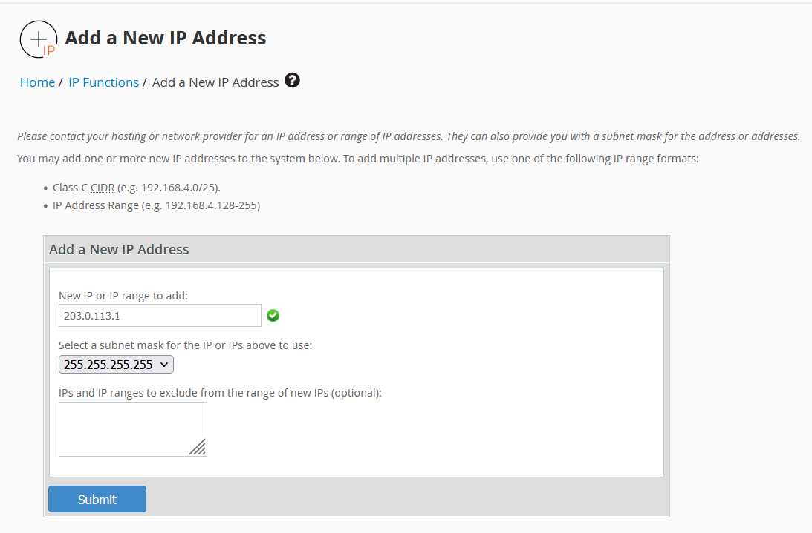
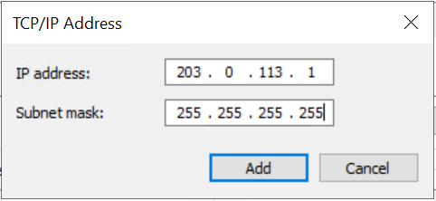
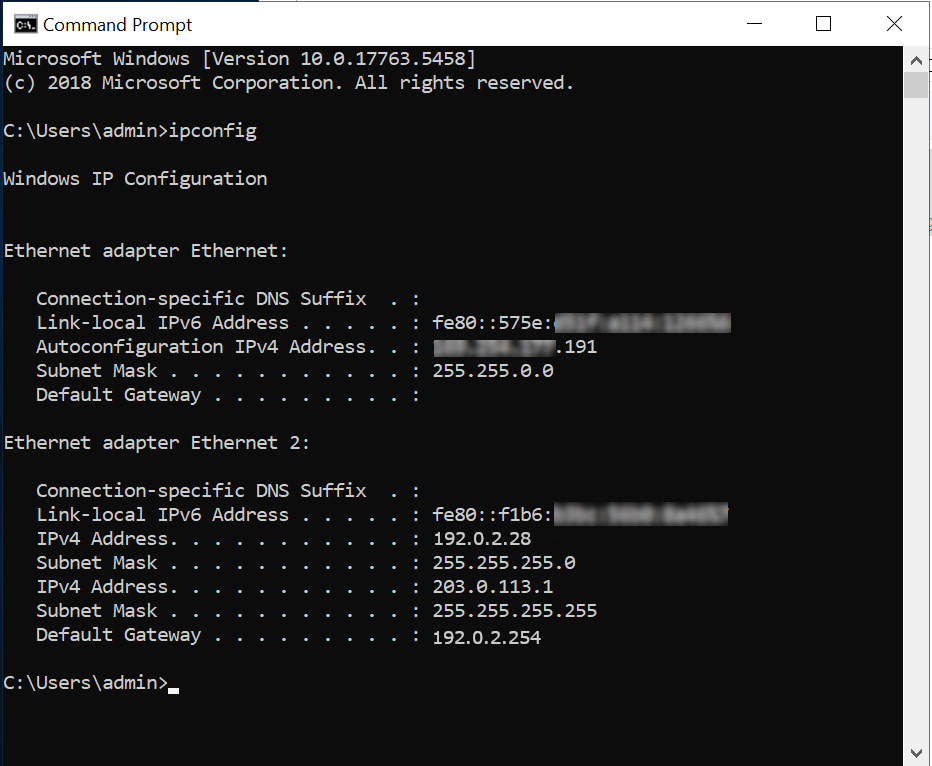
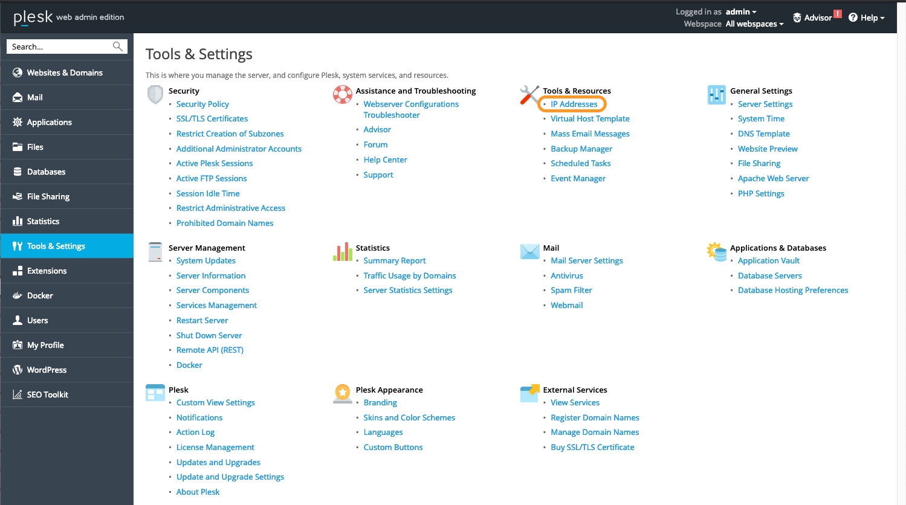
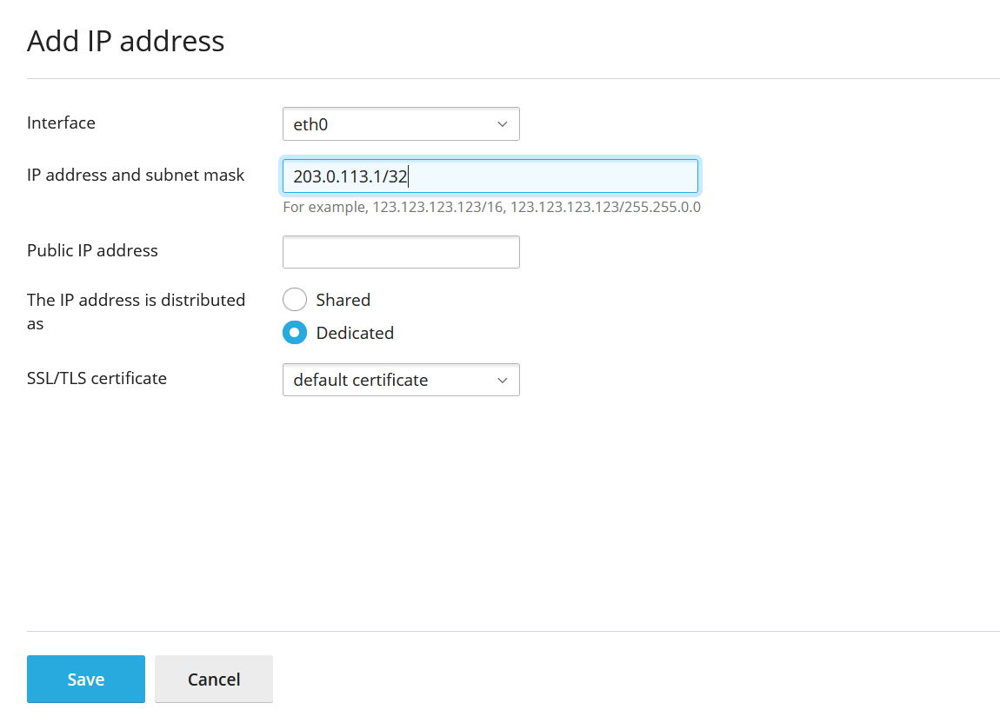

> [!primary]
> Esta traducción ha sido generada de forma automática por nuestro partner SYSTRAN. En algunos casos puede contener términos imprecisos, como en las etiquetas de los botones o los detalles técnicos. En caso de duda, le recomendamos que consulte la versión inglesa o francesa de la guía. Si quiere ayudarnos a mejorar esta traducción, por favor, utilice el botón «Contribuir» de esta página.
>

> [!primary]
>
> Desde el 6 de octubre de 2022, nuestra solución "Failover IP" se denomina desde ahora [Additional IP](https://www.ovhcloud.com/es-es/network/additional-ip/). Esto no afectará a sus funcionalidades.
>

## Objetivo

El alias de IP (*IP aliasing* en inglés) es una configuración especial de la red de un servidor que permite asociar varias direcciones IP a una única interfaz de red.

**Esta guía explica cómo realizar la operación.**

## Requisitos

- Tener un servidor [servidor dedicado](https://www.ovhcloud.com/es-es/bare-metal/){.external}
- Tener una o más direcciones [Additional IP](https://www.ovhcloud.com/es-es/bare-metal/ip/){.external}.
- Estar conectado al servidor por SSH (acceso *sudo*).

> [!warning]
> Esta funcionalidad puede no estar disponible o estar limitada en los [servidores dedicados **Eco**](https://eco.ovhcloud.com/es-es/about/).
>
> Para más información, consulte nuestra [comparativa](https://eco.ovhcloud.com/es-es/compare/).

## Procedimiento

Las siguientes secciones contienen las configuraciones de distribuciones que ofrecemos actualmente y los sistemas operativos y distribuciones más utilizados. En primer lugar, conéctese al servidor por SSH o mediante una sesión de conexión GUI (RDP para un servidor Windows).

> [!primary]
>
> Si desea utilizar una distribución reciente, es posible que tenga que realizar ajustes en el procedimiento adecuado para configurar la interfaz de red. Si necesita ayuda, consulte la documentación del sistema operativo.

**Tenga en cuenta la siguiente terminología, que se utilizará en los ejemplos de código y en las instrucciones de las secciones de la guía:**

|Término|Descripción|Ejemplos|
|---|---|---|
|ADDITIONAL_IP|Dirección IP adicional asignada al servicio|203.0.113.1|
|NETWORK_INTERFACE|Nombre de la interfaz de red|*eth0*, *ens3*|
|ID|ID del alias IP, que empieza por *0* (en función del número de IP adicionales que deba configurar)|*0*, *1*|

En los ejemplos siguientes utilizaremos el editor de texto `nano`. En algunos sistemas operativos, es necesario instalarlo antes de utilizarlo. En ese caso, se le pedirá que lo haga. Por supuesto, puede utilizar el editor de texto que prefiera.

### Debian 10/11

Por defecto, el fichero de configuración se encuentra en `/etc/network/interfaces.d/`. Se recomienda realizar una copia de seguridad del archivo de configuración correspondiente.

#### 1. Crear una copia de seguridad del archivo de configuración

En nuestro ejemplo, nuestro archivo se llama `50-cloud-init`, por lo que copiamos el archivo `50-cloud-init` utilizando el siguiente comando:

```sh
sudo cp /etc/network/interfaces.d/50-cloud-init /etc/network/interfaces.d/50-cloud-init.bak
```

Si comete algún error, puede volver atrás con los siguientes comandos:

```sh
sudo rm -f /etc/network/interfaces.d/50-cloud-init
sudo cp /etc/network/interfaces.d/50-cloud-init.bak /etc/network/interfaces.d/50-cloud-init
```

#### 2. Editar el archivo de configuración

> [!primary]
>
> Los nombres de las interfaces de red de esta guía pueden ser diferentes de los suyos. Por favor, adapte las operaciones en consecuencia.

Ya puede editar el archivo.

```sh
sudo nano /etc/network/interfaces.d/50-cloud-init
```

A continuación, debe agregar una interfaz virtual o un alias Ethernet. En nuestro ejemplo, nuestra interfaz se llama `eth0`, por lo que nuestro alias es `eth0:0`. Haga esto para cada dirección Additional IP que quiera configurar.

No modifique las líneas existentes en el archivo de configuración, simplemente añada su Additional IP al archivo como se indica a continuación, sustituyendo `ADDITIONAL_IP/32` y la interfaz virtual (si su servidor no utiliza **eth0:0**) por sus propios valores:

```console
auto eth0:0
iface eth0:0 inet static
address ADDITIONAL_IP
netmask 255.255.255.255
```

También puede configurar su Additional IP añadiendo las siguientes líneas al fichero de configuración:

```console
post-up /sbin/ifconfig eth0:0 ADDITIONAL_IP netmask 255.255.255.255 broadcast ADDITIONAL_IP
pre-down /sbin/ifconfig eth0:0 down
```

Con la configuración anterior, la interfaz virtual se activa o desactiva cada vez que la interfaz «eth0» se activa o desactiva.

Si tiene que configurar dos direcciones Additional IP, el archivo `/etc/network/interfaces.d/50-cloud-init` debe tener el siguiente aspecto:

```console
auto eth0
iface eth0 inet dhcp

auto eth0:0
iface eth0:0 inet static
address ADDITIONAL_IP1
netmask 255.255.255.255

auto eth0:1
iface eth0:1 inet static
address ADDITIONAL_IP2
netmask 255.255.255.255
```

O como esto:

```console
auto eth0
iface eth0 inet dhcp

# IP 1
post-up /sbin/ifconfig eth0:0 ADDITIONAL_IP1 netmask 255.255.255.255 broadcast ADDITIONAL_IP1
pre-down /sbin/ifconfig eth0:0 down

# IP 2
post-up /sbin/ifconfig eth0:1 ADDITIONAL_IP2 netmask 255.255.255.255 broadcast ADDITIONAL_IP2
pre-down /sbin/ifconfig eth0:1 down
```

**Ejemplo**

```console
auto eth0
iface eth0 inet dhcp

auto eth0:0
iface eth0:0 inet static
address 203.0.113.1
netmask 255.255.255.255
```

O bien:

```console
auto eth0
iface eth0 inet dhcp

# IP 1
post-up /sbin/ifconfig eth0:0 203.0.113.1 netmask 255.255.255.255 broadcast 203.0.113.1
pre-down /sbin/ifconfig eth0:0 down
```

#### 3. Reiniciar la interfaz

Por último, reinicie la interfaz con el siguiente comando:

```sh
sudo /etc/init.d/networking restart
```

### Fedora 36 y versiones posteriores

Fedora ahora utiliza archivos clave (*keyfiles*).
Fedora solía utilizar perfiles de red almacenados por NetworkManager en formato ifcfg en el directorio `/etc/sysconfig/network-scripts/`.<br>
Como el ifcfg ya no está actualizado, NetworkManager ya no crea nuevos perfiles en este formato de forma predeterminada. El archivo de configuración se encuentra ahora en `/etc/NetworkManager/system-connections/`.

#### 1. Crear una copia de seguridad del archivo de configuración

> [!primary]
>
> Tenga en cuenta que el nombre del archivo de red en nuestro ejemplo puede ser diferente del suyo. Por favor, ajuste los ejemplos con el nombre correcto.
>

Se recomienda realizar una copia de seguridad del archivo de configuración correspondiente. En nuestro ejemplo, nuestro archivo de configuración se llama `cloud-init-eno1.nmconnection`:

```sh
sudo cp -r /etc/NetworkManager/system-connections/cloud-init-eno1.nmconnection /etc/NetworkManager/system-connections/cloud-init-eno1.nmconnection.bak
```

Si comete algún error, puede volver atrás con los siguientes comandos:

```sh
sudo rm -f /etc/NetworkManager/system-connections/cloud-init-eno1.nmconnection
sudo cp /etc/NetworkManager/system-connections/cloud-init-eno1.nmconnection.bak /etc/NetworkManager/system-connections/cloud-init-eno1.nmconnection
```

#### 2. Editar el archivo de configuración

> [!primary]
> Tenga en cuenta que el nombre del archivo de red en nuestro ejemplo puede ser diferente del suyo. Adapte los comandos a su nombre de archivo.
>

Para obtener el nombre de la interfaz de red y editar el archivo de red adecuado, ejecute uno de los siguientes comandos:

```sh
ip a
```

```sh
nmcli connection show
```

No modifique las líneas existentes en el fichero de configuración, añada su Additional IP en el fichero como sigue, sustituyendo `ADDITIONAL_IP/32` por sus propios valores:

```sh
sudo nano /etc/NetworkManager/system-connections/cloud-init-eno1.nmconnection
```

```console
[IPv4]
method=auto
may-fail=false
address1=ADDITIONAL_IP/32
```

Si tiene dos direcciones Additional IP que configurar, la configuración debería ser similar a la siguiente:

```console
[IPv4]
method=auto
may-fail=false
address1=ADDITIONAL_IP1/32
address2=ADDITIONAL_IP2/32
```

**Ejemplo**

```console
[IPv4]
method=auto
may-fail=false
address1=203.0.113.1/32
```

#### 3. Reiniciar la interfaz

A continuación, reinicie la interfaz:

```sh
sudo systemctl restart NetworkManager
```

### Debian 12, Ubuntu 20.04 y versiones posteriores

Por defecto, los ficheros de configuración se encuentran en el directorio `/etc/netplan`.

El mejor enfoque consiste en crear un archivo de configuración independiente para configurar las direcciones Additional IP. Esto facilita el retroceso en caso de error.

#### 1. Determinar la interfaz

```sh
ip a
```

Anote el nombre de la interfaz (la interfaz en la que está configurada la dirección IP principal del servidor).

#### 2. Crear el archivo de configuración

A continuación, cree un archivo de configuración con la extensión `.yaml`. En nuestro ejemplo, nuestro archivo se llama `51-cloud-init.yaml`

```sh
sudo nano /etc/netplan/51-cloud-init.yaml
```

A continuación, edite el fichero con el siguiente contenido, sustituyendo `INTERFACE_NAME` y `ADDITIONAL_IP` por sus propios valores:

```yaml
network:
   version: 2
   renderer: networkd
   ethernets:
       INTERFACE_NAME:
           dhcp4: true
           addresses:
           - ADDITIONAL_IP1/32
```

Si tiene dos direcciones Additional IP que configurar, el archivo de configuración debería tener el siguiente aspecto:

```yaml
network:
   version: 2
   renderer: networkd
   ethernets:
       INTERFACE_NAME:
           dhcp4: true
           addresses:
           - ADDITIONAL_IP1/32
           - ADDITIONAL_IP2/32
```

> [!warning]
>
> Es importante mantener la alineación de cada elemento de este archivo, como se muestra en el ejemplo anterior. No utilice el tabulador para crear el espacio. Sólo es necesaria la tecla de espacio.
>

**Ejemplo**

```yaml
network:
   version: 2
   renderer: networkd
   ethernets:
       eth0:
           dhcp4: true
           addresses:
           - 203.0.113.1/32         
```

Guarde y cierre el archivo. Puede probar la configuración con el siguiente comando:

```sh
sudo netplan try
```

#### 3. Aplicar la configuración

Por último, reinicie la interfaz con el siguiente comando:

```sh
sudo netplan apply
```

> [!primary]
> Al utilizar el comando `netplan try`, es posible que el sistema envíe un mensaje de advertencia como `Permissions for /etc/netplan/xx-cloud-init.yaml are too open. Netplan configuration should NOT be accessible by others`. Simplemente significa que el archivo no tiene permisos restrictivos. Esto no afecta a la configuración de su Additional IP. Para obtener más información sobre los permisos de archivo, consulte la [documentación oficial de ubuntu](https://help.ubuntu.com/community/FilePermissions){.external}.
>

### CentOS, AlmaLinux (8 & 9), Rocky Linux (8 & 9)

El archivo de configuración principal se encuentra en `/etc/sysconfig/network-scripts/`. En nuestro ejemplo, se denomina `ifcfg-eth0`. Antes de realizar cualquier cambio, compruebe el nombre de archivo real en esta carpeta.

Para cada Additional IP que vaya a configurar, crearemos un fichero de configuración independiente con los siguientes parámetros: `ifcfg-NETWORK_INTERFACE:ID`. Donde `NETWORK_INTERFACE` representa la interfaz física y `ID` es la interfaz de red virtual o el alias ethernet que empieza por un valor de 0. Por ejemplo, para nuestra interfaz llamada `eth0`, el primer alias es `eth0:0`, el segundo alias es `eth0:1`, etc...

#### 1. Crear una copia de seguridad del archivo de configuración

```sh
ip a
```

Anote el nombre de la interfaz (el nombre en el que está configurada la dirección IP principal del servidor).

#### 2. Crear el archivo de configuración

En primer lugar, cree el archivo de configuración. Sustituya `NETWORK_INTERFACE:ID` por sus propios valores.

```sh
sudo nano /etc/sysconfig/network-scripts/ifcfg-NETWORK_INTERFACE:ID
```

A continuación, edite el archivo con el siguiente contenido, sustituyendo `NETWORK_INTERFACE:ID` y `ADDITIONAL_IP` por sus propios valores:

```console
DEVICE=NETWORK_INTERFACE:ID
ONBOOT=yes
BOOTPROTO=none # For CentOS use "static"
IPADDR=ADDITIONAL_IP
NETMASK=255.255.255.255
BROADCAST=ADDITIONAL_IP
```

**Ejemplo**

```console
DEVICE=eth0:0
ONBOOT=yes
BOOTPROTO=none # For CentOS use "static"
IPADDR=203.0.113.1
NETMASK=255.255.255.255
BROADCAST=203.0.113.1
```

#### 3. Reinicio de la interfaz alias

A continuación, reinicie la interfaz alias. Sustituya `eth0:0` por sus propios valores:

```sh
ifup eth0:0
```

#### Para AlmaLinux y Rocky Linux

```sh
sudo systemctl restart NetworkManager
```

### cPanel

#### 1. Acceder a la sección Gestión IP de WHM

En el área de cliente WHM, haga clic en `IP Functions`{.action} y seleccione `Add a New IP Address`{.action} en el menú de la izquierda.

{.thumbnail}

#### 2. Añadir la información de las Direcciones IP

Introduzca su dirección IP adicional como "xxx.xxx.xxx.xxx" en el campo "New IP or IP range to add".

Seleccione `255.255.255.255` como máscara de subred y haga clic en `Submit`{.action}.

{.thumbnail}

> [!warning]
>
> Atención: Si tiene varias IP que configurar en un mismo bloque y las añade todas al mismo tiempo, el sistema WHM le obligará a utilizar la máscara de subred `255.255.255.0`. No es recomendable utilizar esta configuración. Es necesario añadir cada IP individualmente para poder utilizar la máscara de subred adecuada `255.255.255.255`.
>

#### 3. Comprobar la configuración IP actual

En la sección `IP Functions`{.action}, haga clic en `Show or Delete Current IP Addresses`{.action} para comprobar que la dirección Aditional IP se ha añadido correctamente.

{.thumbnail}

### Windows Server

Los servidores Windows suelen usar DHCP para la configuración de red. Si ya ha configurado una Additional IP, o si ha cambiado su configuración a IP fija, vaya directamente al siguiente paso.

De lo contrario, debe cambiar primero la configuración de red de DHCP a configuración de IP fija.

Abra la consola de comandos **CMD** o **PowerShell** e introduzca el siguiente comando:

```powershell
ipconfig
```

La respuesta tendrá el formato de la imagen:

{.thumbnail}

En ella puede consultar su IPv4, la máscara de subred, la puerta de enlace predeterminada y el nombre de la tarjeta de red.

En nuestro ejemplo, la dirección IP del servidor es **192.0.2.28**.

Los siguientes pasos pueden realizarse, bien mediante línea comandos, o bien a través de la interfaz gráfica.

#### Mediante línea de comandos (recomendado)

En los comandos indicados más abajo, sustituya los siguientes valores:

|Comando|Valor|
|---|---|
|NETWORK_ADAPTER| Nombre de la tarjeta de red (en el ejemplo,  «Ethernet 2»)|
|IP_ADDRESS| Dirección IP del servidor (en el ejemplo, 192.0.2.28)|
|SUBNET_MASK| Máscara de subred (en el ejemplo, 255.255.255.0)|
|GATEWAY| Puerta de enlace predeterminada (en el ejemplo, 192.0.2.254)|
|ADDITIONAL_IP| Dirección Additional IP que quiera añadir|

> [!warning]
>
> Atención: Si introduce información incorrecta, no será posible acceder al servidor. En ese caso, deberá realizar las correcciones oportunas en modo WinRescue o a través del IPMI.
> 

Realice las acciones que se indican a continuación en la consola de comandos.

Cambie a IP fija.

```powershell
netsh interface ipv4 set address name="NETWORK_ADAPTER" static IP_ADDRESS SUBNET_MASK GATEWAY
```
 
Indique el servidor DNS.

```powershell
netsh interface ipv4 set dns name="NETWORK_ADAPTER" static 213.186.33.99
```

Añada una Additional IP.

```powershell
netsh interface ipv4 add address "NETWORK_ADAPTER" ADDITIONAL_IP 255.255.255.255
```

Su Additional IP ya estará activa.

#### A través de la interfaz gráfica

1. Vaya a `Start`{.action} > `Control Panel`{.action} > `Network and Internet`{.action} > `Network and Sharing Centre`{.action}. En el menú izquierdo, seleccione `Change Adapter Settings`{.action}.
2. Haga clic derecho en su conexión de red, en el ejemplo `Ethernet 2`{.action}.
3. Haga clic en `Properties`{.acción}.
4. Seleccione `Internet Protocol Version 4 (TCP/IPv4)`{.action} y, a continuación, haga clic en el botón `Properties`{.action}.
5. Marque la opción `Use the following IP address`{.action} e introduzca la IP principal del servidor, la máscara de subred y la puerta de enlace predeterminada obtenidas anteriormente con el comando `ipconfig`. En **Preferred DNS Server**, introduzca **213.186.33.99**.

{.thumbnail}

> [!warning]
>
> Atención: Si introduce información incorrecta, no será posible acceder al servidor. En ese caso, deberá realizar las correcciones oportunas en modo [WinRescue](/pages/bare_metal_cloud/dedicated_servers/rescue_mode#windows) o a través del [IPMI](/pages/bare_metal_cloud/dedicated_servers/using_ipmi_on_dedicated_servers).
> 

A continuación, haga clic en `Advanced`{.action} (todavía en las `TCP/IP Settings`{.action}).

{.thumbnail}

En la sección **IP Address**, haga clic en `Add`{.action}.

{.thumbnail}

Introduzca ahí su Additional IP y la máscara de subred **255.255.255.255**. Haga clic en `Add`{.action}.

{.thumbnail}

Haga clic en `OK`{.action} para validar la configuración.

Su Additional IP ya está operativa. Para comprobar la configuración, ejecute el siguiente comando:

```powershell
ipconfig
```

Esto le dará un resultado similar al siguiente ejemplo:

{.thumbnail}

### Plesk

#### 1. Acceder a la gestión de IP de Plesk

En el panel de configuración de Plesk, seleccione `Tools & Settings`{.action} en la columna izquierda.

{.thumbnail}

Haga clic en `IP Addresses`{.action} bajo **Tools & Settings**.

#### 2. Añadir la información IP adicional

En esta sección, haga clic en el botón `Add IP Address`{.action}.

{.thumbnail}

Introduzca su dirección Additional IP como `xxx.xxx.xxx.xxx/32` en el campo "IP address and subnet mask" y haga clic en `OK`{.action}.

{.thumbnail}

#### Paso 3: comprobar la configuración IP actual

En la sección "Direcciones IP", compruebe que la dirección Additional IP se haya añadido correctamente.

{.thumbnail}

#### Resolución de fallos

Si no consigue establecer una conexión entre la red pública y su alias IP y si tiene algún problema de red, reinicie el servidor en [modo de rescate](/pages/bare_metal_cloud/dedicated_servers/rescue_mode) y configure el alias directamente en el servidor.

Para ello, una vez que haya reiniciado el servidor en modo de rescate, ejecute el siguiente comando:

```bash
ifconfig eth0:0 ADDITIONAL_IP netmask 255.255.255.255 broadcast ADDITIONAL_IP up
```

Donde podrá sustituir "ADDITIONAL_IP" por la auténtica Additional IP.

A continuación, solo tiene que hacer ping desde su Additional IP hacia el exterior. Si funciona, es probable que haya un error de configuración que deba corregirse. Si, por el contrario, la dirección IP sigue sin funcionar, abra un tíquet con el equipo de soporte a través del [Centro de ayuda de OVHcloud](https://help.ovhcloud.com/csm?id=csm_get_help){.external} y especifique lo siguiente:

- El nombre y la versión del sistema operativo que utiliza en su servidor.
- Nombre y directorio del archivo de configuración de red.
- El contenido de este archivo.

## Más información

[Modo Bridge IP](/pages/bare_metal_cloud/dedicated_servers/network_bridging)

Interactúe con nuestra comunidad de usuarios en <https://community.ovh.com/en/>.
