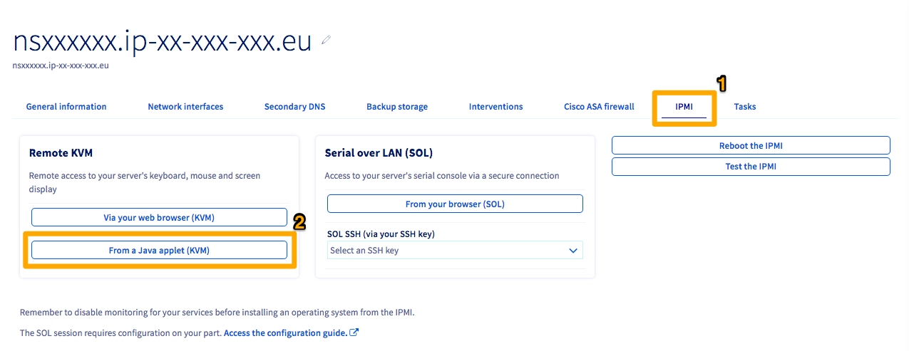

**Dernière mise à jour le 07/03/2023**

## Objectif

La technologie OVHcloud Link Aggregation (OLA) est conçue par nos équipes pour augmenter la disponibilité de votre serveur et améliorer l'efficacité de vos connexions réseau. En quelques clics, vous pouvez agréger vos cartes réseau et rendre vos liaisons réseau redondantes. Cela signifie que si une liaison tombe en panne, le trafic est automatiquement redirigé vers une autre liaison disponible.

**Découvrez comment regrouper vos NIC (Network Interface Controller) pour les utiliser avec le service OLA sur SLES 15.**

## Prérequis

- [Avoir configuré votre NIC pour la fonctionnalité OVHcloud Link Aggregation depuis l’espace client OVHcloud](/pages/bare_metal_cloud/dedicated_servers/ola-enable-manager)
- Être connecté à votre [espace client OVHcloud](https://www.ovh.com/auth/?action=gotomanager&from=https://www.ovh.com/fr/&ovhSubsidiary=fr)

## En pratique

Étant donné que nous avons une configuration privée-privée pour nos NIC sur OLA, il est impossible de se connecter en SSH au serveur. Par conséquent, vous devrez utiliser l’outil IPMI pour accéder au serveur.

Pour cela, connectez-vous à votre [espace client OVHcloud](https://www.ovh.com/auth/?action=gotomanager&from=https://www.ovh.com/fr/&ovhSubsidiary=fr) et allez dans l'onglet `Bare Metal Cloud`{.action}. Sélectionnez votre serveur dans la liste sous la rubrique `Serveurs dédiés`{.action}.

Cliquez ensuite sur l'onglet `IPMI`{.action} (1) puis sur le bouton `Depuis un applet Java (KVM)`{.action} (2).

{.thumbnail}

Un logiciel JNLP sera téléchargé. Lancez le logiciel pour accéder à l’IPMI. Connectez-vous en utilisant les informations d’identification associées au serveur.

Par défaut, en utilisant un modèle OVHcloud, les NIC seront nommés *eth1* et *eth2*. Si vous n’utilisez pas un modèle OVHcloud, vous pouvez retrouver les noms de vos interfaces en utilisant la commande suivante :

```bash
ip a
```

> [!primary]
>
> Cette commande retournera plusieurs « interfaces ». Si vous avez du mal à identifier vos NIC physiques, la première interface aura toujours l’adresse IP publique du serveur assignée par défaut.
>

Une fois les noms de vos deux NIC identifiés, il faut à présent créer le NIC bonding ou agrégation de lien sur le système d’exploitation. Pour ce faire, créez le fichier d’interfaces sur l'éditeur de texte de votre choix à l’aide de la commande suivante :

```bash
vi /etc/sysconfig/network/ifcfg-bond0
```

Cela ouvrira un fichier texte vide. Pour configurer l’interface d’agrégation, insérez les lignes suivantes dans le fichier texte :

```bash
STARTMODE='onboot'
BOOTPROTO='static'
IPADDR='10.0.0.1/24'
BONDING_MASTER='yes'
BONDING_SLAVE_0='eth1'
BONDING_SLAVE_1='eth2'
BONDING_MODULE_OPTS='mode=802.3ad miimon=100 xmit_hash_policy=layer3+4'
```

> [!primary]
>
> Vous pouvez utiliser n’importe quelle adresse IP et de sous-réseau privé souhaitées.
> Si votre serveur possède plus que 2 interfaces réseau, vous pouvez les ajouter dans la configuration en incrémentant le numéro du paramètre `BONDING_SLAVE_`, par exemple `BONDING_SLAVE_2='eth3'`.
>

Sauvegardez et quittez le fichier une fois que vous avez confirmé que l’information est correcte.  Il vous faut à présent configurer les deux interfaces physiques. Par défaut, pour un serveur OVHcloud, seul *eth1* aura un fichier de configuration. Ouvrez-le à l’aide de la commande suivante :

```bash
vi /etc/sysconfig/network/ifcfg-eth1
```

Par défaut, le fichier affichera le texte suivant :

```bash
# Created by cloud-init on instance boot automatically, do not edit.
#
BOOTPROTO=dhcp4
IPADDR6=2001:41d0:408:dd00::/56
LLADDR=10:70:fd:c5:14:00
STARTMODE=auto
```

> [!warning]
>
> Les adresses IP seront différentes pour chaque serveur.
>

Vous devez modifier ce fichier pour qu’il affiche le texte suivant :

```bash
BOOTPROTO='none'
#IPADDR6=2001:41d0:408:dd00::/56
LLADDR=10:70:fd:c5:14:00
STARTMODE='hotplug'
```

> [!primary]
>
> L’adresse matérielle (adresse MAC) du NIC peut être retrouvée à l’aide de la commande `ip a` utilisée précédemment. Ce sera le numéro à côté de `link/ether` du résultat affiché.
>

Le *#* devant une ligne indique que le serveur ignorera cette ligne lors de la lecture du fichier. Cela signifie que ces lignes ne seront pas prises en compte lors de la création du fichier d’interface pour *eth1*.

Vous devrez créer le fichier de configuration *eth2* à l’aide de la commande suivante :

```bash
vi /etc/sysconfig/network/ifcfg-eth2
```

Cette fois-ci, le fichier sera vide. Vous devrez y ajouter le contenu suivant :

```bash
BOOTPROTO='none'
STARTMODE='hotplug'
LLADDR=0c:42:a1:a7:29:c2
```

Pour finir, il faudra redémarrer le service réseau à l’aide de la commande suivante :

```bash
wicked ifreload all
```

Pour vérifier que cette agrégation fonctionne, effectuez un ping vers un autre serveur sur le même vRack. Si cela fonctionne, le processus de configuration est terminé. Si ce n’est pas le cas, vérifiez vos configurations ou essayez de redémarrer le serveur.

Vous pouvez également vérifier les paramètres utilisés par votre interface ifcfg-bond0 à l'aide de la commande suivante :

```bash
/proc/net/bonding/bond0
```

## Aller plus loin

[Configurer l’agrégation de liens OLA dans votre espace client](/pages/bare_metal_cloud/dedicated_servers/ola-enable-manager).

[Comment configurer votre NIC pour l'agrégation de liens OVHcloud sous Debian 9](/pages/bare_metal_cloud/dedicated_servers/ola-enable-debian9).

[Comment configurer votre NIC pour l'agrégation de liens OVHcloud sous CentOS 7](/pages/bare_metal_cloud/dedicated_servers/ola-enable-centos7).

[Comment configurer votre NIC pour l'agrégation de liens OVHcloud sous Windows Server 2019](/pages/bare_metal_cloud/dedicated_servers/ola-enable-w2k19).

Échangez avec notre communauté d'utilisateurs sur <https://community.ovh.com>.
