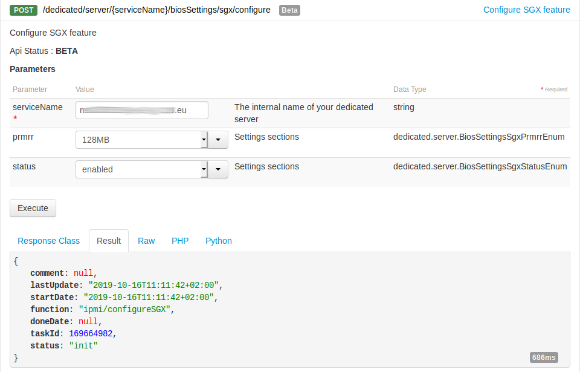
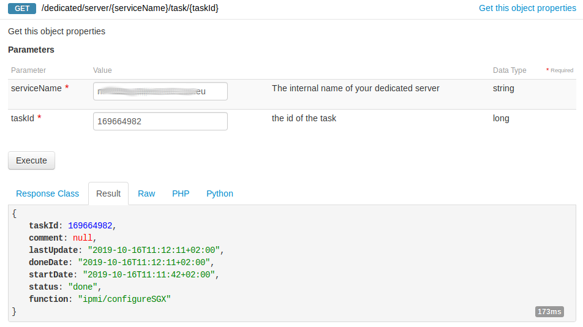

## Objective

Enabling Intel Software Guard Extensions (SGX) on your server allows you to run SGX-ready applications. Intel SGX delivers advanced hardware and RAM security encryption features, in order to isolate parts of code and data that are specific to each application.

**This guide explains how to enable the SGX feature, in the OVHcloud Control Panel or via the OVHcloud API.**

## Requirements

- a dedicated server in the [Infrastructure range](https://www.ovhcloud.com/asia/bare-metal/infra/) or [Advance range](https://www.ovhcloud.com/asia/bare-metal/advance/), with the [SGX](https://www.ovhcloud.com/asia/bare-metal/intel-software-guard-extensions/) option in your OVHcloud account
- access to the [OVHcloud Control Panel](https://ca.ovh.com/auth/?action=gotomanager&from=https://www.ovh.com/asia/&ovhSubsidiary=asia) / to the [OVHcloud API](https://ca.api.ovh.com/)
- root access via SSH on your server
- Ubuntu 18.04 or equivalent installed on the server

> [!warning]
>
> Of the Advance range, only the servers below, equipped with an Intel CPU, are compatible with Intel SGX technology:
>
> - Advance-1
> - Advance-2
> - Advance-6
> - Advance-APAC

## Instructions

### From the OVHcloud Control Panel

Log in to the [OVHcloud Control Panel](https://ca.ovh.com/auth/?action=gotomanager&from=https://www.ovh.com/asia/&ovhSubsidiary=asia), go to the `Bare Metal Cloud`{.action} section and then select the server on which you wish to enable SGX from **Dedicated Servers** in the left-hand sidebar.

#### Enabling the option

Scroll down to the "Advanced features" box and click on `...`{.action} next to "Security - Intel SGX (Software Guard Extensions)". Select `Enable SGX`{.action} from the drop-down menu.

{.thumbnail}

On the following screen, click the `Enable`{.action} button.

{.thumbnail}

You can either choose to enable SGX with a specific amount of reserved memory or enable it by allowing your software to automatically reserve the memory it needs. Once you have made your choice, click `Confirm`{.action}.

{.thumbnail}

A confirmation pop-up will appear. Please confirm you have understood that activating Intel SGX technology will make your server reboot.

{.thumbnail}

> [!warning]
>
> This will cause your server to reboot once or several times, depending on your server model.

#### Disabling the option

Scroll down to the "Advanced features" box and click on `...`{.action} next to "Security - Intel SGX (Software Guard Extensions)". Select `Modify SGX`{.action} from the drop-down menu. Choose the `Disable`{.action} option and then click `Confirm`{.action}.

{.thumbnail}

> [!warning]
>
> This will cause your server to reboot once or several times, depending on your server model.

Continue with [Step 3](#sgx-softwares) of the instructions below.

### Using the OVHcloud API

#### Step 1: Logging in to the API console

On the [OVHcloud API page](https://ca.api.ovh.com/) click on `Login`{.action} in the top-right corner. On the following page, enter the credentials of your OVHcloud account.

#### Step 2: Enabling SGX

Retrieve the name of your server from the list returned from this call:

> [!api]
>
> @api {GET} /dedicated/server

Verify that your service has the SGX option, by calling: 

> [!api]
>
> @api {GET} /dedicated/server/{serviceName}/biosSettings/sgx

{.thumbnail}

Enable SGX using the server name:

> [!warning]
>
> This will cause your server to reboot once or several times, depending on your server model.

> [!api]
>
> @api {POST} /dedicated/server/{serviceName}/biosSettings/sgx/configure

{.thumbnail}

Check the progress of the configuration task by calling this endpoint with the *taskId* returned by the previous call:

> [!api]
>
> @api {GET} /dedicated/server/{serviceName}/task/{taskId}

{.thumbnail}

You can verify that the status is set to enabled:

> [!api]
>
> @api {GET} /dedicated/server/{serviceName}/biosSettings/sgx

{.thumbnail}

### Step 3: Installing the SGX software stack <a name="sgx-softwares"></a>

Use the following commands to install Intel's driver and SDK to be able to develop and run SGX applications.  

First, install some dependencies:

```bash
sudo apt-get install build-essential ocaml ocamlbuild automake autoconf libtool wget python libssl-dev libcurl4-openssl-dev protobuf-compiler libprotobuf-dev debhelper cmake git
```

Then, download, build and install the SGX software stack:

```bash
BASE_DIR=/opt/intel
[[ -d $BASE_DIR ]] || sudo mkdir -p $BASE_DIR && sudo chown `whoami` $BASE_DIR
cd $BASE_DIR

git clone https://github.com/intel/linux-sgx.git

cd linux-sgx
git checkout sgx_2.6
./download_prebuilt.sh
make -j 6
make sdk_install_pkg -j 6
make deb_pkg -j 6
$BASE_DIR/linux-sgx/linux/installer/bin/sgx_linux_x64_sdk_2.6.100.51363.bin --prefix=$BASE_DIR/

sudo dpkg -i $BASE_DIR/linux-sgx/linux/installer/deb/libsgx-urts_2.6.100.51363-bionic1_amd64.deb $BASE_DIR/linux-sgx/linux/installer/deb/libsgx-enclave-common_2.6.100.51363-bionic1_amd64.deb
```

Download and install the driver:

```bash
wget https://download.01.org/intel-sgx/linux-2.6/ubuntu18.04-server/sgx_linux_x64_driver_2.5.0_2605efa.bin
chmod +x sgx_linux_x64_driver_2.5.0_2605efa.bin
sudo ./sgx_linux_x64_driver_2.5.0_2605efa.bin
```

### Step 4: Rebooting to finish the installation

The server needs to reboot before continuing.

### Step 5: Validating the installation (optional)

You can use a sample application to validate the installation. Build one of the sample apps provided:

```bash
BASE_DIR=/opt/intel
cd $BASE_DIR/sgxsdk/SampleCode/LocalAttestation/
source $BASE_DIR/sgxsdk/environment
make SGX_DEBUG=0 SGX_MODE=HW SGX_PRERELEASE=1
```

Run the app:

```bash
ovh@nsXXXX:/opt/intel/sgxsdk/SampleCode/LocalAttestation$ ./app 

Available Enclaves
Enclave1 - EnclaveID 2
Enclave2 - EnclaveID 3
Enclave3 - EnclaveID 4

Secure Channel Establishment between Source (E1) and Destination (E2) Enclaves successful !!!

Enclave to Enclave Call between Source (E1) and Destination (E2) Enclaves successful !!!

Message Exchange between Source (E1) and Destination (E2) Enclaves successful !!!

Secure Channel Establishment between Source (E1) and Destination (E3) Enclaves successful !!!

Enclave to Enclave Call between Source (E1) and Destination (E3) Enclaves successful !!!

Message Exchange between Source (E1) and Destination (E3) Enclaves successful !!!

Secure Channel Establishment between Source (E2) and Destination (E3) Enclaves successful !!!

Enclave to Enclave Call between Source (E2) and Destination (E3) Enclaves successful !!!

Message Exchange between Source (E2) and Destination (E3) Enclaves successful !!!

Secure Channel Establishment between Source (E3) and Destination (E1) Enclaves successful !!!

Enclave to Enclave Call between Source (E3) and Destination (E1) Enclaves successful !!!

Message Exchange between Source (E3) and Destination (E1) Enclaves successful !!!

Close Session between Source (E1) and Destination (E2) Enclaves successful !!!

Close Session between Source (E1) and Destination (E3) Enclaves successful !!!

Close Session between Source (E2) and Destination (E3) Enclaves successful !!!

Close Session between Source (E3) and Destination (E1) Enclaves successful !!!

Hit a key....
```

## Go further

To go further (develop your own application, register for remote attestation, etc.), here are some useful resources:

- [Intel SGX](https://software.intel.com/en-us/sgx){.external}
- [Intel SGX Attestation services](https://software.intel.com/en-us/sgx/attestation-services){.external}
- [Intel SGX linux-2.6 documentation](https://download.01.org/intel-sgx/linux-2.6/docs/){.external}
- [github.com/intel/linux-sgx](https://github.com/intel/linux-sgx){.external}
- [github.com/intel/linux-sgx-driver](https://github.com/intel/linux-sgx-driver){.external}
- [github.com/intel/sgx-ra-sample](https://github.com/intel/sgx-ra-sample){.external}

Join our community of users on <https://community.ovh.com/en/>.
