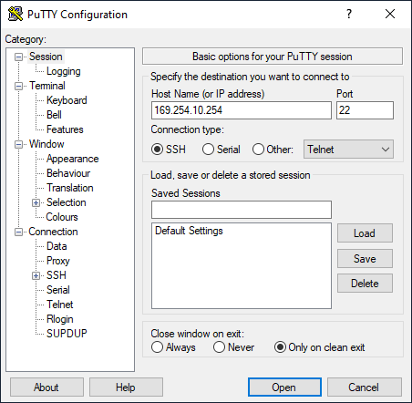
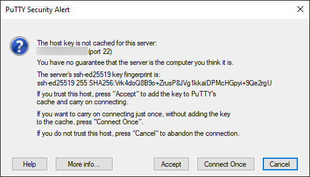

**Last updated 8th June 2022**

## Objective

The SSH (Secure Shell) communication protocol is the main practice to establish encrypted host connections through untrusted networks. The OpenSSH tool is natively installed on all OVHcloud servers (VPS, dedicated servers, Public Cloud instances) to allow secure remote server logins and other operations.

**This guide explains how to securely access your server with SSH.**

> [!warning]
>OVHcloud is providing you with services for which you are responsible, with regard to their configuration and management. You are therefore responsible for ensuring they function correctly.
>
>If you encounter any difficulties performing these actions, please contact a [specialist service provider](https://partner.ovhcloud.com/en/directory/) and/or discuss the issue with our community on https://community.ovh.com/en/. OVHcloud cannot provide you with technical support in this regard.
>

## Requirements

- A [dedicated server](https://www.ovhcloud.com/en/bare-metal/) or a [VPS](https://www.ovhcloud.com/en/vps/) in your OVHcloud account
- An SSH client application (command line or GUI)

> [!primary]
> This guide is not applicable for standard Windows server installations since they rely on the Remote Desktop Protocol for connections. SSH connections are used for the OVHcloud rescue mode however. You can find more information in the [Go further](#gofurther) section of this guide.
>

## Instructions

There are multiple ways to authenticate a connection to a remote device via SSH. The following instructions will involve the authentication method with username and password. You can also configure SSH keys to enable secure logins without passwords. Find the details in our [SSH key guide](/pages/bare_metal_cloud/dedicated_servers/creating-ssh-keys-dedicated).

The login credentials (username and password) are sent to you by email after a server installation or reinstallation from the [OVHcloud Control Panel](https://ca.ovh.com/auth/?action=gotomanager&from=https://www.ovh.com/world/&ovhSubsidiary=we).

The username corresponds to the operating system, for example `ubuntu` or `debian`. To connect, you also need to specify the IPv4 address or the hostname of the server. These details are available in the installation email and in the Control Panel.

Be sure to consult our "Getting started" guides as well:

- For a [dedicated server](/pages/bare_metal_cloud/dedicated_servers/getting-started-with-dedicated-server)
- For a [dedicated server of the **Eco** product line](/pages/bare_metal_cloud/dedicated_servers/getting-started-with-dedicated-server-eco)
- For a [VPS](/pages/bare_metal_cloud/virtual_private_servers/starting_with_a_vps)

### Connecting from a GNU/Linux distribution or macOS

A command line client for SSH (OpenSSH) is usually available by default. Open the Terminal application and connect to the server with the following command:

```bash
ssh username@server_IP
```

If the SSH port of the server is not the standard one, use this command instead:

```bash
ssh username@server_IP -p port_number
```

### Connecting from a Windows 10/11 device

The latest versions of Windows natively include OpenSSH for connections from the PowerShell or the Command Prompt application.

Right-click on the Windows start button and select `Windows PowerShell`{.action}. Alternatively, use the search field to start one of these programs.

{.thumbnail}

Connect to the server with the following command:


```bash
ssh username@server_IP
```

If the SSH port of the server is not the standard one, use this command:

```bash
ssh username@server_IP -p port_number
```

### Login and fingerprint

When prompted for a password, type the password of the connecting user and press `Enter`.

If this is a new connection, your SSH client will receive a key fingerprint from the server. Enter "yes" to confirm and then the password of the connecting user to log in.


```bash
ssh ubuntu@169.254.10.254
```
```console
The authenticity of host '169.254.10.254 (169.254.10.254)' can't be established.
ECDSA key fingerprint is SHA256:rRwrdsmJfzvJF5k0a4JmMSdaWbTlCgRKBukbmQ3gmso.
Are you sure you want to continue connecting (yes/no/[fingerprint])?
Warning: Permanently added '169.254.10.254' (ECDSA) to the list of known hosts.
ubuntu@169.254.10.254's password:
```

The fingerprint is then saved on your device and will be verified for each new connection. If the key has changed on the remote host, you will receive a warning message when trying to connect, for example:

```console
@@@@@@@@@@@@@@@@@@@@@@@@@@@@@@@@@@@@@@@@@@@@@@@@@@@@@@@@@@@
@    WARNING: REMOTE HOST IDENTIFICATION HAS CHANGED!     @
@@@@@@@@@@@@@@@@@@@@@@@@@@@@@@@@@@@@@@@@@@@@@@@@@@@@@@@@@@@
Host key verification failed.
Offending ECDSA key in /home/user/.ssh/known_hosts:3
```

It means that one the following has occured:

- The server has been reinstalled.
- The SSH service on the server has been reinstalled.
- You are connecting to a different host with the same IP address.

> [!primary]
> The warning message does not necessarily indicate a security issue. If you have not initiated one of these incidents however, the remote server might be compromised.
>

To resolve this, use the following command with the IP address of your server:

```bash
ssh-keygen -f ~/.ssh/known_hosts -R 169.254.10.254
```

Alternatively, open the `known_hosts` file located in your home folder with a text editor and delete the "offending" line that was specified in the warning message:

```bash
nano ~/.ssh/known_hosts
```

Save the changes and exit the editor. The new fingerprint has to be accepted at the next server login.

On Windows, the location of the `known_hosts` file and the line you have to delete are specified as well, for example:

```console
Offending ECDSA key in C:\\Users\\YourWindowsUser/.ssh/known_hosts:3
```

Navigate to this folder, right-click on the file and open it with the Notepad application.

{.thumbnail}

Delete the pertinent line, in this case the third one. Save the changes and exit the editor. The new fingerprint has to be accepted at the next server login.

### Using GUI clients or SSH-compatible software

There are many software applications for every type of OS that enable you to connect to your server via the SSH protocol. 

For example, [PuTTY](https://putty.org/){.external} for Windows is an open source SSH client software with a graphical user interface. It has been ported to other platforms as well and is available from [the official website](https://www.chiark.greenend.org.uk/~sgtatham/putty/latest.html), software package managers and [Homebrew](https://brew.sh/).

Start PuTTY and enter the IP address of the server. Specify the port number if the standard port is not used. Then click on `Open`{.action} to connect. You will be prompted for username and password.

{.thumbnail}

One advantage of PuTTY is the ability to save multiple sessions. Enter the connection details into the `Saved Sessions` field and click on `Save`{.action}.

{.thumbnail}

As usual, the fingerprint warning appears at the first connection. Click `Accept`{.action} to save the fingerprint or select `Connect Once`{.action}.

{.thumbnail}

Please consult the official FAQ and documentation of PuTTY for more information.


## Go further <a name="gofurther"></a>

[Creating SSH keys](/pages/bare_metal_cloud/dedicated_servers/creating-ssh-keys-dedicated)

[Dedicated server rescue mode](/pages/bare_metal_cloud/dedicated_servers/rescue_mode)

[VPS rescue mode](/pages/bare_metal_cloud/virtual_private_servers/rescue)

If you need training or technical assistance to implement our solutions, contact your sales representative or click on [this link](https://www.ovhcloud.com/en/professional-services/) to get a quote and ask our Professional Services experts for a custom analysis of your project.

Join our user community on <https://community.ovh.com/en/>.