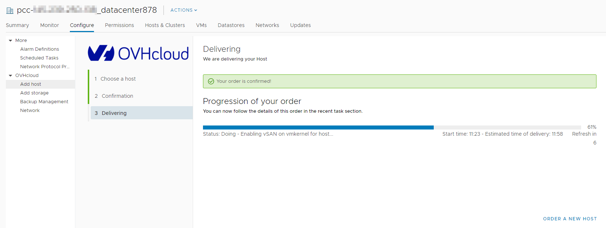

## Ziel

Bei einer Hosted Managed Bare Metal-Lösung können Sie stündlich abgerechnete Ressourcen hinzufügen.

**Diese Anleitung erklärt, wie Sie stündliche Ressourcen über das vSphere-Interface Ihrer Private Cloud hinzufügen.**

## Voraussetzungen

- Sie verfügen über eine [Managed Bare Metal](https://www.ovhcloud.com/de/managed-bare-metal/) Infrastruktur.
- [Dem Benutzer die Berechtigung "Hinzufügen von Ressourcen"](/pages/bare_metal_cloud/managed_bare_metal/change-user-rights) für das betreffende Rechenzentrum über das [OVHcloud Kundencenter](https://www.ovh.com/auth/?action=gotomanager&from=https://www.ovh.de/&ovhSubsidiary=de){.external} erteilen.
- Sie haben Zugriff zum vSphere-Client.

## In der praktischen Anwendung

### Ressource auswählen

Um zum Interface zu gelangen, über das Sie Ressourcen hinzufügen können, wählen Sie das entsprechende Datacenter und klicken sie anschließend auf den Tab `Configure`{.action}.

{.thumbnail}

Im vorliegenden Beispiel werden wir einen stündlich abgerechneten Host-Server hinzufügen. Nachdem Sie das gewünschte Modell ausgewählt haben, klicken Sie auf den Button `Next`{.action}. Wenn Sie einen Datastore hinzufügen möchten, wählen Sie einfach den Tab `Add storage`{.action} aus.

{.thumbnail}

### Bestellung bestätigen

Um die Bestellung zu bestätigen und abzuschließen, klicken Sie erneut auf den Button `Next`{.action}.

{.thumbnail}

### Installation nachverfolgen

Nachdem Sie Ihre Bestellung bestätigt haben, können Sie den Fortschritt zum Hinzufügen der Ressource nachverfolgen.

{.thumbnail}

Darüber hinaus wird ein neuer Task in den “recent tasks” von vSphere erscheinen. Über diesen können Sie den Fortschritt ebenfalls nachverfolgen.

## Weiterführende Informationen

Für den Austausch mit unserer User Community gehen Sie auf <https://community.ovh.com/en/>.
