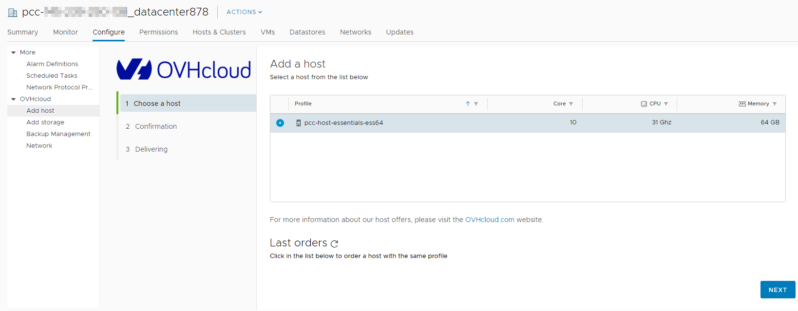
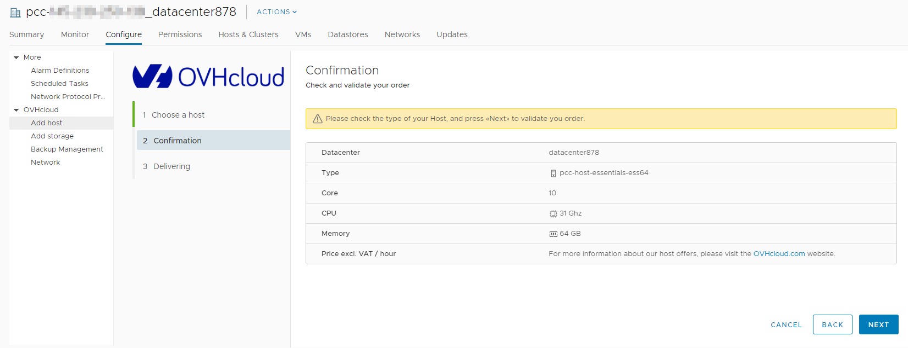

**Última atualização: 15/12/2020**

## Sumário

A solução [Managed Bare Metal](https://www.ovhcloud.com/pt/managed-bare-metal/){.external} permite-lhe adicionar recursos faturados à hora.

**Este manual descreve como adicionar um recurso com faturação à hora a partir da interface vSphere do Managed Bare Metal.**

## Requisitos

* Dispor do serviço [Managed Bare Metal](https://www.ovhcloud.com/pt/managed-bare-metal/){.external}.
* Dar ao utilizador a autorização [“Adição de recursos”](/pages/bare_metal_cloud/managed_bare_metal/change-user-rights){.external} quanto ao datacenter em causa a partir da [Área de Cliente OVH](https://www.ovh.com/auth/?action=gotomanager&from=https://www.ovh.pt/&ovhSubsidiary=pt){.external}.
* Estabelecer uma ligação ao cliente vSphere.

## Instruções

### Selecionar o recurso.

De modo a aceder à interface que permite adicionar recursos horários, deve selecionar o datacenter e, a seguir, clicar no separador `Configure`{.action}.

{.thumbnail}

Neste exemplo, vamos adicionar um servidor host faturado à hora. Uma vez feita a escolha do modelo, clique no botão `Next`{.action}. Para adicionar um datastore, basta selecionar o separador `Add storage`{.action}.

{.thumbnail}

### Validar a encomenda

Para validar e finalizar a encomenda, clique novamente em `Next`{.action}.

{.thumbnail}

### Acompanhar a instalação

Quando a encomenda estiver validada, pode seguir a operação.

{.thumbnail}

Por outro lado, surgirá uma tarefa nas tarefas recentes do vSphere. Também ela lhe permitirá seguir a adição do recurso.

## Quer saber mais?

Fale com a nossa comunidade de utilizadores: [Comunidade OVH](https://community.ovh.com/en/){.external}
