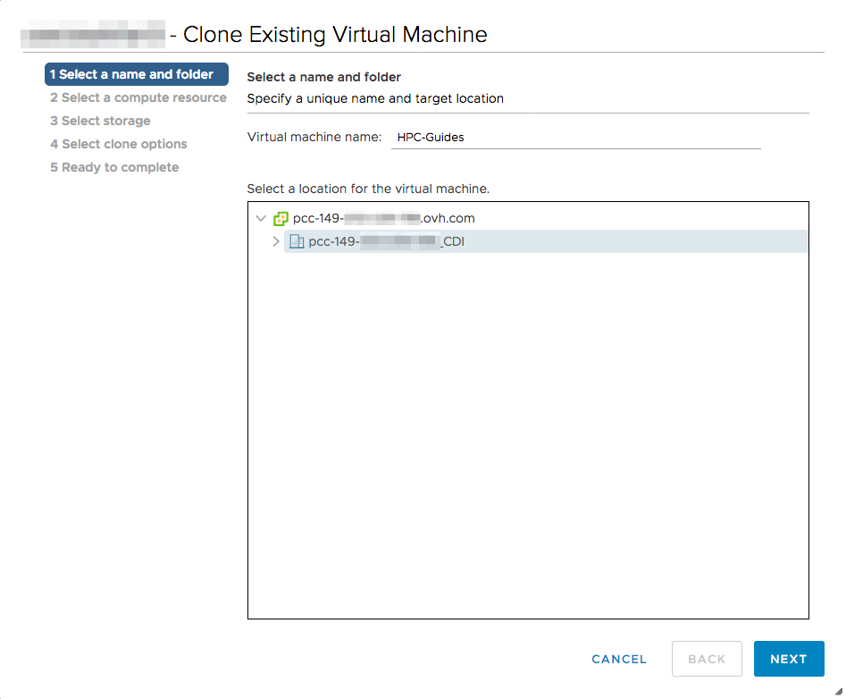
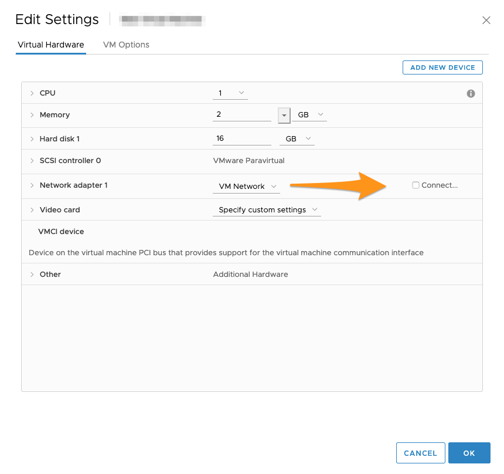

## Objetivo

A clonagem de uma VM permite criar uma cópia da VM de origem.

**Este manual explica como realizar esta operação**

## Requisitos

- Ter um produto [Managed Bare Metal](https://www.ovhcloud.com/pt/managed-bare-metal/){.external}.
- Dispor de, pelo menos, uma VM no seu cluster.
- Estar ligado à [interface vSphere](/pages/bare_metal_cloud/managed_bare_metal/vsphere-interface).

## Instruções

### Clonar a VM

Na sua [interface vSphere](/pages/bare_metal_cloud/managed_bare_metal/vsphere-interface), aceda à vista `Hosts and Clusters`.

Clique com o botão direito do rato na VM que quer clonar e clique em `Clone`{.action} > `Clone to virtual machine...`{.action}. 

{.thumbnail}

Dê um nome a esta nova VM e defina a sua localização na sua arborescência.

{.thumbnail}

### Selecionar o recurso

Especifique o cluster, o host, a vApp ou a pool de recursos desta VM.

{.thumbnail}

### Escolha do armazenamento

Defina a localização do armazenamento (espaço em disco) desta VM. 

O formato do disco virtual é de tipo “Thin Provision”, ou seja um disco virtual será criado mas só utilizará o espaço em disco realmente utilizado no armazenamento, independentemente do espaço em disco anteriormente utilizado na VM de origem.

Pode consultar mais informações sobre os formatos de disco [neste manual](/pages/bare_metal_cloud/managed_bare_metal/choosing-disk-type){.external-link}.

Poderá escolher, através da linha `VM Storage Policy`, a política de armazenamento predefinida se tiver datastores, ou ainda a opção [VM encryption](/pages/bare_metal_cloud/managed_bare_metal/vm_encrypt){.external-link}.

{.thumbnail}

### Configuração do sistema

Este passo permite definir a configuração de rede que quer aplicar a esta VM. Tem duas possibilidades:

- Se não selecionar nada, não haverá qualquer modificação da configuração de rede da nova VM em comparação à VM de origem;

- `Personalizar o hardware desta VM (experimental)`{.action}: esta opção permitir-lhe-á especificar as novas configurações que pretende implementar nesta nova VM.

{.thumbnail}

> [!warning]
>
> Se não efetuou qualquer personalização da VM, é necessário modificar a configuração do clone antes de a iniciar, para evitar um conflito de IP/MAC. 
>
>Neste caso, só precisa de desselecionar a placa de rede nos parâmetros da VM depois de a clonar, logo antes de a iniciar.
>
>{.thumbnail}
>

## Quer saber mais?

Fale com a nossa comunidade de utilizadores em <https://community.ovh.com/en/>.
