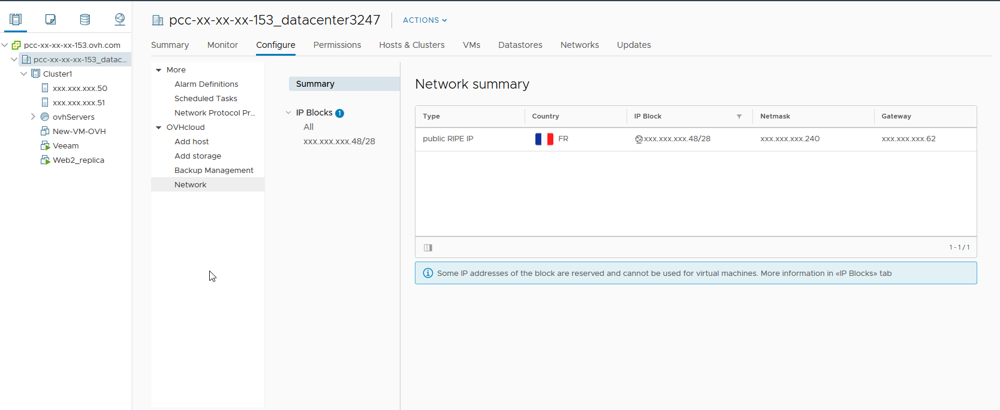
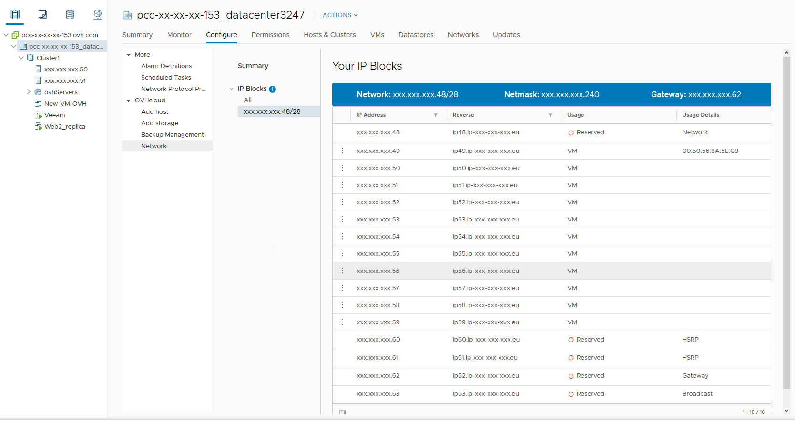
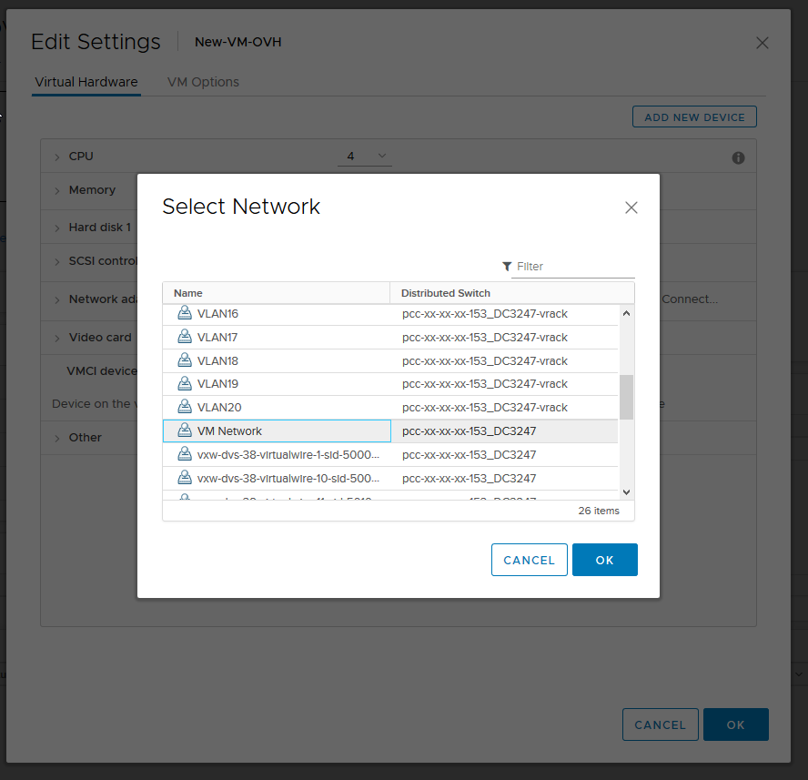
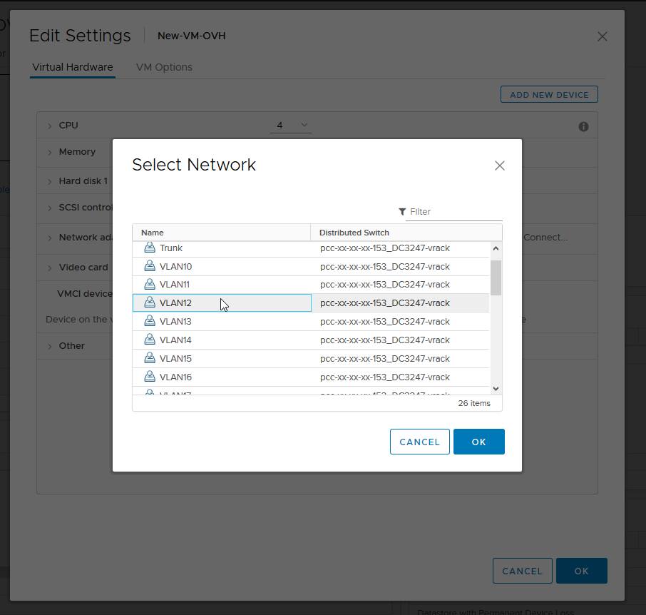
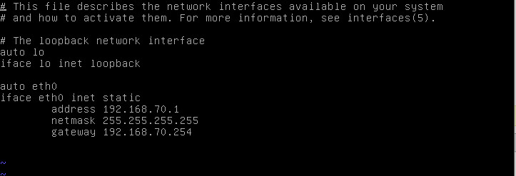

> [!primary]
> Esta traducción ha sido generada de forma automática por nuestro partner SYSTRAN. En algunos casos puede contener términos imprecisos, como en las etiquetas de los botones o los detalles técnicos. En caso de duda, le recomendamos que consulte la versión inglesa o francesa de la guía. Si quiere ayudarnos a mejorar esta traducción, por favor, utilice el botón «Contribuir» de esta página.
> 


## Objetivo

Una vez que haya creado una máquina virtual (MV) en su infraestructura, puede asignarle una IP pública o privada.

**Esta guía explica cómo realizar esta configuración.**

## Requisitos

- Haber creado una máquina virtual.
- Tener un bloque de IP.

## Procedimiento

### Obtener la información

Puede consultar la información de su bloque de direcciones IP públicas directamente desde el cliente vSphere, accediendo a la sección `Hosts y Clusters`{.action}. Haga clic en su datacenter y seleccione la pestaña `Configurar`{.action}. Haga clic en "`Red`{.action}" debajo de `OVHcloud`.

{.thumbnail}

En cada bloque entregado por OVHcloud, 5 direcciones IP están reservadas a la configuración de la red y nunca deben utilizarse para sus máquinas virtuales. Se trata de la primera y las cuatro últimas IP del bloque.

Un bloque IP Managed Bare Metal está organizado de la siguiente manera:

- la primera dirección IP marcada como reservada (`Reserved`) corresponde a la dirección de red.
- las siguientes IP pueden utilizarse en sus máquinas virtuales. Se indican como disponibles (`Available`) si ninguna MV las explota o como utilizadas (`Used`) en caso contrario.
- las cuatro últimas IP del bloque están reservadas, dos están dedicadas a los routers de OVHcloud para el funcionamiento del bloque y las otras dos se utilizan para la puerta de enlace y el broadcast.

{.thumbnail}

### Configurar una IP pública

Para configurar una IP pública en su máquina virtual, es necesario haber elegido previamente la interfaz `VMNetwork`{.action} en los parámetros de la tarjeta de red de su MV:

{.thumbnail}

#### Linux

A continuación le ofrecemos un ejemplo de configuración de la distribución Debian:

{.thumbnail}

```sh
auto eth0
iface eth0 inet static
address 46.105.220.xxx
netmask 255.255.255.240
broadcast 46.105.220.xxx
gateway 46.105.220.xxx
dns-nameservers 213.186.33.99
```

Monte el mapa con un `ifup` de su interfaz.

También podrá comprobar la configuración con un `ifconfig`.

Si su máquina virtual no encuentra la red, compruebe que la tarjeta de red esté configurada en *VMNetwork* y no en *LocalPortGroup* o una VLAN y que la casilla de conexión de la tarjeta esté marcada.

#### Windows

A continuación le ofrecemos un ejemplo de configuración de Windows:

En el `panel de configuración`{.action}, acceda a `Red e Internet`{.action}, `red, comparta`{.action} y `cambie el adaptador de red`{.action}.

Para avanzar más rápido, puede pulsar sobre el campo de búsqueda Windows y escribir `Run` (que corresponde a pulsar simultáneamente la tecla *Windows* de su teclado y la tecla *R*). Se abrirá la consola de ejecución Windows y podrá introducir el siguiente comando:

```shell
ncpa.cpl
```

A continuación, haga clic derecho en el mapa de red correspondiente al VMNetwork y `Propiedades`{.action). Seleccione entonces el `Protocolo TCP/IP v4`{.action} y vuelva a hacer clic en "Propiedades" e introduzca la información de su IP como sigue:

{.thumbnail}

```sh
Dirección IP: 46.105.220.xxx
Máscara de subred: 255.255.255.240
Puerta de enlace predeterminada: 46.105.220.yyy
Servidor DNS: 213.186.33.99
```

### Configurar una IP privada

La configuración de una IP privada es similar a la de una IP pública. No obstante, debe utilizar la tarjeta de red configurada para su VLAN.

Al elegir la interfaz, puede editar los siguientes parámetros:

- una interfaz de VLAN (10 a 20 por defecto y relacionados con el vRack, puede crear más VLAN consultando [esta guía](/pages/bare_metal_cloud/managed_bare_metal/vlan-creation)).

En los parámetros de su máquina virtual, puede utilizar una VLAN :

{.thumbnail}

{.thumbnail}

#### Linux

A continuación le ofrecemos un ejemplo de configuración de la distribución Debian:

{.thumbnail}

Editando el archivo de interfaces, puede indicar una IP privada en el rango IP que usted elija:

```sh
auto eth0
iface eth0 inet static
address 192.168.70.1
netmask 255.255.255.0
gateway 192.168.70.254
```

Monte el mapa con un `ifup` de su interfaz.

También puede comprobar la configuración con un `ifconfig`.

#### Windows

A continuación le ofrecemos un ejemplo de configuración de Windows:

En el `panel de configuración`{.action}, acceda a `Red e Internet`{.action}, `Centro de red y recursos compartidos`{.action} y, por último, `Cambie el adaptador de red`{.action}.

Para avanzar más rápido, puede pulsar sobre el campo de búsqueda Windows y escribir `Run` (que corresponde a pulsar simultáneamente la tecla *Windows* de su teclado y la tecla *R*). Se abrirá la consola de ejecución Windows y podrá introducir el siguiente comando:

```shell
ncpa.cpl
```

A continuación, haga clic derecho en el mapa de red correspondiente al VMNetwork y `Propiedades`{.action). Seleccione el `Protocolo TCP/IP v4`{.action} y vuelva a hacer clic en "Propiedades" e introduzca la información de su IP de la siguiente forma:

{.thumbnail}

Si modifica esta interfaz, puede indicar una IP privada en el rango IP de su elección:

```sh
Dirección IP: 192.168.70.2
Máscara de subred: 255.255.255.0
Puerta de enlace predeterminada: 192.168.70.254
```


## Más información

Interactúe con nuestra comunidad de usuarios en <https://community.ovh.com/en/>.
