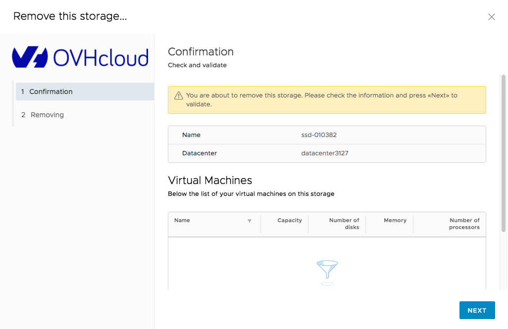

**Última atualização: 18/11/2020**

## Sumário

Existem casos em que pode ser útil eliminar um datastore do cluster, por exemplo, para o substituir por outro ou para migrar para um modelo com maior capacidade de armazenamento.

**Este manual explica-lhe como remover, com toda a segurança, um datastore da sua infraestrutura.**

## Requisitos

* Dispor do serviço [Managed Bare Metal](https://www.ovhcloud.com/pt/managed-bare-metal/){.external}.
* Aceder à interface de gestão vSphere.

## Instruções

> [!warning]
>
> Por razões de segurança, não é possível eliminar os **dois datastores de 300 GB ou 1,2 TB** incluídos no seu pack nem eliminar um datastore se este tiver máquinas virtuais (na janela de validação, pode ver a lista de máquinas virtuais alojadas no datastore).
> 

Para eliminar um datastore, aceda ao armazenamento da sua plataforma na janela `Storage`{.action} da coluna à esquerda. Depois, clique com o botão direito sobre o datastore correspondente e selecione `OVHcloud`{.action} e, a seguir, `Remove storage`{.action}.

{.thumbnail}

Na nova janela que irá aparecer, confirme que pretende eliminar o datastore clicando em `Next`{.action}.

{.thumbnail}

O pedido de eliminação é imediatamente processado.

{.thumbnail}

É possível seguir o progresso da operação através da secção `Recent Tasks`{.action}.

{.thumbnail}

## Quer saber mais?

Fale com a nossa comunidade de utilizadores em [https://community.ovh.com/](https://community.ovh.com/en/){.external}.
