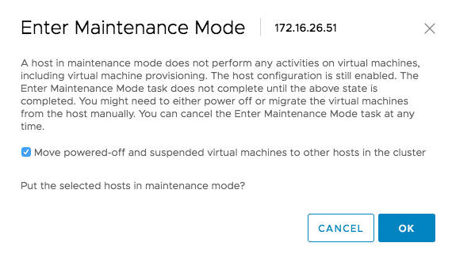

## Obiettivo

In alcuni casi eliminare un server host può risultare utile, ad esempio per restituire un host di <i>spare</i> inutilizzato o per passare a una gamma superiore.

**Questa guida ti mostra come rimuovere in modo sicuro un server host da un’infrastruttura Managed Bare Metal.**

## Prerequisiti

* Disporre di una soluzione [Managed Bare Metal](https://www.ovhcloud.com/it/managed-bare-metal/){.external}
* Avere accesso all’interfaccia di gestione vSphere

## Procedura

> [!warning]
>
> Attenzione a non spegnere il server host che desideri rimuovere perché ciò non avrebbe l'effetto desiderato. Ciò comporterebbe infatti la consegna di un server host di spare e il server host spento non verrebbe automaticamente rimosso.
>

La rimozione di un server host si svolge in due step: l’attivazione della modalità manutenzione di questa risorsa e successivamente la rimozione della stessa.

### Attiva la modalità manutenzione

Una volta effettuata la connessione a vSphere, accedi all’inventario dei tuoi server host e cluster. Seleziona il server host interessato con un semplice click con il tasto destro del mouse e poi scegli `Maintenance Mode`{.action} e `Enter Maintenance Mode`{.action}. Nel caso in cui siano presenti macchine virtuali (VM) in funzione su questo server host, saranno automaticamente salvate su un altro server all’interno del tuo cluster (modalità HA e DRS attivate).

{.thumbnail}

Nella finestra di dialogo, conferma il passaggio in modalità manutenzione cliccando su `OK`{.action}.

{.thumbnail}

Puoi seguire lo stato di avanzamento dell’operazione nell’area **Recent Tasks**.

{.thumbnail}

### Rimuovi il server host

Una volta che il server è in modalità manutenzione, fai un click con il tasto destro del mouse e seleziona `OVHcloud`{.action}, poi clicca su `Remove this host`{.action}.

{.thumbnail}

Nella nuova finestra, conferma la rimozione cliccando su `Next`{.action}.

{.thumbnail}

La richiesta di rimozione è adesso in fase di elaborazione.

{.thumbnail}

Puoi seguire lo stato di avanzamento della rimozione del server host nell’area **Recent Tasks**.

{.thumbnail}

Il server host verrà rimosso entro pochi minuti e non sarà più visibile.

> [!primary]
>
> Se si aggiungono directory o file che non erano inizialmente presenti nello storage locale del server, la rimozione non sarà possibile a causa di un errore. Soltanto le directory di base e i file vSwap consentono di eseguire questa operazione.
>

## Per saperne di più

Contatta la nostra Community di utenti all’indirizzo <https://community.ovh.com/en/>.
