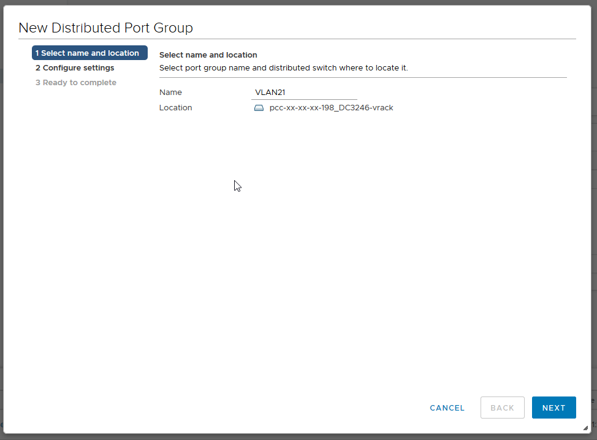
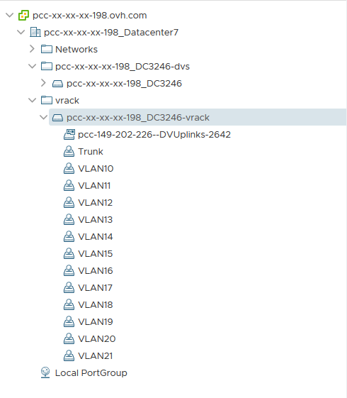

> [!primary]
> Esta tradução foi automaticamente gerada pelo nosso parceiro SYSTRAN. Em certos casos, poderão ocorrer formulações imprecisas, como por exemplo nomes de botões ou detalhes técnicos. Recomendamos que consulte a versão inglesa ou francesa do manual, caso tenha alguma dúvida. Se nos quiser ajudar a melhorar esta tradução, clique em "Contribuir" nesta página.
>

**Última atualização: 18/11/2020**

## Objetivo

Numa infraestrutura Managed Bare Metal, dispõe de base de 11 VLAN fornecidas com o vRack.

**Este guia mostra a criação de VLAN suplementares**

## Requisitos

- Ter acesso ao vSphere Web Client (HTML5)

## Instruções

### Criar VLAN

Nas ofertas Managed Bare Metal, dispõe de dois switchs virtuais distribuídos (vDS). 

Estes *vDS* comportam várias *portGroup*, cada uma com uma utilidade.

O primeiro vDS dispõe de um único tipo de *portaGroup*, a VMnetwork que permite comunicar para a Internet.

O segundo vDS dispõe igualmente de um único tipo de *portaGroup* , VLAN que permite isolar as comunicações privadas no interior do Managed Bare Metal e entre os diferentes serviços OVHcloud compatíveis com vRack (Servidor dedicado, Public Cloud..). 

Neste switch, são criadas 11 VLANs de base (VLAN10 a VLAN20). Ao dar o direito de `administrador` sobre o `Acesso à VLAN` na [gestão dos utilizadores da sua Área de Cliente](/pages/bare_metal_cloud/managed_bare_metal/manager-ovhcloud#utilizadores), poderá criar VLAN suplementares.

Em primeiro lugar, aceda à vista de `networking` do seu vSphere. Implemente a pasta **vrack**, clique com o botão direito do rato no **dVS** que termina com *-vrack* e, por fim, clique em `New Distributed Port Group`{.action}.

{.thumbnail}

{.thumbnail}

O próximo passo é dar um nome o seu **PortGroup**:

{.thumbnail}

De seguida, configure os parâmetros recomendados pela OVHcloud:

- **Port Binding**: Static (reserva e atribuição da porta a uma máquina virtual)
- **Port allocation**: Elastic (permite alargar a quente o número de portas)
- **Number of ports**: 24
- **VLAN type**: VLAN (as outras são [PVLAN](https://kb.vmware.com/s/article/1010691){.external} e Trunk)
- **VLAN ID**: 21 (sabendo que o ID pode ser configurado de 1 a 4096)
- Selecione a opção *Customize default policies configuration*.

{.thumbnail}

Tem 3 parâmetros de segurança que podem ser ativados em função das suas necessidades: 

- *Promiscuem em modo* (elimina qualquer filtragem de receção que o adaptador de máquina virtual possa efetuar para que o sistema operativo convidado receba todo o tráfego observado na rede.)
- *MAC address changes*\: afeta o tráfego que uma máquina virtual recebe. Quando a opção está definida em **Accept**, o ESXi aceita os pedidos de modificação do endereço MAC efetivo num endereço diferente do endereço MAC inicial.
- *Forged transmits*\: afeta o tráfego transmitido a partir de uma máquina virtual. Quando a opção está definida em **Accept**, o ESXi não compara os endereços MAC fonte e efetivo.

> [!primary]
>
> A utilização mais frequente destes 3 parâmetros é o CARP, utilizado principalmente em **pfSense**.
> 

{.thumbnail}

Deixamos a [adaptação de tráfego](https://docs.vmware.com/en/VMware-vSphere/6.5/com.vmware.vsphere.networking.doc/GUID-CF01515C-8525-4424-92B5-A982489BACE2.html){.external} desativado.

{.thumbnail}

Ao nível do Load Balancing, selecione *Route Based on IP hash* que é o melhor método em termos de redundância e repartição.

> [!warning]
>
> Atenção: ao configurar a ordem de migração, é necessário colocar a ligação ascendente `lag1` em *Active* (ligação entre a rede virtual e a rede física), caso contrário não será possível qualquer comunicação entre os hosts.
>

{.thumbnail}

O `Netflow` está desativado (relação de atividade sobre os fluxos de tráfego).

{.thumbnail}

Deixe o valor `Block All Ports` em "No".

{.thumbnail}

Receberá então um resumo das alterações. Clique em `Finish` para confirmar a criação.

{.thumbnail}

É possível constatar que a **VLAN21** está disponível e funcional.

{.thumbnail}

## Quer saber mais?

Fale com a nossa comunidade de utilizadores em <https://community.ovh.com/en/>.
