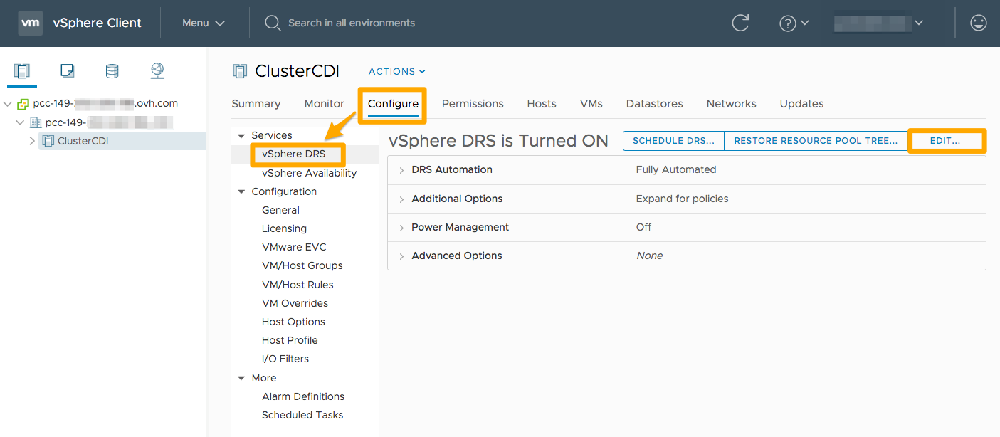
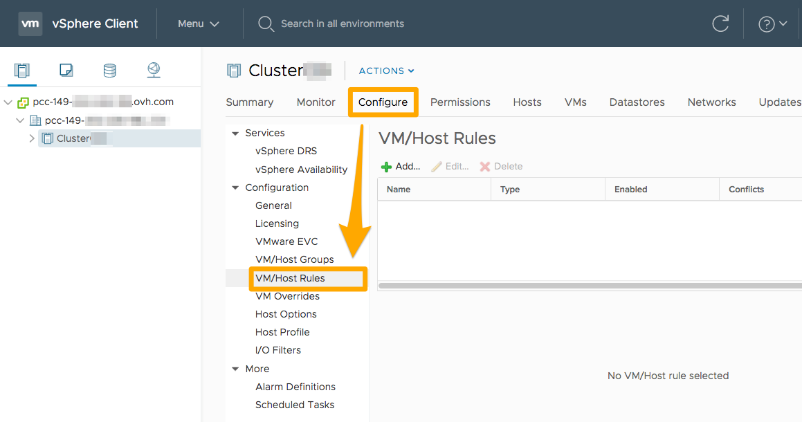
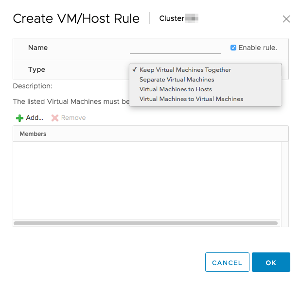

## Objective

The feature Distributed Resource Scheduler (DRS) is available in a VMware cluster, allowing load balancing of hosts by moving virtual machines automatically (vMotion). It will allocate VMs to the different hosts in the cluster based on their usage and resources.

**This guide explains the settings of the DRS feature.**

## Requirements

- a [Managed Bare Metal infrastructure](https://www.ovhcloud.com/en-ca/managed-bare-metal/)
- a user account with access to vSphere (created in the [OVHcloud Control Panel](https://ca.ovh.com/auth/?action=gotomanager&from=https://www.ovh.com/ca/en/&ovhSubsidiary=ca))

## Instructions

The DRS functionality's purpose is to allocate resources more efficiently. It can either move the VMs to a host or pool (best suited) in your cluster, or provide advice on the process.

{.thumbnail}

### Activation

DRS is enabled by default in the first cluster provided with your OVHcloud Managed Bare Metal.

When a new cluster is created, you can enable it at the time of creation or afterwards.

If DRS is not active in your cluster, go to the `Configure`{.action} tab and then select `vSphere DRS`{.action} available in the `Services`{.action} menu.

Click on `EDIT`{.action} and then on the slide button `vSphere DRS`{.action} to enable it.

{.thumbnail}

### Settings

In the same section, you will find 4 categories of options.

#### Automation

Three different levels of automation are available:

- **Manual**: DRS will not move VMs, you will need to manage moving and distributing your VMs independently.
- **Partially Automated**: DRS will advise you on migrating your VMs, but will only do so if you validate the move.
- **Fully Automated**: DRS will automatically move VMs without your validation, based on the load on the hosts.

It is also possible to set a migration threshold between "Conservative" and "Aggressive" on automated modes.

The "Predictive DRS" option, available from VMware version 6.5, allows you to perform migrations based on the forecast metrics returned by vRops.
The latter is therefore essential for the operation of this DRS option.

Finally, the "Virtual Machine Automation" option allows you to configure specific DRS settings for certain VMs in the `VM Overrides` submenu of the `Configure`{.action} tab. (Some VMs may have a partially automated migration mode while the cluster will be fully automated.)

{.thumbnail}

#### Additional Options

You can configure 3 additional options in the DRS settings:

- **VM Distribution**: For availability, distribute a more even number of virtual machines across hosts.
- **Memory Metric for Load Balancing**: Load balancing based on the consumed memory of virtual machines rather than active memory. This setting is only recommended for clusters where host memory is not over-committed.
- **CPU Over-Commitment**:  Limit CPU over-commitment for all hosts in the cluster. This setting will create a virtual CPU on a primary physical CPU ratio limit (vCPU:pCPU) implemented on each ESXi host.

{.thumbnail}

#### Power Management

**This option must always be disabled.**

The main purpose of this option to shut down hosts in your infrastructure if DRS determines that they are not needed, while satisfying the failover level requested by HA.

However, OVHcloud monitoring will detect this operation as abnormal and create a data centre intervention.

#### Advanced Options

Multiple advanced configuration settings can be used in your DRS cluster.

Here are some examples:

|Advanced Option Name|Description|Default value|Most aggressive value|
|:---|:---|:---|:---|
|UseDownTime|If cost analysis should take into account the workload impact of possible memory stalls during migration|1|0 (no impact consideration)|
|IgnoreDownTimeLessThan|Threshold (in seconds) to discard cumulative migration stall times in cost analysis (can be increased if VM workloads are not sensitive to memory stalls during migration).|1|A large number (not including downtime)|
|MinImbalance|Used to calculate target imbalance|50|0|
|MinGoodness|Minimal improvement in cluster imbalance required for each move|Adaptive|0 (All vMotion is considered)|
|MaxMovesPerHost|Maximum number of movements per recommended host per invocation|Adaptive|0 (No limits)|

{.thumbnail}

### DRS rules

In the `Configure`{.action} tab you can find the management of `VM/Host Rules`.

{.thumbnail}

- **Keep Virtual Machines Together**: VMs remain on the same host
- **Separate Virtual Machines**: Separate VMs on different hosts within a single cluster
- **Virtual Machines to Hosts**: VMs that are members of the VM group of the specified cluster must run on the specified host group. It is necessary to create VM and host groups in the `VM/Host Groups` menu.

The fourth rule, **Virtual Machines to Virtual Machines** is explained in our guide on [VMware HA](/pages/bare_metal_cloud/managed_bare_metal/vmware_ha_high_availability).

{.thumbnail}

## Go further

Join our community of users on <https://community.ovh.com/en/>.
