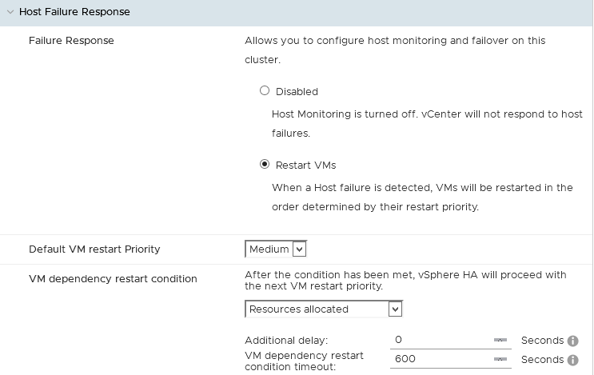

**Ostatnia aktualizacja dnia 18-11-2020**

## Wprowadzenie

Główną funkcją usługi **VMware HA** (High Availability) w razie awarii sprzętu jest zrestartowanie maszyn wirtualnych na innym hoście klastra. **HA** umożliwia również monitorowanie maszyn wirtualnych i aplikacji.

{.thumbnail}

**Z tego przewodnika dowiesz się, jak skonfigurować tę funkcję**

## Wymagania początkowe

- Dostęp do [interfejsu vSphere](/pages/bare_metal_cloud/managed_bare_metal/vsphere-interface).
- Posiadanie usługi [Managed Bare Metal](https://www.ovhcloud.com/pl/managed-bare-metal/){.external}

## W praktyce

### Aktywacja

Funkcja HA jest domyślnie aktywowana w klastrze podstawowym, który OVHcloud dostarcza razem z usługą Managed Bare Metal.

Funkcję HA możesz też aktywować podczas tworzenia nowego klastra lub później.

Jeśli funkcja HA nie jest aktywna w Twoim klastrze, przejdź do karty `Konfiguruj` Twojego klastra, a następnie do karty `Dostępność vSphere` dostępnej w rubryce `Usługi`.

Kliknij polecenie `Edytuj`{.action} i zaznacz pole, aby włączyć funkcję HA.

Ważne jest również, aby włączyć monitorowanie hosta. To ustawienie umożliwia wysyłanie zapytań o dostępność między hostami ESXi w celu wykrycia ewentualnej awarii.
Wyłączenie tej funkcji jest konieczne na przykład do przeprowadzenia aktualizacji przy użyciu narzędzia Update Manager. W tym konkretnym przypadku host jest izolowany.

{.thumbnail}

### Parametry

#### Awarie i reakcje

Pierwsza kategoria pozwala określić zasady restartowania maszyn wirtualnych w zależności od różnych możliwych awarii.

##### Reakcja w razie awarii hosta

Ta kategoria określa zasady restartowania maszyn wirtualnych w razie utraty hosta.

Możesz tu zdecydować, czy maszyny wirtualne będą restartowane automatycznie, czy nie.
Możliwe jest także zarządzanie domyślnym restartem klastra. Możesz zawęzić to ustawienie do pojedynczych maszyn wirtualnych w karcie `Wyjątki dla maszyn wirtualnych`.

Możesz także wybrać inny warunek niż domyślny (Przypisane zasoby), który funkcja vSphere HA sprawdzi przed przystąpieniem do restartu.

{.thumbnail}

##### Reakcja na izolację hosta

Ta kategoria pozwala określić działania, jakie mają zostać podjęte w razie utraty łączności z siecią w przypadku hosta.

Do wyboru masz następujące opcje: 

- Nie zostanie podjęte żadne działanie.
- Maszyny wirtualne zostaną wyłączone i zostanie podjęta próba ich zrestartowania na innym dostępnym hoście.
- Dany host zostanie wyłączony i zostanie podjęta próba zrestartowania maszyn wirtualnych na innym dostępnym hoście.

{.thumbnail}

##### Magazyn danych z PDL

W razie usterki magazynu danych ze statusem PDL (Permanent Device Loss) możesz określić działania, jakie mają zostać podjęte:

- Nie zostanie podjęte żadne działanie.
- Nie zostanie podjęte żadne działanie, ale zostaną wygenerowane logi.
- Maszyny wirtualne zostaną wyłączone i zostanie podjęta próba ich zrestartowania na hostach, które wciąż mają łączność z magazynem danych.

{.thumbnail}

##### Magazyn danych z APD

W razie usterki magazynu danych ze statusem APD (All Path Down) możesz określić działania, jakie mają zostać podjęte:

- Nie zostanie podjęte żadne działanie.
- Nie zostanie podjęte żadne działanie, ale zostaną wygenerowane logi.
- Maszyny wirtualne zostaną wyłączone i zostanie podjęta próba ich zrestartowania.

{.thumbnail}

##### Monitoring maszyn wirtualnych

Monitoring maszyn wirtualnych jest dostępny po zainstalowaniu narzędzia [VMware tools](/pages/bare_metal_cloud/managed_bare_metal/vmware_tools_install).
W razie braku reakcji ze strony **tools** (zapytania o dostępność) maszyna wirtualna zostanie automatycznie zrestartowana. Możliwa jest zaawansowana konfiguracja tej funkcji (np. odstępów czasu restartu).

{.thumbnail}

#### Kontrola dostępu

Funkcja vSphere HA wykorzystuje kontrolę dostępu w celu zapewnienia, że zarezerwowane są zasoby wystarczające do odzyskania maszyn wirtualnych w razie awarii hosta.

Kontrola dostępu narzuca pewne ograniczenia dotyczące wykorzystania zasobów. Działania, które mogą naruszać te ograniczenia, są niedozwolone. Oto przykładowe działania, które mogą być niedozwolone:

- włączenie maszyny wirtualnej;
- migracja maszyny wirtualnej;
- zwiększenie rezerwy CPU lub pamięci maszyny wirtualnej.

Podstawą kontroli dostępu vSphere HA jest liczba awarii hosta, które klaster może tolerować i nadal gwarantować przełączanie awaryjne. Zdolność hostów do przełączania awaryjnego można określić na trzy różne sposoby:

- [Wartość procentowa zasobów klastra](https://docs.vmware.com/en/VMware-vSphere/6.5/com.vmware.vsphere.avail.doc/GUID-FAFEFEFF-56F7-4CDF-A682-FC3C62A29A95.html)

- [Strategia umieszczania](https://docs.vmware.com/en/VMware-vSphere/6.5/com.vmware.vsphere.avail.doc/GUID-85D9737E-769C-40B6-AB73-F58DA1A451F0.html)

- [Dedykowane hosty przełączania awaryjnego](https://docs.vmware.com/en/VMware-vSphere/6.5/com.vmware.vsphere.avail.doc/GUID-C4F5F9EE-4235-4151-BEBE-FCB2A752407B.html)

#### Zapytania o dostępność magazynów danych

Gdy host główny klastra HA nie może komunikować się z hostem podrzędnym w sieci zarządzania, host główny wykorzystuje zapytanie o dostępność magazynu danych do określenia, czy host podrzędny jest uszkodzony, znajduje się w partycji sieciowej, czy też jest odcięty od sieci.

#### Zaawansowane opcje

W klastrze można użyć kilku parametrów konfiguracji zaawansowanej.

Informacje o parametrach znajdziesz na [tej stronie](https://docs.vmware.com/en/VMware-vSphere/6.5/com.vmware.vsphere.avail.doc/GUID-E0161CB5-BD3F-425F-A7E0-BF83B005FECA.html).

### Reguła HA

Przejdź do sekcji `Konfiguruj`, a następnie do karty `Reguły VM/Hosta`, aby utworzyć regułę typu “Maszyny wirtualne do maszyn wirtualnych”.

Dzięki temu zostanie dodany warunek restartu, który zapewni, że wszystkie maszyny wirtualne z pierwszej grupy zostaną zrestartowane przed restartem maszyn z drugiej grupy.

Tę regułę można dodać w uzupełnieniu do priorytetów restartu, które można skonfigurować w karcie `Wyjątki dla maszyn wirtualnych`.

## Sprawdź również

Dołącz do społeczności naszych użytkowników na stronie <https://community.ovh.com/en/>.
