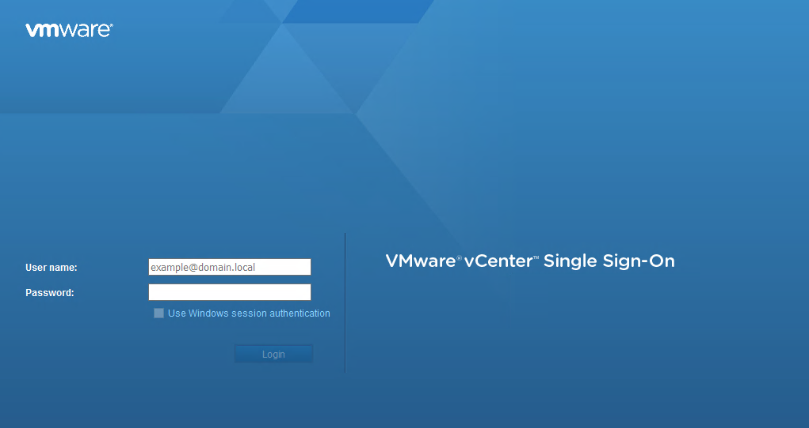
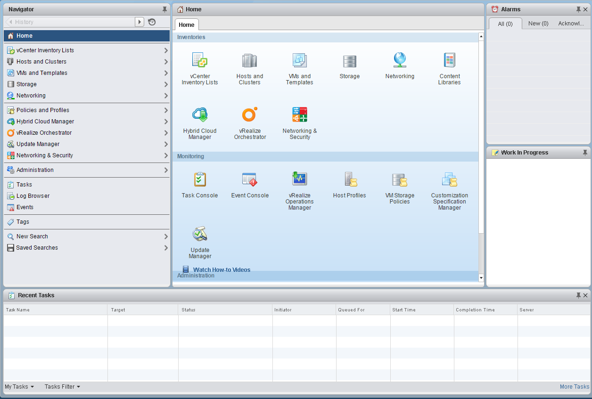

## Objectif

**Ce guide vous présente les différentes façons de se connecter à vSphere.**

## Prérequis

- Être contact administrateur du Managed Bare Metal, celui-ci recevant les identifiants de connexion.
- Avoir créé un utilisateur actif dans l'espace client.

## En pratique

### Récupération des identifiants

Les identifiants sont envoyés par e-mail durant la création du Managed Bare Metal, lors d’une modification du mot de passe ou à la création d’un utilisateur :

```
adresse IP/Nom : pcc-xxx-xxx-xxx-xxx.ovh.com nom d’utilisateur : admin mot de passe : xxxxxx
```

Ce document de VMware répertorie les différents ports que vous devez ouvrir sur votre pare-feu pour, par exemple, accéder à la console : [Accès console](https://kb.vmware.com/kb/1012382){.external-link}

### Utilisation du web client HTML5

Le web client HTML5 est disponible sur l’interface web de votre Managed Bare Metal à l’adresse : `https://pcc-xxx-xxx-xxx-xxx.ovh.com/ui` (remplacez pcc-xxx-xx-xx-xxx.ovh.com par l’adresse de votre Managed Bare Metal).

{.thumbnail}

Vous accéderez ensuite à cette interface :

{.thumbnail}

La page `Home`{.action} permet de retrouver les grands menus de votre vCenter. Vous allez pouvoir effectuer différentes actions, telles que :

- Déployer une machine virtuelle en allant dans `Hosts and Clusters`{.action} ;
- Parcourir vos datastores.

### Utilisation du web client flash

Le web client flash est disponible sur l’interface web de votre Managed Bare Metal à l’adresse : `https://pcc-xxx-xxx-xxx-xxx.ovh.com/vsphere-client` (remplacez pcc-xxx-xx-xx-xxx.ovh.com par l’adresse de votre Managed Bare Metal).

Connectez-vous avec les identifiants qui vous ont été transmis :

{.thumbnail}

Vous accéderez ensuite à cette interface :

{.thumbnail}

La page `Home`{.action} permet de retrouver les grands menus de votre vCenter. Vous allez pouvoir effectuer différentes actions, telles que :

- Déployer une machine virtuelle en allant dans `Hosts and Clusters`{.action} ;
- Parcourir vos datastores.

## Aller plus loin

Échangez avec notre communauté d'utilisateurs sur <https://community.ovh.com>.
