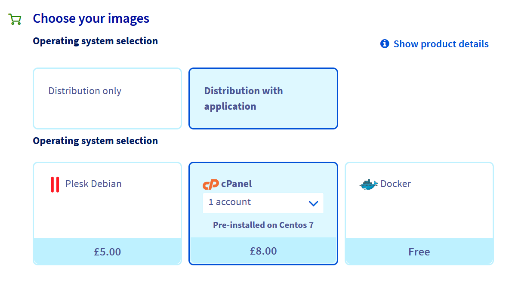

**Dernière mise à jour le 14/10/2021**

## Objectif

cPanel est un panneau de configuration conçu pour les hébergeurs web. Constitué d'une interface graphique permettant l'automatisation des paramètres, l'hébergement de site web est ainsi simplifié.

**Découvrez comment déployer cPanel avec les applications pré-installées sur un VPS.**

## Prérequis

- Un [VPS de la gamme actuelle](https://www.ovhcloud.com/fr/vps/){.external} (offres Value, Essential, Comfort ou Elite).
- Être connecté à votre [espace client OVHcloud](https://www.ovh.com/auth/?action=gotomanager&from=https://www.ovh.com/fr/&ovhSubsidiary=fr){.external}.

## En pratique

Afin d'installer votre serveur cPanel, il faut d'abord commander un VPS avec la distribution cPanel.

{.thumbnail}

Quand votre VPS est prêt, vous recevez un e-mail vous donnant les accès pour vous connecter à votre serveur cPanel :

```
 |    Vos application(s):
 |    Vous pouvez vous connecter à cpanel depuis https://<ip>:2087/<session_parameters>
```

Si vous disposez déjà d'un VPS et que vous souhaitez y installer cPanel, vous pouvez réinstaller le VPS à partir de votre [espace client OVHcloud](https://www.ovh.com/auth/?action=gotomanager&from=https://www.ovh.com/fr/&ovhSubsidiary=fr) à l'aide du modèle « CentOS 7 - cPanel » (disponible uniquement avec une offre VPS compatible).

> [!warning]
>
> Si vous réinstallez un VPS, toutes les données stockées sur le VPS seront perdues.
> 

### Première connexion

Une fois que vous avez reçu l'e-mail avec le lien unique, cliquez sur ce lien pour effectuer la configuration initiale.

> [!primary]
>
> Si le lien a déjà expiré, connectez-vous en SSH au serveur à l’aide de l’utilisateur CentOS et exécutez la commande « sudo whmlogin » pour générer un nouveau lien.
>

L'URL citée plus haut vous permet de vous connecter sans informations d'identification (utilisateur et mot de passe) à votre interface WHM.

#### Étape 1 : lire les conditions d'utilisation de cPanel

Lisez et acceptez les conditions d'utilisation de cPanel

{.thumbnail}

#### Étape 2 : compléter les champs requis

Indiquez les serveurs de messagerie et de noms (nameservers) que vous souhaitez définir sur le serveur VPS.

{.thumbnail}

#### Étape 3 : définir le mot de passe root

{.thumbnail}

Vous devriez à présent pouvoir vous connecter à WHM et en SSH en utilisant l'utilisateur root avec le mot de passe qui vient d'être défini.

### Sécurisation de votre service

Nous vous recommandons de prendre toutes les mesures nécessaires pour sécuriser votre WHM et votre VPS. Pour cela, nous vous recommandons de lire les recommandations de cPanel [ici](https://docs.cpanel.net/knowledge-base/security/tips-to-make-your-server-more-secure/).

Nous vous recommandons également de consulter notre guide pour [sécuriser un VPS](/pages/bare_metal_cloud/virtual_private_servers/secure_your_vps), d'utiliser [nos solutions de sauvegarde](/products/bare-metal-cloud-virtual-private-servers) et de configurer le [Network Firewall](/pages/bare_metal_cloud/dedicated_servers/firewall_network).

## Aller plus loin

Échangez avec notre communauté d'utilisateurs sur <https://community.ovh.com>.