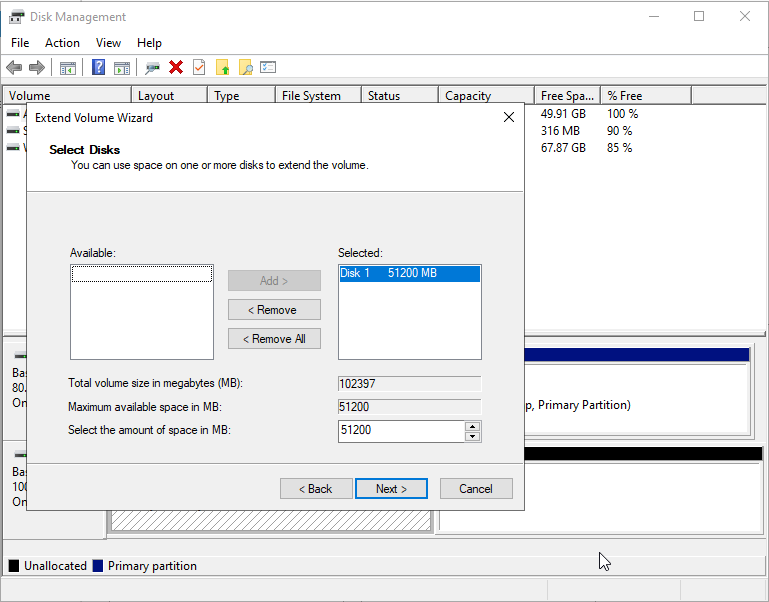

> [!primary]
> Tłumaczenie zostało wygenerowane automatycznie przez system naszego partnera SYSTRAN. W niektórych przypadkach mogą wystąpić nieprecyzyjne sformułowania, na przykład w tłumaczeniu nazw przycisków lub szczegółów technicznych. W przypadku jakichkolwiek wątpliwości zalecamy zapoznanie się z angielską/francuską wersją przewodnika. Jeśli chcesz przyczynić się do ulepszenia tłumaczenia, kliknij przycisk "Zgłóś propozycję modyfikacji" na tej stronie.
> 

**Ostatnia aktualizacja z dnia 14-03-2023**

## Wprowadzenie

Jeśli osiągnąłeś maksymalną pojemność dodatkowego dysku, możesz zwiększyć jego rozmiar.

**Niniejszy przewodnik wyjaśnia, jak zwiększyć rozmiar dodatkowego dysku i odpowiednio rozszerzyć partycję główną.**

## Wymagania początkowe

- Jeden [VPS](https://www.ovhcloud.com/pl/vps/) na koncie OVHcloud.
- Dodatkowy [dysk](/pages/bare_metal_cloud/virtual_private_servers/config_additional_disk) skonfigurowany na serwerze VPS.
- Dostęp do [Panelu client OVHcloud](https://www.ovh.com/auth/?action=gotomanager&from=https://www.ovh.pl/&ovhSubsidiary=pl).
- Dostęp do serwera VPS przez SSH lub RDP.

## W praktyce

Poniższe etapy zakładają, że skonfigurowałeś dodatkowy dysk zgodnie z instrukcjami zawartymi w [tym przewodniku](/pages/bare_metal_cloud/virtual_private_servers/config_additional_disk).

### Zmień rozmiar dysku <a name="extend"></a>

Zaloguj się do [Panelu client OVHcloud](https://www.ovh.com/auth/?action=gotomanager&from=https://www.ovh.pl/&ovhSubsidiary=pl), przejdź do sekcji `Bare Metal Cloud`{.action} i wybierz Twój serwer spośród `Prywatne serwery wirtualne`{.action}.

W sekcji **Podsumowanie opcji** kliknij przycisk `...`{.action} w sekcji `Dodatkowe dyski`. Wybierz `Zwiększ rozmiar dysku`{.action}.

{.thumbnail}

Wybierz nowy rozmiar dysku w oknie, które się wyświetli, po czym kliknij `Zwiększ`{.action}.

{.thumbnail}

Pojawi się komunikat potwierdzający zlecenie. Kliknij link w wiadomości i postępuj zgodnie z poleceniami. Możliwe, że nowa zakładka nawigacyjna dla zamówienia została automatycznie otwarta.

{.thumbnail}

Zwiększenie pojemności dysku zajmie kilka minut po zatwierdzeniu płatności. Możesz sprawdzić postęp operacji w zakładce `Dodatkowe dyski`{.action}: jeśli nowy wybrany rozmiar jest wyświetlany, dysk jest gotowy.

{.thumbnail}

> [!warning]
>
> Zanim przejdziesz dalej, zapisz dane umieszczone na dodatkowym dysku.
>

### Rozszerzenie partycji

> [!warning]
> OVHcloud udostępnia różnorodne usługi, jednak to Ty odpowiadasz za ich konfigurację i zarządzanie nimi. W związku z tym to do Ciebie należy zapewnienie prawidłowego funkcjonowania systemu.
>
> Niniejszy przewodnik ułatwi Ci realizację bieżących zadań. W przypadku trudności zalecamy skorzystanie z pomocy wyspecjalizowanego [usługodawcy](https://partner.ovhcloud.com/pl/directory/) lub skorzystanie z pomocy [naszej społeczności](https://community.ovh.com/en/).
>

#### Na serwerze VPS Linux

> [!primary]
>
> W tej sekcji opisano ogólne podejście do niezbędnych kroków, oparte na systemie operacyjnym Ubuntu Server. Niektóre polecenia mogą wymagać spersonalizowania dystrybucji, której używasz.
>

Jeśli dystrybucja GNU/Linux jest zainstalowana na Twoim serwerze VPS, połącz się z serwerem za pomocą terminala wiersza poleceń lub za pomocą aplikacji klienckiej SSH.

Poniższe przykłady zakładają, że jesteś zalogowany jako użytkownik z dużymi uprawnieniami.

Upewnij się, czy dysk nie jest zamontowany za pomocą polecenia:

```bash
ubuntu@server:~$ sudo umount /mnt/disk
```

W razie potrzeby zastąp `/mnt/disk` Twoją rzeczywistą ścieżką montowania do dodatkowego dysku.

Określ nazwy dysków i partycji:

```bash
ubuntu@server:~$ lsblk
NAME    MAJ:MIN RM   SIZE RO TYPE MOUNTPOINTS
loop0     7:0    0  63.2M  1 loop /snap/core20/1623
loop1     7:1    0  63.3M  1 loop /snap/core20/1828
loop2     7:2    0 111.9M  1 loop /snap/lxd/24322
loop3     7:3    0  49.8M  1 loop /snap/snapd/18357
loop4     7:4    0   103M  1 loop /snap/lxd/23541
sda       8:0    0   160G  0 disk
├─sda1    8:1    0 159.9G  0 part /
├─sda14   8:14   0     4M  0 part
└─sda15   8:15   0   106M  0 part /boot/efi
sdc       8:32   0   100G  0 disk
└─sdc1    8:33   0    50G  0 part 
```

W tym przykładzie dysk jest nazywany `sdc` i ma nowy prawidłowy rozmiar dysku 100 GB po aktualizacji wyjaśnionej w [pierwszej części](#extend) tego przewodnika. Partycja `sdc` 50GB jest dostępna na dysku.

Odtwórz partycję na dysku uruchamiając `fdisk`:

```bash
ubuntu@server:~$ sudo fdisk /dev/sdc
```

Wprowadź następujące polecenia na stronie `fdisk`:

```console
Welcome to fdisk (util-linux 2.37.2).
Changes will remain in memory only, until you decide to write them.
Be careful before using the write command.

Command (m for help): d
Selected partition 1
Partition 1 has been deleted.

Command (m for help): n
```

Potwierdź wszystkie wartości domyślne, naciskając `Enter`:

```console
Partition type
   p   primary (0 primary, 0 extended, 4 free)
   e   extended (container for logical partitions)
Select (default p):

Using default response p.
Partition number (1-4, default 1):
First sector (2048-209715199, default 2048):
Last sector, +/-sectors or +/-size{K,M,G,T,P} (2048-209715199, default 209715199):

Created a new partition 1 of type 'Linux' and of size 100 GiB.
```

Wpisz `n` i na końcu `w`:

```console
Partition #1 contains a ext4 signature.

Do you want to remove the signature? [Y]es/[N]o: n

Command (m for help): w

The partition table has been altered.
Calling ioctl() to re-read partition table.
Syncing disks.
```

Sprawdź partycję i rozszerzaj system plików:

```bash
ubuntu@server:~$ sudo e2fsck -f /dev/sdc1
e2fsck 1.46.5 (30-Dec-2021)
/dev/sdc1: recovering journal
Pass 1: Checking inodes, blocks, and sizes
Pass 2: Checking directory structure
Pass 3: Checking directory connectivity
Pass 4: Checking reference counts
Pass 5: Checking group summary information
/dev/sdc1: 11/3276800 files (0.0% non-contiguous), 284558/13106944 blocks
```
```bash
ubuntu@server:~$ sudo resize2fs /dev/sdc1
resize2fs 1.46.5 (30-Dec-2021)
Resizing the filesystem on /dev/sdc1 to 26214144 (4k) blocks.
The filesystem on /dev/sdc1 is now 26214144 (4k) blocks long.
```

Podnieś dysk:

```bash
ubuntu@server:~$ sudo mount /dev/sdc1 /mnt/disk/
```

Partycja 1 wykorzystuje teraz maksymalny rozmiar dysku.

```bash
ubuntu@server:~$ df -h
Filesystem      Size  Used Avail Use% Mounted on
tmpfs           776M  992K  776M   1% /run
/dev/sda1       155G  2.2G  153G   2% /
tmpfs           3.8G     0  3.8G   0% /dev/shm
tmpfs           5.0M     0  5.0M   0% /run/lock
/dev/sda15      105M  5.3M  100M   5% /boot/efi
tmpfs           776M  4.0K  776M   1% /run/user/1000
/dev/sdc1        99G   24K   94G   1% /mnt/disk
```

#### Na serwerze VPS Windows

Jeśli system operacyjny Windows jest zainstalowany na Twoim serwerze VPS, połącz się z serwerem RDP (Remote Desktop).

Po zalogowaniu kliknij prawym przyciskiem myszy przycisk `Menu Start`{.action} i otwórz `Zarządzanie dyskami`{.action}.

{.thumbnail}

Rozszerzony [dysk](#extend) wyświetla dodatkową pojemność w postaci nieprzydzielonej przestrzeni. Kliknij prawym przyciskiem myszy objętość dodatkowego dysku i wybierz `Rozszerz`{.action} z menu kontekstowego.

{.thumbnail}

W asystencie rozszerzenia wolumenu kliknij Dalej, `aby kontynuować`{.action}.

W razie potrzeby będziesz mógł zmienić przestrzeń dyskową na tym etapie. Kliknij `Dalej`{.action}.

{.thumbnail}

Kliknij przycisk `Zakończ`{.action}, aby zakończyć proces.

Zmieniony rozmiar przestrzeni dyskowej zawiera teraz dodatkową przestrzeń dyskową.

{.thumbnail}

## Sprawdź również

Dołącz do społeczności naszych użytkowników na stronie <https://community.ovh.com/en/>.
