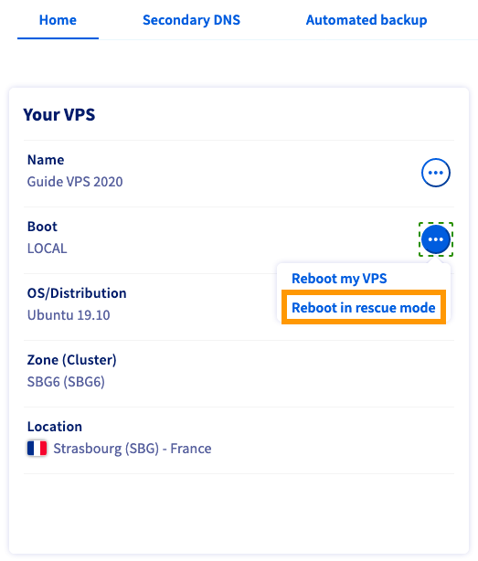

**Ultimo aggiornamento: 02/05/2022**

> [!primary]
> Questa traduzione è stata generata automaticamente dal nostro partner SYSTRAN. I contenuti potrebbero presentare imprecisioni, ad esempio la nomenclatura dei pulsanti o alcuni dettagli tecnici. In caso di dubbi consigliamo di fare riferimento alla versione inglese o francese della guida. Per aiutarci a migliorare questa traduzione, utilizza il pulsante "Contribuisci" di questa pagina.
>

## Obiettivo

La modalità Rescue è uno strumento del tuo VPS. che permette di avviare il server su un sistema operativo temporaneo. In questo modo sarà possibile diagnosticare e risolvere i problemi nel tuo sistema operativo principale. 

Tramite la modalità Rescue, puoi:

  - modificare la password di root
  - diagnosticare problemi di rete;
  - riparare un sistema operativo difettoso
  - correggere una configurazione errata del firewall software;
  - prova le prestazioni del disco.

Verificare il Rescue mode aiuta anche a stabilire se il software o l'hardware sono in difficoltà. Ti consigliamo di farlo prima di contattare i nostri team di supporto.

> [!warning]
>
> Se i tuoi servizi sono in produzione sul tuo VPS, la modalità Rescue interrompe la macchina fino a quando non sarà stata riavviata in modalità normale.
> 

**Questa guida ti mostra come attivare e utilizzare la modalità Rescue sul tuo VPS.**

## Prerequisiti

- Avere accesso allo [Spazio Cliente OVHcloud](https://www.ovh.com/auth/?action=gotomanager&from=https://www.ovh.it/&ovhSubsidiary=it){.external}
- Disporre di un [VPS OVHcloud](https://www.ovhcloud.com/it/vps/){.external} già configurato

> [!warning]
>
> OVHcloud mette a disposizione i server,  ma non è autorizzata ad accedervi e non si occupa quindi della loro amministrazione. Garantire quotidianamente la gestione software e la sicurezza di queste macchine è quindi responsabilità dell’utente. Questa guida ti aiuta a realizzare le operazioni più ricorrenti. Tuttavia, in caso di difficoltà o dubbi relativi ad amministrazione e sicurezza, ti consigliamo di contattare un fornitore specializzato. Per maggiori informazioni consulta la sezione “Per saperne di più” di questa guida.
> 

## Procedura

### Attiva la modalità Rescue

Accedi allo [Spazio Cliente OVHcloud](https://www.ovh.com/auth/?action=gotomanager&from=https://www.ovh.it/&ovhSubsidiary=it), clicca su `Bare Metal Cloud`{.action} e seleziona il tuo server nella sezione `Server Privati Virtuali`{.action}.

#### Con l'offerta VPS corrente

Nella scheda `Home`{.action} clicca sui tre puntini `...`{.action} in corrispondenza di "Boot" nella zona **Il tuo VPS**.

{.thumbnail}

Seleziona `Riavvia in modalità Rescue`{.action} nel menu.

#### Con la soluzione VPS precedente

Nella scheda `Home`{.action}, clicca sul link di accesso intitolato `Riavviare in Rescue mode`{.action}.

{.thumbnail}

Si apre una finestra, clicca su `Conferma`{.action} per avviare il riavvio in modalità Rescue.

### Utilizzo della modalità Rescue

Una volta avviato il riavvio, la barra di progressione indica lo stato di avanzamento dell'operazione. Ti ricordiamo che l'operazione potrebbe richiedere alcuni minuti.

> [!primary]
>
> Riceverai un'email automatizzata con le credenziali SSH per accedere alla modalità Rescue. Attendi il ricevimento dell'email prima di adottare qualsiasi altra misura. Questa email è disponibile anche nello [Spazio Cliente OVHcloud](https://www.ovh.com/auth/?action=gotomanager&from=https://www.ovh.it/&ovhSubsidiary=it). Per ritrovarlo, clicca sul nome associato all'identificativo OVHcloud nella barra dei menu situata nell'angolo superiore destro e seleziona `Email di servizio`{.action}.
>

A questo punto dovrai accedere al tuo server da riga di comando o tramite un tool SSH, utilizzando la password di root generata per la modalità Rescue.

ad esempio:

```bash
ssh root@your_server_IP
root@your_server_password:
```

> [!warning]
>
> Il tuo client SSH probabilmente bloccherà la connessione per prima, a causa di un'incompatibilità dell'impronta ECDSA. Questa operazione è normale perché la modalità Rescue utilizza un server SSH dedicato temporaneamente.
>
> Per aggirare il problema, puoi commentare l'impronta del tuo sistema abituale aggiungendo una `#` davanti alla sua linea nel file *known_hosts*. Elimina questo carattere prima del riavvio del server in modalità normale.
>
La maggior parte delle modifiche apportate al tuo server via SSH in modalità Rescue richiedono il mount di una partizione. Questa modalità possiede infatti il proprio file system temporaneo. e, di conseguenza, le modifiche apportate al file system vengono perse con il reboot della macchina sul disco principale.

Verifica i dischi disponibili con questo comando:

```bash
[RESCUE] root@vps-111111d:~ $ lsblk
NAME MAJ:MIN RM SIZE RO TYPE MOUNTPOINT
sda 8:0 0 2.5G 0 disk
└─sda1 8:1 0 2.5G 0 part /
sdb 8:16 0 80G 0 disk
└─sdb1 8:17 0 80G 0 part
```

monta la partizione:

```bash
[RESCUE] root@vps-111111d:~ $ mount /dev/sdb1 /mnt
```

I tuoi dati saranno accessibili dalla directory `/mnt`.

Una volta terminate le operazioni in modalità Rescue, riavvia il VPS in modalità "normale" dal tuo [Spazio Cliente OVHcloud](https://www.ovh.com/auth/?action=gotomanager&from=https://www.ovh.it/&ovhSubsidiary=it).

{.thumbnail}

## Per saperne di più

[Modificare la password di root su un VPS](/pages/bare_metal_cloud/virtual_private_servers/root_password)

[Introduzione a SSH](/pages/bare_metal_cloud/dedicated_servers/ssh_introduction)

Unisciti alla nostra Community di utenti <https://community.ovh.com/en/>.
