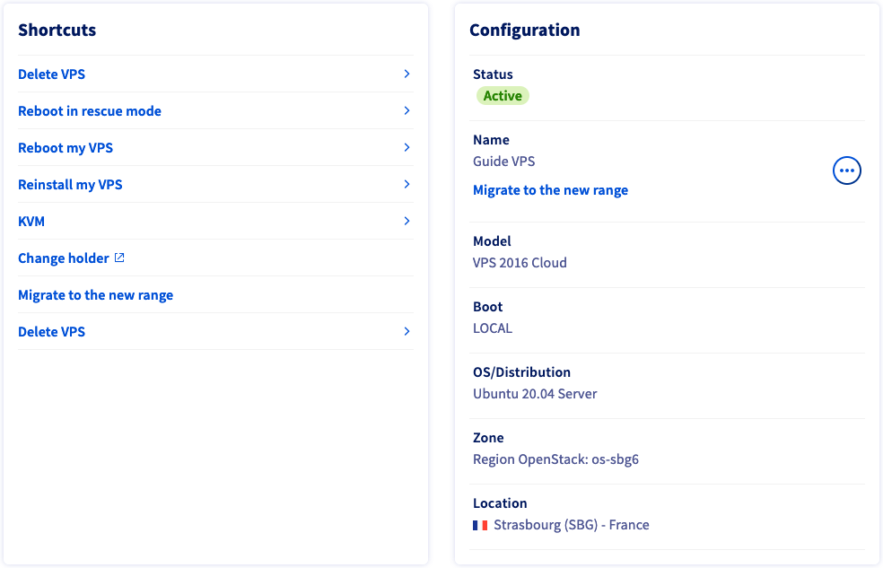

## Objective

You can identify an old-range VPS by the reference name displayed in your [OVHcloud Control Panel](https://ca.ovh.com/auth/?action=gotomanager&from=https://www.ovh.com/ca/en/&ovhSubsidiary=ca): If this internal identifier has the format *vpsXXXX.ovh.net* (in which *X* stands for a number) and you have not migrated the corresponding VPS to our [current product line](https://www.ovhcloud.com/en-ca/vps/), this is a legacy VPS. There are a few differences to consider when managing such a service.

The reference name of a current VPS looks like this: *vps-XXXXXXX.vps.ovh.net* (where *X* can be a number or a letter).

**This guide explains the Control Panel functions of a legacy VPS.**

## Requirements

- A legacy [Virtual Private Server](https://www.ovhcloud.com/en-ca/vps/vps-offer-migration/) in your OVHcloud account
- Access to the [OVHcloud Control Panel](https://ca.ovh.com/auth/?action=gotomanager&from=https://www.ovh.com/ca/en/&ovhSubsidiary=ca)

## Instructions

Log in to the [OVHcloud Control Panel](https://ca.ovh.com/auth/?action=gotomanager&from=https://www.ovh.com/ca/en/&ovhSubsidiary=ca), open `Bare Metal Cloud`{.action} and select your server from `Virtual Private Servers`{.action}. On the `Home`{.action} tab you can access the main VPS operations from the section **Shortcuts**.

{.thumbnail}

### Delete VPS

This will open a popup window to initiate the process of [cancelling your service](/pages/account_and_service_management/managing_billing_payments_and_services/how_to_cancel_services).

### Reboot in rescue mode

Click on this option to restart the VPS into rescue mode. Find all the details in [our guide](/pages/bare_metal_cloud/virtual_private_servers/rescue).

### Reboot my VPS

This Control Panel option will carry out a "hard reboot" of your VPS if you click on `Confirm`{.action} in the popup window.

A restart might become necessary in order to apply updated configurations or to fix an issue. Whenever feasible, perform a "soft reboot" via the command line:

```bash
sudo reboot
```

### Reinstall my VPS

Click on this option to install a new operating system. In the popup window, you will be asked to choose:

- An operating system from the drop-down list
- The language
- An [SSH key](/pages/bare_metal_cloud/dedicated_servers/creating-ssh-keys-dedicated) (optional)

Note that the selection of operating systems might be limited on your service.

> [!primary]
>
> Some proprietary operating systems or platforms such as Plesk or cPanel require licences which generate additional fees. Licences can be managed from the OVHcloud Control Panel: Go to the `Bare Metal Cloud`{.action} section, then open `Licences`{.action}.

You will receive an email once the installation is complete. This process may take up to 30 minutes.

#### Connecting to your VPS after reinstallation

When you reinstall your VPS, you will be sent an email containing your root password for connecting to your VPS via [SSH](/pages/bare_metal_cloud/dedicated_servers/ssh_introduction), unless you have selected an [SSH key](/pages/bare_metal_cloud/dedicated_servers/creating-ssh-keys-dedicated) to be preinstalled.

#### Disabling server access for the root user

The user "**root**" is created by default on GNU/Linux systems. Root access means having the highest level of permissions on an operating system. It can be dangerous to leave your VPS accessible via the root user login and password, as this account can perform irreversibly damaging operations.

You can disable root user logins via the SSH protocol. Remember to [create another user](/pages/bare_metal_cloud/virtual_private_servers/secure_your_vps#createuser) before following the steps below.

Use a text editor such as *vim* or *nano* to edit this configuration file:

```bash
sudo nano /etc/ssh/sshd_config
```

Locate the following line:

```console
PermitRootLogin yes 
```

Replace **yes** with **no** after `PermitRootLogin`. Save and exit the editor.

For this modification to be taken into account, you need to restart the SSH service with one of the following commands:

```bash
sudo systemctl restart ssh
```

```bash
sudo systemctl restart sshd
```

This should be sufficient to apply the changes. Alternatively, reboot the VPS (`~$ sudo reboot`).

Afterwards, connections to your server via root user (`ssh root@IPv4_VPS`) will be rejected.

### KVM

Use this option to connect to your VPS via KVM. Find all the details in [our guide](/pages/bare_metal_cloud/virtual_private_servers/using_kvm_for_vps).

### Change holder

This link directs you to the form to fill out in case the owner of the VPS has to be changed. Contact our support teams by creating a ticket in the [OVHcloud Control Panel](https://ca.ovh.com/auth/?action=gotomanager&from=https://www.ovh.com/ca/en/&ovhSubsidiary=ca) if you need assistance with this procedure.

### Migrate to the new range

Your VPS can be migrated to the current range automatically. Find out the benefits of this offer on our [VPS migration FAQ page](https://www.ovhcloud.com/en-ca/vps/vps-offer-migration/).

## Go further

[Introduction to SSH](/pages/bare_metal_cloud/dedicated_servers/ssh_introduction)

[Creating and using SSH keys](/pages/bare_metal_cloud/dedicated_servers/creating-ssh-keys-dedicated)

[Securing a VPS](/pages/bare_metal_cloud/virtual_private_servers/secure_your_vps)

[Configuring a new Windows Server installation](/pages/bare_metal_cloud/virtual_private_servers/windows_first_config)

[Getting started with a VPS](/pages/bare_metal_cloud/virtual_private_servers/starting_with_a_vps)

Join our community of users on <https://community.ovh.com/en/>.
