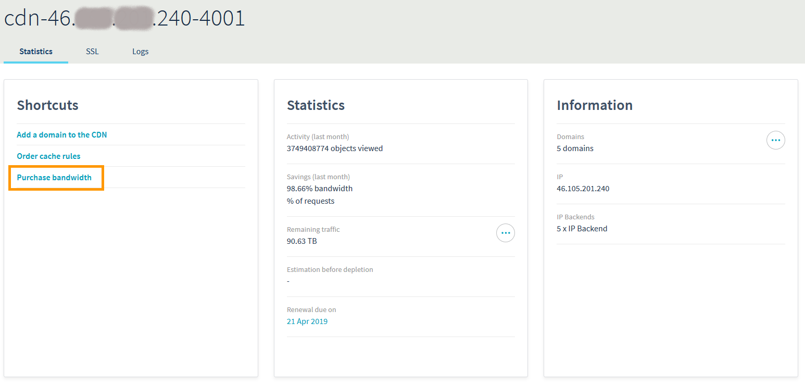

**Dernière mise à jour le 22/02/2018**

## Objectif

Le Content Delivery Network (CDN) vous permet d'optimiser le temps de réponse de vos sites pour tous vos utilisateurs. Toute connexion à votre site va créer un flux de données consommant du quota (limitation du volume total qui peut transiter vers et depuis votre CDN).

**Ce guide vous détaille toutes les informations sur la gestion du quota sur votre CDN.**

## Prérequis

- Avoir accès à votre [espace client OVH](https://www.ovh.com/auth/?action=gotomanager&from=https://www.ovh.com/fr/&ovhSubsidiary=fr){.external}.

## En pratique

### Renouveler votre quota

Lors de votre commande, **1 To** de trafic vous est offert. Attention, ce quota n'est pas renouvelé chaque mois avec votre offre. En effet, une fois ce volume consommé (quelle que soit la durée), vous devrez en ajouter à nouveau.

Si vous avez besoin de quota supplémentaire, vous pouvez le commander directement depuis votre [espace client OVH](https://www.ovh.com/auth/?action=gotomanager&from=https://www.ovh.com/fr/&ovhSubsidiary=fr){.external} :

{.thumbnail}

Retrouvez les tarifications de ce quota sur [notre site](https://www.ovh.com/fr/cdn/infrastructure/){.external}.

Une alerte vous est automatiquement envoyée lorsqu'il vous reste **100 Go** de quota pour que vous puissiez planifier un nouvel achat de bande passante. S'il ne vous reste plus de quota, la fonction `*bypass*` sera automatiquement activée jusqu'à ce que vous possédiez de nouveau du quota disponible.

### Le trafic facturé sur l'offre CDN

> [!primary]
>
> L'ensemble du trafic sortant par le CDN vous est facturé.  
>

Prenons cet exemple :

{.thumbnail}

- Les 21,74 Mo représentent des fichiers déjà mis en cache. Le CDN a alors pu répondre directement aux requêtes concernant ces fichiers.

- Les 72,96 Mo représentent des fichiers directement appelés sur le *back end*, derrière le CDN. Ce qui sera mis en cache ou ce qui devra être appelé directement sur votre *back end* dépendra des règles de cache appliquées sur votre domaine.

Que les fichiers soient pris en cache ou appelés sur le *back end* en passant par le CDN, **les deux trafics seront soustraits de votre quota**. C'est pourquoi nous vous conseillons de créer un sous-domaine spécifique qui sera appelé pour les fichiers devant être pris en cache et conserver des domaines pointant vers votre *back end* pour les autres fichiers.

## Aller plus loin

Échangez avec notre communauté d’utilisateurs sur <https://community.ovh.com>.