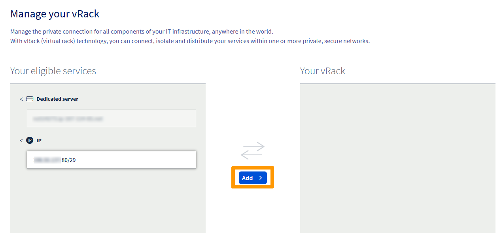

**Última atualização: 26/07/2022**

## Objetivo

Além do direcionamento IP privado, o [vRack](https://www.ovh.pt/solucoes/vrack/){.external} permite direcionar o tráfego IP público através da porta vRack do servidor através de um bloco de endereços IP públicos.

**Este manual explica como configurar um bloco de endereços IP públicos no vRack.**


## Requisitos

- Ter reservado um bloco público de endereços IP na sua conta, com um mínimo de quatro endereços.
- Ter acesso ao intervalo de endereços de IP privados escolhidos.
- Dispor de um [servidor compatível com o vRack](https://www.ovh.pt/servidores_dedicados/){.external}.
- Ter ativado um serviço [vRack](https://www.ovh.pt/solucoes/vrack/){.external}.
- Ter acesso à [Área de Cliente OVHcloud](https://www.ovh.com/auth/?action=gotomanager&from=https://www.ovh.pt/&ovhSubsidiary=pt){.external}.

> [!warning]
> Esta funcionalidade pode estar indisponível ou limitada nos [servidores dedicados **Eco**](https://eco.ovhcloud.com/pt/about/).
>
> Para mais informações, consulte o nosso [comparativo](https://eco.ovhcloud.com/pt/compare/).

## Instruções

> [!primary]
>
> A título de exemplo, iremos utilizar um bloco de endereços IP 46.105.135.96/28 e a interface de rede secundária `eth1` (dedicada ao vRack).
>

### Adicionar o bloco IP ao vRack

> [!warning]
>
> Quando um bloco IP é adicionado ao vRack, este deixa de estar ligado a um servidor físico.
>
> Esta configuração permite configurar endereços IP de um mesmo bloco em vários servidores, desde que todos estejam no mesmo vRack que o bloco IP. O bloco IP deve ter pelo menos 2 endereços IP utilizáveis ou mais para que isso seja possível.
>

Na sua [Área de Cliente OVHcloud](https://www.ovh.com/auth/?action=gotomanager&from=https://www.ovh.pt/&ovhSubsidiary=pt), vá à secção `Bare Metal Cloud`{.action} e clique em `Network`{.action}. A seguir, abra o menu `vRack`{.action}.

Selecione o seu vRack na lista para apresentar a lista dos serviços elegíveis. Clique no bloco IP que deseja adicionar ao vRack e clique no botão `Adicionar`{.action}.

{.thumbnail}

### Configurar um endereço IP utilizável

No caso do vRack, o primeiro, o penúltimo e o último endereço de um bloco de endereços IP estão sempre reservados, respetivamente, para o endereço da rede, ao gateway da rede e ao *broadcast* da rede. Isto significa que o primeiro endereço utilizável é o segundo endereço do bloco, como indicado a seguir:

```sh
46.105.135.96   # Reservado: endereço de rede
46.105.135.97   # Primeiro IP utilizável
46.105.135.98
46.105.135.99
46.105.135.100
46.105.135.101
46.105.135.102
46.105.135.103
46.105.135.104
46.105.135.105
46.105.135.106
46.105.135.107
46.105.135.108
46.105.135.109   # Último IP utilizável
46.105.135.110   # Reservado: gateway de rede  
46.105.135.111   # Reservado: broadcast
```

Para configurar o primeiro endereço IP utilizável, é preciso editar o ficheiro de configuração de rede, como indicado abaixo. Neste exemplo, utilize uma máscara de sub-rede **255.255.255.240**.

> [!primary]
>
> A máscara de sub-rede utilizada neste exemplo adequa-se ao nosso bloco de endereços IP. A sua máscara de sub-rede pode diferir em função da dimensão do bloco. Quando comprar o seu bloco de endereços IP, receberá um e-mail com a máscara de sub-rede que deve utilizar.
>


```sh
/etc/network/interfaces

auto eth1
iface eth1 inet static
address 46.105.135.97
netmask 255.255.255.240
broadcast 46.105.135.111
```

### Criar uma nova tabela de roteamento IP

Antes de mais, é preciso descarregar e instalar o “iproute2”, um pacote que permitirá configurar manualmente o roteamento IP no servidor.

A seguir, estabeleça uma ligação SSH ao seu servidor e utilize o comando seguinte para descarregar e instalar o pacote:

```sh
apt-get install iproute2
```

Agora tem de criar uma nova rota IP para o vRack. Para isso, basta adicionar uma nova regra de tráfego alterando o ficheiro, tal como indicado a seguir:

```sh
/etc/iproute2/rt_tables

# # #
# reserved values
# # #
255	local
254	main
253	default
0	unspec
# # #
local
# # #
#1	inr.ruhep
1 vrack
```

### Modificar o ficheiro de configuração de rede

> [!primary]
>
> A título de exemplo, o ficheiro de configuração de rede a que nos referimos encontra-se em `/etc/network/interfaces`. Em função do sistema operativo utilizado, o ficheiro equivalente pode encontrar-se noutro local. Não hesite em consultar a documentação oficial da sua distribuição em caso de dúvidas.
>

Por fim, resta modificar o ficheiro de configuração de rede para ter em conta a nova regra de tráfego e encaminhar o tráfego vRack através do endereço do gateway de rede **46.105.135.110**.

```sh
/etc/network/interfaces

auto eth1
iface eth1 inet static
address 46.105.135.97
netmask 255.255.255.240
broadcast 46.105.135.111
post-up ip route add 46.105.135.96/28 dev eth1 table vrack
post-up ip route add default via 46.105.135.110 dev eth1 table vrack
post-up ip rule add from 46.105.135.96/28 table vrack
post-up ip rule add to 46.105.135.96/28 table vrack
```

Reinicie o servidor para aplicar as modificações realizadas.


## Quer saber mais?

[Configurar vários servidores dedicados no vRack](/pages/cloud/dedicated/vrack_configuring_on_dedicated_server){.external}

[Criar várias VLAN no vRack](/pages/cloud/dedicated/creating-multiple-vlans-in-a-vrack){.external}

[Configurar o vRack entre o Public Cloud e um servidor dedicado](/pages/cloud/dedicated/configuring-the-vrack-between-the-public-cloud-and-a-dedicated-server){.external}
 
Fale com a nossa comunidade de utilizadores: <https://community.ovh.com/en/>.