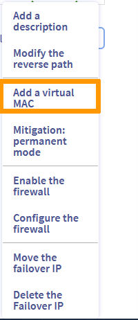

> [!primary]
> Esta tradução foi automaticamente gerada pelo nosso parceiro SYSTRAN. Em certos casos, poderão ocorrer formulações imprecisas, como por exemplo nomes de botões ou detalhes técnicos. Recomendamos que consulte a versão inglesa ou francesa do manual, caso tenha alguma dúvida. Se nos quiser ajudar a melhorar esta tradução, clique em "Contribuir" nesta página.
>

**Última atualização: 22/12/2022**

## Sumário

A OVHcloud permite-lhe associar um endereço MAC virtual a um endereço de IP, de modo a poder instalar máquinas virtuais com uma configuração bridge no seu servidor.

**Este manual explica como criar um endereço MAC virtual e como associá-lo a um Additional IP.**

## Requisitos

- Dispor de um [servidor dedicado](https://www.ovh.pt/servidores_dedicados/){.external}.
- Dispor de um [endereço de Additional IP](https://www.ovhcloud.com/pt/bare-metal/ip/){.external} ou de um bloco de Additional IP (RIPE).
- Ter acesso à [Área de Cliente OVHcloud](https://www.ovh.com/auth/?action=gotomanager&from=https://www.ovh.pt/&ovhSubsidiary=pt){.external}  ou à [API OVHcloud](https://api.ovh.com/).
- O seu servidor deve suportar os MAC virtuais. Consulte [este guia](https://docs.ovh.com/pt/dedicated/network-support-virtual-mac/) para saber mais.

> [!warning]
> Esta funcionalidade pode estar indisponível ou limitada nos [servidores dedicados **Eco**](https://eco.ovhcloud.com/pt/about/).
>
> Para mais informações, consulte o nosso [comparativo](https://eco.ovhcloud.com/pt/compare/).

> [!primary]
> Se não está familiarizado com a utilização da API OVHcloud, consulte o nosso guia [Primeiros passos com as API OVHcloud](https://docs.ovh.com/pt/api/first-steps-with-ovh-api/).

## Instruções

### Atribuir um endereço MAC

> [!warning]
>
> Se um bloco IP foi migrado para o vRack, já não é atribuído a um servidor físico. Já não é possível atribuir um MAC virtual a um IP.
>

#### Através da Área de Cliente OVHcloud

Depois de aceder à [Área de Cliente OVHcloud](https://www.ovh.com/auth/?action=gotomanager&from=https://www.ovh.pt/&ovhSubsidiary=pt){.external}, clique no menu `Bare Metal Cloud`{.action} e abra a secção `IP`{.action}.

Clique no separador `Additional IP`{.action}.

{.thumbnail}

De seguida, localize na lista o endereço de Additional IP (ou o bloco) e clique no botão `...`{.action} para exibir a lista de opções.

{.thumbnail}

Quando aparecer a caixa de diálogo “Adicionar um MAC virtual”, selecione um tipo no menu pendente, introduza o nome da máquina virtual e clique em `Confirmar`{.action}.

> [!primary]
>
> **Tipo**: trata-se do tipo de endereço MAC virtual (“VMware” será um endereço MAC feito para o sistema VMware ESXi, ao passo que “ovh” servirá para todos os outros tipos de sistemas de virtualização).
>
> **Nome da máquina virtual**: trata-se do nome desejado para o endereço MAC virtual, para depois se encontrar mais facilmente o par IP/MAC.
>

{.thumbnail}

> [!primary]
>
> Não se esqueça de atribuir o endereço MAC virtual criado durante a configuração da máquina virtual.
> 

#### Através da API OVHcloud

Utilize a seguinte chamada API:

> [!api]
>
> @api {POST} /dedicated/server/{serviceName}/virtualMac/{macAddress}/virtualAddress/{ipAddress}

### Eliminar um endereço MAC

> [!warning]
>
> A eliminação de um endereço MAC é definitiva: não será possível recuperá-lo.
> 

#### Através da Área de Cliente OVHcloud

Para eliminar um endereço MAC virtual associado a um Additional IP, aceda à [Área de Cliente](https://www.ovh.com/auth/?action=gotomanager&from=https://www.ovh.pt/&ovhSubsidiary=pt){.external}, clique no menu `Bare Metal Cloud`{.action} e abra a secção `IP`{.action}. Escolha o servidor em causa, de modo a aparecer o Additional IP (ou o bloco de IP) a ele associado.

Para concluir, clique no botão `...`{.action} à direita e em `Eliminar um MAC virtual`{.action}.

#### Através da API OVHcloud

Utilize a seguinte chamada API:

> [!api]
>
> @api {DELETE} /dedicated/server/{serviceName}/virtualMac/{macAddress}/virtualAddress/{ipAddress}
>

## Quer saber mais?

Junte-se à nossa comunidade de utilizadores em <https://community.ovh.com/en/>.