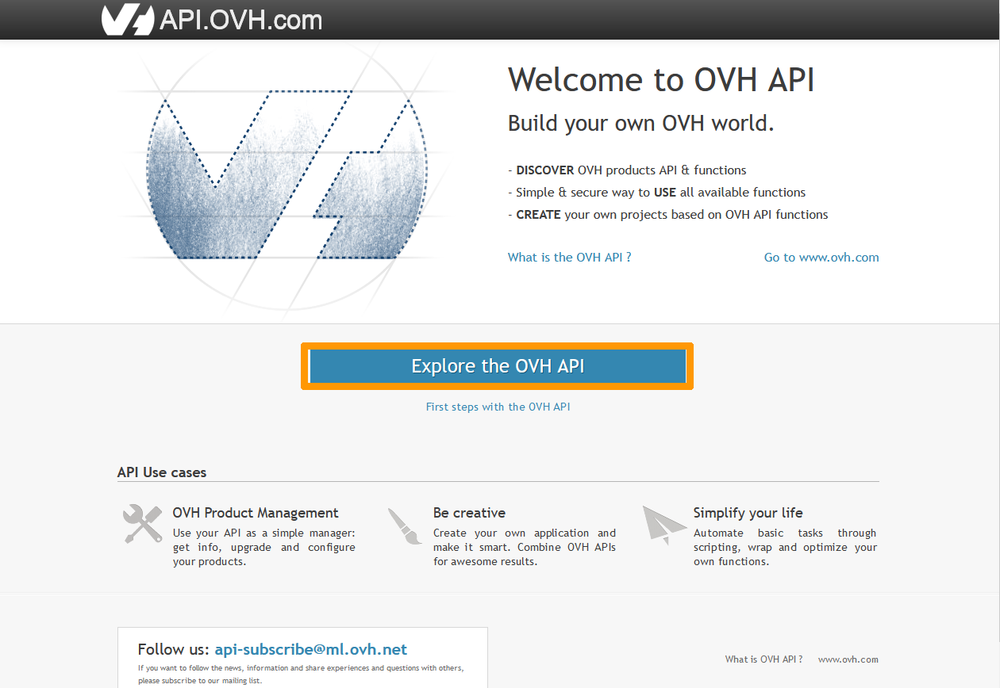
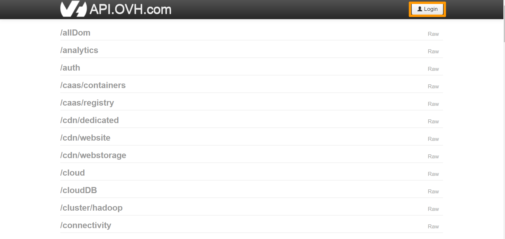
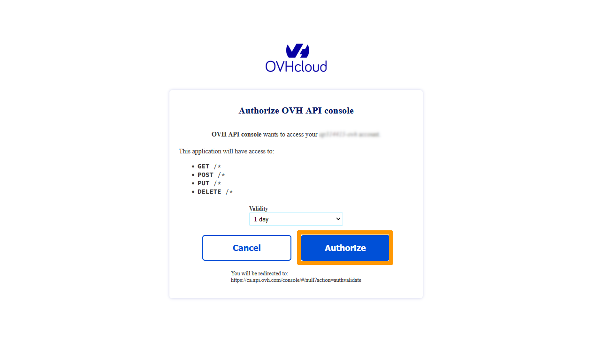
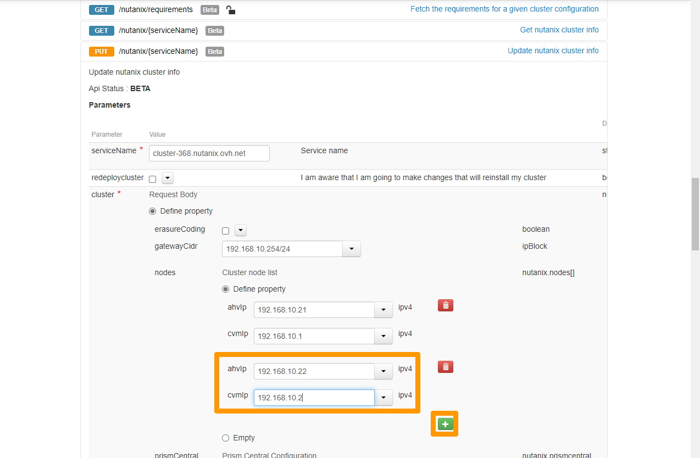
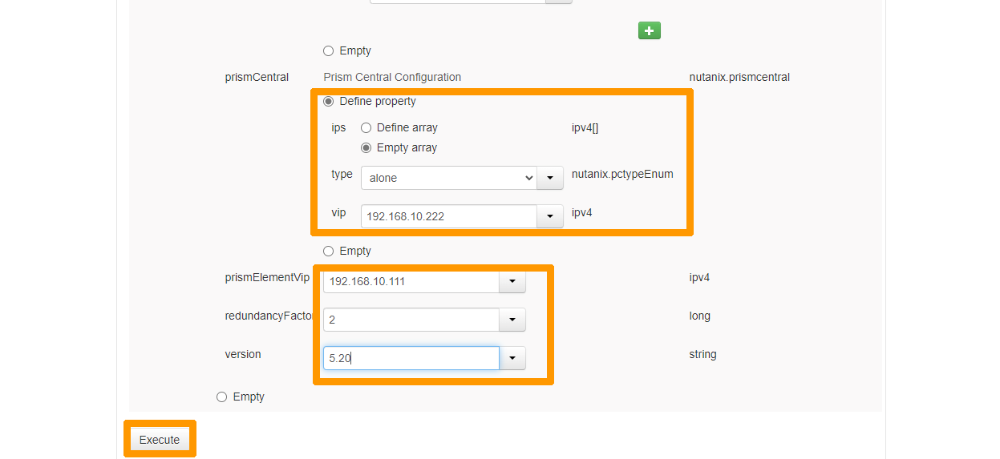

**Dernière mise à jour le 09/06/2022**

## Objectif

Reconditionner un cluster avec des paramètres réseaux personnalisés au travers de l'API d'OVHcloud.

> [!warning]
> OVHcloud vous met à disposition des services dont la configuration, la gestion et la responsabilité vous incombent. Il vous appartient donc de ce fait d’en assurer le bon fonctionnement.
>
> Ce guide a pour but de vous accompagner au mieux sur des tâches courantes. Néanmoins, nous vous recommandons de faire appel à un prestataire spécialisé si vous éprouvez des difficultés ou des doutes concernant l’administration, l’utilisation ou la mise en place d’un service sur un serveur.
>

## Prérequis

- Disposer d'un cluster Nutanix dans votre compte OVHcloud
- Être connecté à votre [espace client OVHcloud](https://www.ovh.com/auth/?action=gotomanager&from=https://www.ovh.com/fr/&ovhSubsidiary=fr)

## Présentation de l'utilisation du réseau privé pour un cluster Nutanix chez OVHcloud. 

Avant de redéployer un cluster Nutanix Il faut définir un réseau privé avec son masque de sous réseau comme ceci `XX.XX.XX.XX/XX` et ensuite choisir des adresses IP à l'intérieur de cette étendue.

La liste des adresses IP nécessaires varie en fonction du nombre de serveurs commandés (La solution Proposée par OVHcloud va de 3 à 18 nœuds) et du mode de configuration de **Prism Central** (**Alone** ou **Scale**) voici le détail des besoins :

- Entre 6 et 36 adresses IP pour les serveurs physiques (Il faut deux adresses par serveur, une pour l'hyperviseur **AHV** et une autre pour la machine virtuelle **CVM**).
- Une adresse IP pour **Prism Element**.
- Une adresse IP pour l'adresse IP de **Prism Central**.
- 3 adresses IP optionnelles pour un déploiement de **Prism Central** en mode scale avec 3 machines virtuelles.
- Une adresse IP pour la passerelle Internet.

Certaines adresses du plan IP sont réservées pour le **Load balancer** elles sont toujours sur le réseau `XX.XX.XX.128/27` soit les adresses comprises en `XX.XX.XX.129 & XX.XX.XX.158` du réseau, il ne faut pas les utiliser lors du redéploiement.

Voici deux exemples possible de configuration d'un cluster Nutanix chez OVHcloud:

**Exemple1 :** Reconfiguration d'un cluster avec 3 nœuds sur un plan IP en `192.168.10.0/24`.

- Serveur1 : adresse VM **CVM** `192.168.10.1`, adresse IP hyperviseur **AHV** `192.168.10.21`.
- Serveur2 : adresse VM **CVM** `192.168.10.2`, adresse IP hyperviseur **AHV** `192.168.10.22`.
- Serveur3 : adresse VM **CVM** `192.168.10.3`, adresse IP hyperviseur **AHV** `192.168.10.23`.
- Adresse virtuelle de **Prism Element** : `192.168.10.111`.
- Adresse IP  **Prism Central** :`192.168.10.222`.
- Etendue réservée pour le load balancer : `192.168.10.128 à 192.168.10.159`.
- Passerelle : `192.168.10.254`.

**Exemple2 :** Reconfiguration d'un cluster avec 4 nœuds en mode Scale pour **Prism Central** sur un plan IP en `172.16.0.0/16`.

- Serveur1 : adresse VM **CVM** `172.16.0.1`, adresse IP hyperviseur **AHV** `172.16.0.21`.
- Serveur2 : adresse VM **CVM** `172.16.0.2`, adresse IP hyperviseur **AHV** `172.16.0.22`.
- Serveur3 : adresse VM **CVM** `172.16.0.3`, adresse IP hyperviseur **AHV** `172.16.0.23`.
- Serveur4 : adresse VM **CVM** `172.16.0.4`, adresse IP hyperviseur **AHV** `172.16.0.24`.
- Adresse virtuelle de **Prism Element** : `172.16.0.111`.
- Adresse virtuelle de **Prism Central** : `172.16.0.222`.
- VM Prism Central : `172.16.0.223 à 172.16.0.225`.
- Le load balancer : `172.16.0.128 à 172.16.0.159`.
- Passerelle : `172.16.0.254`.

## En pratique

Nous allons redéployer un cluster de 3 nœuds comme dans l'exemple 1 du chapitre précèdent.

> [!warning]
> L'opération de redéploiement du cluster est irréversible, toutes les données du cluster sont supprimées
> et un nouveau mot de passe du compte admin est généré et envoyé sur la boite à lettre du compte client.

Se connecter à l'API d'OVHcloud au travers de l'interface WEB [API OVHcloud](https://api.ovh.com) avec votre compte client.

Cliquer sur `Explore the OVH API`{.action} au milieu de l'écran.

Cliquer sur `Login`{.action} en haut à droite.

Saisissez ces informations.

* **Email :**  `nom ou email du compte client`
* **Password :** `Mot de passe du compte client`

et cliquez sur `Login`{.action}.

Cliquez sur `Authorize`{.action}.

Au travers de l'interface cliquez sur `Nutanix`{.action}.

Choisissez `Update nutanix cluster info`{.action}.

Remplissez ces données :

* **ServiceName :** `Nom FQDN de votre cluster Nutanix`.
* **redeploycluster :**  `Cochez la case`.
* **gatewayCidr :** `l'adresse IP de la passerelle suivi du masque de sous réseau`.

Saisissez ces informations en dessous de **nodes :**   

* **ahvip :** `Adresse IP de l'hyperviseur du premier nœud`.
* **cvmip :** `Adresse IP de la CVM du second nœud`.

Et cliquez sur le bouton `Plus`{.action}.

Rajoutez les informations du deuxième nœud :
 
* **ahvip :** `Adresse IP de l'hyperviseur du deuxième nœud`{.action}.
* **cvmip :** `Adresse IP de la CVM du deuxième nœud`{.action}.

Cliquez sur le bouton `Plus`{.action}.

Insérer les informations du dernier nœud :

* **ahvip :** `Adresse IP de l'hyperviseur du dernier nœud`{.action}.
* **cvmip :** `Adresse IP de la CVM du dernier nœud`{.action}.

Ensuite faites défilez la fenêtre du navigateur avec la `barre de défilement`{.action}.

Dans la rubrique **Prism Central Configuration** cochez `define property`{.action} et `Empty array`{.action}, choisissez dans **type** `alone`{.action} et saisissez dans **vip** `L'adresse IP de Prim Central`{.action}.

Ensuite saisissez dans **prismElementVip** `L'adresse IP de Prim Element`{.action} suivi dans **redondancyFactor** du `Numero du facteur de redondance`{.action} et dans **version** du `numéro de version du cluster`{.action}

Cliquez sur `Execute`{.action} pour lancer le redéploiement du cluster.

> [!warning]
> Le redéploiement du cluster dure deux heures au minimum il faut attendre de recevoir un message
> dans la boite à lettre du compte client pour pouvoir l'utiliser. Le **Load Balancer** est reconfiguré lors du redéploiement et fait pointer l'adresse FQDN du cluster sur l'adresse privée de **Prism Central**.

## Aller plus loin

[Utilisation de l'API d'OVHcloud](https://docs.ovh.com/fr/api/)

Échangez avec notre communauté d'utilisateurs sur <https://community.ovh.com/>.
