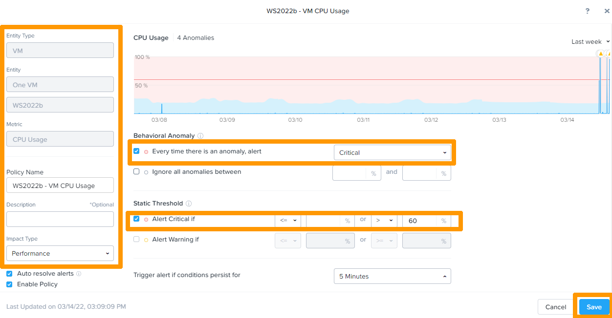
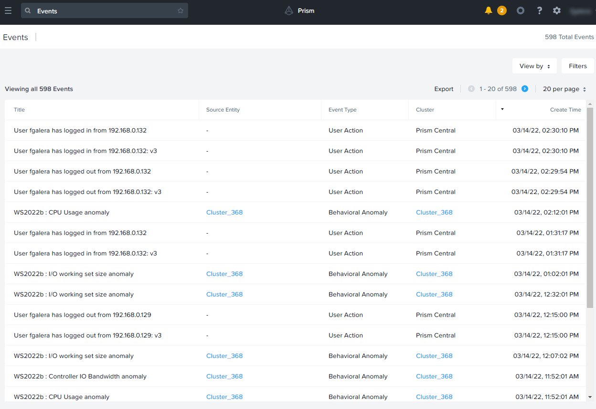

**Dernière mise à jour le 17/03/2022**

## Objectif

Ce guide vous détaille comment consulter les alertes et les évènements ainsi que la création d'alertes personnalisées.

> [!warning]
> OVHcloud vous met à disposition des services dont la configuration, la gestion et la responsabilité vous incombent. Il vous appartient donc de ce fait d’en assurer le bon fonctionnement.
>
> Ce guide a pour but de vous accompagner au mieux sur des tâches courantes. Néanmoins, nous vous recommandons de faire appel à l'équipe [Professional Services OVHcloud](https://www.ovhcloud.com/fr/professional-services/) ou à un [prestataire spécialisé](https://partner.ovhcloud.com/fr/directory/) si vous éprouvez des difficultés ou des doutes concernant l’administration, l’utilisation ou la mise en place d’un service sur un serveur.
>

## Prérequis

- Disposer d'un cluster Nutanix dans votre compte OVHcloud
- Être connecté à votre [espace client OVHcloud](https://www.ovh.com/auth/?action=gotomanager&from=https://www.ovh.com/fr/&ovhSubsidiary=fr)
- Être connecté sur le cluster via Prism Central

## Définitions des alertes, événements et tâches dans Prism Central

Tout ce qui se passe dans un cluster associé à Prism Central est enregistré dans les **évènements**.

Les **alertes** se déclenchent automatiquement lorsqu'une anomalie survient, comme par exemple l'utilisation excessive du CPU sur une machine virtuelle. 
Les alertes de Prism Central s'ajoutent à celles de Prism Element.

Vous pouvez ajouter des alertes personnalisées pour augmenter la sensibilité sur un élément du cluster. 
Les alertes peuvent être envoyées à des destinataires au travers de la messagerie électronique.

Chaque action qu'un utilisateur de Prism Central exécute apparait en tant que **tâche** et est donc listée avec un statut *terminée*, *en cours* ou *en erreur*

## En pratique

### Configuration du serveur SMTP dans Prism Central

Pour que **Prism Central** puisse envoyer des alertes, vous devez configurer un serveur SMTP.

Cliquez sur l'icône `Engrenage`{.action} en haut à droite de l'interface **Prism Central** pour le configurer.

{.thumbnail}

Dans le menu de droite, cliquez sur `SMTP Server`{.action}.

Saisissez les paramètres d'envoi du serveur SMTP et cliquez sur `Save`{.action}.

{.thumbnail}

### Gestion des alertes 

Ouvrez le menu principal en haut à gauche.

Sélectionnez `Alerts`{.action} dans le menu « Activity ».

{.thumbnail}

La liste des alertes déclenchées apparaît. Configurez des destinataires en cliquant sur `Email Configuration`{.action}.

{.thumbnail}

Saisissez les noms des destinataires dans la zone de saisie « Email Recipients » et cliquez sur `Save`{.action}.

{.thumbnail}

#### Création d'une alerte personnalisée

Pour créer une alerte personnalisée, avec des seuils de déclenchements différents, cliquez sur `Alerts Policies`{.action} et sélectionnez `User Defined`{.action}. 

{.thumbnail}

Cliquez ensuite sur `Create Alert Policy`{.action}.

À gauche, sélectionnez les paramètres que vous voulez surveiller comme, dans l'exemple ci-dessous, l'utilisation du processeur sur une seule machine virtuelle.

Modifiez ensuite les paramètres « Behavioral Anomaly » en cochant `Every time there is an anomaly, alert`{.action} et choisissez `Critical`{.action}.

Modifiez les paramètres « Static Threshold » en cochant `Alert Critical if`{.action} et choisissez un seuil supérieur à 60%.

Cliquez sur `Save`{.action} pour valider l'enregistrement de l'alerte personnalisée.

{.thumbnail}

L'alerte créée apparait alors dans la liste.

{.thumbnail}

#### Résoudre une alarme

Dans **Prism Central**, lorsqu'une alarme est déclenchée, un rond rouge apparaît en haut à droite à côté d'une cloche. Cette alerte disparaîtra au bout de 180 minutes si le seuil de déclenchement est revenu à la normale.

Le seuil de déclenchement peut revenir à la normale avant les 180 minutes. Dans ce cas, vous pouvez supprimer l'alerte manuellement.

Pour supprimer une alerte manuellement, cliquez sur le rond rouge numéroté.

{.thumbnail}

L'alarme déclenchée apparaît.

{.thumbnail}

Sélectionnez l'alarme et cliquez sur `Resolve`{.action}

{.thumbnail}

L'alarme est alors résolue et n'apparait plus dans le tableau de bord de **Prism Central**

{.thumbnail}

### Affichage des événements

Cliquez dans le menu principal en haut à gauche.

Sélectionnez `Events`{.action} dans le menu « Activity ».

{.thumbnail}

La liste des évènements s'affiche.

{.thumbnail}

### Affichage des tâches

Cliquez dans le menu principal en haut à gauche.

Sélectionnez `Tasks`{.action} dans le menu « Activity ».

{.thumbnail}

La liste des tâches apparaît.

{.thumbnail}

## Aller plus loin 

[Gestion des alertes et des évènement dans Prism Central](https://portal.nutanix.com/page/documents/details?targetId=Prism-Central-Guide-Prism-v5_20:mul-alerts-management-pc-c.html)

Si vous avez besoin d'une formation ou d'une assistance technique pour la mise en oeuvre de nos solutions, contactez votre commercial ou cliquez sur [ce lien](https://www.ovhcloud.com/fr/professional-services/) pour obtenir un devis et demander une analyse personnalisée de votre projet à nos experts de l’équipe Professional Services.

Échangez avec notre communauté d'utilisateurs sur <https://community.ovh.com/>.
