**Dernière mise à jour le 07/04/2022**

## Objectif

Nutanix fournit un outil qui se nomme **Nutanix Move** et qui permet de faire des migrations depuis d'autres environnements vers **AHV**.

**Ce guide vous explique comment effectuer une migration avec le logiciel Move.**

> [!warning]
> OVHcloud vous met à disposition des services dont la configuration, la gestion et la responsabilité vous incombent. Il vous appartient donc de ce fait d’en assurer le bon fonctionnement.
>
> Ce guide a pour but de vous accompagner au mieux sur des tâches courantes. Néanmoins, nous vous recommandons de faire appel à un [prestataire spécialisé](https://partner.ovhcloud.com/fr-ca/directory/) si vous éprouvez des difficultés ou des doutes concernant l’administration, l’utilisation ou la mise en place d’un service sur un serveur.
>
> Certaines options comme l'utilisation de la compression ou de la déduplication nécessitent des licences particulières fournies par Nutanix au travers d'OVHcloud, nous vous invitons à vous renseigner auprès du service commercial OVHcloud pour plus d'informations.

## Prérequis

- Disposer d'un cluster Nutanix dans votre compte OVHcloud
- Être connecté à votre [espace client OVHcloud](https://ca.ovh.com/auth/?action=gotomanager&from=https://www.ovh.com/ca/fr/&ovhSubsidiary=qc)
- Être connecté sur le cluster via Prism Central
- Avoir une connexion à un environnement autre que Nutanix 

## Présentation de Nutanix Move

**Nutanix Move** est un outil qui permet d'effectuer des migrations de machines virtuelles depuis **VMware ESXI**, **Hyper-V**, **Azure** et **AWS** vers **AHV**.

Il peut aussi être utilisé pour faire des migrations de Nutanix **AHV** vers **AWS**.

Ce logiciel fonctionne sur une machine virtuelle dont les sources sont disponibles sur le site de Nutanix avec un compte client.

Pour une utilisation optimale, il est conseillé d'installer **Nutanix Move** au plus près de la destination.

Le logiciel **Nutanix Move** est le seul à communiquer entre la source et la destination.

> [!warning]
> Il est fortement déconseillé d'utiliser **Nutanix Move** avec des machines virtuelles sous Windows Server exécutant **Active Directory** ou **Microsoft Exchange**. Il est plus judicieux de faire une migration selon les préconisations de Microsoft.
>
> Pour les machines virtuelles qui utilisent des bases de données sous **Microsoft SQL**, il est préférable que le service de la base de données soit arrêté lors de la finalisation d'une migration.
>
> Assurez-vous de la compatibilité de la machine virtuelle d'origine avec l'environnement Nutanix de destination.

## En pratique

Nous allons voir comment effectuer une migration entre un environnement distant sur Hyper-V et un environnement Nutanix OVHcloud.

La source et la destination sont sur deux réseaux privés interconnectés au travers d'un **VPN IPSEC**.

### Préparation des machines virtuelles d'origines avant migration.

La machine virtuelle doit faire partie de la liste des machines virtuelles supportées dans la matrice de compatibilité pour que la migration fonctionne.

Connectez-vous sur le site ci-dessous pour vérifier la compabilité des machines sources avec l'environnement de destination sous Nutanix :

[Matrice de comptatibilité Nutanix](https://portal.nutanix.com/page/documents/compatibility-interoperability-matrix/guestos)

#### Spécificité des machines virtuelles sous LINUX

Certaines machines virtuelles ne démarreront pas correctement après la migration via **Nutanix Move**. 
Vérifiez la liste de compatibilité car il est probable que le pilote SCSI ne soit pas supporté et qu'il soit nécessaire de le changer avec le pilote PCI. 
Dans ce cas de figure, il faudra suivre cette procédure pour [changer le contrôleur disque d'une Machine Virtuelle](#changediskcontroller) après la migration de la machine virtuelle.

#### Particularité de l'environnement Microsoft

Microsoft ne fournit pas les pilotes **Virtio** de la carte SCSI et de la carte réseau. Il faut installer ces pilotes avant de faire une migration. Ces pilotes sont disponibles sur le site de Nutanix avec un compte client.

> [!primary]
> Microsoft Windows 2008 n'est plus supporté ni par Microsoft ni par Nutanix. Néanmoins, il est possible d'installer d'anciens pilotes **Virtio** et de tenter une migration.
>

Connectez-vous sur le site de Nutanix avec un compte client pour télécharger les pilotes VIRTIO.

[Lien de téléchargement des pilotes VIRTIO](https://portal.nutanix.com/page/downloads?product=ahv&bit=VirtIO).

Saisissez votre nom d'utilisateur dans `Emails`{.action}, votre mot de passe dans `Password`{.action} et cliquez sur `Log In`{.action}.

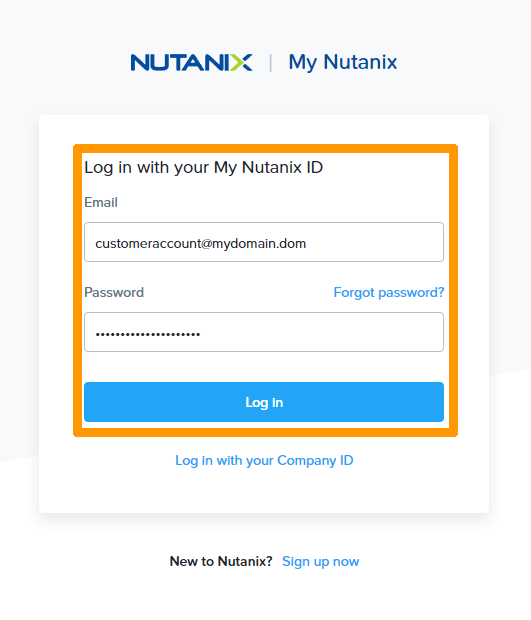{.thumbnail}

Cliquez sur le lien `Download`{.action} de téléchargement qui vous convient.

Pour notre exemple, nous allons télécharger le pilote pour **amd64**.

{.thumbnail}

A partir d'une machine virtuelle sous Windows de l'environnement Hyper-V, double-cliquez sur `Nutanix-VirtIO-1.1.7-amd64`{.action}.

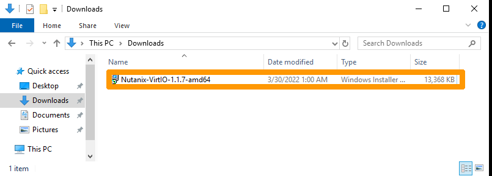{.thumbnail}

Prenez connaissances des termes et conditions de licence, acceptez-les en cochant la case puis cliquez sur `Install`{.action}

{.thumbnail}

Cliquez sur `Finish`{.action} pour terminer l'installation sans avoir à redémarrer la machine virtuelle.

{.thumbnail}

### Installation de Move sur le Cluster Nutanix.

#### Téléchargement et importation des sources. 

Récupérez le fichier au format **qcow2** sur ce site : [Lien de téléchargement de Nutanix Move](https://portal.nutanix.com/page/downloads?product=move).

Connectez-vous avec un compte enregistré chez Nutanix.

{.thumbnail}

Cliquez sur `Download`{.action} à droite de `Move QCOW2 file for AHV`.

{.thumbnail}

Importez l'image téléchargée de **Nutanix Move** dans le cluster. Pour plus d'informations sur l'importation d'images, consultez notre guide sur l'[importation d'images](/pages/cloud/nutanix/05-image-import).

#### Installation de la machine virtuelle **Move**

Créez une machine virtuelle à partir de l'image Move.

Depuis **Prism Central**, ouvrez le menu principal en cliquant sur le bouton en haut à gauche.

{.thumbnail}

Cliquez dans le menu sur `VMs`{.action}.

{.thumbnail}

Cliquez sur `Create VM`{.action}.

{.thumbnail}

Saisissez **Nutanix Move** dans le champ `Name`.

Choisissez les options **2 vCPU**, **2 Cores** et **8 GB** dans les champs `VM Properties` et cliquez sur `Next`{.action}.

{.thumbnail}

Cliquez sur `Attach Disk`{.action}.

{.thumbnail}

Choisissez les options **Disk**, **Clone from Image** et **move-4.3.0.qcow2**  puis cliquez sur `Save`{.action}.

{.thumbnail}

Cliquez sur `Attach to Subnet`{.action}.

{.thumbnail}

Choisissez le réseau dans `Subnet`, vérifiez qu'il soit bien connecté dans `Network Connection State` et cliquez sur `Save`{.action}.

{.thumbnail}

Cliquez sur `Next`{.action} .

{.thumbnail}

Laissez les options de fuseau horaire par défaut et cliquez sur `Next`{.action}.

{.thumbnail}

Cliquez sur `Create VM`{.action} pour finaliser l'installation de la machine virtuelle **Nutanix Move**.

{.thumbnail}

Sélectionnez la machine virtuelle **Nutanix Move** et cliquez sur le menu `Actions`{.action}.

{.thumbnail}

Cliquez sur `Power On`{.action} dans le menu `Actions`{.action} pour démarrer la machine virtuelle.

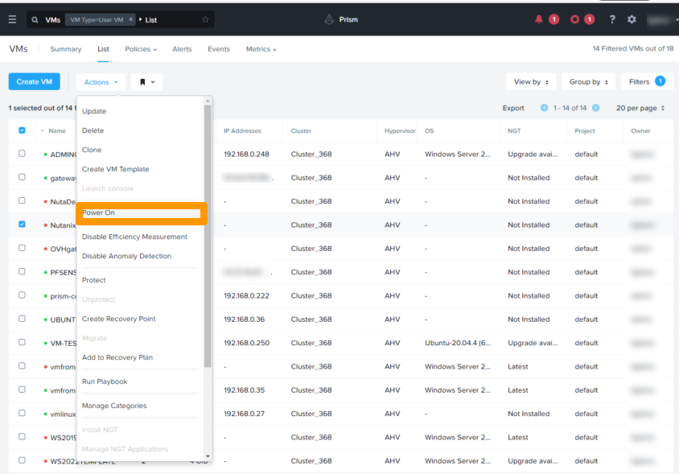{.thumbnail}

La machine virtuelle est démarrée et l'on obtient une adresse IP si un serveur **DHCP** est opérationnel sur ce réseau.

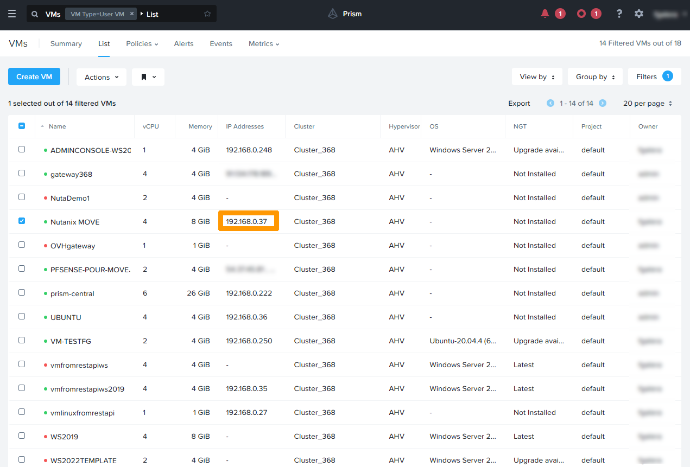{.thumbnail}

Cette installation de **Nutanix Move** se fait sur un réseau disposant d'un serveur DHCP mais il est possible de configurer la machine virtuelle sur un réseau sans serveur **DHCP**. 

Pour plus de détails sur **Nutanix Move**, reportez-vous à la section « [Aller plus loin](#gofurther) » de ce guide.

### Configuration de **Nutanix Move** 

#### Connexion à l'interface web et création d'environnements pour la migration

Connectez-vous à l'adresse IP de la machine virtuelle **Nutanix Move** au travers d'un navigateur web en HTTPS comme ceci : `https://addresseipnutanixmove/`.

Prenez connaissance des conditions d'utilisation de la licence, validez leur acceptation et cliquez sur `Continue`{.action}.

{.thumbnail}

Cliquez sur `OK`{.action} pour poursuivre.

{.thumbnail}

Choisissez et confirmez un mot de passe dans les champs prévus à cet effet puis cliquez sur `Set Password`{.action} pour valider la création du mot de passe de Nutanix Move.

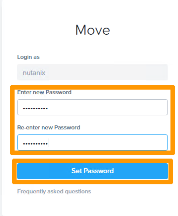{.thumbnail}

Saisissez le mot de passe dans `Password`{.action} et cliquez sur `Log In`{.action} pour vous connecter à l'interface web de **Nutanix Move**.

{.thumbnail}

Cliquez sur `+ Add Environment`{.action}.

{.thumbnail}

Choisissez `Nutanix AOS`{.action}.

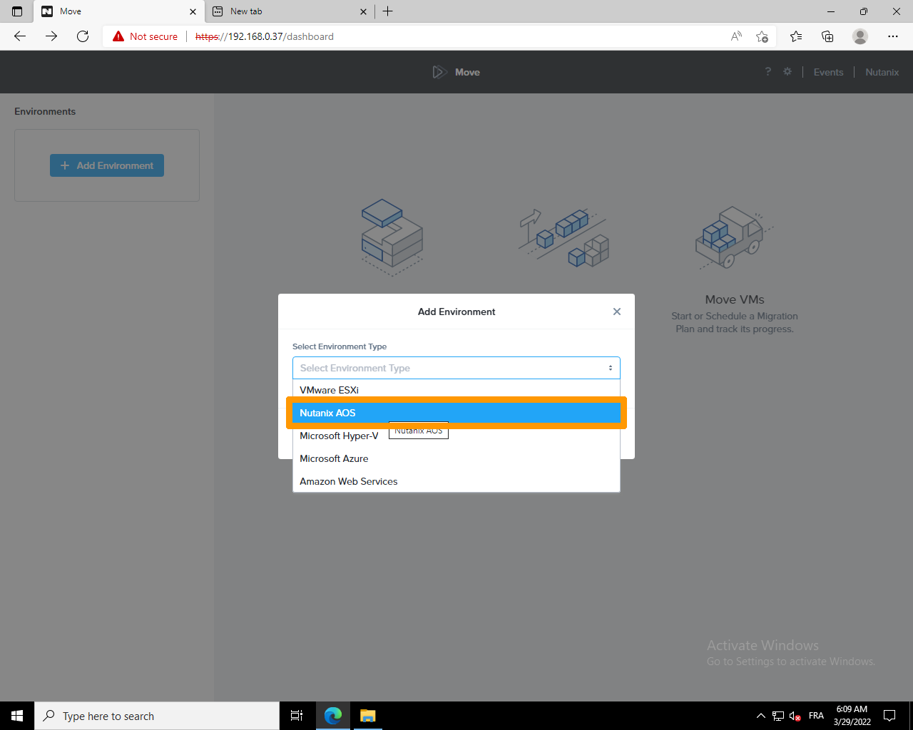{.thumbnail}

Saisissez les informations suivantes :

- **PRISM-CENTRAL-DESTINATION** dans le champ `Environment Name`; 
- l'adresse IP privée de **Prism Central** dans le champ `Nutanix Environment`; 
- un compte d'administration de **Prism Central** dans le champ `Username `;
- le mot de passe du compte dans le champ `Password`{.action}. 

Cliquez sur `ADD`{.action} pour ajouter l'environnement **Prism Central**. 

{.thumbnail}

Cliquez sur `Add Environment`{.action}.

{.thumbnail}

Choisissez `Microsoft Hyper-V`{.action}.

{.thumbnail}

Saisissez les informations suivantes :

- **HyperV-SOURCE** dans le champ `Environment Name`;
- l'adresse IP privée du serveur **Hyper-V** dans le champ `Hyper-V Server/Cluster`;
- un compte d'administration **Hyper-V** dans le champ `Username `;
- le mot de passe de ce compte dans le champ `Password`;

Cliquez sur `ADD`{.action} pour ajouter l'environnement **Hyper-V**. 

{.thumbnail}

Les deux environnements de migration apparaissents en haut à gauche.

{.thumbnail}

#### Création d'un plan de migration

Nous allons créer un plan de migration à partir des deux environnements créés précédemment.

La source sera le serveur **Hyper-V** et la destination le cluster **Nutanix**.

Cliquez sur `Create a Migration Plan`{.action}.

{.thumbnail}

Choisissez un nom dans le champ `Plan Name` et cliquez sur `Proceed`{.action}.

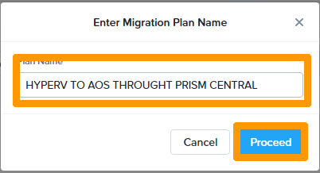{.thumbnail}

Saisissez les informations suivantes :

- **HyperV-SOURCE** dans le champ `Select a Source`;
- **PRISM-CENTRAL-DESTINATION** dans le champ `Hyper-V Server/Cluster`;
- le nom du CLUSTER dans le champ `Target Cluster`;
- le nom du container de destination dans le champ `Target Container`.

Cliquez ensuite sur `Next`{.action} pour passer à l'étape suivante.

{.thumbnail}

Sélectionnez les machines virtuelles que vous voulez migrer de l'environnement **Hyper-V** vers **AOS** en cliquant à gauche de la VM sur l'icone `+`{.action}. 
Cliquez sur `Next`{.action} pour continuer la création du plan de migration.

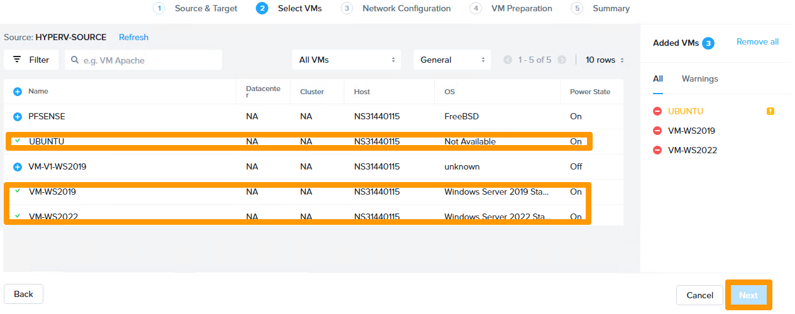{.thumbnail}

Choisissez le réseau dans `Target Network` et cliquez sur `Next`{.action}.

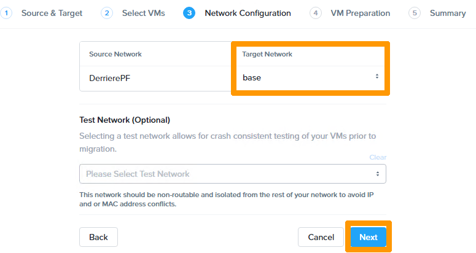{.thumbnail}

Cliquez sur `Next`{.action} pour valider la migration.

{.thumbnail}

Cliquez sur `Save`{.action} pour enregistrer le plan de migration sans l'éxécuter.

{.thumbnail}

#### Lancement de la migration

Le plan de migration est créé, il est possible de le lancer manuellement.

Cochez la case à côté du plan de migration souhaité.

{.thumbnail}

Dans le menu `Actions`, cliquez sur `Start`{.action}.

{.thumbnail}

La migration est en cours. La colonne `Status` vous renseigne sur l'état de la migration.

{.thumbnail}

#### Finalisation de la migration

Contrôlez l'état de la migration en vous positionnant avec la souris sur le statut `In Progress`. 
Une fenêtre mentionnant l'information **Ready to Cutover N** doit apparaître et correspond aux nombre de VMs qui peuvent basculer.

Cliquez sur `In Progress`{.action} pour lancer le processus de finalisation.

{.thumbnail}

Sélectionnez toutes les VMs en cochant la case `VM Name`{.action} et cliquez sur `Cutover`{.action}.

{.thumbnail}

Cliquez sur `Continue`{.action}. 

{.thumbnail}

Patientez quelques instants pendant la finalisation.

{.thumbnail}

La migration est terminée lorsque la mention **Completed** apparaît dans la colonne `Migration Status`.

{.thumbnail}

Connectez-vous sur **Prism Central** pour voir les 3 VMs migrées qui sont présentes et démarrées.

{.thumbnail}

#### Modification du contrôleur de disque sur une machine virtuelle Linux 

Si la machine virtuelle ne démarre pas correctement après la migration, cela peut provenir d'un mauvais contrôleur de disque dans la configuration de la machine virtuelle. Dans ce cas, il faut le changer en suivant cette procédure.

Allez dans le menu principal de **Prism Central** et cliquez sur `VMs`{.action}.

{.thumbnail}

Assurez-vous que la machine virtuelle est bien éteinte.

{.thumbnail}

Revenez sur le menu principal et cliquez sur `Images`{.action}.

{.thumbnail}

Cliquez sur `Add Image`{.action}.

{.thumbnail}

Sélectionnez **VM Disk** comme `Image Source`. Saisissez un nom dans `Search by VM Name`{.action} et cliquez sur `+`{.action}.

{.thumbnail}

Saisissez un nom dans le champ `Image Name` et cliquez sur `Next`{.action}.

{.thumbnail}

Sélectionnez `Place image on source VM's cluster`{.action} et cliquez sur `Save`{.action}.

{.thumbnail}

L'image créée à partir de la machine virtuelle apparaît au bout de quelques instants.

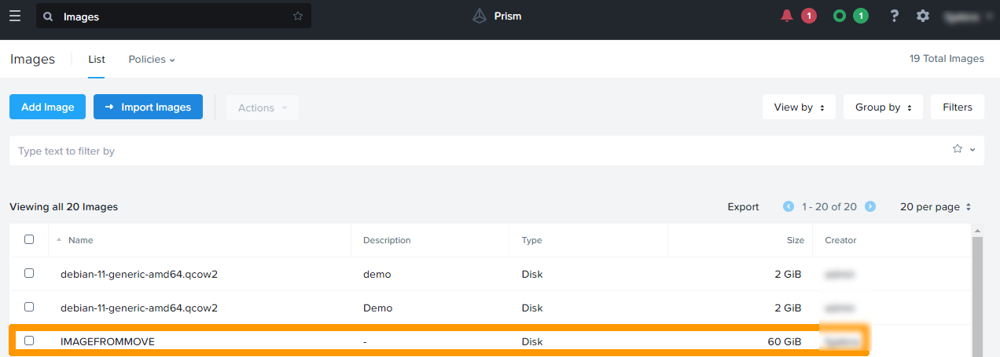{.thumbnail}

Ouvrez sur le menu principal et cliquez sur `VMs`{.action}.

{.thumbnail}

Cochez la case à gauche de la machine virtuelle.

{.thumbnail}

Ouvrez le menu `Actions`{.action} et choisissez `Update`{.action}.

{.thumbnail}

Cliquez sur l'icône de `corbeille`{.action} à coté du lecteur de CDROM.

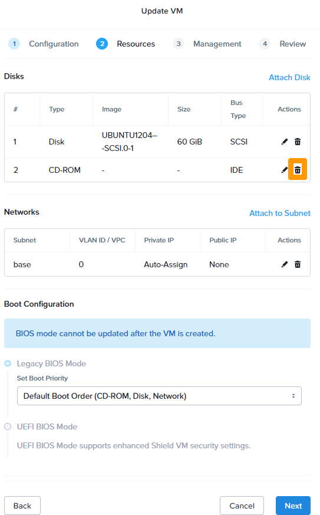{.thumbnail}

Cliquez sur l'icône de `corbeille`{.action} à coté du lecteur de disque.

{.thumbnail}

Cliquez sur `Attach Disk`{.action}.

{.thumbnail}

Choisissez :

- **Disk** Dans `Type`;
- sélectionnez l'option **Clone from image**;
- saisissez le **nom de l'image créée** dans `Image`; 
- sélectionnez PCI comme `Bus type`{.action} et cliquez sur `Save`{.action}

{.thumbnail}

Cliquez sur `Next`{.action}.

{.thumbnail}

Cliquez sur `Next`{.action}.

{.thumbnail}

Cliquez sur `Save`{.action}.

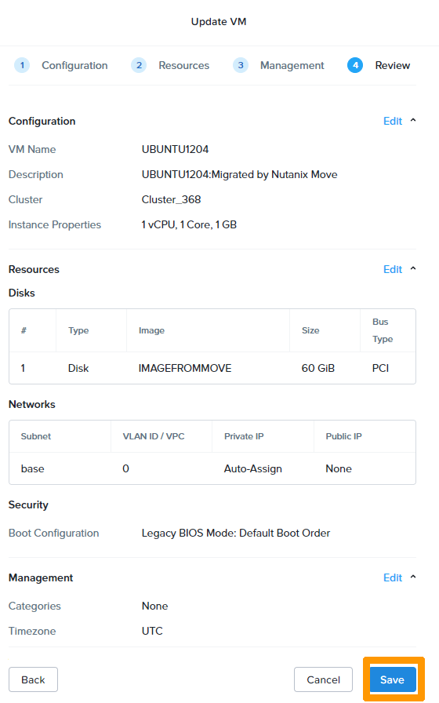{.thumbnail}

Le contrôleur de disque a été modifié et la machine virtuelle demarre correctement.

## Aller plus loin 

[Installation et configuration de Move](https://portal.nutanix.com/page/documents/details?targetId=Nutanix-Move-v4_3:Nutanix-Move-v4_3)

Échangez avec notre communauté d'utilisateurs sur <https://community.ovh.com/>.
